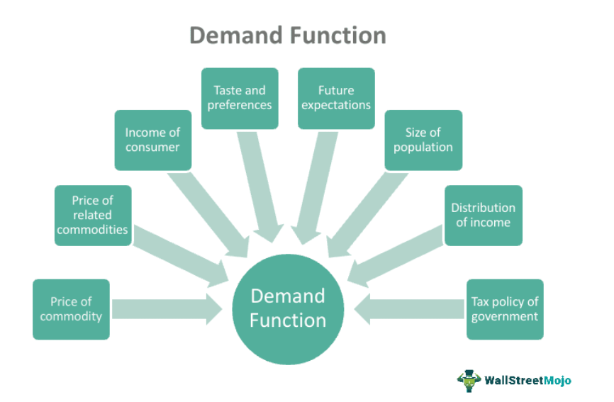

The Lao Kip (LAK) serves as the official currency of the Lao People's Democratic Republic, commonly known as Laos. It is managed by the central bank, the Bank of the Lao P.D.R. Introduced in 1952 following the nation's independence from France, the Kip replaced the Indochinese piastre and has been a cornerstone of the country's financial system. Unlike many Asian currencies, the Kip is a freely floating currency in the foreign exchange market, offering a unique profile for traders and economists. While the US dollar is also commonly accepted in urban centers and tourist destinations, the Kip remains pivotal in Laos’ predominantly cash-based economy.

Recent advancements in technology have led to a growing interest in algorithmic trading, even for less mainstream currencies like the Lao Kip. Algorithmic trading employs computer algorithms to execute trades based on pre-set criteria, enhancing speed and accuracy while reducing human error. This method of trading is becoming increasingly accessible, providing new opportunities for traders to navigate the volatility and liquidity challenges associated with trading the Kip. 



Laos' economy, reliant on natural resources and exports to neighboring countries, such as China and Thailand, plays a significant role in influencing the currency's value. In addition, sectors like tourism contribute significantly to the GDP, affecting the Kip's standing in the market. The integration of algorithmic trading offers new strategies for interacting with these economic dynamics, making it possible to optimize trades by considering macroeconomic indicators and market fluctuations. As traders and investors explore these opportunities, they also face challenges stemming from the low trading volume and infrastructural limitations within the country.

This article aims to explore these dimensions, focusing on the economic background of the Lao Kip and how algorithmic trading is shaping its trading landscape. Understanding the interplay between local economic developments and global trading practices is crucial for those interested in harnessing the potential of algorithmic trading with the Lao Kip. The discussion will highlight both the opportunities and challenges inherent in this emerging trading frontier.

## Table of Contents

## Understanding the Lao Kip (LAK)

The Lao Kip (LAK) serves as the official currency of the Lao People's Democratic Republic, introduced in 1952 subsequent to Laos' liberation from French colonial rule. This currency succeeded the Indochinese piastre, marking Laos' fiscal independence. Currently, the Kip is a freely floating currency within the foreign exchange market, distinctive for not being pegged to any other currency, which is uncommon among Asian monetary systems.

Inflation has significantly influenced the Kip's utility and design, primarily leading to the discontinuation of smaller banknotes and coins. Despite these challenges, the Kip remains pivotal in Laos’ predominantly cash-based economy. Even with high inflation, it maintains a role in major financial transactions, although the US dollar also sees extensive use, predominantly in urban areas and throughout tourist locations. This dual usage enables Laos to facilitate international trade and tourism efficiently, cushioning against potential currency volatility.

Historically, the evolution of the Kip reflects Laos' economic conditions and policy decisions, an understanding of which is essential for developing informed trading strategies. Knowledge of its historical journey and present-day utilization informs the strategies implemented in modern [algorithmic trading](/wiki/algorithmic-trading), which leverage these economic insights. As Laos continues to progress economically and technologically, the Kip's role within both the national and global markets is expected to evolve, reflecting broader economic trends and innovations.

## Economic Impact on the Kip

Laos' economy is significantly influenced by its abundant natural resources and strategic export relationships, particularly with neighboring nations like China and Thailand. Copper, a key export commodity, plays a crucial role in the country's export revenues, supporting economic development and infrastructural projects. Hydroelectric power, another substantial contributor, leverages the country's river systems, providing electricity to neighboring countries and underpinning Laos' commitment to becoming the 'Battery of Southeast Asia'. This export-driven approach underscores the dependency of the Lao Kip on fluctuations in global commodity markets, which can induce [volatility](/wiki/volatility-trading-strategies) in the currency's value.

Tourism is another vital sector in Laos' economic framework, contributing significantly to the national GDP. The COVID-19 pandemic dealt a severe blow to this sector, leading to substantial revenue losses. However, recent indicators show a resilient rebound as travel restrictions ease and global travel begins to normalize. This revitalization helps stabilize the local economy, indirectly supporting the Kip by boosting foreign currency inflows and stimulating domestic spending.

Economic policies in Laos, often shaped by the mandates of major trading partners and international entities, play a pivotal role in affecting the Lao Kip's value and volatility. Given the interconnected nature of international trade and finance, policies impacting interest rates, trade tariffs, or currency controls in China and Thailand can have immediate repercussions on the Lao economy and, in turn, on the Kip's stability.

The transition from a predominantly cash-based economy towards a more digital-oriented financial landscape presents both opportunities and challenges for the Lao Kip. Initiatives aimed at increasing financial inclusivity and digital payment systems can enhance the efficiency and integration of the Lao economy into global markets. However, it is crucial to manage these transitions carefully to mitigate risks such as cyber threats and to ensure equitable access across the population.

For traders, these macroeconomic variables are essential considerations when crafting algorithmic trading strategies for the Lao Kip. Understanding the implications of export dependency, the fluctuating tourism landscape, and the influence of foreign economic policies is critical. Additionally, as Laos moves toward digitalization, traders need to adapt strategies to capitalize on the opportunities and navigate the challenges presented by the evolving financial ecosystem. This comprehensive analysis informs the development of robust trading algorithms, aiming to maximize returns while effectively managing risks associated with the LAK.

## The Evolution of Algorithmic Trading

Algorithmic trading uses computer algorithms to execute trades according to pre-established criteria, a practice that has become widespread across various financial markets globally. This methodology offers significant potential for traders dealing with minor currencies such as the Lao Kip (LAK), where navigating the market's inherent thin [liquidity](/wiki/liquidity-risk-premium) and high volatility can be challenging. By automating the trading process, traders can efficiently handle large volumes of complex data at high speeds, making it a crucial tool in maximizing market opportunities while minimizing risks.

For currencies like the Lao Kip, algorithmic trading can effectively manage the limited liquidity and rapid price fluctuations characteristic of smaller financial markets. One of the primary strategies deployed in such circumstances is [market making](/wiki/market-making), where algorithms continually provide buy and sell prices to facilitate trading and enhance liquidity. This can be particularly advantageous in markets where wide bid-ask spreads are common due to low trading volumes.

Technological advancements have played a pivotal role in the evolution of algorithmic trading. Improved internet connectivity enhances data transmission speed and reliability, which are crucial for executing trades timely and reducing latency-related issues. Furthermore, blockchain technology contributes to creating more secure and transparent trading environments by providing decentralized and immutable transaction records. This advancement ensures transactional integrity and reduces the risk of fraud, making it increasingly appealing to investors and regulatory bodies alike.

A profound understanding of algorithms, combined with strategic insights into Lao market conditions, is paramount for traders and investors seeking competitive advantages. By analyzing historical data and market trends, algorithms can be coded to predict price movements, optimize execution strategies, and reduce trading costs. For instance, the simple moving average (SMA) and exponential moving average (EMA) are commonly used indicators in algorithmic strategies to identify market trends and potential reversals.

```python
# Example of calculating Simple Moving Average (SMA) in Python
import pandas as pd

# Sample data representing LAK pricing
data = {'prices': [9500, 9520, 9480, 9535, 9600, 9580]}
df = pd.DataFrame(data)

# Calculate the 3-day SMA
df['SMA_3'] = df['prices'].rolling(window=3).mean()
print(df)
```

This focus on algorithmic acumen and local market insights not only aids in optimizing trading strategies but also helps in risk management. Effective [backtesting](/wiki/backtesting) of these algorithms using historical data can provide traders with a performance outlook under varied market conditions, thereby enhancing decision-making confidence.

In conclusion, algorithmic trading transforms how traders engage with minor currencies like the Lao Kip, leveraging technology to overcome traditional market obstacles and capitalize on emerging opportunities. As technologies continue to advance, and as the Lao financial landscape evolves, harnessing algorithms could provide substantial competitive edges for those trading in these markets.

## Algo Trading Strategies for Lao Kip

Algorithmic trading strategies for the Lao Kip (LAK) involve several sophisticated approaches designed to harness the currency's unique liquidity and volatility characteristics. Market-making strategies are particularly potent in the LAK market due to the currency's liquidity profile. By continuously quoting buy and sell prices, market makers can benefit from the bid-ask spread, thereby facilitating smoother trading flows and potentially reducing transaction costs. These strategies require advanced algorithms capable of executing high-frequency trades to exploit fleeting opportunities in the market.

Momentum-based strategies offer another avenue for trading Lao Kip. These strategies rely on identifying and capitalizing on trends or patterns in LAK prices that may arise from economic announcements, such as changes in monetary policy, or geopolitical events affecting regional trade dynamics. By utilizing statistical models and technical indicators, traders can predict future price movements and position themselves advantageously. A vital component of [momentum](/wiki/momentum) trading is the use of [machine learning](/wiki/machine-learning) algorithms to analyze historical price data and optimize the timing of trades.

Statistical [arbitrage](/wiki/arbitrage) strategies focus on exploiting short-term price discrepancies between Lao Kip pairs and other currencies. Despite the challenges posed by the LAK's less frequent trading and lower liquidity, [statistical arbitrage](/wiki/statistical-arbitrage) can identify situations where the market has temporarily mispriced the currency. This approach often requires sophisticated computational models to assess the probability of price convergence and involves opening long and short positions simultaneously to minimize risk. Implementing such strategies demands a high degree of computational power and real-time data analysis.

Risk management and backtesting are integral components when evaluating algorithmic strategies in the context of Lao Kip trading. Effective risk management involves setting precise parameters for trade execution, stop-loss limits, and position sizing to mitigate potential losses. Backtesting these strategies involves rigorous analysis of historical trading data to ascertain their robustness and adaptability to market conditions. This process allows traders to refine strategies before applying them in live markets, ensuring they can withstand various market scenarios.

In summary, algorithmic trading strategies for the Lao Kip leverage market-making advantages, momentum insights, and statistical arbitrage opportunities. The successful implementation of these strategies hinges on comprehensive risk management, robust backtesting, and the effective use of technology to manage the complexities of trading a less mainstream currency like the Lao Kip.

## Challenges and Opportunities

One of the main challenges faced by algorithmic traders in the Lao Kip (LAK) market is the relatively low trading [volume](/wiki/volume-trading-strategy) compared to major global currencies. This low volume often results in reduced liquidity, complicating large transaction executions without causing significant price shifts. This volatility and potential for slippage make algorithmic trading in LAK a more complex endeavor, requiring sophisticated strategies that can handle rapid price changes and wide spreads.

Regulatory and infrastructural limitations present additional hurdles. Laos is in the early stages of developing a comprehensive financial regulatory framework that encompasses algorithmic and high-frequency trading. The lack of a robust legal and technological infrastructure can deter foreign investors and limit the speed and efficiency at which trades can be executed. Enhanced communication networks and trading platforms are essential for enabling real-time data access and efficient trade executions, which are critical for algorithmic trading's success.

Despite these challenges, substantial opportunities exist for those who can adeptly navigate the complexities of the LAK market. Traders equipped with advanced computation and data analysis capabilities can exploit short-term market inefficiencies. Algorithms designed to forecast market trends by analyzing economic indicators, global market movements, and geopolitical developments can yield lucrative returns. 

As global interest in Southeast Asian markets increases, so does the potential for technological advancements and financial innovations that can strengthen the algorithmic trading environment in Laos. Improvements in digital infrastructure, alongside increased foreign investment, could enhance the liquidity and stability of the LAK market. As these developments unfold, they provide a promising horizon for traders willing to engage with the unique aspects of the Lao Kip market using cutting-edge algorithmic strategies.

## Conclusion

The Lao Kip represents a distinctive opportunity for algorithmic trading, primarily due to its unique economic and trading environment. While not as prevalent as global currencies like the USD or EUR, the LAK's characteristics can offer niche advantages for those equipped to navigate its intricacies. 

Investors and traders seeking portfolio diversification may find the Lao Kip to be a favorable asset when combined with robust algorithmic trading strategies. The capacity of algorithmic trading to handle multiple market factors—including the fluctuating prices, liquidity constraints, and volatile economic conditions of the Kip—makes it a suitable method for engaging with this currency.

The economic trajectory of Laos, characterized by ongoing developments and integration into global markets, could significantly influence the future landscape of LAK algo trading. Efforts to digitize the economy and increase transparency in economic policies may positively impact trading conditions, presenting new avenues for efficient execution and profit potential for algorithmic traders.

Crucially, understanding the relationship between Laos' local economic context and global trading dynamics is essential for those exploring algorithmic trading of the Lao Kip. Such an understanding allows traders to anticipate market shifts, align strategies with macroeconomic trends, and leverage technological advancements. By staying informed about these evolving factors, traders can effectively harness the potential of LAK within their broader trading frameworks.

## References & Further Reading

[1]: Bergstra, J., Bardenet, R., Bengio, Y., & Kégl, B. (2011). ["Algorithms for Hyper-Parameter Optimization."](https://dl.acm.org/doi/10.5555/2986459.2986743) Advances in Neural Information Processing Systems 24.

[2]: ["Advances in Financial Machine Learning"](https://www.amazon.com/Advances-Financial-Machine-Learning-Marcos/dp/1119482089) by Marcos Lopez de Prado

[3]: ["Evidence-Based Technical Analysis: Applying the Scientific Method and Statistical Inference to Trading Signals"](https://www.amazon.com/Evidence-Based-Technical-Analysis-Scientific-Statistical/dp/0470008741) by David Aronson

[4]: ["Machine Learning for Algorithmic Trading"](https://github.com/stefan-jansen/machine-learning-for-trading) by Stefan Jansen

[5]: ["Quantitative Trading: How to Build Your Own Algorithmic Trading Business"](https://www.amazon.com/Quantitative-Trading-Build-Algorithmic-Business/dp/1119800064) by Ernest P. Chan