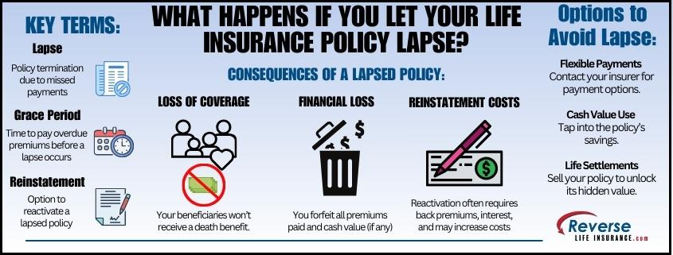

A lapse, in the context of financial management and insurance, refers to the discontinuation or expiration of a policy or contract due to non-fulfillment of certain obligations. Typically, this can happen when a policyholder fails to make required premium payments, leading to a voided insurance policy. Such lapses signify a break in coverage, leaving the individual or entity without protection against risks previously covered by the policy. The implications of a policy lapse are broad, impacting the financial stability and risk exposure of the policyholder. Often, lapses result in financial penalties or the necessity to negotiate new terms to reinstate coverage, which may come with increased premiums or less favorable conditions.

In financial trading, algorithmic trading involves the use of automated and complex systems to execute trades based on predefined strategies. These systems heavily depend on accurate, real-time data to assess market conditions and make optimal trade decisions. While not directly related, the concept of lapses in insurance can be metaphorically linked to challenges faced in algorithmic trading. For example, just as a lapse in insurance coverage can lead to exposure and financial vulnerability, lapses in data accuracy or system functioning in algorithmic trading can result in suboptimal trading decisions, financial losses, and increased market risk.



This article explores the dual nature of lapses, exemplified in both insurance and algorithmic trading contexts. Understanding policy lapses in insurance involves a detailed examination of their triggers, consequences, and management strategies. Additionally, it looks at how these lapses might resonate with the operational and strategic challenges in algorithmic trading. The article aims to provide insights into the prevention of policy lapses and discusses the future interplay between insurance and trading in an increasingly digital world.

## Table of Contents

## Understanding Policy Lapse in Insurance

An insurance policy lapse occurs when a policyholder fails to meet the necessary conditions to keep their insurance coverage active. This typically happens when premium payments are missed or not paid within the specified timeframe. When a policy lapses, the coverage offered under that policy becomes null and void, leaving the policyholder unprotected against risks that were previously insured. It is crucial to understand the triggers, types, and roles of grace periods associated with policy lapses, along with their statistical prevalence.

**Triggers of Insurance Policy Lapse**

The primary [factor](/wiki/factor-investing) leading to an insurance policy lapse is non-payment of premiums. However, lapses can also occur due to other factors, such as not meeting the policy’s conditions, failing to renew the policy upon expiration, or incorrect information provided to the insurer. Each insurance company may have specific conditions under which a policy can lapse, but non-payment is the most common denominator.

**Types of Insurance Policies Subject to Lapse**

1. **Auto Insurance**: Auto insurance policies require timely payments to cover risks associated with vehicle operation. A lapse in auto insurance can result in legal penalties and potential financial liabilities in the event of an accident.

2. **Life Insurance**: Life insurance policies, both term and whole life, are subject to lapsing if premiums are not paid. A lapsed life insurance policy can mean a lack of financial support for beneficiaries upon the policyholder’s death, defeating the primary purpose of the policy.

**Role of Grace Periods and Reinstatement Policies**

Insurance companies usually offer a grace period after the premium due date during which the policyholder can make a payment without losing coverage. This period typically ranges from 10 to 30 days, depending on the insurer and the type of policy. If the payment is made within this grace period, the policy remains active without penalty. However, if the grace period expires and the premium remains unpaid, the policy lapses.

Reinstatement policies allow policyholders to reactivate a lapsed policy, often within a certain period after the lapse. Reinstatement requires payment of the overdue premium, and sometimes additional fees or proof of insurability. Each insurer defines its specific conditions and timeframe for reinstatement.

**Statistics and Data on the Occurrence of Insurance Lapses**

The prevalence of insurance policy lapses varies across different lines of insurance and demographics. According to industry reports, lapse rates can be significant, especially in term life insurance policies, where approximately 4-5% of policies lapse annually. Auto insurance lapse rates tend to vary by state in the United States due to differing state laws and regulations regarding insurance requirements.

The reasons behind these [statistics](/wiki/bayesian-statistics) include economic factors, such as unemployment and inflation, which can impact a policyholder’s ability to pay premiums. Additionally, a lack of understanding of policy terms and benefits often contributes to unintended lapses. These statistics underscore the importance of educating policyholders about maintaining active coverage and the financial risks associated with lapses.

Understanding these aspects of policy lapse helps individuals and businesses maintain essential insurance coverage, safeguarding against unforeseen financial damages.

## Consequences of Insurance Lapse

Insurance lapses can have significant consequences for policyholders, both financially and legally. Understanding these implications is crucial for maintaining financial stability and legal compliance.

Financially, when an insurance policy lapses, policyholders may face increased premiums if they reapply for coverage. This is because insurers often view a lapse as an indicator of higher risk, potentially leading to a reassessment of premiums. Additionally, some insurers impose reinstatement fees or penalties to reactivate a lapsed policy, further adding to costs. For example, auto insurance companies may charge an average fee of $50 to $100 for reinstatement [1].

The legal and personal financial risks associated with uninsurance are substantial. Without valid insurance coverage, individuals risk violating state laws, particularly when it comes to auto insurance. Driving without insurance can result in fines, license suspension, and even legal action. Furthermore, an uninsured individual may be personally liable for damages and injuries resulting from an accident, which can lead to significant financial burdens.

An insurance lapse can also negatively affect a policyholder's credit score. Although insurance payments themselves do not directly impact credit scores, many insurers perform credit checks during the underwriting process. A lapse might indicate financial instability, potentially affecting future applications for loans or credit. An increased credit utilization ratio and late payments can further exacerbate this issue.

Real-world examples highlight the impacts of insurance lapses. For instance, in the wake of the 2008 financial crisis, many individuals faced lapses in home insurance due to foreclosures or financial constraints. This left homes vulnerable to natural disasters without financial protection, resulting in severe economic losses for homeowners [2].

In conclusion, insurance lapses [carry](/wiki/carry-trading) a wide array of consequences that can affect one's financial stability, legal standing, and creditworthiness. Being aware of these risks underlines the importance of maintaining continuous insurance coverage.

**References**:
1. "The High Cost of Insurance Lapses." InsuranceQuotes, www.insurancequotes.com.
2. "The Financial Impact of Home Insurance Lapses." Institute for Business & Home Safety, www.disastersafety.org.

## Insurance Lapse and Algorithmic Trading

Algorithmic trading refers to the use of computer algorithms to automate trading decisions based on pre-defined criteria, such as timing, price, or [volume](/wiki/volume-trading-strategy). These algorithms rely heavily on market data to execute trades with precision and speed, making them integral to modern financial markets. Algorithmic trading systems are capable of processing large sets of data rapidly, enabling traders to capitalize on fleeting market opportunities that would be impossible to exploit manually.

Insurance lapses, on the other hand, occur when a policyholder fails to pay the premiums on an insurance policy, leading to the termination of coverage. While insurance lapses are primarily a concern in personal finance, they can have ripple effects that reach [algorithmic trading](/wiki/algorithmic-trading) environments.

One way insurance lapses could impact algorithmic trading is through the effect on consumer confidence and spending. The lapse of a significant number of insurance policies could indicate financial distress among policyholders. In turn, this may affect sectors like the automotive industry if a considerable portion of auto insurance policies lapse, leading to decreased car sales and, consequently, impacting the stock prices of automotive companies. Algorithms that track consumer sentiment, insurance sector data, or economic indicators might adjust trading strategies in response to such shifts.

Another hypothetical scenario involves risk assessment and management. Insurance companies are significant players in the investment markets, often managing large portfolios to ensure they can meet future claims. A sharp increase in policy lapses might force these companies to liquidate assets in their portfolios, influencing market [liquidity](/wiki/liquidity-risk-premium) and asset prices. Algorithmic trading systems programmed to react to changes in market liquidity may alter their trading patterns as a result.

Furthermore, algorithmic models often incorporate a variety of economic indicators, including insurance industry health. An unexpected rise in policy lapses might be interpreted by models as an increase in systemic risk, prompting algorithms to reduce exposure to equities or other volatile assets, potentially leading to a chain reaction in financial markets.

In summary, while insurance lapses are a peripheral concern to algorithmic trading, their indirect impact through economic indicators and consumer behavior can potentially influence trading environments. Algorithms, designed to respond swiftly to economic shifts, may adjust their trading logic in response to the cascade of effects initiated by widespread insurance policy lapses.

## Prevention and Management of Insurance Lapse

Preventing insurance policy lapses is essential for maintaining continuous coverage and avoiding potential financial penalties. Here are some strategies to ensure that policies remain active and financial health is preserved:

### Automatic Payments and Regular Policy Reviews
Automating payment processes is one of the most effective measures to prevent a lapse. By setting up automatic deductions from a bank account or credit card, policyholders can ensure that their premiums are paid on time, reducing the risk of missed payments. Most insurance providers offer electronic payment options, providing convenience and reliability.

Regular policy reviews are equally crucial. Life changes such as marriage, the birth of a child, or purchasing a new home can significantly impact insurance needs. Reviewing policies at least annually helps ensure that coverage remains adequate and that any necessary adjustments are made proactively.

### Managing Lapses with Reinstatement and New Coverage Exploration
If a lapse occurs, prompt action can help mitigate its effects. Many insurers provide a grace period—typically ranging from 10 to 30 days—during which a policyholder can pay the outstanding premium without losing coverage. If the grace period expires, reinstatement is an option wherein the policyholder might be required to pay overdue premiums along with any interest or penalties, often after passing a new underwriting review.

Exploring new coverage is another viable option if reinstatement is not possible or preferred. In such cases, obtaining quotes from different insurers can provide competitive options and potentially better terms.

### Maintaining Financial Health
Maintaining financial health is fundamental to avoiding insurance lapses. Budgeting effectively to ensure that essential costs, such as insurance premiums, are prioritized can prevent lapses. It is also advisable to build an emergency fund to cover unexpected expenses that might otherwise divert funds from insurance payments.

Engaging with financial advisors or planners can offer personalized strategies to better manage finances and prioritize expenses. By ensuring that resources are allocated correctly, policyholders can maintain continuous coverage and avoid the risks associated with insurance lapses.

By implementing these strategies, individuals and families can safeguard their financial security and maintain the necessary coverage provided by their insurance policies.

## The Future of Insurance and Trading in A Digital Age

The digital transformation has undeniably left its mark on both the insurance and trading sectors, reshaping traditional practices and establishing new paradigms. In insurance, this transformation has facilitated the development of innovative policy models, like usage-based and pay-as-you-go, which help mitigate the risk of lapses by aligning insurance costs more closely with actual usage patterns. These models leverage the vast amount of data collected through digital platforms, enabling insurers to price policies dynamically and offer consumers more flexibility and transparency.

In trading, digital advancements have shifted the landscape towards high-frequency trading and algorithmic decision-making, where vast volumes of market data are processed to execute trades at microsecond intervals. While these systems have increased market efficiency, they are not immune to external disturbances like insurance policy lapses. For instance, large-scale lapses in insurance could signal economic downturns or shifts in market stability, impacting algorithmic models that depend heavily on predictive analytics and risk assessments.

Emerging trends such as [machine learning](/wiki/machine-learning) and [artificial intelligence](/wiki/ai-artificial-intelligence) further deepen this integration. Algorithms are increasingly capable of ingesting non-traditional data, including insurance policy statuses, to better gauge market sentiments. For example, Python's data analysis libraries like pandas and numpy can be used to process large datasets, identify patterns, and predict market shifts based on various input parameters, including insurance-related data points:

```python
import pandas as pd
import numpy as np

# Sample data processing using pandas and numpy
data = pd.read_csv('market_data.csv')
insurance_lapses = data[data['policy_status'] == 'lapsed']

# Analyze the correlation between policy lapses and market trends
correlation = np.corrcoef(insurance_lapses['date'], insurance_lapses['market_impact'])

print(f"Correlation coefficient: {correlation[0, 1]}")
```

As these technologies evolve, so do the opportunities for adaptive insurance policies. Usage-based models, for instance, are enabled by telematics and the Internet of Things (IoT), which track real-time usage metrics to adjust coverage and premiums accordingly. This not only caters to the modern consumer's demand for customization but also reduces the risk of lapses by ensuring policies remain relevant and affordable to the insured's current lifestyle. 

The future landscape of insurance and trading in a digital age points towards greater convergence, where automated processes and smart technologies will play pivotal roles in safeguarding against policy lapses and enhancing trading precision. As this synergy develops, the financial ecosystem will likely see more real-time adjustments and personalized services catered to individual consumer and market needs.

## Conclusion

In conclusion, the comprehensive exploration of insurance lapse has highlighted its multifaceted impacts and the importance of maintaining active insurance coverage. Lapses in insurance policies, whether due to missed payments or administrative oversights, carry significant financial repercussions. These include increased premiums upon reinstatement and potential out-of-pocket expenses during periods of uninsurance. Furthermore, insurance lapses contribute to legal and personal financial risks, including liabilities arising from accidents or events during an uncovered period and potential negative impacts on a policyholder's credit score.

The article also points to the broader implications of insurance lapses on algorithmic trading. The sophisticated landscape of digital trading relies heavily on real-time data and predictions, which could be indirectly influenced by trends in insurance states or lapses. Hypothetical scenarios suggest that such lapses could alter market behavior slightly, underlining the interconnected nature of financial tools and services.

Preventative measures for avoiding insurance lapses were discussed, emphasizing the utility of automatic payment systems and regular reviews of policy terms. These strategies are essential in fostering financial health and ensuring continuous coverage.

Looking towards the future, the digital transformation in both insurance and trading sectors presents opportunities for more robust models that mitigate the risk of lapses. Emerging trends in insurance, such as usage-based policies, offer innovative solutions, potentially reshaping how coverage is maintained.

Ultimately, maintaining active insurance policies is crucial not only for individual security but also for sustaining the stability and interconnectedness of financial systems at large. As technology continues to evolve, both industries must adapt to ensure that these systems remain agile and responsive to the needs of their users.

## References & Further Reading

[1]: Bergstra, J., Bardenet, R., Bengio, Y., & Kégl, B. (2011). ["Algorithms for Hyper-Parameter Optimization."](https://dl.acm.org/doi/10.5555/2986459.2986743) Advances in Neural Information Processing Systems 24.

[2]: ["Advances in Financial Machine Learning"](https://www.amazon.com/Advances-Financial-Machine-Learning-Marcos/dp/1119482089) by Marcos Lopez de Prado

[3]: ["Evidence-Based Technical Analysis: Applying the Scientific Method and Statistical Inference to Trading Signals"](https://books.google.com/books/about/Evidence_Based_Technical_Analysis.html?id=MeoJAQAAMAAJ) by David Aronson

[4]: ["Machine Learning for Algorithmic Trading"](https://github.com/stefan-jansen/machine-learning-for-trading) by Stefan Jansen

[5]: ["Quantitative Trading: How to Build Your Own Algorithmic Trading Business"](https://www.amazon.com/Quantitative-Trading-Build-Algorithmic-Business/dp/1119800064) by Ernest P. Chan