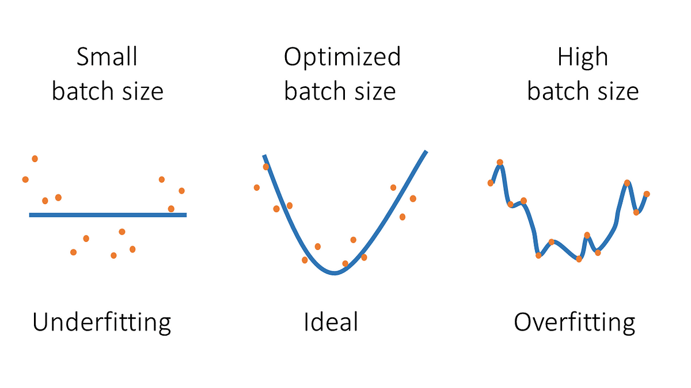

## Table of Contents

## What is large batch optimization in machine learning?

Large batch optimization in machine learning is a technique used to train models using bigger sets of data at once. Instead of updating the model with small amounts of data, large batch optimization uses larger chunks. This can make training faster because the computer can use its power more efficiently. However, it can also make it harder for the model to learn well because it might miss out on important details in the data.

One challenge with large batch optimization is that it can lead to a situation where the model gets stuck and doesn't improve much. This is because when you use big batches, the model might not see the variety in the data as clearly. Researchers have come up with ways to deal with this, like adjusting the learning rate or using special techniques to keep the model learning well even with large batches. Overall, large batch optimization is a useful tool, but it needs careful handling to work best.

## Why is large batch optimization important for training deep learning models?

Large batch optimization is important for training deep learning models because it can make the training process much faster. When you use large batches, you can take advantage of the power of modern computers, especially those with multiple processors or graphics processing units (GPUs). This means you can process more data at once, which can lead to quicker training times. This is especially helpful when you're working with big datasets or complex models that would take a long time to train otherwise.

However, using large batches isn't always straightforward. One challenge is that large batches can sometimes make it harder for the model to learn well. This is because the model might not see the variety in the data as clearly when it's looking at a big chunk all at once. Researchers have found ways to deal with this, like adjusting the learning rate or using special techniques to keep the model learning well even with large batches. So, while large batch optimization can speed things up, it needs to be used carefully to make sure the model still learns effectively.

## What are the challenges associated with using large batch sizes in optimization?

One big challenge with using large batch sizes in optimization is that it can make it harder for the model to learn well. When you use a large batch, the model looks at a big chunk of data all at once. This can make it miss out on important details or patterns in the data because it's trying to learn from too much at the same time. This can lead to the model getting stuck and not improving as much as it could. Researchers call this problem "generalization gap," which means the model doesn't perform as well on new data it hasn't seen before.

Another challenge is that large batches can make training unstable. When you use large batches, the updates to the model can be big and sudden. This can cause the training process to jump around a lot, making it hard for the model to find the best solution. To deal with this, people often need to adjust the learning rate, which is how fast the model learns from the data. If the learning rate is too high, the model might overshoot the best solution. If it's too low, the training can take a long time. Finding the right balance is tricky but important for making large batch optimization work well.

To address these challenges, researchers have developed special techniques. One common approach is to use a technique called "learning rate scaling," where the learning rate is adjusted based on the batch size. For example, if you increase the batch size by a [factor](/wiki/factor-investing) of $$k$$, you might also increase the learning rate by the square root of $$k$$. Another technique is "warmup," where the learning rate starts low and gradually increases at the beginning of training. These methods help to make large batch optimization more stable and effective, but they require careful tuning to work best.

## How does the Adam optimizer work, and why is it suitable for large batch optimization?

The Adam optimizer is a popular way to train [machine learning](/wiki/machine-learning) models because it combines the best parts of two other methods: AdaGrad and RMSprop. It works by keeping track of how much each parameter in the model has changed over time. Adam uses this information to adjust the learning rate for each parameter separately. This helps the model learn faster and more accurately. Adam also uses something called "[momentum](/wiki/momentum)," which helps the model keep moving in the right direction even if it hits a bump along the way. The formula for updating the parameters in Adam is a bit complex, but it looks like this: $$ \theta_{t+1} = \theta_t - \frac{\alpha \cdot \hat{m}_t}{\sqrt{\hat{v}_t} + \epsilon} $$, where $$\theta$$ is the parameter, $$\alpha$$ is the learning rate, $$m$$ and $$v$$ are moving averages of the gradient and its square, and $$\epsilon$$ is a small number to avoid dividing by zero.

Adam is suitable for large batch optimization because it can handle the challenges that come with using big batches of data. When you use large batches, the updates to the model can be big and sudden, which can make training unstable. But Adam's ability to adjust the learning rate for each parameter helps keep things smooth. It also uses momentum to help the model keep learning even when the updates are big. This makes Adam a good choice for large batch optimization because it can help the model learn well even when it's looking at a lot of data at once.

## What is the LAMB optimizer and how does it differ from Adam in handling large batches?

The LAMB optimizer, or Layer-wise Adaptive Moments optimizer, is a type of optimizer that's really good at handling large batches when training machine learning models. It's based on the Adam optimizer but adds some special tweaks to make it work better with big data chunks. LAMB looks at each layer of the model separately and adjusts how fast the model learns based on the size of the layer. This helps the model learn more evenly and prevents any one part from getting stuck or learning too fast. The main formula for LAMB is a bit different from Adam's and looks like this: $$ \theta_{t+1} = \theta_t - \eta_t \cdot \frac{\hat{m}_t}{\sqrt{\hat{v}_t} + \epsilon} \cdot \frac{\|\theta_t\|}{\|\hat{m}_t / (\sqrt{\hat{v}_t} + \epsilon)\| + \epsilon} $$. This formula helps LAMB keep the updates to the model in check, even with large batches.

LAMB is different from Adam because it pays special attention to how big each layer of the model is. Adam treats all parts of the model the same, but LAMB knows that bigger layers might need different learning speeds. This makes LAMB better at keeping the training stable when you're using large batches. Adam is great at adjusting the learning rate for each parameter, but it might not handle the big jumps that come with large batches as smoothly as LAMB does. That's why LAMB is often the go-to choice when you're working with big datasets and want your model to learn as quickly and accurately as possible.

## Can you explain the LARS optimizer and its approach to scaling learning rates with batch size?

The LARS optimizer, which stands for Layer-wise Adaptive Rate Scaling, is another way to train machine learning models that works well with large batches. LARS focuses on making sure that each layer of the model learns at the right speed. It does this by looking at how big each layer is and adjusting the learning rate based on that. This helps keep the training stable, even when you're using big chunks of data. The main idea behind LARS is to scale the learning rate in a way that depends on the size of the layer, which can help the model learn more evenly across all its parts.

LARS uses a special formula to adjust the learning rate for each layer. The formula is $$ \eta_l = \frac{\eta_0 \cdot \|p_l\|}{\|\nabla L(p_l)\| + \lambda \|p_l\|} $$, where $$\eta_l$$ is the learning rate for layer $$l$$, $$\eta_0$$ is the base learning rate, $$p_l$$ is the parameter of the layer, $$\nabla L(p_l)$$ is the gradient of the loss with respect to the parameter, and $$\lambda$$ is a small constant to avoid division by zero. This formula helps LARS make sure that the updates to the model are the right size, even when you're using large batches. By scaling the learning rate this way, LARS can keep the training process smooth and help the model learn well, no matter how big the batch size is.

## What are the advantages of using 1-bit Adam for large batch optimization?

1-bit Adam is a special version of the Adam optimizer that uses only one bit to send information during training. This makes it use less memory and be faster, which is great for large batch optimization. When you use large batches, you have to deal with a lot of data at once, and this can slow things down. But with 1-bit Adam, you can train your model faster because it doesn't need as much memory to store all that data. This means you can work with bigger batches without making your computer struggle.

Another advantage of 1-bit Adam is that it can still learn well even with large batches. Normally, when you use big batches, the model might miss important details in the data. But 1-bit Adam has a special way of updating the model that helps it keep learning well. It uses a technique where it sends only the sign of the gradient, which is either +1 or -1, instead of the full gradient. This helps the model stay on track and learn effectively, even when it's looking at a lot of data at once. So, 1-bit Adam is a good choice for large batch optimization because it's fast and can still help your model learn well.

## How does the Nesterov Accelerated Gradient method enhance large batch training?

The Nesterov Accelerated Gradient (NAG) method helps make large batch training better by giving the model a way to look ahead and adjust its learning more smoothly. When you use big batches, the updates to the model can be big and sudden, which can make training unstable. But NAG uses a special trick called "momentum" to help the model keep moving in the right direction. It does this by first taking a step in the direction it's already going, then calculating the gradient at that new spot, and finally adjusting the model based on that gradient. This helps the model learn more smoothly and avoid big jumps that can mess up training.

The main formula for NAG looks like this: $$ v_{t+1} = \gamma v_t - \eta \nabla f(\theta_t - \gamma v_t) $$ and $$ \theta_{t+1} = \theta_t + v_{t+1} $$. Here, $$v$$ is the momentum, $$\gamma$$ is the momentum coefficient, $$\eta$$ is the learning rate, and $$\nabla f(\theta_t - \gamma v_t)$$ is the gradient calculated at the point where the model would be if it took a step based on its current momentum. By using this formula, NAG can help the model learn faster and more accurately, even when you're using large batches. This makes NAG a good choice for large batch optimization because it can keep the training process stable and help the model learn well.

## What is the concept behind 1-bit LAMB and its impact on memory efficiency?

1-bit LAMB is a special version of the LAMB optimizer that uses only one bit to send information during training. This makes it use less memory and be faster, which is great for large batch optimization. When you use large batches, you have to deal with a lot of data at once, and this can slow things down. But with 1-bit LAMB, you can train your model faster because it doesn't need as much memory to store all that data. This means you can work with bigger batches without making your computer struggle.

Another advantage of 1-bit LAMB is that it can still learn well even with large batches. Normally, when you use big batches, the model might miss important details in the data. But 1-bit LAMB has a special way of updating the model that helps it keep learning well. It uses a technique where it sends only the sign of the gradient, which is either +1 or -1, instead of the full gradient. This helps the model stay on track and learn effectively, even when it's looking at a lot of data at once. So, 1-bit LAMB is a good choice for large batch optimization because it's fast and can still help your model learn well.

## How does the SM3 optimizer address the issues of generalization in large batch training?

The SM3 optimizer, which stands for Sharpness-Aware Minimization with Momentum, helps with the problem of generalization in large batch training by making the model learn in a way that's less likely to overfit. Overfitting happens when a model learns the training data too well and doesn't do as well on new data. SM3 does this by looking at how sensitive the model is to small changes in the data. It tries to find a solution that's not only good for the training data but also works well for new data. This is done by using a special formula that balances the model's performance on the training data with how much it changes when the data changes a little bit.

SM3 also uses momentum to help the model keep learning smoothly, even with large batches. Momentum helps the model keep moving in the right direction, even if it hits a bump along the way. The formula for SM3 includes a term for momentum, which helps the model learn faster and more accurately. By using this approach, SM3 can help the model generalize better, meaning it can perform well on new data it hasn't seen before. This makes SM3 a good choice for large batch training because it can help the model learn well and avoid overfitting, even when it's looking at a lot of data at once.

## What makes Distributed Shampoo a good choice for optimizing large models with large batches?

Distributed Shampoo is a good choice for optimizing large models with large batches because it can handle the complexity of big models and big data chunks at the same time. It does this by breaking down the optimization problem into smaller pieces that can be worked on by different parts of the computer at the same time. This makes the training process faster and more efficient. Distributed Shampoo also uses a special way of updating the model that helps it learn well, even when it's looking at a lot of data at once. It does this by using something called a "second-order optimizer," which looks at how the model changes when you change the data a little bit. This helps the model learn more accurately and quickly.

Another reason Distributed Shampoo is good for large models and large batches is that it can work well on different types of computers, like those with many processors or graphics processing units (GPUs). This means you can use it to train your model faster, no matter what kind of computer you have. Distributed Shampoo also helps the model learn evenly across all its parts, which can be hard to do when you're using big batches. By using a special formula to update the model, Distributed Shampoo can keep the training process smooth and help the model learn well, even when it's dealing with a lot of data at once.

## How does the SLAMB optimizer combine the strengths of LAMB and other techniques for large batch optimization?

The SLAMB optimizer, which stands for Scaled LAMB, combines the strengths of the LAMB optimizer with other techniques to make large batch optimization even better. SLAMB takes the idea of adjusting the learning rate based on the size of each layer from LAMB and adds a special way of scaling the learning rate that depends on the batch size. This helps the model learn more smoothly and quickly, even when you're using big chunks of data. SLAMB also uses a technique called "learning rate warmup," where the learning rate starts low and gradually increases at the beginning of training. This helps the model learn well from the start and keeps the training process stable.

By combining these techniques, SLAMB can handle the challenges that come with using large batches. It helps the model learn evenly across all its parts and keeps the training process smooth, even when the updates to the model are big and sudden. The main formula for SLAMB looks like this: $$ \theta_{t+1} = \theta_t - \eta_t \cdot \frac{\hat{m}_t}{\sqrt{\hat{v}_t} + \epsilon} \cdot \frac{\|\theta_t\|}{\|\hat{m}_t / (\sqrt{\hat{v}_t} + \epsilon)\| + \epsilon} \cdot \text{scale_factor} $$. The scale_factor helps adjust the learning rate based on the batch size, making sure the model learns well no matter how big the batch is. This makes SLAMB a good choice for large batch optimization because it can help the model learn quickly and accurately, even when it's looking at a lot of data at once.

## References & Further Reading

[1]: Goyal, P., Dollár, P., Girshick, R., Noordhuis, P., Wesolowski, L., Kyrola, A., ... & He, K. (2017). ["Accurate, large minibatch SGD: Training ImageNet in 1 hour."](https://arxiv.org/abs/1706.02677) arXiv preprint arXiv:1706.02677.

[2]: You, Y., Gitman, I., & Ginsburg, B. (2017). ["Large Batch Training of Convolutional Networks."](https://arxiv.org/abs/1708.03888) arXiv preprint arXiv:1708.03888.

[3]: Kingma, D. P., & Ba, J. (2014). ["Adam: A Method for Stochastic Optimization."](https://arxiv.org/abs/1412.6980) arXiv preprint arXiv:1412.6980.

[4]: You, Y., Zhang, Z., Hsieh, C. J., Demmel, J., & Keutzer, K. (2019). ["LARGE BATCH OPTIMIZATION FOR DEEP LEARNING: TRAINING BERT IN 76 MINUTES."](https://arxiv.org/abs/1904.00962) International Conference on Learning Representations (ICLR).

[5]: You, Y., Li, J., Reddi, S., Hseu, J., Kumar, S., Bhojanapalli, S., ... & Demmel, J. (2019). ["Reducing BERT Pre-Training Time from 3 Days to 76 Minutes."](https://arxiv.org/abs/1904.00962) arXiv preprint arXiv:1904.00962.

[6]: Zinkevich, M., Weimer, M., Li, L., & Smola, A. J. (2010). ["Parallelized Stochastic Gradient Descent."](https://martin.zinkevich.org/publications/nips2010.pdf) Advances in neural information processing systems.

[7]: Hoffer, E., Hubara, I., & Soudry, D. (2017). ["Train longer, generalize better: closing the generalization gap in large batch training of neural networks."](https://arxiv.org/abs/1705.08741) arXiv preprint arXiv:1705.08741.

[8]: Wang, R., Li, S., Chen, Z., & Zhao, P. (2020). ["SM3 Optimizer: Sharpness-aware Minimization with Momentum Optimizer in Batch Learning."](https://www.nature.com/articles/s41698-025-00902-z) arXiv preprint arXiv:2003.06192.