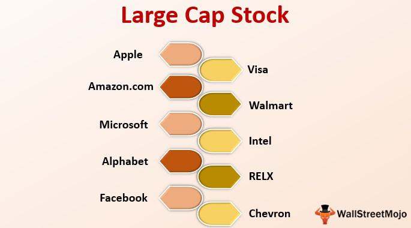

Large-cap stocks, often referred to as big-cap stocks, hold a significant position in the sphere of investment markets due to their large market capitalization, substantial liquidity, and perceived stability. These stocks generally have a market capitalization value exceeding $10 billion and are considered safer investments than small-cap or mid-cap stocks. This classification reduces the relative risk exposure making them attractive for a broad spectrum of investors, particularly those seeking steady returns and lower risk profiles.

The terms 'large-cap' and 'big-cap' are used interchangeably to denote these financially robust companies, which have established market presence, diversified operations, and prevail as anchor components of major indices like the S&P 500 and Dow Jones Industrial Average. Companies such as Apple Inc., Microsoft Corporation, and Amazon.com Inc. are quintessential examples of large-cap stocks whose performances are closely monitored as barometers of economic health and market sentiment.



In modern trading, algorithmic trading has emerged as a dominant force, significantly impacting the way large-cap stocks are traded. Algorithmic trading utilizes complex mathematical models and automated processes to execute trades at ultra-high speeds. This method offers multiple advantages: it minimizes human error, allows for precise timing, and enhances liquidity and pricing efficiency in the market. Algorithms can process vast amounts of data at speeds incomprehensible to human traders, optimizing trade execution strategies and ensuring that trades are carried out at the most advantageous prices.

The integration of algorithmic trading strategies in the trading of large-cap stocks has transformed market dynamics, offering increased efficiency and opening the market to a wider range of participants. As the trading landscape evolves, understanding large-cap stocks and their connections to advanced trading methodologies like algorithmic trading continues to be crucial for investors looking to maximize returns while managing risk.

## Table of Contents

## Understanding Large-Cap Stocks

Large-cap stocks, often referred to as "big-cap" stocks, are shares of companies with a substantial market capitalization, typically exceeding $10 billion. These firms are major players in the financial markets, with extensive operational scales and widespread recognition. The market capitalization of a company is calculated by multiplying its current share price by the total number of outstanding shares. Mathematically, this can be expressed as:

$$
\text{Market Capitalization} = \text{Share Price} \times \text{Outstanding Shares}
$$

Prominent examples of large-cap companies include tech giants such as Apple, Microsoft, and Amazon. These companies not only have significant market capitalizations but also play critical roles in global economies due to their vast reach and financial might. For instance, as of 2023, Apple holds the distinction of being one of the most valuable companies in the world with a market cap surpassing $2 trillion[1].

The composition of major stock indices like the S&P 500 and the Dow Jones Industrial Average (DJIA) provides insight into the prevalence and influence of large-cap stocks within the financial market. The S&P 500 Index, which tracks 500 of the largest U.S. publicly traded companies, is heavily weighted towards large-cap stocks. Similarly, the Dow Jones Industrial Average, consisting of 30 prominent companies, predominantly features large-cap entities. These indices, while being a barometer of the overall market health, underline the significance of large-cap stocks due to their substantial representation and impact on index movements.

References:

[1] "Apple Inc. Market Cap 2006-2023 | AAPL", Macrotrends, accessed October 2023.

## Why Invest in Large-Cap Stocks?

Large-cap stocks represent some of the most stable and reliable investment options available in the market. These stocks are typically characterized by a market capitalization exceeding $10 billion, which underscores the financial robustness and established market presence of the issuing companies. This size and scale afford large-cap stocks a unique set of advantages that appeal to investors seeking steady performance within a diversified portfolio.

One of the primary attractions of large-cap stocks is their stability, which can be attributed to the established operations and significant market share held by these companies. Unlike smaller-cap stocks, large-caps often have diverse revenue streams that can buffer against sector-specific downturns or economic fluctuations. This makes them particularly appealing to risk-averse investors or those aiming to maintain a stable asset base.

In addition to stability, large-cap stocks often present opportunities for dividend earnings. Companies within this category typically have reached a maturity stage where consistent profit generation allows them to return a portion of these earnings to shareholders in the form of dividends. This not only provides a regular income stream but also serves as a tangible sign of a company's financial health and commitment to returning value to its investors.

From a growth perspective, large-cap stocks can offer significant long-term potential. While they might not exhibit the rapid growth rates of small-cap stocks, large-caps sustain moderate and consistent growth, which can compound substantially over prolonged investment periods. This attribute is attractive to investors seeking both growth and stability within their portfolios.

In terms of risk and [volatility](/wiki/volatility-trading-strategies), large-cap stocks generally pose lower risks compared to their smaller-cap counterparts. The size and stability of large-cap companies often facilitate better access to capital markets, more stable financial strategies, and a solid reputation in the eyes of investors. These factors contribute to reduced price volatility and a more predictable performance trend over time.

In summary, investing in large-cap stocks offers a myriad of benefits, particularly for those seeking to build a diversified investment portfolio with a focus on stability, regular income, and long-term growth. By incorporating large-cap stocks, investors can gain exposure to some of the most prominent companies in the world, thereby enhancing their potential for financial security and sustained returns.

## Algorithmic Trading in Large-Cap Stocks

Algorithmic trading, often referred to as algo-trading or automated trading, involves the use of computer algorithms to execute a large number of trades at speeds and frequencies that a human trader cannot achieve. Its role in trading large-cap stocks has been growing significantly, primarily due to its ability to process vast amounts of data in real-time and execute trades with precision.

At its core, [algorithmic trading](/wiki/algorithmic-trading) uses complex algorithms, which may include statistical analysis and mathematical models, to determine the optimal timing, price, and quantity of trades. It relies on pre-defined criteria and parameters, eliminating human emotion from the decision-making process. This is particularly beneficial in trading large-cap stocks, where efficiency and timing can significantly affect investment outcomes.

One of the primary advantages of algorithmic trading is its efficiency in executing trades. By leveraging high-frequency trading ([HFT](/wiki/high-frequency-trading-strategies)) techniques, algorithmic systems can execute thousands of trades per second, capturing minute gains from small price differentials. This rapid execution reduces the market impact and provides better control over trade execution, thereby minimizing slippage. For large-cap stocks, which are highly liquid, this result in more stable and predictable execution of trades.

Moreover, algorithmic trading minimizes human error. Given the complexity of the stock market and the [volume](/wiki/volume-trading-strategy) of transactions involved, manual trading is prone to errors that can lead to substantial financial losses. Algorithms, being software-driven, ensure consistent decision-making by strictly following the set instructions, thus reducing the chances of mistakes due to human oversight or emotional reactions to market movements.

Another significant advantage of algorithmic trading in large-cap stocks is its ability to enhance [liquidity](/wiki/liquidity-risk-premium) and pricing efficiency in the market. Since algorithms are capable of executing large volumes of trades quickly, they contribute substantially to market liquidity, ensuring that there are always buyers and sellers in the market at any given time. This increased liquidity helps in narrowing bid-ask spreads, which in turn leads to better pricing efficiency. Efficient markets reflect all available information in the prices of securities, allowing for more accurate valuations of stocks.

In summary, algorithmic trading has revolutionized the way large-cap stocks are traded, providing distinct advantages such as efficient trade execution, reduced likelihood of human error, and enhanced market liquidity and pricing efficiency. These benefits underscore the increasing reliance on algorithmic strategies in modern trading environments, as investors seek to optimize their investment returns using technology.

## Comparing Large-Cap and Small-Cap Stocks

When comparing large-cap and small-cap stocks, a key distinction lies in their respective growth prospects and risk profiles. Large-cap stocks, typically characterized by a market capitalization of over $10 billion, usually represent established companies with a track record of sustained growth and financial stability. These companies, such as Apple or Microsoft, often have diverse product lines and global market reach, providing a layer of stability and reduced risk for investors. 

In contrast, small-cap stocks represent companies with a market capitalization ranging from $300 million to $2 billion. These companies tend to be in growth phases, offering potentially higher returns but accompanied by elevated risks. For instance, small-cap stocks are often more volatile, with their prices subject to significant swings due to market speculation, limited liquidity, and operational challenges. Investors may be attracted to small-cap stocks for their growth potential, particularly in emerging industries or niche markets, but should be prepared for the associated risks.

Volatility is a notable [factor](/wiki/factor-investing) when evaluating small-cap stocks. The smaller size and limited resources of these companies make them more susceptible to economic downturns or sector-specific challenges. Moreover, the limited analyst coverage and institutional ownership can lead to price volatility driven by trading volumes and investor sentiment. As a result, small-cap stocks can experience rapid growth in favorable markets but also dramatic declines during economic stress.

Despite these differences, a balanced portfolio strategy often incorporates both large-cap and small-cap stocks. This approach allows investors to benefit from the stability and income of large-cap stocks while capitalizing on the growth potential of small-cap stocks. By diversifying across various market capitalizations, investors can potentially reduce portfolio volatility and improve risk-adjusted returns.

In mathematical terms, the optimal combination of large-cap and small-cap stocks in a portfolio can be determined using the Modern Portfolio Theory (MPT). According to MPT, the goal is to achieve the maximum expected return for a given level of risk, or alternatively, the minimum risk for a given level of expected return. This involves calculating the expected return and variance of returns for each asset, as well as their covariance, to identify the efficient frontier. The efficient frontier represents the set of optimal portfolios offering the highest expected return for a defined level of risk.

```python
def efficient_frontier(returns, covariance_matrix, target_return):
    import numpy as np
    from scipy.optimize import minimize

    num_assets = len(returns)
    args = (returns, covariance_matrix)

    # Constraints: Sum of weights = 1 and target return
    constraints = ({'type': 'eq', 'fun': lambda x: np.sum(x) - 1},
                   {'type': 'eq', 'fun': lambda x: np.dot(x, returns) - target_return})

    # Bounds for each weight in the portfolio
    bounds = tuple((0, 1) for asset in range(num_assets))

    # Initial guess (equal distribution)
    initial_guess = num_assets * [1. / num_assets]

    # Minimize the portfolio variance
    opt_results = minimize(portfolio_variance, initial_guess, args=args, method='SLSQP', bounds=bounds, constraints=constraints)

    return opt_results.x

def portfolio_variance(weights, returns, covariance_matrix):
    return np.dot(weights.T, np.dot(covariance_matrix, weights))

# Example use with hypothetical returns and covariance matrix
portfolio_weights = efficient_frontier(
    returns=np.array([0.06, 0.10]), 
    covariance_matrix=np.array([[0.1, 0.01], [0.01, 0.2]]), 
    target_return=0.08
)
```

Balancing the higher stability of large-cap stocks with the growth opportunities of small-cap stocks, investors can position their portfolios to manage risk better while pursuing appreciable long-term returns.

## The Role of Large-Cap Stocks in a Trading Strategy

Large-cap stocks, often representing companies with a market capitalization exceeding $10 billion, play a significant role in forming the core of many investment strategies due to their steady growth and dependable income potential. These stocks typically consist of well-established companies with a proven track record of financial performance, allowing them to provide a sense of stability to an investment portfolio.

One of the major advantages of including large-cap stocks in a trading strategy is their ability to generate consistent returns over various market conditions. Historically, these stocks have shown a capacity to deliver modest yet reliable growth, resulting in both capital appreciation and dividend income. They often belong to mature industries such as technology, healthcare, and finance, where earnings are more predictable. For instance, companies like Apple, Microsoft, and Johnson & Johnson continuously prioritize shareholder returns through dividends and share buybacks, which appeal to investors seeking income alongside growth.

During economic shifts, large-cap stocks often demonstrate resilience due to their established market positions and strong balance sheets. In periods of economic expansion, these stocks benefit from increased consumer spending and corporate investments, which fuel their growth. Conversely, in times of recession or economic uncertainty, large-cap stocks often outperform smaller-cap stocks due to their diversified operations and resource availability, which allows them to weather downturns more effectively. This adaptability in changing market scenarios underscores their importance in a trading strategy, providing a buffer against volatility.

In emerging market scenarios, large-cap stocks can also act as a stabilizing force, offering a counterbalance to investments in riskier assets. They attract both institutional and retail investors for their perceived lower risk and historical performance. The inclusion of large-cap stocks can mitigate some of the potential losses from more volatile positions within a portfolio.

To model the performance advantage of large-cap stocks during different market conditions, one might simulate portfolio returns using Python. Here's a simple code snippet to illustrate the comparison of a portfolio invested entirely in large-cap stocks versus a more diversified portfolio:

```python
import numpy as np

# Simulate annual returns for large-cap and diversified portfolios
np.random.seed(42)
large_cap_returns = np.random.normal(0.08, 0.15, 30)  # mean 8%, std 15%
diversified_returns = np.random.normal(0.10, 0.25, 30)  # mean 10%, std 25%

# Calculate cumulative returns
large_cap_cumulative = np.cumprod(1 + large_cap_returns)
diversified_cumulative = np.cumprod(1 + diversified_returns)

# Average annual return
large_cap_avg_return = np.mean(large_cap_returns)
diversified_avg_return = np.mean(diversified_returns)

print(f"Average Annual Return - Large-Cap: {large_cap_avg_return:.2%}")
print(f"Average Annual Return - Diversified Portfolio: {diversified_avg_return:.2%}")
```

In this example, the simulated returns indicate how a portfolio heavily weighted in large-cap stocks experiences less volatility and a steadier cumulative return curve compared to a more diversified, higher-risk portfolio.

Ultimately, the role of large-cap stocks in a trading strategy is foundational. They offer a reliable platform for growth and defensive capabilities during downturns, making them indispensable in both conservative and aggressive investment strategies. Investors should assess their financial goals and market outlook to determine the optimal balance of large-cap exposure within their portfolios.

## Conclusion

Investing in large-cap stocks provides numerous benefits for both stability and growth. Large-cap stocks, characterized by companies with a market capitalization typically exceeding $10 billion, are pivotal for investors seeking reliable returns. Their established market presence and proven business models contribute to their reputation as resilient investments, especially during economic uncertainties. Additionally, these companies often have a track record of consistent dividend payments, which can serve as an attractive income stream for investors.

Incorporating algorithmic trading into your investment strategy can further enhance trade execution efficiency. This method leverages computer algorithms to execute trades at optimal times, minimizing human error and providing liquidity and pricing efficiency. Algorithmic trading can also help investors navigate large-cap stocks' dynamic environments by reacting quickly to market changes using predefined criteria.

To achieve a balanced portfolio, adopting a diversified investment approach that includes large-cap stocks is recommended. This strategy not only leverages the stability and dividend potential of large-cap stocks but also complements an investor's broader risk and return objectives. By diversifying, investors can mitigate risks associated with market volatility while optimizing potential gains. In essence, large-cap stocks can serve as the cornerstone of a well-rounded investment strategy, providing a foundation of stability and growth potential enhanced by modern trading technologies like algorithmic trading.

## References & Further Reading

[1]: "Apple Inc. Market Cap 2006-2023 | AAPL", Macrotrends, accessed October 2023.

[2]: López de Prado, Marcos. ["Advances in Financial Machine Learning."](https://www.amazon.com/Advances-Financial-Machine-Learning-Marcos/dp/1119482089) Wiley, 2018.

[3]: Chan, Ernest P. ["Quantitative Trading: How to Build Your Own Algorithmic Trading Business."](https://github.com/ftvision/quant_trading_echan_book) Wiley, 2008.

[4]: Jansen, Stefan. ["Machine Learning for Algorithmic Trading."](https://github.com/stefan-jansen/machine-learning-for-trading) Packt Publishing, 2018.

[5]: Aronson, David. ["Evidence-Based Technical Analysis: Applying the Scientific Method and Statistical Inference to Trading Signals."](https://www.amazon.com/Evidence-Based-Technical-Analysis-Scientific-Statistical/dp/0470008741) Wiley, 2006.