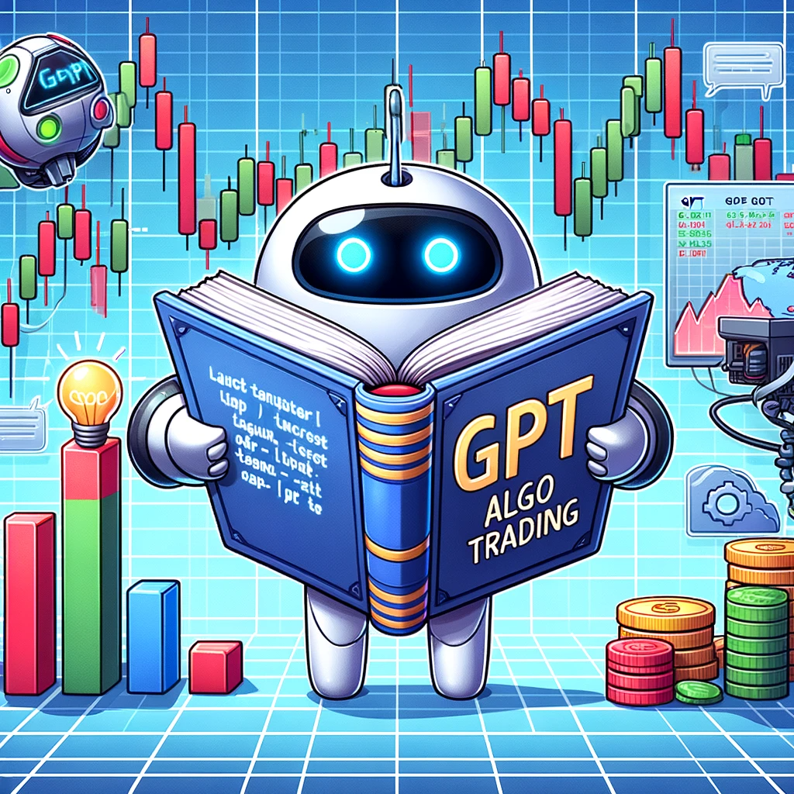

Finance has historically been a data-intensive field, making it ripe for the application of various data analysis and machine learning technologies. Large Language Models (LLMs), with their immense capacity to understand and generate text, have been logically extended into the financial sector, moving from general-purpose models to those with a specific focus on finance and trading.

It's crucial to underline that while the applications of LLMs in trading present novel opportunities, they also bring to light imperative questions about data validity, ethical considerations, and risk management, which will be explored in forthcoming sections. As we further delve into how LLMs are revolutionizing the trading world, the emphasis on navigating through these challenges becomes paramount, ensuring that the evolution of financial technologies remains ethical, transparent, and robust.

# A Deep Dive into LLMs and Their Evolution

The application of Large Language Models (LLMs) like GPT-3.5 or beyond, in the trading domain has fashioned a nuanced approach towards financial forecasting and analysis. Integrating machine learning with traditional [trading strategies](https://paperswithbacktest.com/) not only expedites the data analysis process but also infuses a level of predictive precision that was once only theoretical.

The utility of LLMs in parsing vast [datasets](https://paperswithbacktest.com/datasets) extends remarkably into market analysis, especially in assessing [sentiments](https://paperswithbacktest.com/paper/market-sentiment-and-an-overnight-anomaly) across diverse data sources. Social media platforms, financial news outlets, and forums become rich sources where LLMs scrape and analyze textual data, converting it into actionable insights. The sentiment gleaned from this data - be it bullish, bearish, or neutral, provides traders and investment algorithms with a predictive lens to anticipate market movements. A practical case is when an LLM identifies a surge in positive sentiment toward a particular stock on social media and investment forums, prompting traders to anticipate an uptick in its value. Moreover, LLMs, due to their robust natural language understanding, can sieve through the noise and focus on relevant signals, enhancing the quality of predictive analytics.

In the realm of algorithmic trading, LLMs sculpt strategies by identifying potentially lucrative patterns via historical data analysis. Whether it's a matter of [executing high-frequency trades](https://blog.paperswithbacktest.com/p/execute-your-trades-at-lower-cost) or devising long-term investment algorithms, LLMs facilitate these activities by offering predictions based on identified patterns, correlating various market variables, and managing multi-dimensional data efficiently. This may include strategies that leverage mean reversion, [momentum](https://paperswithbacktest.com/paper/fact-fiction-and-momentum-investing), statistical arbitrage, or any other [algorithmic trading strategy](https://paperswithbacktest.com/). Their capacity to manage large volumes of data allows traders and analysts to operate at scales and speeds, which were previously unattainable, enabling more informed and timely investment decisions.

# Unveiling LLMs in the Financial Sector

LLMs, leveraging their extensive training, enable the synthesis of trading signals from the tumultuous sea of market data, steering the trading algorithms towards enhanced accuracy and minimizing human-induced errors.

Certain LLMs have emerged as pivotal players, each offering unique functionalities.

- **ChatGPT:** A creation of OpenAI, ChatGPT, excels in generating articulate and contextually relevant responses in financial discussions and providing investment advice. Its training on chat conversations enables it to effectively engage in generating personalized investment recommendations and astutely answering financial market inquiries, though its prowess in market analysis and forecasting might have limitations due to its training data nature.
- **BloombergGPT:** Developed by Bloomberg, this proprietary LLM harnesses the vast ocean of financial news and data it is trained on to perform potent market analysis and forecasting. However, its utility is confined within the walls of its proprietary nature, limiting public access and utilization.
- **FinGPT:** Spawned from the minds at Google AI, FinGPT, an open-source LLM, offers a democratized tool trained on financial text and code, catering to an array of financial applications like market analysis and generating trading signals. While it provides a myriad of functionalities, its accuracy might not mirror that of certain proprietary models such as GPT.

# Practical Applications and Real-world Cases

Large Language Models (LLMs) have become crucial in market analysis and forecasting, particularly through the use of [sentiment analysis](https://paperswithbacktest.com/paper/market-sentiment-and-an-overnight-anomaly). This approach analyzes the emotional tone of textual data from various sources like news and social media to predict market movements and provides insights into collective market sentiments towards specific assets or events. While promising, it’s not foolproof; one study recorded a prediction accuracy of 65% for the S&P 500 index, and another showed about 58% accuracy for individual stock prices[1][2].

Several organizations, like AQR Capital Management and Kensho Technologies, utilize LLMs to identify [trends](https://paperswithbacktest.com/paper/does-trend-following-work-on-stocks) in financial news and social media and inform their investment strategies. Kensho's LLM-driven platform, which provides investment recommendations based on market data analysis, is used by major investment firms like Bridgewater Associates and BlackRock. However, it’s vital to note that LLMs come with challenges, such as data biases and vulnerability to manipulation, necessitating ongoing research and regulatory oversight.

## Algorithmic Trading and LLMs

High-Frequency Trading (HFT), a subset of algorithmic trading, operates within minimal timeframes, often milliseconds, aiming to leverage tiny price discrepancies by executing trades at an extremely rapid pace. LLMs, when integrated with HFT, can analyze, interpret, and predict short-term market movements, deciphering textual data like news flashes, tweets, or financial reports, and instantaneously feeding this insight into trading algorithms.

A study published in arXiv explored how transformer-based models, a category to which LLMs belong, can be utilized in predicting mid-price movements, providing a scientific foundation to the conceptual applicability of LLMs in algorithmic trading ([Zhang et. al, 2022](https://arxiv.org/abs/2211.08025)). Another exploration by [Zohren et. al, 2020](https://arxiv.org/abs/2108.09254) detailed how various machine learning models, indicative of the kind of architectures LLMs are based upon, demonstrated aptitude in predicting stock price movements, underscoring the potential viability of LLMs in a real-world trading context.

# Overcoming Challenges and Mitigating Risks

Hallucinations and biases are substantial impediments when employing LLMs. The occurrences of hallucinations, wherein LLMs generate unfounded or spurious information, necessitate stringent validation mechanisms to verify the generated outputs, especially in the critical domain of financial trading where accuracy is paramount. Moreover, biases, inadvertently inherited during the training on historical data, can skew predictions and analyses, demanding meticulous scrutiny and potentially the application of bias-mitigation techniques to ensure impartiality in the financial forecasts and decisions derived from LLMs.

Beyond the internal mechanisms, the transparency and validity of the data utilized for training and operating LLMs have far-reaching consequences on the models’ reliability and ethicality. Employing a transparent data management and utilization strategy, potentially encompassing public availability of the data or auditing by independent entities, ensures that the LLMs' operations and predictions can be traced back to authentic and unbiased data, safeguarding against unintentional misinformation or skewed predictions.

Using Large Language Models (LLMs) in trading requires ethical and legal considerations. Financial markets are vulnerable to manipulations, so it's crucial to use LLMs ethically to avoid issues like market manipulation or biased predictions. Legal regulations are essential to ensure fairness when using advanced tech like LLMs. As financial tech regulations change, staying updated, seeking legal advice, and adapting strategies are vital to ensure LLMs are used legally and protect everyone's interests.

# Future Perspectives

Financial Large Language Models (LLMs), despite their nascent stage, delineate a future where intricate financial analyses, predictions, and decisions are articulated and executed with nuanced understanding and high precision.

Yet, the realization of Artificial General Intelligence (AGI) in finance seems like a distant, albeit transformative, future. AGI, with its envisaged capacity to grasp, understand, and innovate across a multitude of domains just as a human would, could restructure the very foundations of financial analytics, product development, service provision, and market operations. This machinery, when realized, could conjure unprecedented financial models, services, and products while catalyzing operational transparency and efficiency in markets on a global scale.

Ensuring that the development and deployment of financial LLMs, and eventually AGI, ensue ethically and equitably is paramount. The onus lies on technologists, policymakers, and financial experts to forge pathways that ensure the inclusivity of diverse demographics in benefiting from this technological marvel. It entails formulating frameworks that guarantee transparency, accountability, and understanding in how LLMs and AGIs operate and make decisions, especially in a domain as impactful and crucial as finance.

Bridging the gap between the technological advancements in LLMs and AGI and the practical, ethical deployment in the finance sector is the next frontier. The synergistic melding of expertise from artificial intelligence, financial analytics, ethics, and policy-making will be instrumental in crafting a future where financial LLMs and AGI not only revolutionize the financial industry but also serve as exemplars of ethical, equitable, and inclusive technological advancement.

# Conclusion

Large Language Models (LLMs) have the potential to enhance precision and efficiency in finance, from automating tasks to giving personalized advice. As we move from models like GPT-3 to more specialized ones like BloombergGPT, AI's role in finance becomes more integrated.

However, this integration brings challenges. Ethical use, transparency, and inclusivity are essential. We must create frameworks to ensure fair practices and clear understanding of AI decisions. Combining technological advancement with ethical practices will lead to a future where AI not only improves financial operations but is also used responsibly.

# References & Further Reading

[1]: [Bollen, J., Mao, H., & Zeng, X. (2011). Twitter mood predicts the stock market. Journal of Computational Science, 2(1), 1-8.](https://www.sciencedirect.com/science/article/pii/S187775031100007X)

[2]: [Tetlock, P. C. (2007). Giving Content to Investor Sentiment: The Role of Media in the Stock Market. The Journal of Finance, 62(3), 1139–1168.](https://onlinelibrary.wiley.com/doi/abs/10.1111/j.1540-6261.2007.01232.x)