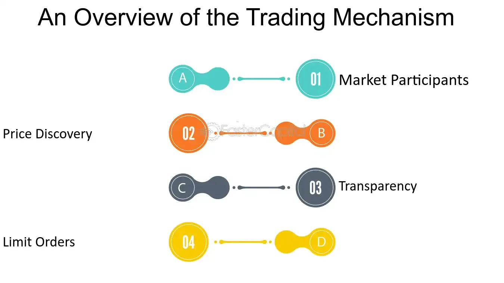

## Table of Contents

## What is a large trader?

A large trader is someone who buys or sells a lot of stocks or other financial products. They usually trade more than most people and can affect the prices of what they are trading. Big banks, investment firms, and sometimes even wealthy individuals can be large traders.

These traders have to follow special rules set by the government. In the United States, for example, they need to report their trades to the Securities and Exchange Commission (SEC) if they trade a certain amount. This helps the government keep an eye on the market and make sure everything is fair.

## How does the definition of a large trader vary by regulatory body?

Different countries and their regulatory bodies have their own rules for what makes someone a large trader. In the United States, the Securities and Exchange Commission (SEC) says a large trader is someone who trades a lot of stocks or other financial products. The SEC has a specific rule, called Rule 13h-1, that says if you trade more than a certain amount, you need to register with them. This helps the SEC watch the market and make sure no one is doing anything wrong.

In Europe, the rules can be different. The European Securities and Markets Authority (ESMA) has its own set of rules under the Markets in Financial Instruments Directive (MiFID II). Under MiFID II, a large trader might be someone who trades a lot of stocks or other financial products, but the exact amount can be different from what the SEC says. ESMA's rules are meant to keep the European markets fair and transparent, just like the SEC's rules in the U.S.

## What are the common characteristics of large traders?

Large traders usually trade a lot more than regular people. They often work for big banks, investment firms, or might even be rich individuals who buy and sell a lot of stocks or other financial products. Because they trade so much, they can sometimes affect the prices of what they are trading. For example, if a large trader buys a lot of a certain stock, the price of that stock might go up.

These traders have to follow special rules set by different countries' governments. In the United States, the Securities and Exchange Commission (SEC) says that if you trade more than a certain amount, you need to report your trades to them. This helps the SEC watch the market and make sure everything is fair. In Europe, the European Securities and Markets Authority (ESMA) has its own rules, but the main idea is the same: to keep the markets honest and transparent.

## How do large traders impact the market?

Large traders can have a big effect on the market because they buy and sell a lot of stocks or other financial products. When a large trader buys a lot of a certain stock, it can make the price of that stock go up. This is because more people want to buy the stock, so the demand goes up. On the other hand, if a large trader sells a lot of a stock, it can make the price go down because there is more of the stock available, and fewer people want to buy it.

Because large traders can move the market, they have to follow special rules set by governments. In the United States, the Securities and Exchange Commission (SEC) makes sure large traders report their trades. This helps the SEC keep an eye on the market and make sure no one is doing anything wrong. In Europe, the European Securities and Markets Authority (ESMA) has similar rules to keep the markets fair and transparent. These rules help make sure that large traders don't cause too much trouble in the market.

## What mechanisms do large traders use to execute their trades?

Large traders use special tools and methods to buy and sell a lot of stocks or other financial products. One way they do this is by using algorithms, which are like smart math formulas that help them decide when and how much to trade. These algorithms can look at a lot of information very quickly and make trades automatically. Another way is by using direct market access, which lets them send their orders straight to the stock exchange without going through a middleman. This can help them get better prices and faster trades.

Large traders also often use block trades, which are big trades done all at once. They might do this away from the main stock exchange, in what's called the over-the-counter (OTC) market, to keep their trades secret and not affect the market too much. Sometimes, they use dark pools, which are private trading places where they can trade without other people knowing what they are doing. All these methods help large traders manage their big trades without causing too much trouble in the market.

## What are the key regulatory requirements for large traders?

Large traders have to follow special rules set by governments to make sure they don't mess up the market. In the United States, the Securities and Exchange Commission (SEC) says that if you trade a lot, you need to sign up with them and report your trades. This helps the SEC watch the market and make sure everything is fair. Large traders also have to keep good records of their trades and be ready to show them if the SEC asks.

In Europe, the European Securities and Markets Authority (ESMA) has its own rules under something called MiFID II. These rules say that large traders need to report their trades too, but the exact amount of trading that makes someone a large trader can be different from the SEC's rules. The main idea is the same though: to keep the markets honest and clear. Both the SEC and ESMA want to make sure that large traders don't cause too much trouble and that everyone plays by the rules.

## How do large traders manage their risk?

Large traders manage their risk by using different strategies. One way they do this is by spreading out their investments. Instead of putting all their money into one stock or one type of investment, they buy many different things. This way, if one investment goes down, they won't lose everything. They also use something called stop-loss orders, which automatically sell a stock if its price drops to a certain level. This helps them limit how much money they could lose.

Another way large traders manage risk is by using hedging. Hedging is like buying insurance for their investments. For example, if they own a lot of a certain stock, they might buy something called a put option, which gives them the right to sell that stock at a set price. If the stock's price falls, the put option can help them not lose as much money. Large traders also keep a close eye on the market and use tools like algorithms to help them make quick decisions and adjust their trades to manage risk better.

## What are the advantages of being classified as a large trader?

Being classified as a large trader can give you some special benefits. One big advantage is that you get to use tools and methods that regular traders can't. For example, you can use algorithms and direct market access to make your trades faster and get better prices. You can also do big trades all at once, called block trades, without causing too much fuss in the market. This can help you buy or sell a lot of stocks without everyone else knowing what you're doing.

Another advantage is that being a large trader can give you more influence in the market. Because you trade so much, you can sometimes affect the prices of stocks or other financial products. This can be good if you want to make the price of something go up or down. Also, even though you have to follow more rules, being a large trader means you can work with big banks and investment firms, which can open up more opportunities for you to make money.

## What are the potential disadvantages or challenges faced by large traders?

Being a large trader comes with some challenges. One big problem is that they have to follow a lot of rules. In places like the United States and Europe, they need to report their trades and keep good records. This can be a lot of work and can slow them down. Also, because they trade so much, they can sometimes make the prices of stocks or other things go up or down a lot. This can make other people in the market upset or worried, which can cause problems for the large trader.

Another challenge is that large traders can have a hard time keeping their trades secret. When they buy or sell a lot of something, other people in the market might notice and start doing the same thing. This can make it harder for the large trader to get the prices they want. Plus, if they make a big mistake, it can cost them a lot of money. Managing risk is really important, but it's not always easy, and even the best plans can go wrong sometimes.

## How do large traders influence market liquidity and volatility?

Large traders can make the market more liquid, which means it's easier for people to buy and sell things. When they trade a lot, they help keep the market moving. Imagine a big river where water is always flowing. Large traders are like the water that keeps the river full and flowing smoothly. This can be good because it means other people can trade more easily too. But, if a large trader suddenly stops trading, it can make the market less liquid, like a river drying up. This can make it harder for others to buy and sell.

Large traders can also make the market more volatile, which means prices can change a lot and quickly. When they buy or sell a lot of something, it can make the price of that thing go up or down fast. Think of it like a big wave in the ocean. The wave can make the water move a lot, just like how a large trader can make prices move a lot. This can be good if the large trader wants to make money from these price changes, but it can also be risky. If too many large traders are trading at the same time, it can make the market very unstable, like a stormy sea.

## What advanced strategies do large traders employ to optimize their trading?

Large traders use smart ways to make their trading better. One way is by using algorithms, which are like smart math formulas. These algorithms can look at a lot of information very quickly and decide when to buy or sell. This helps large traders make trades faster and get better prices. They also use something called direct market access, which lets them send their orders straight to the stock exchange without going through a middleman. This can help them save time and money. Another way is by doing big trades all at once, called block trades. They might do this away from the main stock exchange, in the over-the-counter (OTC) market, to keep their trades secret and not affect the market too much.

Large traders also use dark pools, which are private trading places where they can trade without other people knowing what they are doing. This helps them keep their big trades secret and not cause too much trouble in the market. They also use hedging to manage their risk. Hedging is like buying insurance for their investments. For example, if they own a lot of a certain stock, they might buy a put option, which gives them the right to sell that stock at a set price. If the stock's price falls, the put option can help them not lose as much money. By using these strategies, large traders can make their trading more efficient and less risky.

## What future trends might affect large traders and their operations?

In the future, large traders might see changes because of new technology. More and more, they will use smart computer programs called artificial intelligence (AI) and machine learning to make their trading decisions. These programs can look at a lot of information very quickly and find patterns that people might miss. This can help large traders make better choices and trade faster. Also, as the internet gets better and faster, large traders might be able to trade from anywhere in the world, which can open up new markets for them.

Another trend that might affect large traders is new rules from governments. As markets get bigger and more complicated, governments might make stricter rules to make sure everything stays fair. This could mean more work for large traders, as they will have to report more of their trades and keep better records. But, these rules can also help keep the market stable and safe, which is good for everyone. Large traders will need to keep up with these changes and find new ways to do their job well while following the rules.

## What are the key considerations for large traders?

Large traders, such as institutional investors, hedge funds, and proprietary trading firms, encounter unique challenges and opportunities in financial markets. Their trading activities can significantly impact market dynamics, necessitating meticulous planning and execution strategies. 

Evaluating market impact is paramount for large traders due to the potential to influence prices adversely when executing substantial orders. Market impact refers to the change in price resulting from a large buy or sell order. To manage this, traders often employ a variety of strategies, such as breaking large orders into smaller, less conspicuous trades. This approach can help to minimize price slippage, which is the difference between the expected and actual execution price of a trade. Quantitative models like the Almgren-Chriss framework are often utilized to optimize the trade-off between minimizing execution cost and the risk associated with price [volatility](/wiki/volatility-trading-strategies) over the execution time. The model seeks to minimize the cost function:

$$
C = \text{Total cost} + \text{Risk penalty}
$$

where the risk penalty is typically modeled as a function of volatility and the time horizon of the trades.

Maintaining anonymity and reducing information leakage is another critical consideration. Information leakage can lead to unfavorable market movements against the trader's position. To mitigate this, traders can employ techniques like dark pools, which are private exchanges where buy and sell orders are not visible to the public. Dark pools allow traders to execute large trades without revealing their intentions, thereby reducing the risk of price movements following their trades. Additionally, employing advanced data encryption and anonymization techniques can further protect sensitive order information from being exposed.

Numerous tools and technologies facilitate large-scale trading operations. Algorithmic trading platforms provide the capability to execute trades automatically based on pre-defined criteria, enhancing efficiency and precision. High-frequency trading ([HFT](/wiki/high-frequency-trading-strategies)) systems, designed to capitalize on minor price inefficiencies within fractions of a second, are often employed by large traders to maintain a competitive edge. Moreover, big data analytics and [artificial intelligence](/wiki/ai-artificial-intelligence) (AI) are increasingly used to generate insights from massive datasets, aiding in the development of sophisticated trading strategies.

Examples of successful strategies used by large traders highlight the necessity of adaptability and innovation. For instance, quantitative hedge funds often utilize statistical [arbitrage](/wiki/arbitrage) strategies, capitalizing on temporary price discrepancies between related financial instruments. These strategies typically rely on advanced statistical models and [machine learning](/wiki/machine-learning) algorithms to identify opportunities and execute trades rapidly.

In conclusion, large traders must navigate specific challenges in financial markets, focusing on mitigating market impact, maintaining confidentiality, and leveraging cutting-edge technology to enhance their trading operations. By employing a blend of strategic execution, technological innovation, and risk management tools, large traders can successfully optimize their market participation.

## References & Further Reading

[1]: Bergstra, J., Bardenet, R., Bengio, Y., & Kégl, B. (2011). ["Algorithms for Hyper-Parameter Optimization."](https://papers.nips.cc/paper/4443-algorithms-for-hyper-parameter-optimization) Advances in Neural Information Processing Systems 24.

[2]: ["Advances in Financial Machine Learning"](https://www.amazon.com/Advances-Financial-Machine-Learning-Marcos/dp/1119482089) by Marcos Lopez de Prado

[3]: ["Evidence-Based Technical Analysis: Applying the Scientific Method and Statistical Inference to Trading Signals"](https://www.amazon.com/Evidence-Based-Technical-Analysis-Scientific-Statistical/dp/0470008741) by David Aronson

[4]: ["Machine Learning for Algorithmic Trading"](https://github.com/stefan-jansen/machine-learning-for-trading) by Stefan Jansen

[5]: ["Quantitative Trading: How to Build Your Own Algorithmic Trading Business"](https://www.amazon.com/Quantitative-Trading-Build-Algorithmic-Business/dp/1119800064) by Ernest P. Chan