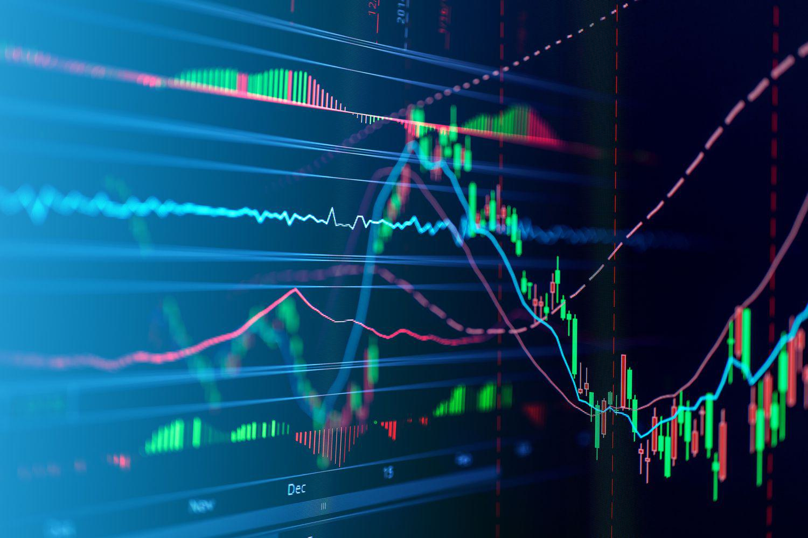

Algorithmic trading has become a cornerstone of modern financial markets, reflecting the digitization and increased sophistication of trading activities. It refers to the use of computer algorithms to automate trading decisions, encompassing vast data analysis and the execution of trades based on pre-determined criteria. This approach is pivotal for ensuring efficiency, speed, and precision in executing trades, outperforming the manual execution of orders by human traders in both speed and accuracy.

Large traders, including institutional investors like hedge funds and mutual funds, play a critical role in the market. Their significant transaction volumes necessitate a nuanced approach to trading mechanisms. The execution of large orders without substantial market impact requires careful consideration of factors such as liquidity, timing, and execution strategy. These traders are tasked with minimizing the market footprint of their trades to avoid adverse price movements, which involves sophisticated techniques and tools.

This article provides an extensive examination of key considerations for traders engaging with algorithmic strategies, highlighting the importance of optimizing these strategies for both retail and institutional investors. While retail investors benefit from the accessibility and democratization of financial markets through algorithmic trading, institutional investors leverage high-tech strategies for competitive advantages and maximizing returns.

The optimization of trading strategies not only involves the selection of appropriate algorithms but also necessitates a robust understanding of trading mechanisms. These include electronic trading platforms that facilitate liquidity and price discovery, and the utilization of high-frequency trading (HFT) that significantly alters market dynamics through rapid, algorithm-driven trades.

The importance of refining trading strategies is underscored by the ever-evolving landscape of financial markets. As algorithms become more advanced, propelled by technological innovations and data-centric approaches, the competitive edge they provide must be continuously honed. This article sets the stage for a deep exploration of trading mechanisms and algorithms, offering insights into their intricacies and the profound impact they have on market participants.

## Table of Contents

## Understanding Trading Mechanisms

Trading mechanisms in financial markets refer to the structures and processes that facilitate the buying and selling of securities. These mechanisms ensure order execution, determine prices, and maintain market efficiency. Two predominant types of trading mechanisms are electronic trading platforms and over-the-counter (OTC) markets.

Electronic trading platforms are computerized systems used to place and execute trades in financial markets. Examples include stock exchanges like the New York Stock Exchange (NYSE) and NASDAQ. These platforms enable greater transparency, efficiency, and accessibility, allowing traders to execute transactions swiftly. Electronic trading has become the cornerstone of modern financial markets, providing improved [liquidity](/wiki/liquidity-risk-premium) and price discovery.

Over-the-counter markets, on the other hand, consist of decentralized networks where trading occurs directly between two parties without a centralized exchange. This type of trading is typical for derivatives, foreign exchange, and bonds. While OTC markets offer flexibility and privacy, they pose challenges such as less transparency and higher counterparty risk.

Liquidity refers to the capacity to buy or sell an asset without causing significant price changes. It's crucial for efficient trading as it affects the bid-ask spread, execution speed, and market stability. High liquidity ensures quick and cost-effective trade execution, whereas low liquidity may result in increased costs and [volatility](/wiki/volatility-trading-strategies). Price discovery is the process through which the price of an asset is determined in the marketplace through supply and demand. Efficient price discovery is vital for establishing fair market prices and reflecting all available information.

Various challenges confront trading mechanisms, such as the risk of market fragmentation and the need to handle substantial trading volumes. Market fragmentation can occur when liquidity dissipates across several platforms, complicating the price discovery process. Handling large trading volumes requires systems capable of managing numerous transactions without latency, ensuring trades are executed at the intended prices.

High-frequency trading ([HFT](/wiki/high-frequency-trading-strategies)), a subset of [algorithmic trading](/wiki/algorithmic-trading), has significantly influenced market dynamics. It involves executing numerous transactions at exceptionally high speeds, aiming to capitalize on minor price discrepancies. While HFT can enhance liquidity and market efficiency, it also raises concerns about increased volatility and potential systemic risks. The rapid transmission of trades can lead to events like flash crashes, where prices drop rapidly and recover within minutes, potentially destabilizing markets.

In summary, understanding trading mechanisms involves recognizing the structure and function of different trading platforms, appreciating the role of liquidity and price discovery, and addressing the challenges and impacts brought forth by high-frequency trading. These elements are pivotal in shaping trading decisions and contributing to market stability and efficiency.

## Key Considerations for Large Traders

Large traders, such as institutional investors, hedge funds, and proprietary trading firms, encounter unique challenges and opportunities in financial markets. Their trading activities can significantly impact market dynamics, necessitating meticulous planning and execution strategies. 

Evaluating market impact is paramount for large traders due to the potential to influence prices adversely when executing substantial orders. Market impact refers to the change in price resulting from a large buy or sell order. To manage this, traders often employ a variety of strategies, such as breaking large orders into smaller, less conspicuous trades. This approach can help to minimize price slippage, which is the difference between the expected and actual execution price of a trade. Quantitative models like the Almgren-Chriss framework are often utilized to optimize the trade-off between minimizing execution cost and the risk associated with price volatility over the execution time. The model seeks to minimize the cost function:

$$
C = \text{Total cost} + \text{Risk penalty}
$$

where the risk penalty is typically modeled as a function of volatility and the time horizon of the trades.

Maintaining anonymity and reducing information leakage is another critical consideration. Information leakage can lead to unfavorable market movements against the trader's position. To mitigate this, traders can employ techniques like dark pools, which are private exchanges where buy and sell orders are not visible to the public. Dark pools allow traders to execute large trades without revealing their intentions, thereby reducing the risk of price movements following their trades. Additionally, employing advanced data encryption and anonymization techniques can further protect sensitive order information from being exposed.

Numerous tools and technologies facilitate large-scale trading operations. Algorithmic trading platforms provide the capability to execute trades automatically based on pre-defined criteria, enhancing efficiency and precision. High-frequency trading (HFT) systems, designed to capitalize on minor price inefficiencies within fractions of a second, are often employed by large traders to maintain a competitive edge. Moreover, big data analytics and [artificial intelligence](/wiki/ai-artificial-intelligence) (AI) are increasingly used to generate insights from massive datasets, aiding in the development of sophisticated trading strategies.

Examples of successful strategies used by large traders highlight the necessity of adaptability and innovation. For instance, quantitative hedge funds often utilize statistical [arbitrage](/wiki/arbitrage) strategies, capitalizing on temporary price discrepancies between related financial instruments. These strategies typically rely on advanced statistical models and [machine learning](/wiki/machine-learning) algorithms to identify opportunities and execute trades rapidly.

In conclusion, large traders must navigate specific challenges in financial markets, focusing on mitigating market impact, maintaining confidentiality, and leveraging cutting-edge technology to enhance their trading operations. By employing a blend of strategic execution, technological innovation, and risk management tools, large traders can successfully optimize their market participation.

## Algorithmic Trading: An Overview

**Algorithmic Trading: An Overview**

Algorithmic trading refers to the use of computer algorithms to automate trading decisions, executing trades at speeds and frequencies that a human trader cannot achieve. The practice has its roots in the early foundations of [quantitative trading](/wiki/quantitative-trading), evolving significantly with advancements in technology and market structure over the past few decades.

**Historical Context**

Historically, algorithmic trading began to take shape in the 1970s with the development of electronic communication networks (ECNs), which laid the groundwork for subsequent innovations. The real [momentum](/wiki/momentum) for algorithmic trading surged in the 1990s, fueled by the proliferation of high-frequency trading (HFT) firms and the increased ability of computers to process large volumes of data rapidly. This period marked a shift from manual order execution to automated, algorithmic strategies.

**Technological Evolution**

Technology has been a driving force behind the evolution of algorithmic trading. The exponential growth in computational power and data storage capabilities has enabled the development of complex mathematical models that can analyze vast datasets in real time. Additionally, advances in machine learning and artificial intelligence have enhanced the sophistication of trading algorithms, allowing them to adapt to changing market conditions with minimal human intervention.

**Benefits of Algorithmic Trading**

The primary benefits of algorithmic trading include increased efficiency, speed, and accuracy. Algorithms can execute trades in milliseconds or even microseconds, capitalizing on fleeting market opportunities. This speed is particularly advantageous in HFT, where the ability to process information faster than competitors can result in significant profits. Algorithmic trading also reduces the potential for human error, as predefined rules govern trade execution, ensuring consistency and discipline in trading strategies.

**Concerns and Challenges**

Algorithmic trading, while advantageous, is not without its concerns. One significant issue is its potential to exacerbate market volatility. The phenomenon of flash crashes, where rapidly executed trades cause abrupt price swings, underscores the risks associated with algorithmic strategies. An example is the 2010 Flash Crash, where the Dow Jones Industrial Average suffered a drastic drop within minutes.

**Regulatory Landscape**

The regulatory environment for algorithmic trading has evolved to address these challenges. Regulatory bodies, such as the U.S. Securities and Exchange Commission (SEC) and the European Securities and Markets Authority (ESMA), have implemented measures to increase transparency and reduce systemic risks. These include requirements for firms to maintain robust risk controls and to ensure that their algorithms do not destabilize the market.

Overall, algorithmic trading has transformed the landscape of financial markets, offering numerous advantages while also presenting unique challenges. Its continued evolution will likely shape the future of trading, necessitating careful consideration of both its potential and its pitfalls.

## Algorithmic Strategies for Large Traders

Algorithmic trading strategies are crucial for large traders aiming for efficiency and precision in executing trades. Among the most prevalent strategies are [trend following](/wiki/trend-following), arbitrage, and [market making](/wiki/market-making).

Trend following involves identifying and capitalizing on market trends. It is based on the principle that prices tend to move in a sustained direction over time. Traders using this strategy typically employ statistical techniques and historical data to project future price movements. A common tool used in this approach is the moving average crossover, where traders buy when a shorter-term moving average crosses above a longer-term moving average and sell in the reverse scenario.

Arbitrage exploits price discrepancies in different markets or forms. Traders buy and sell simultaneously across these markets to profit from the differential, aiming for risk-free profit. This strategy requires speed and precision, often provided by algorithmic systems capable of executing trades in milliseconds. A classic example is triangular arbitrage in the foreign exchange market, where discrepancies between three currency pairs are used to generate profits.

Market making involves quoting both a buy and a sell price to capture the spread between them. Market makers provide liquidity and facilitate trades, profiting from the spread. This strategy requires managing inventory risk and is highly dependent on speed and the ability to adjust quickly to market changes.

The integration of machine learning (ML) and artificial intelligence (AI) enhances these strategies significantly. Large traders leverage ML and AI for pattern recognition, predictive analytics, and decision-making processes. These technologies allow traders to process vast amounts of data and identify complex patterns that are not easily discernible through traditional methods. For instance, neural networks can be trained on historical data to predict price movements and inform trading decisions.

Balancing risk management with potential returns is a critical aspect of algorithmic trading. Traders must ensure their strategies are robust against market fluctuations and unforeseen events. Techniques such as diversification, stop-loss orders, and real-time monitoring help mitigate risks.

Backtesting and simulation are integral to developing effective trading algorithms. These processes involve testing algorithmic strategies on historical data to evaluate their performance and refine them before live deployment. Backtesting helps identify potential flaws and optimize parameters to enhance strategy robustness.

Emerging trends in algorithmic trading include the use of [deep learning](/wiki/deep-learning), [reinforcement learning](/wiki/reinforcement-learning), and quantum computing. Deep learning, with its ability to model complex nonlinear relationships, is being increasingly adopted to predict market trends and volatility. Reinforcement learning offers the ability to adapt strategies based on dynamic market environments, continually learning and optimizing actions to achieve the best outcomes. Quantum computing, though still in nascent stages, promises to revolutionize trading by performing complex calculations at unprecedented speeds, potentially offering competitive advantages to early adopters.

These advancements in algorithmic strategies provide large traders with powerful tools to enhance efficiency, manage risks, and stay competitive in fast-evolving markets.

## Risk Management in Algo Trading

Algorithmic trading, while offering numerous advantages such as speed and efficiency, also presents particular risks that must be carefully managed. Identifying and mitigating these risks is paramount for ensuring the robustness and reliability of trading systems.

Risk identification in algorithmic trading begins with understanding the potential sources of errors. Common types of risks include market risk, operational risk, and technical risk. Market risk arises from the possibility of adverse market movements affecting the trading strategy's profitability. Operational risk involves failures in internal processes, people, and systems. Technical risks may stem from software bugs, network glitches, or hardware failures that could cause unintended trades or financial losses.

Strategies for maintaining control over algorithmic trading systems focus on establishing comprehensive risk management frameworks. These frameworks often incorporate pre-trade risk checks, which are critical to prevent erroneous trades that can lead to significant losses. Implementing stop-loss orders and position limits is also a common practice to cap potential losses. Moreover, maintaining a robust disaster recovery plan ensures that the trading system can swiftly resume operation after any disruption.

Real-time monitoring is a cornerstone of effective risk management in algorithmic trading. It involves continuously tracking market conditions, system performance, and trading activity to identify and resolve potential issues before they escalate. Swift decision-making is essential when anomalies are detected. By using algorithms capable of self-calibrating based on market conditions, traders can adapt strategies dynamically, minimizing risk exposure.

Case studies of algorithmic trading failures underscore the importance of meticulous risk management. The infamous Knight Capital incident in 2012 serves as a prime example, where a software glitch led to a loss of over $440 million in less than an hour. This case highlighted the necessity for rigorous pre-launch testing and effective fail-safes to halt trading activities in case of unexpected anomalies.

Regulatory compliance in algorithmic trading is crucial to uphold market integrity and trust. Regulations often mandate transparency and accountability. For instance, the European Market Infrastructure Regulation (EMIR) and the Markets in Financial Instruments Directive II (MiFID II) in the EU enforce strict guidelines on reporting and risk management practices. Adhering to these regulations involves implementing audit trails, ensuring data protection, and conducting regular system audits to verify compliance.

In conclusion, effective risk management in algorithmic trading involves a multi-faceted approach that combines technical safeguards, real-time monitoring, and adherence to regulatory standards. By developing robust systems that prioritize these areas, traders can mitigate the inherent risks associated with algorithmic trading and maintain resilient and profitable operations.

## The Future of Large Trader Algo Trading

Forecasting the evolution of algorithmic trading for large traders involves examining several key technological and regulatory factors that are poised to shape the future landscape of financial markets. 

Technological advancements like blockchain and quantum computing offer promising avenues for enhancing algorithmic trading practices. Blockchain technology, with its decentralized and secure nature, presents opportunities to streamline trade settlement processes, reduce fraud, and increase transparency in trading operations. It enables smart contracts that can execute trades automatically when predefined conditions are met, potentially increasing efficiency and reducing latency in trades. Quantum computing, with its immense computational power, can revolutionize the way complex trading algorithms are processed. It can optimize the handling of vast datasets and improve the speed of complex calculations, potentially leading to more sophisticated and accurate predictive models.

Regulatory changes also play a critical role in shaping the future of algorithmic trading. As governments and regulatory bodies adapt to the rapid advancements in trading technologies, potential changes could include stricter compliance requirements designed to prevent market manipulation and ensure stability. These regulations may necessitate more rigorous monitoring and reporting of algorithmic trades, requiring large traders to implement robust compliance frameworks and leverage technology to maintain adherence to evolving standards.

Sustainability and ethical considerations are increasingly important in forming trading strategies. Large traders are progressively incorporating environmental, social, and governance ([ESG](/wiki/esg-investing)) factors into their algorithmic models to align with broader corporate sustainability goals. This approach not only meets growing investor demand for responsible investments but also mitigates long-term risk associated with unsustainable practices. Algorithmic trading incorporating ESG criteria may involve filtering assets based on sustainability indices or integrating machine learning models that analyze and predict ESG-related trends.

In conclusion, the future of large trader algo trading will be shaped by the industry's ability to adapt to technological advancements and regulatory changes while incorporating sustainable and ethical practices. As the market environment evolves, large traders must continue to innovate and refine their strategies, leverage cutting-edge technologies, and remain agile to maintain a competitive edge. The adaptability of trading firms will be paramount in navigating the complexities and opportunities of tomorrow's financial markets.

## Conclusion

In summary, the article has explored the essential aspects of algorithmic trading and the various considerations that large traders must [factor](/wiki/factor-investing) into their trading strategies. Algorithmic trading has emerged as a vital component in today's financial markets, offering enhanced efficiency, speed, and accuracy. As traders engage with complex trading mechanisms, they must prioritize liquidity and price discovery while navigating the challenges posed by high-frequency trading and information leakage.

For traders, especially large institutional ones, the development and implementation of innovative and strategic trading algorithms are crucial for maintaining a competitive edge. This encompasses the careful assessment of market impact, strategic anonymity, and leveraging advanced technologies such as machine learning and artificial intelligence. Furthermore, successful risk management, supported by continuous real-time monitoring and regulatory compliance, remains a cornerstone for mitigating potential losses.

In an ever-evolving market landscape, staying informed about technological advancements and regulatory changes empowers traders to adapt and thrive. As the future unfolds, potential developments in areas such as blockchain, quantum computing, and sustainability will likely reshape trading strategies and mechanisms. Traders are encouraged to remain agile and embrace innovation, ensuring their practices align with emerging trends and ethical standards. Ultimately, by combining robust strategies with adaptability, traders can navigate complexities and capitalize on opportunities within the financial markets.

## References & Further Reading

[1]: Bergstra, J., Bardenet, R., Bengio, Y., & Kégl, B. (2011). ["Algorithms for Hyper-Parameter Optimization."](https://papers.nips.cc/paper/4443-algorithms-for-hyper-parameter-optimization) Advances in Neural Information Processing Systems 24.

[2]: ["Advances in Financial Machine Learning"](https://www.amazon.com/Advances-Financial-Machine-Learning-Marcos/dp/1119482089) by Marcos Lopez de Prado

[3]: ["Evidence-Based Technical Analysis: Applying the Scientific Method and Statistical Inference to Trading Signals"](https://www.amazon.com/Evidence-Based-Technical-Analysis-Scientific-Statistical/dp/0470008741) by David Aronson

[4]: ["Machine Learning for Algorithmic Trading"](https://github.com/stefan-jansen/machine-learning-for-trading) by Stefan Jansen

[5]: ["Quantitative Trading: How to Build Your Own Algorithmic Trading Business"](https://www.amazon.com/Quantitative-Trading-Build-Algorithmic-Business/dp/1119800064) by Ernest P. Chan