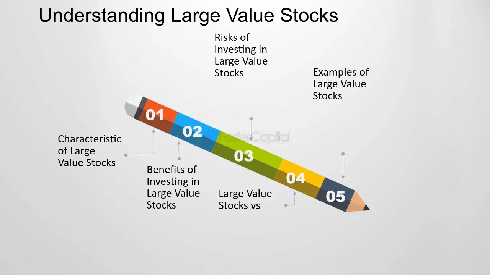

## Table of Contents

## What are large-value stocks?

Large-value stocks are shares of big companies that are thought to be a good deal. These companies are usually well-known and have been around for a long time. They might not grow as fast as smaller, newer companies, but they are often seen as safer investments. Investors like them because they think the stock price is lower than it should be, given how much the company is worth.

These stocks are often part of what's called "value investing." This means looking for companies that the market has overlooked, but which have strong fundamentals like earnings and assets. People who invest in large-value stocks hope that, over time, the market will realize the true value of these companies, and the stock price will go up. This can lead to good returns for the investor, even if the company itself doesn't grow very quickly.

## How are large-value stocks identified?

Large-value stocks are found by looking at a few key things about big companies. First, people check if the stock price seems low compared to what the company is really worth. This can be done by looking at numbers like the price-to-earnings ratio, which compares the stock price to the company's earnings. If this ratio is lower than what's normal for similar companies, it might be a sign that the stock is undervalued. Also, investors look at the company's book value, which is what the company would be worth if it sold all its assets and paid off all its debts. If the stock price is less than the book value, it could be a good value stock.

Another way to spot large-value stocks is by looking at the company's history and how it's doing now. Companies that have been around for a long time and have a strong track record are often seen as safer bets. These companies might not be growing quickly, but they have steady earnings and often pay dividends, which are payments to shareholders. Investors also pay attention to the overall health of the company, like its debt levels and how well it's managing its money. If a big company looks healthy but its stock price is low, it might be a large-value stock worth considering.

## What are the key characteristics of large-value stocks?

Large-value stocks come from big companies that people think are a good deal. These companies are usually well-known and have been around for a while. They might not grow as fast as smaller, newer companies, but they are often seen as safer investments. Investors like these stocks because they believe the stock price is lower than it should be, given how much the company is really worth. This means the stock could go up in value over time, which is good for the investor.

To spot large-value stocks, people look at numbers like the price-to-earnings ratio. This compares the stock price to the company's earnings. If this ratio is lower than what's normal for similar companies, it might be a sign that the stock is undervalued. Another thing investors check is the company's book value, which is what the company would be worth if it sold all its assets and paid off all its debts. If the stock price is less than the book value, it could be a good value stock. Also, large-value stocks often come from companies with a strong history and steady earnings. These companies might pay dividends, which are payments to shareholders, making them even more attractive to investors.

## How do large-value stocks function within a diversified investment portfolio?

Large-value stocks play an important role in a diversified investment portfolio. They are shares from big companies that are seen as good deals because their stock price is lower than what the company is really worth. These stocks can help balance out a portfolio because they are often less risky than stocks from smaller, newer companies. Since large-value stocks come from companies that have been around for a long time and have steady earnings, they can provide stability to an investor's holdings. This means that even if other parts of the portfolio go down in value, the large-value stocks might not drop as much, helping to protect the overall value of the portfolio.

In addition to stability, large-value stocks can also offer growth potential. Investors believe that over time, the market will realize the true value of these companies, and the stock price will go up. This can lead to good returns for the investor, even if the company itself doesn't grow very quickly. Including large-value stocks in a diversified portfolio can help investors achieve a mix of safety and growth. By spreading investments across different types of assets, including large-value stocks, investors can reduce risk and increase the chances of earning a solid return over the long term.

## What are the typical industries associated with large-value stocks?

Large-value stocks often come from industries that have been around for a long time and are seen as stable. These industries include financial services, like banks and insurance companies, because they have steady earnings and often pay dividends. Another common industry is energy, with companies like oil and gas producers, because they have big assets and can be undervalued when the market goes through ups and downs. Healthcare is also a big one, with companies making drugs or medical devices, as they have strong earnings and can be seen as good deals when their stock prices drop.

Other industries that often have large-value stocks are consumer goods, like companies that make things people use every day, such as food and drinks. These companies have steady sales and can be undervalued if the market overlooks their long-term value. Lastly, utilities, like companies that provide electricity and water, are often seen as large-value stocks because they have steady income and are essential services, making them less risky and often undervalued when the market goes through tough times.

## What are the potential benefits of investing in large-value stocks?

Investing in large-value stocks can be a smart move because they come from big, well-known companies that are often seen as a good deal. These companies have been around for a long time and usually have steady earnings. This means they are less risky than smaller, newer companies. When you buy large-value stocks, you are buying them at a price that is lower than what the company is really worth. Over time, if the market realizes this, the stock price can go up, giving you a good return on your investment.

Another benefit of large-value stocks is that they can help balance your investment portfolio. Because they are from stable companies, they can protect your money when other parts of your portfolio go down in value. Many of these companies also pay dividends, which are regular payments to shareholders. This can give you extra income while you wait for the stock price to go up. So, by including large-value stocks in your investments, you can have both safety and the chance for growth.

## What are the risks associated with large-value stocks?

Even though large-value stocks can be a good choice for investors, they still come with some risks. One big risk is that the market might not see the true value of the company like the investor does. This means the stock price might not go up as expected, and the investor could lose money. Also, large-value stocks can be affected by economic downturns. Big companies in industries like finance or energy might struggle if the economy is doing badly, which can make their stock prices drop.

Another risk is that large-value stocks might not grow as fast as other types of stocks. Companies that are seen as good deals are often not growing quickly, so investors might miss out on bigger gains from faster-growing companies. Plus, if everyone starts thinking the same company is a good deal, the stock price can go up a lot, making it less of a value and more expensive. This can happen quickly and leave investors with stocks that are no longer undervalued.

## How do large-value stocks perform during different economic cycles?

Large-value stocks can do well or badly depending on what's happening with the economy. During good times, when the economy is growing, these stocks might not go up as fast as other stocks. This is because they are from big, stable companies that don't grow quickly. But, they can still be a good choice because they are often seen as safer bets. Investors might feel more comfortable with these stocks when things are going well because they know the companies are strong and have been around for a long time.

In tough economic times, like during a recession, large-value stocks can be a bit of a mixed bag. On one hand, they might do better than smaller, riskier stocks because big companies are more likely to survive hard times. They have steady earnings and might even pay dividends, which can help investors stay afloat when other parts of the market are falling. On the other hand, if the economic downturn hits the industries these companies are in, like finance or energy, their stock prices can drop a lot. So, while large-value stocks can offer some protection during bad times, they are not completely safe from economic cycles.

## What are the valuation metrics used to assess large-value stocks?

To figure out if a stock is a large-value stock, people use certain numbers called valuation metrics. One common metric is the price-to-earnings (P/E) ratio. This compares the stock's price to the company's earnings. If the P/E ratio is lower than what's normal for similar companies, it might mean the stock is undervalued. Another important metric is the price-to-book (P/B) ratio. This compares the stock's price to the company's book value, which is what the company would be worth if it sold all its stuff and paid off all its debts. If the stock price is less than the book value, it could be a sign that the stock is a good deal.

There are also other metrics that can help. The dividend yield tells you how much money the company pays out to shareholders compared to the stock's price. A high dividend yield can be a sign of a good value stock, especially if the company has steady earnings. The price-to-sales (P/S) ratio compares the stock's price to the company's sales. If this ratio is low, it might mean the stock is undervalued. By looking at these different numbers, investors can get a better idea of whether a large stock is a good value and worth buying.

## How does dividend yield play a role in large-value stock investments?

Dividend yield is an important thing to look at when you're thinking about buying large-value stocks. It tells you how much money a company pays out to its shareholders compared to the price of the stock. If a company has a high dividend yield, it means you can get a lot of money back from your investment just by holding onto the stock. This can be really good for investors who want a steady income from their investments. Large-value stocks often come from big, stable companies that can afford to pay out these dividends regularly.

When you're looking at large-value stocks, a high dividend yield can also be a sign that the stock is a good deal. If a company is paying out a lot of money to shareholders and the stock price is low, it might mean the market is not seeing the true value of the company. Over time, if the market realizes this, the stock price could go up. So, by looking at the dividend yield, investors can find large-value stocks that not only give them regular income but also have the potential to grow in value.

## What strategies can investors use to mitigate risks when investing in large-value stocks?

Investors can use a few smart strategies to lower the risks when they put money into large-value stocks. One way is to spread out their investments, which means not putting all their money into just one or a few stocks. By buying stocks from different companies and industries, they can protect themselves if one stock or industry does badly. Another good idea is to keep an eye on the economy and the industries where the large-value stocks come from. If they see signs that the economy might be heading for tough times, they can adjust their investments to be safer.

Another strategy is to do a lot of research before buying any stock. This means looking at the company's financial health, like its earnings and debt, and using valuation metrics like the price-to-earnings ratio and dividend yield to make sure the stock really is a good deal. Also, investors can use stop-loss orders, which automatically sell the stock if it drops to a certain price, to limit how much money they could lose. By being careful and doing their homework, investors can make smarter choices and lower the risks of investing in large-value stocks.

## How do large-value stocks compare to growth stocks in terms of investment strategy and expected returns?

Large-value stocks and growth stocks are two different ways to invest in the stock market. Large-value stocks come from big, well-known companies that people think are a good deal. These companies might not grow quickly, but they are often stable and pay dividends, which are regular payments to shareholders. Investors who buy large-value stocks are looking for stocks that are undervalued, meaning the stock price is lower than what the company is really worth. They hope that over time, the market will realize this and the stock price will go up, giving them a good return on their investment. The focus is on safety and steady income, with the potential for the stock price to increase as the market recognizes the company's true value.

On the other hand, growth stocks are from companies that are expected to grow a lot faster than average. These companies might be smaller or newer, and they often reinvest their earnings back into the business instead of paying dividends. Investors who buy growth stocks are looking for big gains in the stock price over time. They are willing to take more risk because they believe the company will do very well and the stock price will go up a lot. The focus is on potential for high returns, but with more risk because the stock price can be more unpredictable. So, while large-value stocks offer stability and income, growth stocks aim for bigger, faster growth but with higher risk.

## What is the understanding of large-value stocks?

Large-value stocks are shares from companies notable for their substantial market capitalizations, typically exceeding $10 billion. These companies are often leaders in their respective industries, possessing robust business models and established market positions. The determination of these stocks as undervalued hinges on fundamental analysis, which evaluates financial metrics such as price-to-earnings (P/E) ratio, price-to-book (P/B) ratio, and dividend yield. The lower these ratios relative to industry or historical benchmarks, the more attractive the stock may appear to value investors who seek returns from both capital appreciation and dividend income.

The allure of large-value stocks primarily arises from the market's perceived mispricing. This occurs when the intrinsic value, essentially the inherent worth of a company based on [fundamental analysis](/wiki/fundamental-analysis), exceeds its current market price. Investors speculate that over time, market corrections will occur, aligning the stock price closer to its intrinsic value, thereby offering potential gains. This speculation assumes that the market is efficient in the long run, correcting any discrepancies between market price and intrinsic value. Mathematically, this can be expressed as:

$$
\text{Intrinsic Value} > \text{Market Price}
$$

The expectation is that eventually,

$$
\text{Market Price} \rightarrow \text{Intrinsic Value}
$$

accompanied by potential gains for the investor.

Dividend payments are another key component of the value proposition offered by large-value stocks. These payments not only provide a steady income stream but also signal the company's fiscal health and commitment to distributing profits to shareholders. For value investors, dividends can represent a significant portion of total returns, particularly when reinvested to benefit from compounding effects over time.

While large-value stocks are attractive due to perceived undervaluation and dividends, they come with risks. The anticipation of a price correction assumes rational market behavior, yet multiple factors can delay or prevent it. Consequently, a thorough due diligence process is essential to validate the undervaluation hypothesis and ensure alignment with the investor's risk profile and investment objectives.

## References & Further Reading

[1]: Bergstra, J., Bardenet, R., Bengio, Y., & Kégl, B. (2011). ["Algorithms for Hyper-Parameter Optimization."](https://dl.acm.org/doi/10.5555/2986459.2986743) Advances in Neural Information Processing Systems 24.

[2]: ["Advances in Financial Machine Learning"](https://www.amazon.com/Advances-Financial-Machine-Learning-Marcos/dp/1119482089) by Marcos Lopez de Prado

[3]: ["Evidence-Based Technical Analysis: Applying the Scientific Method and Statistical Inference to Trading Signals"](https://www.amazon.com/Evidence-Based-Technical-Analysis-Scientific-Statistical/dp/0470008741) by David Aronson

[4]: ["Machine Learning for Algorithmic Trading"](https://github.com/stefan-jansen/machine-learning-for-trading) by Stefan Jansen

[5]: ["Quantitative Trading: How to Build Your Own Algorithmic Trading Business"](https://www.amazon.com/Quantitative-Trading-Build-Algorithmic-Business/dp/1119800064) by Ernest P. Chan