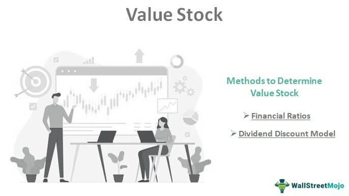

The world of stock market investment presents a broad and intricate landscape where myriad strategies compete for investor interest. Within this array, large-value stocks have traditionally attracted those seeking stability and consistent dividend returns. These stocks, often representing companies with robust market capitalizations exceeding $10 billion, are perceived as undervalued based on fundamental analysis. This perceived undervaluation suggests potential future appreciation, making large-value stocks appealing to value investors. However, as with any investment, large-value stocks are not devoid of risk. They can become "value traps," where they seem undervalued but do not experience price appreciation due to underlying issues. Additionally, even prominent stocks are susceptible to market volatility and may suffer from deteriorating financial conditions if the low price is warranted. 

Moreover, the increasing prevalence of algorithmic trading adds a layer of complexity to these investments. Algorithmic trading involves utilizing computer algorithms to execute trades rapidly and with high precision based on predefined criteria. While this approach promises enhanced efficiency, it introduces challenges, particularly in volatile markets. This paper explores the specific risks large-value stock investors face and examines how algorithmic trading influences these risks, thereby shaping modern investment strategies.



## Table of Contents

## Understanding Large-Value Stocks

Large-value stocks are shares from companies notable for their substantial market capitalizations, typically exceeding $10 billion. These companies are often leaders in their respective industries, possessing robust business models and established market positions. The determination of these stocks as undervalued hinges on fundamental analysis, which evaluates financial metrics such as price-to-earnings (P/E) ratio, price-to-book (P/B) ratio, and dividend yield. The lower these ratios relative to industry or historical benchmarks, the more attractive the stock may appear to value investors who seek returns from both capital appreciation and dividend income.

The allure of large-value stocks primarily arises from the market's perceived mispricing. This occurs when the intrinsic value, essentially the inherent worth of a company based on [fundamental analysis](/wiki/fundamental-analysis), exceeds its current market price. Investors speculate that over time, market corrections will occur, aligning the stock price closer to its intrinsic value, thereby offering potential gains. This speculation assumes that the market is efficient in the long run, correcting any discrepancies between market price and intrinsic value. Mathematically, this can be expressed as:

$$
\text{Intrinsic Value} > \text{Market Price}
$$

The expectation is that eventually,

$$
\text{Market Price} \rightarrow \text{Intrinsic Value}
$$

accompanied by potential gains for the investor.

Dividend payments are another key component of the value proposition offered by large-value stocks. These payments not only provide a steady income stream but also signal the company's fiscal health and commitment to distributing profits to shareholders. For value investors, dividends can represent a significant portion of total returns, particularly when reinvested to benefit from compounding effects over time.

While large-value stocks are attractive due to perceived undervaluation and dividends, they come with risks. The anticipation of a price correction assumes rational market behavior, yet multiple factors can delay or prevent it. Consequently, a thorough due diligence process is essential to validate the undervaluation hypothesis and ensure alignment with the investor's risk profile and investment objectives.

## Investment Risks of Large-Value Stocks

Large-value stocks, although generally perceived as stable investments, [carry](/wiki/carry-trading) certain risks that investors should carefully evaluate. One prominent risk is the phenomenon known as the "value trap." This occurs when a stock appears undervalued, drawing the attention of value investors, but fails to appreciate in price over time due to underlying fundamental issues. Such issues might include obsolete business models, inefficient operations, or persistent negative cash flows. As a result, investors may find their capital tied up in a stock that remains stagnant or even declines further.

Market [volatility](/wiki/volatility-trading-strategies) represents another significant risk associated with large-value stocks. Despite their substantial market capitalizations, these stocks are not immune to the fluctuations and unpredictability of the financial markets. Events such as economic downturns, geopolitical tensions, or changes in interest rates can lead to substantial movements in stock prices. These fluctuations can adversely affect the valuation of large-value stocks, potentially leading to investment losses.

Moreover, deteriorating financials can justify the low price of a large-value stock. Companies facing declining revenues, increasing debt, or shrinking profit margins may see their stock prices drop as investors [factor](/wiki/factor-investing) in these negative indicators. In some cases, the financial condition of these companies might worsen over time, leading to further declines in stock value. Investors should conduct thorough due diligence and scrutinize financial statements to assess the true health of a company before committing capital.

In conclusion, while large-value stocks can provide attractive investment opportunities due to perceived undervaluation and dividend payouts, they are not without risks. Understanding the potential pitfalls such as value traps, market volatility, and deteriorating financials is crucial for investors aiming to make informed decisions and mitigate potential losses.

## Algorithmic Trading: A Modern Twist

Algorithmic trading, commonly referred to as algo trading, is a significant technological advancement in the field of trading. It leverages computer programs to automate the execution of trades at speeds and frequencies that traditional human traders cannot match. Algo trading operates by pre-defined criteria, such as timing, price, and quantity, which are encoded into trading algorithms. This method enhances trading efficiency and ensures that trades are executed in compliance with the desired strategy without emotional interference.

The primary appeal of [algorithmic trading](/wiki/algorithmic-trading) is its speed and precision, which are crucial in the fast-paced world of financial markets. Algorithms can analyze large volumes of data and execute trades within milliseconds, enabling traders to capitalize on short-lived market opportunities that arise from price discrepancies or news releases. Python, for example, is a widely used programming language in this context due to its vast libraries and ease of integration with trading platforms. A simple Python example of an algorithm that checks for a moving average crossover might look like this:

```python
def moving_average(data, window_size):
    return data.rolling(window=window_size).mean()

# Sample usage with pandas
import pandas as pd

def check_crossover(data):
    data['SMA_50'] = moving_average(data['Close'], 50)
    data['SMA_200'] = moving_average(data['Close'], 200)

    if data['SMA_50'].iloc[-1] > data['SMA_200'].iloc[-1]:
        return "Buy Signal"
    elif data['SMA_50'].iloc[-1] < data['SMA_200'].iloc[-1]:
        return "Sell Signal"
    else:
        return "Hold"
```

However, despite its advantages, algorithmic trading also brings unique challenges, especially in volatile markets. Volatility can cause drastic price swings, and while algorithms are designed to respond to such fluctuations, they can sometimes overreact, triggering a cascade of unintended trades. This risk is heightened in scenarios where multiple algorithms operate simultaneously, potentially leading to "flash crashes."

High-frequency trading ([HFT](/wiki/high-frequency-trading-strategies)) is a specialized subset of algorithmic trading. It involves executing a large number of orders at extremely high speeds to exploit minor market inefficiencies. HFT firms leverage sophisticated algorithms to gain a competitive edge, often engaging in practices such as latency [arbitrage](/wiki/arbitrage), where they capitalize on small differences in the time it takes for market data to travel between markets. This technique aims to exploit temporary mispricings before the broader market can adjust. While HFT can improve market [liquidity](/wiki/liquidity-risk-premium), it also raises concerns about market fairness and stability due to its potential to exacerbate market turbulence.

In summary, while algorithmic trading, and particularly HFT, offer remarkable capabilities in terms of speed and efficiency, they do require careful regulation and oversight to mitigate the potential for market disruption during periods of high volatility. Understanding these dynamics is essential for investors and market participants who wish to leverage algorithmic strategies effectively.

## Risks of Algorithmic Trading

Algorithmic trading, widely adopted for its efficiency and precision, presents several risks that can significantly impact financial markets. One notable concern is systemic risk. This type of risk emerges because algorithmic trading can facilitate the rapid transmission of market shocks through interconnected trading systems. Algorithms react to market data at speeds far beyond human capabilities, which can exacerbate market movements both upward and downward, leading to heightened systemic stress. For instance, during periods of market instability, an initial shock could propagate swiftly between trading systems, amplifying market volatility and potentially leading to significant financial disturbances.

Another risk associated with algorithmic trading is technical glitches. Given the heavy reliance on sophisticated software, any technical malfunction, such as a software bug or hardware failure, can lead to erroneous trades with severe financial consequences. These technical operations are typically coded using programming languages like Python or C++, ensuring high-speed performance, yet this also makes them susceptible to coding errors that can result in unforeseen trading behaviors. For example, an incorrect algorithmic instruction might trigger indiscriminate buying or selling, causing unforeseen turbulence in stock prices.

Moreover, algorithmic trading can be abused for market manipulation through practices like spoofing. Spoofing involves placing large orders with no intention of executing them, creating a false impression of demand or supply, and influencing prices artificially. This manipulation is executed by rapidly placing and canceling orders, misleading other market participants regarding the stock's true market conditions. Such manipulative strategies compromise market integrity, leading to distorted price signals and unfair trading environments.

These risks underscore the necessity for robust regulatory frameworks and advanced monitoring systems to mitigate potential negative impacts on the financial markets. As algorithmic trading continues to evolve, so too must the strategies to manage its inherent risks, ensuring market stability and fairness.

## Impact of Algo Trading on Large-Value Stock Investments

Algorithmic trading has become an integral part of modern financial markets, significantly influencing the dynamics of large-value stock investments. This influence is evident in the increased volatility in stock prices, complex price movements, and liquidity concerns.

**Increased Volatility:** The advent of algorithmic trading has led to heightened volatility in the stock market. Algorithms execute trades at speeds and volumes unimaginable by human traders, reacting instantaneously to market data. This rapid trading can cause sharp price swings in large-value stocks, which traditionally were considered more stable due to their market capitalization and perceived undervaluation. The algorithmic execution of trades can amplify price movements, especially when multiple algorithms respond similarly to market signals, leading to significant price fluctuations over short periods. Such volatility can be particularly challenging for investors, as it introduces uncertainty that complicates the assessment of a stock's intrinsic value.

**Complex Price Movements:** Algorithmic trading contributes to complex and often unpredictable price movements in large-value stocks. Algorithms are designed to identify and exploit market inefficiencies, but this can lead to intricate patterns that are difficult for human investors to interpret. For instance, the interaction between various algorithms, each operating based on different criteria, can lead to rapid oscillations in stock prices. This complexity can hinder long-term investment strategies, as traditional valuation models may become less reliable amid such erratic movements. Investors might struggle to discern the underlying fundamentals of a stock as they are overshadowed by algorithm-driven price dynamics.

**Liquidity Concerns:** While algorithmic trading has the potential to enhance market liquidity by facilitating quicker transactions and tighter spreads, it can also contribute to liquidity vacuums during periods of high volatility. In such scenarios, algorithms may withdraw from the market to mitigate risk, leading to a sudden drop in available liquidity. This can exacerbate price swings and make it challenging for investors to execute trades at desired price points. Liquidity vacuums can also escalate market stress, as the lack of active participants may delay the market's ability to stabilize after a shock.

In conclusion, while algorithmic trading can offer benefits such as improved efficiency and liquidity under normal conditions, it also introduces complexities into large-value stock investments. The potential for increased volatility, intricate price movements, and transient liquidity issues necessitates that investors remain vigilant and adapt their strategies accordingly. Understanding these impacts is crucial for navigating the evolving landscape of stock market investments in the age of algorithmic trading.

## Strategies to Mitigate Investment Risks

Diversification is one of the foundational strategies for mitigating investment risks. By spreading investments across a range of asset classes, sectors, and geographical regions, investors can reduce the impact of any single underperforming investment on their overall portfolio. This approach aligns with the Modern Portfolio Theory, which suggests that diversification can optimize a portfolio's return for a given level of risk or, conversely, minimize risk for a given level of return. For instance, a well-diversified portfolio might include a mix of stocks, bonds, real estate, and international assets.

Robust risk management practices are essential for protecting investments from unforeseen market movements. This involves setting clear investment objectives, assessing risk tolerance, and employing tools such as stop-loss orders, which automatically sell a stock if its price falls below a predetermined level. Additionally, employing options strategies like protective puts can provide a hedge against downside risk.

Staying informed is crucial for investors to understand the dynamic nature of markets and the technological advancements impacting trading. This means regularly reviewing financial news, market analyses, and economic indicators, as well as understanding how algorithmic trading strategies might influence stock prices. Keeping up with technological trends in trading, such as advancements in [artificial intelligence](/wiki/ai-artificial-intelligence) and data analytics, can provide investors with insights into potential market shifts and new opportunities for managing risk.

In summary, by diversifying portfolios, implementing rigorous risk management strategies, and staying well-informed about market trends and technologies, investors can enhance their ability to navigate the complexities of stock market investments and mitigate associated risks.

## Conclusion

Large-value stocks are often perceived as a beacon of stability and a source of dividends for investors seeking reliable returns. However, these investments are accompanied by inherent risks amplified by the accelerating integration of algorithmic trading strategies in financial markets. Algorithms, while offering unmatched speed and efficiency in trade execution, could heighten market volatility and lead to unpredictably complex price movements.

In this evolving landscape, investors must cultivate a comprehensive understanding of market dynamics, focusing on both traditional valuation techniques and the implications of technologically-driven trading methods. It becomes crucial to recognize how automated systems can introduce temporary liquidity issues or create artificial market pressures, reshaping the investment horizon for large-value stocks.

Mitigating these risks demands the deployment of well-informed strategies. Diversification remains a powerful tool, spreading exposure across different asset classes to cushion against sector-specific downturns or algorithm-induced market swings. Additionally, robust risk management structures serve as essential guards, allowing investors to withstand unforeseen market fluctuations. Keeping informed about technological advancements and shifts in trading practices further enhances an investor’s ability to respond agilely to market changes.

Thus, while large-value stocks present opportunities for stable returns and dividends, navigating these investments effectively requires an adeptness at balancing traditional investment tenets with emerging technological influences. When equipped with a nuanced understanding and strategic foresight, investors can not only manage risks but also harness the potential of the stock market to enhance their returns.

## References & Further Reading

[1]: Bergstra, J., Bardenet, R., Bengio, Y., & Kégl, B. (2011). ["Algorithms for Hyper-Parameter Optimization."](https://dl.acm.org/doi/10.5555/2986459.2986743) Advances in Neural Information Processing Systems 24.

[2]: ["Advances in Financial Machine Learning"](https://www.amazon.com/Advances-Financial-Machine-Learning-Marcos/dp/1119482089) by Marcos Lopez de Prado

[3]: ["Evidence-Based Technical Analysis: Applying the Scientific Method and Statistical Inference to Trading Signals"](https://www.amazon.com/Evidence-Based-Technical-Analysis-Scientific-Statistical/dp/0470008741) by David Aronson

[4]: ["Machine Learning for Algorithmic Trading"](https://github.com/stefan-jansen/machine-learning-for-trading) by Stefan Jansen

[5]: ["Quantitative Trading: How to Build Your Own Algorithmic Trading Business"](https://www.amazon.com/Quantitative-Trading-Build-Algorithmic-Business/dp/1119800064) by Ernest P. Chan