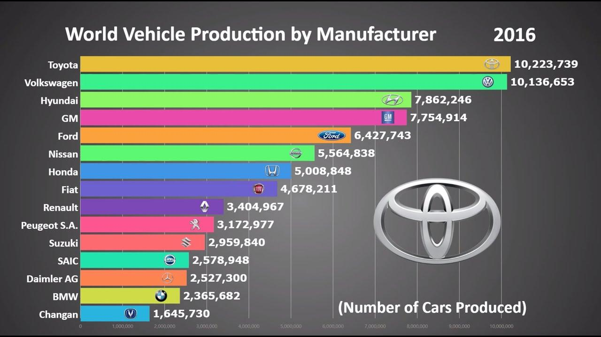

The automobile industry is a cornerstone of the global economy, significantly impacting employment, technological advancement, and international trade. Large companies such as Volkswagen, Toyota, and Ford dominate this dynamic sector by their sheer market presence and financial clout. These automotive giants not only produce vast numbers of vehicles annually but also drive innovation through investments in electric and autonomous vehicles, fiscal strategies, and market expansions.

This article aims to provide a detailed examination of the largest car manufacturers, focusing on both market capitalization and revenue. By understanding these key players, we can appreciate their influence over global market trends and industrial practices.



Additionally, the influence of algorithmic trading within the automotive sector reflects the industry's interaction with modern financial markets. Algorithmic trading, which uses advanced computational tools to predict market behavior, plays a crucial role in shaping investment strategies in an industry often characterized by its volatility and rapid technological advancements. Understanding these financial intricacies is vital for investors aiming to make informed decisions regarding automotive stocks.

Furthermore, as we uncover the trends shaping the automotive industry, we will gain valuable insights into how these companies maintain competitiveness. Whether through pioneering green technologies, enhancing supply chains, or entering emerging markets, these strategies are key to navigating an ever-changing global landscape. The future of the automotive industry hinges on such adaptations, as businesses strive to balance innovation with the demands of sustainability and efficiency.

## Table of Contents

## The Automotive Industry: An Overview

The automotive industry is a pivotal element of the global economy, providing employment to millions and driving significant technological progress. This multifaceted industry encompasses the manufacturing of both passenger cars and commercial vehicles, operating in a dynamic environment subject to continuous evolution. Major automotive companies are strategically positioned across the globe, with their headquarters predominantly located in North America, Europe, and Asia. These regions serve not only as manufacturing hubs but also as centers for research and development, fostering innovations that shape the future of transportation.

One of the primary activities of these leading automotive companies is the production of vehicles, ranging from compact urban cars to large commercial trucks. However, their contributions extend beyond mere manufacturing. Many are actively developing advanced technologies, such as electric vehicles (EVs) and autonomous driving systems. These innovations are set to redefine personal and commercial transportation, offering solutions that are cleaner, safer, and more efficient.

Recent years have seen a growing focus on sustainable and eco-friendly transportation solutions. This emphasis has been driven by a combination of regulatory requirements and consumer demand for vehicles with a reduced environmental footprint. Consequently, automotive firms are investing heavily in research and development to produce electric and hybrid vehicles that align with global sustainability goals. These efforts are not limited to passenger vehicles; commercial vehicles are also seeing advancements in alternative fuels and propulsion technologies.

The shift towards sustainability is further supported by the integration of digital and technological advancements within the industry. Modern vehicles increasingly incorporate [artificial intelligence](/wiki/ai-artificial-intelligence) (AI) and the Internet of Things (IoT) to enhance functionality, safety, and user experience. For instance, AI algorithms can optimize energy consumption in electric vehicles or support advanced driver-assistance systems (ADAS) that improve road safety.

In summary, the automotive industry is more than a manufacturing powerhouse; it is a sector at the forefront of technological transformation. Its pursuit of sustainability and innovation is shaping the future of mobility, highlighting the importance of adapting to changing economic and environmental landscapes. This continuous evolution underscores the industry's crucial role in not only meeting contemporary needs but also anticipating future demands.

## Top 10 Largest Car Manufacturers

The automotive industry is characterized by several key players who dominate the market in terms of revenue. These companies are not only leaders in producing a wide range of vehicles but also in driving technological advancements and market strategies. Understanding the financial performance of these companies provides insights into their market positioning and influence.

**Volkswagen AG** leads the list of the largest car manufacturers, with an impressive trailing 12 months (TTM) revenue of $284.34 billion. As one of the most prolific automakers, Volkswagen's extensive lineup and global reach position it at the forefront of the industry. The company's strategy encompasses a wide range of brands, catering to diverse market segments and continuously expanding its electric vehicle (EV) offerings.

**Toyota Motor Corporation** is closely behind Volkswagen and is renowned for its commitment to quality and efficiency. The company's revenue underscores its substantial market share and global influence. Toyota's innovative approaches, especially in hybrid and fuel-efficient vehicles, have set industry standards and reinforced its reputation as a leader in automotive technology and manufacturing.

**Stellantis** emerges as another major player with a revenue of $181.58 billion. Formed by the merger of Groupe PSA and Fiat Chrysler Automobiles (FCA), Stellantis represents a significant consolidation in the automotive sector. This merger pooled resources and expertise, creating a diversified product portfolio that spans several well-known brands. Stellantis is actively pursuing advancements in electrification and mobility solutions, aligning with contemporary consumer demands.

The list of top car manufacturers also includes other notable companies like **Mercedes-Benz AG**, **Ford Motor Company**, and **General Motors**. Each of these organizations contributes massively to global automobile production and reflects significant market presence:

- **Mercedes-Benz AG** is a hallmark of luxury and innovation, consistently producing high-value vehicles that blend performance with cutting-edge technology.

- **Ford Motor Company**, with its longstanding history, continues to be a significant player through its focus on innovation and sustainability. Ford's push towards EVs and autonomous driving technologies illustrates its strategic adaptation to emerging market trends.

- **General Motors** also remains a formidable force in the automotive industry. Its diversification into electric and autonomous vehicles showcases its proactive approach to future mobility solutions.

These leading manufacturers not only shape the current automotive landscape but also set the [course](/wiki/best-algorithmic-trading-courses) for future industry developments through their strategic initiatives and adaptations to market changes.

## Automobile Trading and Investment

The automobile industry consistently attracts significant attention from investors due to its dynamic nature and the substantial financial stakes involved. Many of the world's leading automotive companies are publicly traded, providing ample opportunities for investment. The [volatility](/wiki/volatility-trading-strategies) inherent in stock markets, coupled with the rapid technological transformations within the automotive sector, has led investors to increasingly rely on [algorithmic trading](/wiki/algorithmic-trading).

Algorithmic trading involves using complex algorithms to execute trades at high speed and [volume](/wiki/volume-trading-strategy), leveraging mathematical models and automated systems to make investment decisions. This approach is particularly advantageous in the automotive sector, where market conditions can shift rapidly due to technological advancements, regulatory changes, and consumer preferences.

Investors utilize sophisticated algorithms to analyze vast amounts of data, identify market trends, and predict future price movements. These algorithms assess various factors, such as historical stock performance, news sentiment, and macroeconomic indicators, to generate trading signals. The application of [machine learning](/wiki/machine-learning) and artificial intelligence further enhances the accuracy of these predictions, allowing investors to make data-driven decisions. For example, a simple moving average (SMA) strategy can be employed to determine the optimal timing for buying or selling automotive stocks. An SMA can be calculated using Python as follows:

```python
def simple_moving_average(prices, period):
    return [sum(prices[i:i+period]) / period for i in range(len(prices) - period + 1)]
```

Tesla Motors (TSLA) is one of the companies that vividly illustrate the impact of innovation on investment strategies. Tesla's advancements in electric vehicles and sustainability have propelled it into the spotlight, making its stock highly sought after. Investors keen on capitalizing on the shift towards clean energy and electric mobility closely monitor Tesla's performance, utilizing algorithms to analyze its financial metrics and market behavior. 

Understanding trading patterns and market performance is crucial for making strategic investment decisions. In the automotive sector, factors such as the introduction of new vehicle models, technological innovations, and policy changes significantly influence stock prices. Investors must remain informed about these developments to navigate the complex landscape and seize opportunities. A keen awareness of the broader economic environment, coupled with advanced trading strategies, positions investors to effectively manage the risks and rewards associated with automobile stocks. Consequently, algorithmic trading remains an essential tool for optimizing investment outcomes in this dynamic industry.

## Emerging Trends in the Automotive Industry

The automotive industry is undergoing a significant transformation, with emerging trends reshaping its landscape. A notable shift is the increasing adoption of electric and hybrid vehicles, driven by the mounting environmental concerns and regulatory pressure to reduce carbon emissions. Companies such as Tesla and BYD are at the forefront of this movement, leveraging cutting-edge technology to enhance the efficiency and performance of electric vehicles (EVs). According to the International Energy Agency (IEA), electric car sales reached a record high in 2021, with electric vehicles accounting for nearly 9% of global car sales. This [momentum](/wiki/momentum) is expected to continue as advancements in battery technology make EVs more accessible and affordable.

Autonomous driving technology represents another frontier of innovation, as manufacturers pour substantial investments into the development of self-driving cars. Companies like Waymo, a subsidiary of Alphabet, and traditional automakers such as General Motors and Ford are accelerating their efforts to bring autonomous vehicles (AVs) to the market. The integration of advanced sensors, machine learning algorithms, and high-resolution mapping allows these vehicles to navigate complex urban environments with increasing accuracy. While fully autonomous vehicles are not yet commercially widespread, certain semi-autonomous features, such as adaptive cruise control and lane-keeping assistance, are becoming standard in many new cars.

Sustainability is a key focus in the automotive industry's evolution, impacting production methods and material selection. Automotive companies are increasingly aligning their operations with global environmental goals by committing to carbon neutrality and reducing resource consumption. This shift is evident in the increased use of lightweight materials, such as aluminum and carbon fiber, that improve fuel efficiency. Furthermore, manufacturers are adopting circular economy principles, prioritizing the recyclability of vehicles and the reduction of waste in production processes.

The integration of artificial intelligence (AI) and the Internet of Things (IoT) in vehicles brings enhanced user experiences and bolsters safety features. AI facilitates personalized in-car systems that adapt to driver preferences and behaviors, while IoT allows for seamless connectivity between vehicles and smart infrastructure. These technologies enable real-time data analysis, predictive maintenance alerts, and improved navigation systems that can adjust routes based on traffic conditions.

Collectively, these trends signify a transformative period in the automotive industry, fueled by technological advancements and evolving consumer preferences. As demand for environmentally friendly and technologically advanced vehicles grows, the automotive landscape is set for continuous innovation, presenting opportunities and challenges for industry players.

## Conclusion

The largest car manufacturers maintain a commanding presence in the global market landscape, perpetually driving innovation and influencing emerging trends within the automotive industry. The focus on technological advancements and dynamic market conditions has notably influenced investments and trading strategies in this sector. As these companies adapt to the continual changes, they face a dual challenge: harnessing opportunities while mitigating economic and environmental pressures that are intrinsic to the industry's evolution.

In navigating the complexities of the automotive sector, sustainable practices coupled with cutting-edge technology emerge as pivotal factors that will ultimately determine the success of these automotive leaders. This trajectory emphasizes enhancing vehicle efficiency, reducing emissions, and integrating intelligent systems in response to growing environmental and regulatory demands.

For investors, manufacturers, and consumers, staying informed about these developments is imperative. This knowledge enables them to anticipate and adapt to the automotive industry's future. Market insights driven by data analytics and strategic forecasting offer crucial advantages for stakeholders seeking to understand the impact of technological transformations and sustainability initiatives on the market dynamics.

In summary, while the global automotive giants continue to dominate the industry, success in the coming years will hinge on their ability to innovate sustainably and leverage market intelligence effectively. These efforts not only cater to consumer expectations but also respond to broader societal and environmental goals.

## References & Further Reading

[1]: ["The Global Automotive Industry"](https://www.statista.com/topics/1487/automotive-industry/) by Paul Nieuwenhuis and Peter Wells

[2]: ["The Machine That Changed the World: The Story of Lean Production"](https://books.google.com/books/about/The_Machine_That_Changed_the_World.html?id=9NHmNCmDUUoC) by James P. Womack, Daniel T. Jones, and Daniel Roos

[3]: ["Automobiles and the Environment: An International Perspective"](https://www.osti.gov/biblio/5619388) by Joel A. Tarr, Shinya Sugiyama, and Joseph A. Pratt

[4]: ["Electric Vehicle Technology Explained"](https://onlinelibrary.wiley.com/doi/book/10.1002/9781118361146) by James Larminie and John Lowry

[5]: ["Algorithmic Trading & DMA: An Introduction to Direct Access Trading Strategies"](https://www.amazon.com/Algorithmic-Trading-DMA-introduction-strategies/dp/0956399207) by Barry Johnson