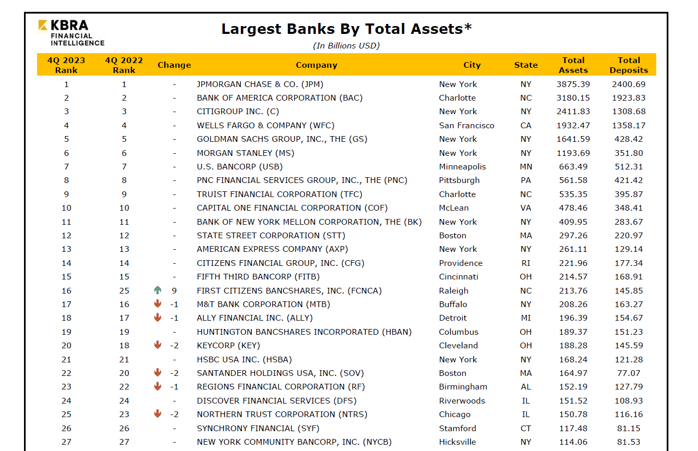

In recent years, the global banking industry has experienced substantial changes, largely driven by technological advancements. Among these advancements, algorithmic trading has come to the forefront as a significant factor shaping the financial strategies of the world's largest banks. Algorithmic trading, commonly known as algo trading, refers to the use of computer algorithms to automate trading decisions and execute orders based on predetermined conditions. This technology utilizes sophisticated mathematical models and rapid data analysis to predict market trends, optimize trading strategies, and execute trades with precision and speed.

The influence of algorithmic trading is particularly pronounced among the major banking institutions, which hold substantial total assets. These banks, including giants such as JPMorgan Chase, the Industrial and Commercial Bank of China, and HSBC, manage trillions in assets, positioning them to effectively leverage algo trading technologies. By integrating these advanced trading techniques, banks can enhance their trading efficiency, reduce human error, and improve their profit margins while mitigating risks.



This article examines how algorithmic trading is reshaping the banking industry, focusing specifically on those institutions that dominate by their asset size. The confluence of large-scale asset management and cutting-edge trading technologies fuels a competitive advantage for these banks, allowing them to remain at the forefront of the financial sector. As we explore the global banking scene, we aim to highlight the interconnectedness between algorithmic trading and the substantial assets held by leading banks, revealing how these elements collectively influence modern banking strategies.

## Table of Contents

## Overview of the Largest Banks by Total Assets

To identify the most prominent players in the global banking sector, one must examine the total assets managed by these institutions. The total assets denote the aggregate value of everything a bank owns, including loans, securities, and property. As a measure of financial strength and market influence, banks with substantial total assets play a pivotal role in global economic trends.

Leading the pack are banks such as JPMorgan Chase, the Industrial and Commercial Bank of China (ICBC), and HSBC. These institutions consistently rank at the top globally, each commanding trillions of dollars in total assets. As of recent reports, JPMorgan Chase is one of the largest banks in the United States and globally, while the ICBC is widely recognized as the largest bank by total assets in China and worldwide.

The management of these massive asset portfolios provides crucial insights into the financial health and market dominance of these banks. For instance, JPMorgan Chase's diversified asset base allows it to withstand economic volatility and sustain profitability, as evidenced by its robust performance in financial markets. Similarly, ICBC's extensive assets have enabled it to support China's rapid economic growth and expand its influence both domestically and internationally.

The size of a bank's total assets also directly impacts its capacity to invest in and develop advanced financial technologies. Large-scale asset management necessitates sophisticated technology to efficiently process, analyze, and manage these assets. Algorithmic trading, for instance, has become increasingly integral to managing large volumes of transactions and data with precision. Banks with substantial assets are better positioned to invest in the infrastructure required for [algorithmic trading](/wiki/algorithmic-trading), integrating it into their operational strategies to enhance efficiency and market reach.

In conclusion, the largest banks by total assets are not only pillars of global finance but also facilitators of technological advancement within the industry. Their asset size enables them to be more robust in the face of financial challenges and innovative in their strategic pursuits, ensuring they maintain a leading edge in the competitive banking landscape.

## Understanding Algorithmic Trading

Algorithmic trading, or algo trading, involves the use of computer algorithms that automate trading decisions and execute orders based on predefined criteria. These algorithms employ complex mathematical models and rapid data analysis to forecast market trends and enhance trading strategies. The fundamental goal is to make swift, informed trading choices that are less susceptible to human error.

At its core, algorithmic trading utilizes various mathematical models such as the Black-Scholes model for option pricing or the Kelly criterion for optimal bet sizing, to make real-time decisions. Python, for example, is widely used in implementing these models due to its efficient libraries like NumPy and pandas, which facilitate quick data processing.

Originally, algorithmic trading found its niche among hedge funds and proprietary trading firms. Its promise of enhanced trading efficiency and precision, however, has caught the attention of major banks. By integrating algo trading, these institutions can conduct high-frequency trades with minimal time lags, potentially improving profit margins.

For example, an algorithm might be programmed to buy a stock when its 50-day moving average surpasses the 200-day moving average. This is a common technical indicator used to identify trading opportunities. In Python, this could be implemented using a simple script:

```python
import pandas as pd

# Sample data for stock prices
data = {'price': [100, 102, 104, 106, 105, 107, 108]}
df = pd.DataFrame(data)

# Calculate moving averages
df['50_MA'] = df['price'].rolling(window=50).mean()
df['200_MA'] = df['price'].rolling(window=200).mean()

# Trading signal
df['signal'] = (df['50_MA'] > df['200_MA']).astype(int)
```

The adoption of algorithmic trading has grown among top-tier banks as it serves as a strategic asset in maintaining a competitive edge in the financial markets. By automating trades, banks reduce the risk of human error and lessen the influence of emotional factors, leading to more consistent trading outcomes and enhanced risk management.

In conclusion, algorithmic trading has transformed from a specialty tool of niche trading entities to a cornerstone of major banks' trading strategies. Its ability to analyze and act on large data sets quickly and accurately underscores its importance in contemporary financial markets.

## The Role of Algorithmic Trading in Global Banks' Strategies

Global banks have increasingly integrated algorithmic trading into their strategic frameworks to capitalize on its numerous advantages. One of the pivotal benefits of algorithmic trading is its ability to handle vast quantities of data rapidly. By analyzing real-time market data, it enables banks to make informed and prompt trading decisions that are crucial in today’s fast-paced financial environments. This characteristic enhances the efficiency of banking operations, allowing for streamlined processes and reduced latency in executing trades.

Algorithmic trading is employed by banks for diverse functions, each tailored to specific financial strategies. Arbitrage, for example, involves simultaneously buying and selling an asset in different markets to exploit price differentials, a task made efficient by algorithms that can quickly detect and act on such opportunities. Market making involves continuous buying and selling securities to profit from the bid-ask spread, and algorithmic approaches ensure both speed and accuracy in these transactions.

In addition to straightforward trading activities, banks utilize algorithmic trading for complex portfolio management and risk management strategies. Through sophisticated models, banks can optimize portfolio allocations and dynamically hedge positions against potential market downturns. These models analyze historical data and current market conditions to predict future price movements and adjust accordingly, thus mitigating risk and enhancing returns.

The scalability of algorithmic trading allows global banks to implement comprehensive strategies that are adaptable to a wide range of market conditions. This scalability is crucial, as it permits banks to engage in various trading strategies simultaneously, from managing small-scale trades to executing large-[volume](/wiki/volume-trading-strategy) transactions with precision. By employing advanced algorithms capable of learning and adapting, financial institutions are better positioned to capture fleeting market opportunities and sustain competitive advantages.

In summary, the adoption of algorithmic trading within global bank strategies provides a multifaceted tool that enhances operational efficiency and strategic depth. It not only supports traditional banking operations but also opens new avenues for innovation and revenue generation in the highly dynamic financial market landscape.

## Impact of Algorithmic Trading on Bank Profitability and Risk Management

Algorithmic trading has reshaped the landscape of bank profitability and risk management by affording financial institutions the ability to execute trades rapidly with precision. This capability is crucial in seizing transient market opportunities that manual trading processes, constrained by human decision-making speeds, often miss. The implementation of algorithmic strategies has become indispensable for banks aiming to maximize profit margins in fast-moving financial markets.

The automation inherent in algorithmic trading drastically reduces operational risks. Human errors—stemming from miscalculations, oversight, or emotional trading responses—are minimized when trading is guided by predefined computer algorithms. By automating transaction processes, banks benefit from a more consistent and reliable trading performance. This leads to enhanced efficiency and effectiveness across trading desks, contributing positively to profitability.

Furthermore, algorithmic models provide robust tools for risk management. Sophisticated predictive analytics enable banks to anticipate market trends and shifts with greater accuracy. These models can perform comprehensive stress testing, evaluating a bank's portfolio against various hypothetical scenarios to assess potential impacts. Through these simulations, banks can foresee possible risks and take precautionary measures to mitigate adverse outcomes. This proactive approach to risk analysis strengthens the financial security and stability of banking institutions.

The integration of such advanced trading technologies also opens new revenue streams. Banks can engage in more complex trading strategies such as statistical [arbitrage](/wiki/arbitrage) and high-frequency trading, which exploit small price differentials across markets at unprecedented speeds. These capabilities allow banks to optimize their trading strategies for improved returns, positioning them competitively in a global financial market.

Overall, algorithmic trading equips banks with a toolset that not only amplifies profitability through enhanced trading efficiency and precision but also fortifies their ability to manage and mitigate financial risks. These advantages underscore the critical role of algorithmic innovations in shaping the future strategies of major banking institutions.

## Challenges and Opportunities in Algorithmic Trading for Large Banks

Despite its substantial benefits, algorithmic trading presents several challenges for large banks that must be addressed to fully exploit its potential. One of the primary concerns is ensuring the security and transparency of trading algorithms in an industry fraught with regulations. With the financial sector's decreasing tolerance for errors or ethical lapses, protecting the integrity of algorithms against cyber threats and ensuring compliance with regulatory standards is vital. Algorithmic transparency is crucial, as regulators demand insights into how trading strategies are constructed and executed. Consequently, banks are investing significantly in robust security protocols and compliance frameworks to navigate these challenges.

Market [volatility](/wiki/volatility-trading-strategies) poses another significant challenge in algorithmic trading for large banks. The dynamic nature of financial markets means that algorithms must be adaptive and resilient to avoid significant losses. Unforeseen market conditions can lead algorithms to behave unpredictably, resulting in substantial financial risks. To combat this, banks are increasingly utilizing advanced risk mitigation techniques and real-time monitoring systems. These systems aim to refine trading algorithms dynamically and provide contingency plans in case of market disturbances. By employing predictive analytics and scenario-based stress testing, banks can calculate the Value at Risk (VaR) and implement measures to reduce exposure to adverse market conditions.

However, the landscape of algorithmic trading offers noteworthy opportunities for banks that can overcome these challenges. Mastery of algorithmic trading can significantly enhance client offerings. For instance, customized trading solutions tailored to specific client requirements can provide banks with a competitive edge, strengthening client relationships and expanding market presence. Furthermore, successful integration of algorithmic trading can streamline operations, reduce trading costs, and maximize return on investments, thus bolstering overall market competitiveness.

The future of banking is intricately tied to overcoming these challenges to harness the full potential of algorithmic trading. As banks continue to invest in algorithmic research and development, the integration of [artificial intelligence](/wiki/ai-artificial-intelligence) and [machine learning](/wiki/machine-learning) into trading platforms could drive the next evolution of this technology. Embracing these innovations will require banks to continually update their infrastructure, train their workforce, and ensure compliance with emerging regulations.

Large banks that can adeptly navigate these barriers will position themselves as leaders in the financial markets of tomorrow, thereby solidifying their roles not just as stewards of capital but also as pioneers of technological transformation in finance. Thus, balancing the inherent challenges with the promising opportunities that algorithmic trading presents will be crucial for banks aiming to maintain a competitive edge in global finance.

## Conclusion

As technology continues to drive change within the banking sector, algorithmic trading has become a fundamental component of evolving financial strategies. This transformation is particularly evident among the largest banks, such as JPMorgan Chase and the Industrial and Commercial Bank of China, which, with immense total assets, stand to gain significantly by integrating algorithmic trading into their operations. These banks leverage their vast resources to develop sophisticated trading algorithms that can process enormous data sets quickly and efficiently.

Despite the inherent challenges, including regulatory scrutiny, potential for unforeseen market losses, and the necessity for robust risk management, the relentless pursuit of technological innovation and competitive edge ensures that algorithmic trading remains a vital instrument for these financial behemoths. By navigating these challenges and seizing the opportunities presented, banks can enhance their service offerings, achieve greater financial stability, and effectively manage the complexities of contemporary financial markets.

Ultimately, the harmonious integration of traditional banking resources with cutting-edge algorithmic technologies may redefine the future landscape of global finance. Such synergy promises not only to fortify the financial robustness of these banks but also to drive the continuous evolution of the global banking industry, enabling more efficient and secure financial ecosystems worldwide.

## References & Further Reading

[1]: Bergstra, J., Bardenet, R., Bengio, Y., & Kégl, B. (2011). ["Algorithms for Hyper-Parameter Optimization."](https://papers.nips.cc/paper/4443-algorithms-for-hyper-parameter-optimization) Advances in Neural Information Processing Systems 24.

[2]: ["Advances in Financial Machine Learning"](https://www.amazon.com/Advances-Financial-Machine-Learning-Marcos/dp/1119482089) by Marcos Lopez de Prado

[3]: ["Evidence-Based Technical Analysis: Applying the Scientific Method and Statistical Inference to Trading Signals"](https://www.amazon.com/Evidence-Based-Technical-Analysis-Scientific-Statistical/dp/0470008741) by David Aronson

[4]: ["Machine Learning for Algorithmic Trading"](https://github.com/PacktPublishing/Machine-Learning-for-Algorithmic-Trading-Second-Edition) by Stefan Jansen

[5]: ["Quantitative Trading: How to Build Your Own Algorithmic Trading Business"](https://books.google.com/books/about/Quantitative_Trading.html?id=j70yEAAAQBAJ) by Ernest P. Chan