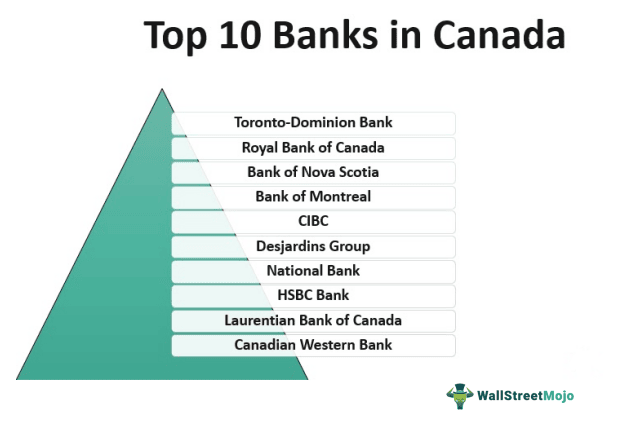

The Canadian banking sector is widely recognized for its unparalleled stability and substantial presence in the global financial landscape. At the heart of this system are the 'Big Six' banks, which include the Royal Bank of Canada (RBC), Toronto-Dominion Bank (TD), Bank of Nova Scotia (Scotiabank), Bank of Montreal (BMO), Canadian Imperial Bank of Commerce (CIBC), and National Bank of Canada. These financial institutions not only dominate the domestic market but also extend their influence internationally, showcasing robust performances across a variety of financial services.

In this article, we aim to provide an in-depth exploration of these Canadian banking giants and the unique practices that set them apart. Additionally, an important focus will be placed on algorithmic trading. This modern trading method has become integral within Canadian banks, facilitating more efficient and cost-effective trading processes. As algorithmic trading continues to evolve, it is reshaping the strategic landscape of Canadian banks, influencing market dynamics and offering new potentials for growth.

Our comprehensive guide is designed to offer valuable insights into the complexities of the Canadian banking system. From regulatory frameworks to technological adoption, we will examine the multifaceted elements that contribute to the strength and resilience of Canadian banks. By navigating through this exploration, readers will gain a better understanding of how Canada's banking sector maintains its global reputation as one of the most robust financial systems.

This article is your gateway to understanding the intricacies of banking in Canada and the innovations poised to shape its future. Whether you are an investor, a banking professional, or simply interested in financial systems, this guide provides a detailed overview of an industry that plays a critical role in Canada's economy and on the world stage.

## Table of Contents

## Overview of the Largest Banks in Canada

The largest banks in Canada, colloquially known as the 'Big Six', are integral to the country's financial fabric. This elite group includes the Royal Bank of Canada (RBC), Toronto-Dominion Bank (TD), Bank of Nova Scotia (Scotiabank), Bank of Montreal (BMO), Canadian Imperial Bank of Commerce (CIBC), and National Bank of Canada. These institutions boast a substantial presence in the Canadian banking sector, collectively holding significant market share and exhibiting strong financial performance.

Each of the Big Six banks offers a comprehensive array of services, encompassing personal banking, commercial services, and investment operations. This diversity in offerings allows them to cater to a broad range of customer needs, from basic account management to complex financial solutions. Personal banking options typically include savings and chequing accounts, credit facilities, and mortgage solutions. On the commercial side, they provide everything from small business loans to large-scale corporate funding, reflecting their capability to support varying scales of enterprise.

The Canadian banking system is renowned for its stringent regulatory environment, which has been pivotal to its global reputation for safety and reliability. This regulatory framework is designed to protect consumers and ensure banks maintain adequate capital reserves, effectively mitigating the risk of financial instability. This rigorous approach to regulation has been instrumental in maintaining Canada’s robust economic standing, particularly during times of global financial turmoil.

In terms of financial strength, the Big Six regularly report significant profits and maintain high levels of capitalization. For instance, the Royal Bank of Canada and Toronto-Dominion Bank frequently feature among the top performers in terms of profitability and asset management capabilities. These banks regularly disclose key performance indicators in their financial reports, showcasing their solid market positions and operational efficiencies. According to recent quarterly reports, the combined assets and revenue figures of these banks illustrate the depth and breadth of their reach within and beyond Canadian borders.

Internationally, the Big Six have made strategic moves to broaden their influence. RBC and TD, in particular, have expanded extensively in the United States and other international markets, leveraging synergies to enhance their competitive edge. Meanwhile, Scotiabank has capitalized on opportunities in Latin America and the Caribbean, aligning with its strategic growth initiatives.

The alignment of robust domestic operations with ambitious global strategies underscores the dynamic nature of the Big Six. Through innovation and regulatory compliance, these banks continue to strengthen their position in the global financial market while maintaining their core values that ensure trust and stability in the Canadian banking system.

## Banking in Canada: A Snapshot

Canadian banks operate in a highly competitive market characterized by a strong emphasis on customer service, innovation, and international expansion efforts. With a focus on maintaining high levels of customer satisfaction, these institutions consistently prioritize the enhancement of client interactions through comprehensive service offerings and advanced technological solutions.

The regulatory framework governing Canadian banks is renowned for its robustness, providing a sturdy foundation that ensures the stability and security of the financial system. This framework, overseen by entities such as the Office of the Superintendent of Financial Institutions (OSFI) and the Canada Deposit Insurance Corporation (CDIC), mandates rigorous regulatory practices that shield the financial sector from potential risks and instabilities.

In terms of consumer banking, Canadian institutions offer a diverse range of products that cater to various financial needs—from traditional savings accounts and personal loans to sophisticated investment opportunities like stock trading accounts and mutual funds. This breadth of offerings underscores the banks' commitment to meeting the evolving demands of both individual and corporate clients.

Recent trends demonstrate a marked shift towards digital banking, largely spurred by technological advancements and the changing preferences of a tech-savvy clientele. Canadian banks have increasingly embraced digital platforms to enhance service delivery, offering mobile banking apps and online financial services that seamlessly integrate into the daily lives of users. This digital transformation is reflective of a broader shift within the banking industry towards more efficient, user-friendly solutions that prioritize convenience and accessibility.

Furthermore, Canadian banks have adapted to the digital age by leveraging data analytics and customer insights to tailor their offerings, improve client engagement, and build more personalized banking experiences. As technology continues to evolve, Canadian banks remain committed to innovating their service models, ensuring they remain competitive in both domestic and global markets. The integration of emerging technologies not only enhances operational efficiencies but also strengthens the customer-bank relationship, setting a strong foundation for future growth and adaptation in a rapidly changing financial landscape.

## Algorithmic Trading in Canadian Banks

Algorithmic trading has become an integral component of the financial landscape, playing a crucial role in enhancing trading efficiency for Canadian banks. The adoption of [algorithmic trading](/wiki/algorithmic-trading) allows these banks to execute trades at speeds and volumes previously unattainable through human efforts alone. By harnessing advanced computational algorithms, Canadian banks can monitor market conditions, analyze large data sets, and execute transactions that align with their trading strategies and maximize profit margins.

At the core of algorithmic trading is the application of sophisticated mathematical models and software to make trading decisions based on predefined criteria. These algorithms can handle various asset classes, including equities, commodities, and foreign exchange, thereby making diverse Canadian markets more dynamic and efficient.

Algorithmic trading in Canada operates within a well-defined regulatory framework designed to safeguard market integrity and promote fairness. The Investment Industry Regulatory Organization of Canada (IIROC) is the national self-regulatory body that oversees all trading activities. IIROC mandates standards to prevent unethical practices like market manipulation and to ensure transparency. For instance, rules concerning the use of automated pre-trade risk filters are in place to manage potential systemic risks associated with high-frequency trading.

The enhanced efficiency provided by algorithmic trading comes with a series of benefits and challenges for Canadian banks and the broader financial market. On the positive side, algorithmic trading minimizes human error, reduces transaction costs, and enhances [liquidity](/wiki/liquidity-risk-premium), contributing to the overall health of the market. Moreover, it enables better price discovery and the ability to react swiftly to market changes.

However, challenges persist, including the risk of market [volatility](/wiki/volatility-trading-strategies) amplified by algorithmic trading strategies and the potential for technological failures that can lead to significant financial repercussions. There is also the ever-present threat of cyber-attacks, which necessitates stringent security measures and constant vigilance.

In summary, algorithmic trading continues to shape the Canadian banking sector, providing both opportunities for increased profitability and challenges that require robust regulatory oversight and innovative solutions. As technology progresses, Canadian banks must remain adaptable, ensuring they capitalize on algorithmic trading's benefits while mitigating its risks.

## The Future of Banking in Canada

The future of banking in Canada is characterized by a continual push towards innovation while upholding the core values of trust and financial stability. As digital transformation progresses, technologies such as [artificial intelligence](/wiki/ai-artificial-intelligence) (AI) and blockchain are poised to play pivotal roles in reshaping banking operations. AI has the potential to enhance customer service through personalized recommendations and chatbots, streamline risk management by analyzing vast amounts of data for better decision-making, and improve fraud detection with real-time monitoring systems. Blockchain technology, on the other hand, offers opportunities for more secure transactions, reduced processing times, and enhanced transparency in banking operations.

Environmental, Social, and Governance ([ESG](/wiki/esg-investing)) considerations are becoming increasingly significant in shaping banking practices and investment strategies. Canadian banks are integrating ESG factors into their risk assessment and decision-making frameworks to promote sustainable development. This shift is driven by growing regulatory demands, stakeholder expectations, and an acknowledgment of the long-term benefits of sustainable investments. Banks are investing in green technologies and sustainable projects, thereby aligning their portfolios with global sustainability goals.

As emerging technologies and regulatory standards evolve, Canadian banks are expected to adapt their practices. The adaptation process is likely to involve an increased focus on cybersecurity to protect against growing cyber threats. Moreover, banks will need to balance technological innovation with stringent compliance requirements, ensuring that ethical standards and consumer protection remain priorities.

Canadian banks are also positioning themselves to take advantage of the global shift towards digital financial services. By investing in fintech partnerships and developing innovative digital products, they aim to offer seamless and secure banking experiences to their customers. This involves leveraging data analytics to gain insights into customer behavior, thereby providing tailored solutions that meet the dynamic needs of consumers.

In summary, the future of banking in Canada is set to be defined by a harmonious blend of technology and sustainability, aimed at enhancing operational efficiency while maintaining customer trust and regulatory compliance. Canadian banks are well-equipped to navigate the complexities of the global financial landscape, ensuring they remain competitive and relevant in the years to come.

## Conclusion

The Canadian banking sector remains a cornerstone of the nation's economy, distinguished by its consistent stability and resilience. Among the most prominent players in this sector are the 'Big Six' banks—Royal Bank of Canada (RBC), Toronto-Dominion Bank (TD), Bank of Nova Scotia (Scotiabank), Bank of Montreal (BMO), Canadian Imperial Bank of Commerce (CIBC), and National Bank of Canada. These institutions have demonstrated exceptional performance, both within Canada and internationally, underpinning the strength and reliability of the national banking system.

Algorithmic trading has significantly transformed operational strategies within these banks, providing new opportunities to enhance growth and efficiency. By leveraging sophisticated algorithms, these banks are able to execute trades at speeds and volumes that are unachievable through traditional methods. This technological advancement helps optimize profit margins and contributes to the overall competitiveness of Canadian banks in the global market.

As technological evolution continues, Canadian banks are well-prepared to adapt and prosper in an increasingly digital environment. They are integrating various leading-edge technologies such as artificial intelligence and blockchain, which are set to redefine financial services. Moreover, Environmental, Social, and Governance (ESG) considerations are becoming ever more critical, reshaping how these banks approach investment decisions and operational strategies to meet emerging societal expectations.

For individuals and businesses looking to engage with or invest in the Canadian market, a comprehensive understanding of the Canadian banking system offers invaluable insights. Its robust, well-regulated framework, alongside cutting-edge technological adoption, positions it as a model of financial stability and innovation on the world stage.

## References & Further Reading

[1]: Freeland, C. (2010). ["Plutocrats: The Rise of the New Global Super-Rich and the Fall of Everyone Else"](https://books.google.com/books/about/Plutocrats.html?id=gOjMHq4jYk0C). Penguin Press.

[2]: Nandy, S. K., Safavi, S., & Keasey, K. (2016). ["The Role of Algorithmic Trading in Financial Markets."](https://www.nber.org/papers/w20149) Journal of Risk Finance, 17(2), 164-184.

[3]: Zorn, L. (2018). ["Recent Trends in Canadian Bank Performance"](https://www.semanticscholar.org/paper/Coming-in-2017%3A-A-New-Generation-of-Graduate-Z-Zorn/45e9efc23eafe12ad17c38e272e134ac94fce609) Bank of Canada Staff Analytical Note.

[4]: Patton, M. (2019). ["Algorithmic Trading and the Impact on Financial Markets"](https://www.researchgate.net/publication/378548435_Algorithmic_Trading_and_AI_A_Review_of_Strategies_and_Market_Impact). Social Science Research Network.

[5]: Hull, J. C. (2017). ["Options, Futures, and Other Derivatives"](https://www.semanticscholar.org/paper/Options%2C-Futures%2C-and-Other-Derivatives-Hull/89bdee500c8623864fc9eb7a471546aa713acc44). Pearson, 10th Edition.