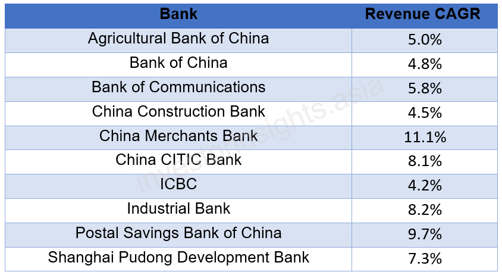

## Table of Contents

## What are the largest banks in China?

The largest banks in China are the Industrial and Commercial Bank of China (ICBC), China Construction Bank (CCB), and Agricultural Bank of China (ABC). These banks are among the biggest in the world, not just in China. ICBC is the largest, followed by CCB and then ABC. They have many branches all over China and also in other countries.

These banks offer many services like savings accounts, loans, and credit cards. They help businesses and people with their money needs. They also work with the government to help the economy grow. People trust these banks because they are very big and have been around for a long time.

## How are the sizes of these banks typically measured?

The sizes of banks like ICBC, CCB, and ABC are usually measured by looking at their total assets. Total assets mean all the money and things the bank owns, like buildings, loans they have given out, and money they have in their accounts. When a bank has more assets, it is considered bigger. This is why ICBC is the largest bank in China because it has the most total assets compared to other banks.

Another way to measure the size of a bank is by looking at its market value. Market value is how much the bank is worth if all its shares were sold at the current price. This can change every day because stock prices go up and down. But it gives an idea of how big and important a bank is in the eyes of investors. Both total assets and market value help us understand how large and influential a bank is.

## What is the history of the largest banks in China?

The Industrial and Commercial Bank of China (ICBC) was set up in 1984. Before that, it was part of the People's Bank of China, which was the only bank in China at the time. ICBC grew very fast and became the biggest bank in China. It helps many people and businesses with their money. In 2006, ICBC started selling its shares to people all over the world, and it became the biggest bank in the world by total assets.

China Construction Bank (CCB) started in 1954 to help with building projects in China. It was also part of the People's Bank of China at first. Later, it became its own bank and grew to be very big. CCB helps people buy homes and businesses build things. In 2005, CCB sold its shares to people around the world, and it became one of the biggest banks in China and the world.

The Agricultural Bank of China (ABC) began in 1951 to help farmers and rural areas. It was also part of the People's Bank of China at the start. ABC grew to be very important for the countryside in China. It helps farmers get loans and save money. In 2010, ABC sold its shares to people around the world, and it became one of the biggest banks in China and the world.

## How do the largest Chinese banks compare to global banks in terms of assets?

The largest Chinese banks, like ICBC, CCB, and ABC, are some of the biggest banks in the world when we look at their total assets. ICBC is the biggest bank in the world by assets, with more than any other bank. CCB and ABC are also very big and have more assets than many other global banks. These Chinese banks have grown a lot over the years and now have a lot of money and things they own.

Compared to other big banks around the world, like JPMorgan Chase in the United States or HSBC in the UK, the Chinese banks have more assets. For example, JPMorgan Chase has a lot of assets, but it is still less than ICBC. This shows how big and important the Chinese banks are on a global scale. They help a lot of people and businesses in China and other countries with their money needs.

## What role do these banks play in China's economy?

The largest banks in China, like ICBC, CCB, and ABC, play a very big role in the country's economy. They help the economy grow by giving loans to businesses and people. When businesses get loans, they can build new things, hire more workers, and make more products. This helps create jobs and makes the economy stronger. These banks also help the government with big projects, like building roads and schools, which are important for the country's development.

These banks also help people save their money and plan for the future. Many people in China have accounts with these banks, which means they trust them to keep their money safe. The banks use this money to give out more loans, which helps the economy keep growing. By doing all these things, the biggest banks in China are very important for making sure the economy stays healthy and keeps getting better.

## What are the main services offered by the largest banks in China?

The largest banks in China, like ICBC, CCB, and ABC, offer many services to help people and businesses. They let people open savings accounts where they can keep their money safe and earn a little interest. These banks also offer checking accounts so people can easily pay for things. They give out loans too, which can help people buy homes or start businesses. Credit cards are another service they provide, letting people borrow money to buy things and pay it back later.

These banks also help businesses a lot. They give loans to companies so they can grow and hire more workers. They offer services like managing money for big companies and helping them with payments around the world. The banks also work with the government on big projects, like building roads and schools. They help with things like investing money and planning for the future, which is important for the economy.

## How has the Chinese government influenced the operations of these banks?

The Chinese government has a big say in how the biggest banks in China work. These banks, like ICBC, CCB, and ABC, are mostly owned by the government. This means the government can tell them what to do. For example, the government might tell the banks to give loans to certain companies or projects that they think are important for the country. This helps the government control the economy and make sure it grows in the way they want.

The government also sets rules that these banks have to follow. These rules can be about how much money the banks need to keep in reserve or how they should lend money. By setting these rules, the government can make sure the banks are safe and that they help the economy in the right way. This influence helps the government guide the banks to support big projects and help people and businesses when they need it.

## What are the recent financial performance trends of the largest Chinese banks?

The largest Chinese banks, like ICBC, CCB, and ABC, have been doing well in recent years. They have seen their profits grow because they are lending more money to people and businesses. This is good for them because when they lend money, they earn interest. Also, the Chinese economy has been growing, which means more people and businesses are using the banks' services. This has helped the banks make more money.

However, these banks have also faced some challenges. One big challenge is that they have to follow strict rules set by the government. These rules can make it harder for them to make as much profit as they want. Another challenge is that they have to be careful about the loans they give out. If too many people or businesses can't pay back their loans, the banks could lose money. But overall, the biggest Chinese banks are still strong and doing well.

## How do the largest banks in China manage risk and regulatory compliance?

The largest banks in China, like ICBC, CCB, and ABC, manage risk by being very careful about who they lend money to. They check if people and businesses can pay back their loans before giving them money. They also keep some money aside, called reserves, to cover any losses if someone can't pay back a loan. This helps them stay safe and keep their customers' money secure. They also use special computer programs to watch for any problems and fix them quickly.

These banks also have to follow many rules set by the Chinese government. They have special teams that make sure they are doing everything the right way. These teams check all the bank's activities to make sure they are following the rules. If they find any problems, they fix them fast. The banks also work closely with the government to make sure they are doing what is expected of them. This helps them stay out of trouble and keep the trust of their customers and the government.

## What technological innovations have been adopted by these banks?

The biggest banks in China, like ICBC, CCB, and ABC, have been using new technology to make things easier for their customers. They have made apps for phones and computers that let people do their banking from home. With these apps, people can check their money, pay bills, and even get loans without going to a bank. They also use something called AI, which stands for [artificial intelligence](/wiki/ai-artificial-intelligence). AI helps the banks answer customer questions quickly and find any problems with accounts faster.

These banks also use something called blockchain, which is a special way to keep records that is very safe. They use it to make sure their money transfers are secure and fast. Another thing they do is use big data, which means they look at a lot of information to understand what their customers need. This helps them make better decisions and offer services that people really want. By using all these new technologies, the big banks in China are trying to stay ahead and keep their customers happy.

## How do the largest Chinese banks approach international expansion?

The largest banks in China, like ICBC, CCB, and ABC, want to grow in other countries. They do this by opening new branches in different places around the world. This helps them work with businesses and people in those countries. They also make deals with other banks in different countries to help their customers send and receive money easily. By doing these things, they can help more people and businesses, no matter where they are.

These banks also buy other banks or companies in other countries. This helps them grow faster and learn new ways of doing things. They want to be big players in the world of banking, not just in China. By expanding to other countries, they can share their services and help the global economy grow. This makes them important not just in China but all over the world.

## What are the future challenges and opportunities for the largest banks in China?

The biggest banks in China, like ICBC, CCB, and ABC, face many challenges in the future. One big challenge is that they have to follow strict rules from the government. These rules can make it hard for them to make as much money as they want. Another challenge is that they need to be careful about who they lend money to. If too many people or businesses can't pay back their loans, the banks could lose money. They also have to deal with new technology, like AI and blockchain, which can be hard to use and keep safe. Competition from other banks, both in China and around the world, is another big challenge they need to handle.

But there are also many opportunities for these banks. They can use new technology to make their services better and faster. By using AI and big data, they can understand what their customers need and offer new services. Expanding to other countries is another big opportunity. By opening new branches and making deals with other banks around the world, they can help more people and businesses. As the Chinese economy keeps growing, these banks have a chance to grow with it and become even more important in the global economy.

## References & Further Reading

[1]: Li, S., & Doling, J. (2018). ["Urbanization and Real Estate Investment in China."](https://www.sciencedirect.com/science/article/pii/S0959652618332232) Springer.

[2]: Cai, J., Lin, A., & Zhu, H. (2019). ["The Impact of Algorithmic Trading on Market Quality: Evidence from China."](https://www.cambridge.org/core/journals/journal-of-financial-and-quantitative-analysis/article/abs/algorithmic-trading-and-market-quality-international-evidence/4B96E916E3E13AFF1DF9B5FCC188F4E0) Financial Innovation, 5(1), 7.

[3]: ["The Development and Prospects of China's Financial System"](https://www.tandfonline.com/doi/full/10.1080/17538963.2018.1411057) by D. Sheng Lin, Taylor & Francis.

[4]: Lee, I., & Lee, T. (2008). ["The Advancement of Mobile Services in China: A Major Factor and Implications for Mobile Marketing."](https://www.researchgate.net/publication/286202048_Perceived_quality_as_a_key_antecedent_in_continuance_intention_on_mobile) Electronic Markets.

[5]: Zhang, X., & Broadstock, D.C. (2020). ["The Evolution of China's Position in the Global Financial System: A Network Analysis Perspective."](https://ijournalse.org/index.php/ESJ/article/view/2511) Journal of Banking & Finance, 113.