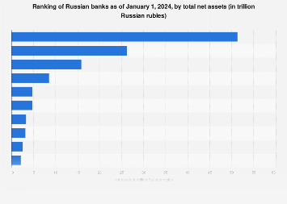

## Table of Contents

## What are the criteria used to determine the largest banks in Russia?

The largest banks in Russia are determined by looking at a few key things. One main thing is the total amount of money the bank has. This includes money from customers and money the bank has invested. Another important thing is how much money the bank makes in a year. Banks that make more money are usually considered bigger. Also, the number of branches and how many people use the bank's services can show how big a bank is.

Another way to figure out the size of a bank is by looking at its assets. Assets are things like loans the bank has given out, property the bank owns, and other investments. Bigger banks usually have more assets. The Central Bank of Russia also keeps track of these things and can help decide which banks are the largest. By combining all these factors, people can get a good idea of which banks are the biggest in Russia.

## Which bank in Russia has the highest total assets?

Sberbank is the bank in Russia with the highest total assets. It is very big and has a lot of money and things that it owns. Sberbank has been around for a long time and helps many people and businesses with their money needs.

People trust Sberbank because it is very stable and has a lot of branches all over Russia. It also makes a lot of money each year. Because of all these things, Sberbank is known as the biggest bank in Russia when you look at how much it has.

## How does the number of branches influence a bank's ranking among the largest in Russia?

The number of branches a bank has can show how big it is in Russia. More branches mean the bank can reach more people and help them with their money needs. Banks with lots of branches are often seen as bigger because they can be found in many places across the country. This makes it easier for people to use their services, which can make the bank more popular and increase its total business.

Having many branches also shows that a bank has a lot of money to spend on opening and running these locations. It takes a lot of money to have many branches, so banks with more branches usually have more money and assets. This is one reason why banks like Sberbank, which has branches all over Russia, are considered among the largest. The more branches a bank has, the more likely it is to be ranked higher among the biggest banks in Russia.

## What role do state-owned banks play among the largest banks in Russia?

State-owned banks in Russia are very important among the biggest banks. They are owned by the government, which means they have a lot of support and money. One big state-owned bank is Sberbank, which is the largest bank in Russia. Because the government owns these banks, they can help the country's economy by giving loans to businesses and helping people with their money needs.

These banks are trusted because they are backed by the government. They can also follow the government's plans for the economy. This can help them grow bigger and have more branches and customers. State-owned banks like Sberbank and VTB are among the top banks in Russia because of their size, the money they have, and the important role they play in the country's financial system.

## How have recent economic sanctions affected the largest banks in Russia?

Recent economic sanctions have made things hard for the biggest banks in Russia. These sanctions mean that other countries won't do business with them as easily. This has made it harder for the banks to get money from other countries and to do business with foreign companies. Because of this, the banks have less money coming in and it's harder for them to grow.

The sanctions have also made people less trusting of these banks. When people hear about sanctions, they might worry about their money being safe. This can make them move their money to other banks or keep it at home. For big banks like Sberbank and VTB, this means they have to work harder to keep their customers happy and to find new ways to make money. Even though these banks are still big and important, the sanctions have made their job much harder.

## What are the key financial services offered by the top banks in Russia?

The top banks in Russia offer many important financial services to help people and businesses. They provide basic services like savings accounts and checking accounts where people can keep their money safe and use it to pay for things. These banks also give out loans, which can help people buy homes or cars, or help businesses grow. They have credit cards too, which let people borrow money to spend now and pay it back later.

Another big service these banks offer is helping with investments. They can help people put their money into things like stocks or bonds to try to make more money over time. The banks also help with money transfers, both inside Russia and to other countries. This is important for people who need to send money to family or pay for things abroad.

Lastly, the top banks in Russia offer services like online banking and mobile apps. This makes it easy for people to check their money, pay bills, and do other banking things from their phones or computers. They also have lots of branches where people can go to talk to someone in person if they need help with their money.

## How do the largest banks in Russia compare in terms of market share?

The biggest banks in Russia, like Sberbank and VTB, have a lot of the market share. Sberbank has the most, with around 40-45% of the market. This means that almost half of all the banking business in Russia goes through Sberbank. VTB is the second biggest, with about 15-20% of the market. These two banks together have more than half of the market, which shows how important they are in Russia's banking world.

Other big banks like Gazprombank and Alfa-Bank have smaller shares but are still important. Gazprombank has around 5-7% of the market, and Alfa-Bank has about 3-5%. These banks help a lot of people and businesses, but they don't have as much of the market as Sberbank and VTB. Even with economic sanctions making things harder, these big banks still have a strong hold on the market and play a big role in Russia's economy.

## What is the history of the largest bank in Russia?

Sberbank, the biggest bank in Russia, started a long time ago in 1841. It was first called the "Savings Bank of the Russian Empire." Its main job was to help people save money. Over the years, it grew bigger and bigger. After the Soviet Union ended in 1991, Sberbank became a state-owned bank in the new Russia. It kept growing and became very important for the country's economy.

Today, Sberbank is known all over Russia and even in other countries. It has many branches and helps millions of people and businesses with their money. Sberbank offers all kinds of services, like savings accounts, loans, and even online banking. Even though it faces challenges like economic sanctions, Sberbank is still the biggest and most trusted bank in Russia.

## How do the largest banks in Russia manage their international operations?

The biggest banks in Russia, like Sberbank and VTB, have branches in other countries to help with their international business. Sberbank has offices in places like Europe, Asia, and even some parts of Africa. They help Russian companies do business in these countries and also help people from other countries do business in Russia. VTB also has branches in many countries and works to make it easier for businesses to trade across borders. These banks use their international branches to offer services like loans, money transfers, and help with investments in different parts of the world.

Economic sanctions have made it harder for these banks to do business internationally. Because of the sanctions, some countries don't want to work with Russian banks as much. This means that Sberbank and VTB have to find new ways to keep their international business going. They might work with banks in countries that are still friendly with Russia, or they might use different ways to move money around. Even with these challenges, the biggest banks in Russia keep trying to grow their business in other countries and help their customers with their international needs.

## What are the technological innovations adopted by the largest banks in Russia?

The biggest banks in Russia, like Sberbank and VTB, use new technology to make banking easier and better for people. They have apps for phones and computers where customers can do their banking from home. These apps let people check their money, pay bills, and even get loans without going to a bank branch. Sberbank has also started using [artificial intelligence](/wiki/ai-artificial-intelligence), or AI, to help with things like answering customer questions and finding the best ways to give out loans. This makes the bank work faster and helps customers get what they need more quickly.

Another big thing these banks do is use something called blockchain. Blockchain is a special way to keep track of money and other things that makes it hard for anyone to cheat. Sberbank uses blockchain to help with international money transfers, making them safer and faster. They also use it for other things like keeping records of property and contracts. By using these new technologies, the biggest banks in Russia are trying to stay ahead and give their customers the best service possible.

## How do the largest banks in Russia contribute to the national economy?

The biggest banks in Russia, like Sberbank and VTB, help the country's economy a lot. They give loans to people and businesses so they can buy things they need or start new projects. This helps the economy grow because when people and businesses spend money, it creates jobs and makes more money move around. These banks also help the government by handling money for big projects and keeping the country's money safe. They have a lot of branches all over Russia, so they can reach many people and help them with their money needs.

Even with problems like economic sanctions, these big banks keep working to support the economy. They use new technology to make banking easier and faster, which helps more people use their services. By doing international business, they also help Russian companies sell things to other countries and bring money back to Russia. This makes the economy stronger and helps Russia do well in the world.

## What are the regulatory challenges faced by the largest banks in Russia?

The biggest banks in Russia, like Sberbank and VTB, have to follow many rules set by the government. These rules are made to keep the banks safe and make sure they treat their customers fairly. One big challenge is dealing with economic sanctions from other countries. These sanctions make it hard for the banks to do business with foreign companies and get money from other countries. The banks have to find new ways to work around these sanctions while still following the rules.

Another challenge is keeping up with new technology. The government has rules about how banks can use things like artificial intelligence and blockchain. The banks need to make sure their new technology follows these rules, which can be hard and take a lot of time. Even with these challenges, the biggest banks in Russia work hard to follow all the rules and keep helping their customers and the economy.

## References & Further Reading

[1]: Ivashkovskaya, I. V., & Stepanova, M. A. (2011). ["Resource-based view in examining competitive advantage of the leading Russian banks."](https://conf.hse.ru/pubs/share/direct/217673524) Procedia - Social and Behavioral Sciences, 25, 372-383.

[2]: Lopez de Prado, M. (2018). ["Advances in Financial Machine Learning."](https://www.amazon.com/Advances-Financial-Machine-Learning-Marcos/dp/1119482089) Wiley.

[3]: Goldstein, M. A., Kumar, P., & Graves, F. C. (2014). ["Computerized and High-Frequency Trading."](https://papers.ssrn.com/sol3/papers.cfm?abstract_id=2379842) The Review of Financial Studies, 27(6), 2267-2306.

[4]: Jansen, S. (2018). ["Machine Learning for Algorithmic Trading."](https://github.com/stefan-jansen/machine-learning-for-trading) Packt Publishing.

[5]: Shendeti, O. (2021). ["The Effect of Artificial Intelligence and Machine Learning on Banking Performance: A Bibliometric and CRISP-DM Approach."](https://tracker.specialtyfood.com/files/publication/Download_PDFS/if_youre_thinking_of_living_in_michael_leahy.pdf) The IUP Journal of Information Technology, 17(2), 7-28.