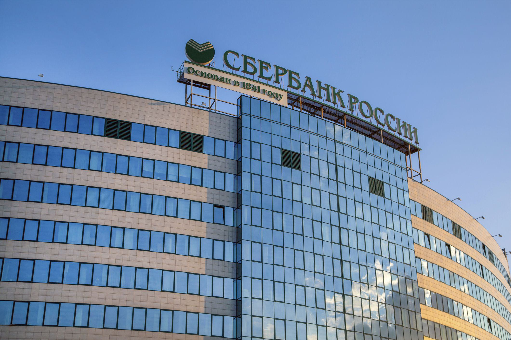

The Russian banking sector, a cornerstone of the nation's financial system, is marked by its vast network and substantial influence both domestically and internationally. As one of the world's largest economies, Russia's banking sector plays a pivotal role in global finance. The system is characterized by a mix of state-owned behemoths and a competitive field of private financial institutions. Among the key players, Sberbank, VTB Bank, and Gazprombank stand out due to their significant market shares, extensive customer bases, and strategic roles in economic development. These institutions influence not only the national economy but also wield considerable clout in regional and global finance, impacting investment flows, trade, and economic policies.

Algorithmic trading, a method leveraging complex algorithms to make transaction decisions in the financial markets, has revolutionized banking operations worldwide. It offers precision, efficiency, and the possibility of cost reductions, making it highly relevant to banks seeking to optimize their trading activities. Its application ranges from automating routine trading tasks to executing intricate portfolio strategies at speeds and scales unattainable by human traders. This technological innovation has become a crucial tool for banks, including those in Russia, enabling them to enhance their competitiveness on the global stage.

The primary aim of this article is to analyze how the largest Russian banks are embracing algorithmic trading, evaluating their strategies, technological investments, and the resulting transformation in their operational paradigms. Understanding this evolution is essential for investors and economists as it provides insights into the strategic direction of these banks, their adaptation to technological trends, and the implications for broader economic dynamics. The adoption of algorithmic trading represents a critical juncture for Russian banks, as it allows them to improve market efficiency and reinforce their positions in an increasingly digital and data-driven global economy.

This exploration provides valuable perspectives for stakeholders seeking to navigate the complexities of the Russian financial landscape. Investors, policy-makers, and economists can gain a deeper understanding of the sector's trajectory, risks, and opportunities, thereby enhancing their strategic decision-making processes. As we proceed to examine the detailed profiles and adoption strategies of Russia's largest financial institutions, this discussion sets the stage for a comprehensive analysis of the interplay between technology and banking in Russia.

## Table of Contents

## Overview of the Russian Banking Sector

The Russian banking sector is a complex and dynamic component of the country's economy, shaped by its historical evolution and current economic policies. It features a dual-tier system, consisting of state-controlled banks and privately owned financial institutions. At the apex is the Central Bank of Russia (CBR), which oversees monetary policy, regulates banking activities, and ensures financial stability. The CBR's key functions include setting reserve requirements, conducting monetary interventions, and providing liquidity to the banking system.

Economically, the Russian banking sector plays a crucial role, representing roughly 5% of the nation's GDP. It serves as the primary channel for financial intermediation, affecting the allocation of resources within the economy. Regulatory frameworks established by the CBR and other government bodies guide the operational standards and prudential limits for banks, emphasizing risk management and consumer protection. The regulatory environment has evolved in response to the need for greater transparency and stability, especially following the financial crises of the late 1990s and 2008.

When compared with global counterparts, Russian banks are distinct in their significant state ownership, with major entities like Sberbank and VTB controlled by the government. This contrasts with the private sector dominance seen in many Western economies. Moreover, the capitalization levels and profitability ratios of Russian banks typically trail behind those of larger international banks, reflecting varying degrees of market development and integration.

The sector faces several trends and challenges, including economic sanctions, geopolitical tensions, and fluctuating oil prices, which affect credit risk and loan performance. Additionally, there is a notable presence of non-performing loans (NPLs) within some institutions' portfolios, necessitating stringent risk assessment and provisioning practices. The market dynamics have been further complicated by digital advancements and customer expectations for digital financial services.

Technology and innovation play increasingly pivotal roles as banks invest in digital platforms to enhance efficiency, reduce costs, and meet consumer demands. The integration of advanced technologies such as [artificial intelligence](/wiki/ai-artificial-intelligence), blockchain, and big data analytics is transforming traditional banking models. These innovations offer new opportunities for growth and competition; however, they also require substantive investments in IT infrastructure and cybersecurity.

The Russian banking sector's journey through regulatory reforms, economic pressures, and technological advancements mirrors global shifts in banking paradigms, yet remains uniquely influenced by domestic circumstances. Understanding these elements offers insights into the sector's contributions to both national and international financial landscapes.

## Largest Banks in Russia

The Russian banking sector plays a pivotal role in the national economy, with several key institutions leading the landscape in terms of asset size and market influence. This section offers a detailed profile of Russia's largest banks, including Sberbank, VTB, Gazprombank, and Alfa-Bank, highlighting their market share, financial performance, customer services, digital offerings, and strategic goals.

### 1. Sberbank

**Profile and Market Position**: Sberbank, Russia's largest bank, holds a dominant position in the national banking sector with significant influence over the market. As of 2022, Sberbank controlled over a third of all banking assets in Russia, making it a central figure in the financial landscape.

**Financial Performance**: Sberbank consistently achieves strong financial results, with substantial profits driven by a diverse range of financial services including retail banking, corporate banking, and investment services. Its robust balance sheet and high levels of liquidity contribute to its financial stability.

**Customer Services and Digital Offerings**: Sberbank has been at the forefront of digital transformation in the Russian banking sector. It offers a comprehensive suite of online banking services and has invested heavily in developing digital platforms to enhance customer experience. The introduction of the Sberbank Online platform exemplifies its commitment to digital innovation.

**Strategic Goals**: Sberbank's strategic objectives focus on maintaining its leadership position through continuous innovation and expansion into new markets, particularly in fintech and digital banking solutions. The bank emphasizes improving operational efficiency and customer satisfaction.

### 2. VTB Bank

**Profile and Market Position**: VTB Bank is the second-largest financial institution in Russia, with a significant share in both corporate and retail banking sectors. It plays a critical role in supporting the Russian economy through financing major infrastructure and industrial projects.

**Financial Performance**: VTB has shown resilience in its financial results, supported by diverse revenue streams and a strong focus on risk management. The bank's performance is bolstered by its extensive network and strategic investments in technology and infrastructure.

**Customer Services and Digital Offerings**: VTB has prioritized the enhancement of customer services through digital channels, launching the VTB Online platform that offers seamless integration of banking services across devices. The focus on digital capabilities reflects an ongoing shift towards modernization.

**Strategic Goals**: VTB aims to expand its market presence by fostering innovation in digital banking services, enhancing customer-centric products, and reinforcing its role in the corporate banking domain. The bank also seeks to increase its international footprint and strengthen its position in key overseas markets.

### 3. Gazprombank

**Profile and Market Position**: Gazprombank, ranked among the top three banks in Russia, primarily services the oil and gas sector but also provides comprehensive retail and corporate banking services. Its close ties to the energy industry provide a stable foundation for growth.

**Financial Performance**: The bank reports solid financial metrics, underpinned by its strategic partnerships and investments in energy and infrastructure sectors. Gazprombank's performance is augmented by its strong asset base and capital adequacy.

**Customer Services and Digital Offerings**: Gazprombank has been enhancing its digital banking offerings, focusing on improving user experience and streamlining service delivery through technology. The bank is investing in cybersecurity and IT infrastructure to support its digital evolution.

**Strategic Goals**: The strategic direction of Gazprombank involves augmenting its investment banking capabilities, expanding its portfolio in non-banking financial services, and advancing digitalization initiatives to improve operational efficiency and customer engagement.

### 4. Alfa-Bank

**Profile and Market Position**: Alfa-Bank is the largest private bank in Russia, known for its innovation and strong presence in both the retail and corporate banking sectors. Its competitive edge is attributed to its agile management and customer-centric approach.

**Financial Performance**: Alfa-Bank's financial strength is reflected in its consistent performance and ability to adapt to market changes. The bank maintains a robust credit rating and demonstrates solid growth in its asset base and customer deposits.

**Customer Services and Digital Offerings**: Renowned for its digital innovation, Alfa-Bank offers a range of cutting-edge mobile and online banking services. It leverages technology to provide personalized banking solutions and enhance customer convenience.

**Strategic Goals**: Alfa-Bank's strategy emphasizes scaling its digital platforms, expanding into new financial products, and increasing its market share in retail banking. The bank's focus on technological development and customer experience is central to its growth strategy.

These banks collectively shape the Russian banking sector, each with distinct strategies driving their operations. Their adoption of digital technologies and focus on customer service highlight the ongoing transformation in the sector, positioning these institutions for future growth amidst a dynamic economic landscape.

## The Rise of Algorithmic Trading in Russia

Algorithmic trading, defined as the use of computer algorithms to automate trading decisions, has significantly transformed financial markets globally. In essence, these algorithms analyze market data, identify trading opportunities, and execute orders at speeds and frequencies impossible for human traders. Typically, these algorithms are based on complex mathematical models and statistical analysis to identify patterns and trends within the financial markets.

In Russia, the adoption of [algorithmic trading](/wiki/algorithmic-trading) has been on the rise, paralleling global trends as major Russian banks and trading firms seek greater efficiency and competitive advantage. The growth of algorithmic trading in Russia's banking landscape reflects a broader shift towards automation and digitalization, driven by the need to enhance market operations and reduce costs. In recent years, algorithmic trading has gained traction because of increasing access to advanced technologies and a growing pool of skilled professionals in quantitative analysis and computer science.

Algorithmic trading offers several benefits to banks and financial institutions. Firstly, it enhances efficiency by executing trades at high speeds, thereby capitalizing on short-lived market opportunities. Secondly, algorithmic trading significantly reduces operational costs by minimizing the need for manual intervention and lowering the margins of human error. Thirdly, it provides greater precision in trade execution, optimizing pricing strategies and ensuring best execution practices. The precision and speed offered by algorithmic trading allow banks to improve their trading volumes and [liquidity](/wiki/liquidity-risk-premium) provision.

However, the adoption of algorithmic trading is not without its challenges and risks in Russia. One significant risk is the potential for market disruptions due to algorithmic errors or "flash crashes," where rapid sell-offs occur due to automated strategies. Additionally, the complexity of these algorithms necessitates robust risk management frameworks to prevent systemic risks. Another challenge is the high initial investment required in technology and infrastructure, which might be a barrier for smaller institutions.

The regulatory environment surrounding algorithmic trading in Russia plays a critical role in shaping its adoption. Russian financial regulators, such as the Central Bank of Russia, have emphasized the importance of maintaining market stability and ensuring that algorithmic trading practices align with broader financial system objectives. Regulations are in place to monitor and control the use of algorithms, requiring banks to implement effective risk management systems and maintain transparency in their operations. This regulatory oversight aims to balance the benefits of algorithmic trading with the potential risks it poses to the financial markets.

Overall, the rise of algorithmic trading in Russia signals a significant evolution in the financial sector, characterized by increased efficiency and modernization. As Russian banks continue to leverage these technologies, the landscape of trading and market operations is likely to undergo further transformation.

## How Russian Banks Are Adopting Algorithmic Trading

Russian banks are increasingly adopting algorithmic trading to enhance their operations and maintain competitiveness in the global financial market. Leading banks in the nation, such as Sberbank, VTB, and Gazprombank, are employing various strategies to integrate algorithmic trading into their systems effectively.

**Case Studies of Prominent Russian Banks and Their Algo Trading Strategies**

Sberbank, as Russia's largest bank, has been at the forefront of technological innovation. The bank has invested substantial resources in technology and research and development (R&D) to enhance its trading algorithms. Sberbank utilizes advanced data analytics to develop predictive models that optimize trading decisions. This approach allows the bank to execute trades with greater efficiency and precision, thereby improving its market position.

VTB, another major player in the Russian banking sector, has focused on expanding its algorithmic trading capabilities through strategic partnerships with fintech companies. By collaborating with technology providers, VTB enhances its infrastructure and gains access to cutting-edge trading solutions. These partnerships enable VTB to implement sophisticated trading algorithms that can process large volumes of data at high speeds.

Gazprombank has also taken significant steps towards integrating algorithmic trading into its operations. The bank focuses on developing proprietary algorithms tailored to its specific trading needs. This strategy involves substantial investment in R&D and collaboration with academic institutions to access the latest advancements in algorithmic trading research.

**Investment in Technology and R&D**

Russian banks recognize the critical importance of investing in technology and R&D to sustain algorithmic trading activities. They allocate a significant portion of their budgets towards upgrading technology infrastructure, hiring skilled personnel, and conducting research to develop innovative trading algorithms. This investment not only boosts trading efficiency but also reduces operational costs by automating complex trading processes.

**Partnerships with Fintech Companies and Other Stakeholders**

Collaboration with fintech companies is a common strategy adopted by Russian banks to enhance their algorithmic trading capabilities. By partnering with these innovative firms, banks gain access to new technologies, insights, and technical expertise. These partnerships often result in the development of customized trading solutions that leverage [machine learning](/wiki/machine-learning) and artificial intelligence to improve trade execution and risk management.

**Impact on Trading Volumes and Market Efficiency**

The adoption of algorithmic trading by Russian banks has led to a notable increase in trading volumes and market efficiency. Algorithmic trading enables banks to process vast amounts of data and execute trades at an extremely rapid pace, leading to higher trading volumes. Moreover, the precision of algorithmic trading reduces transaction costs and minimizes the impact of human error, thereby enhancing market efficiency.

**Future Outlook for Algo Trading within These Institutions**

The future outlook for algorithmic trading within Russian banks is promising. As these institutions continue to invest in technology and forge strategic partnerships, they are likely to further refine their trading strategies and expand their market presence. Emerging technologies like quantum computing and blockchain could play a pivotal role in shaping the next generation of trading algorithms. Russian banks are expected to adopt these technologies to gain a competitive edge and to adapt to the evolving market dynamics.

In conclusion, Russian banks are actively integrating algorithmic trading into their operations to improve trading efficiency, reduce costs, and enhance market competitiveness. Through technological investment, strategic partnerships, and R&D, these banks are well-positioned to capitalize on the opportunities presented by algorithmic trading, both domestically and globally.

## The Impact of Algorithmic Trading on the Russian Economy

Algorithmic trading has notably transformed the operational dynamics of the Russian financial markets, largely facilitating enhanced market liquidity and improved reaction times. This integration of technology enables the execution of high-frequency trading ([HFT](/wiki/high-frequency-trading-strategies)), which contributes to the robustness and fluidity of financial transactions. By automatically executing orders based on predefined criteria, algorithmic trading ensures that large volumes of transactions are processed rapidly without significant human intervention, thus increasing liquidity. This is crucial, as increased liquidity minimizes the cost of trading and narrows bid-ask spreads, making markets more efficient.

The modernization of the Russian financial landscape is significantly driven by the adoption of algorithmic trading. As these advanced trading strategies become more prevalent, they catalyze the shift towards more sophisticated financial infrastructure. This modernization not only attracts foreign investors by offering competitive transaction environments but also aligns Russian markets with global trading standards.

The long-term economic benefits of algorithmic trading include increased market competitiveness and enhanced price discovery mechanisms. However, the potential challenges cannot be overlooked. The rapid execution of trades can exacerbate market [volatility](/wiki/volatility-trading-strategies), particularly in instances of erroneous algorithms or flash crashes, where prices plummet within seconds due to automated trading mechanisms. Regulatory bodies are tasked with ensuring that these trading activities do not destabilize the broader financial system, necessitating a balanced approach to oversight and innovation.

From a labor market perspective, the increase in algorithmic trading reshapes employment landscapes within the finance sector. While there is a marked decline in traditional trading roles, there is a heightened demand for professionals skilled in coding, data science, and quantitative analysis. The banking sector particularly seeks expertise in developing and maintaining sophisticated trading algorithms, thereby shifting the demand towards tech-savvy professionals.

Globally, Russian banks' integration of algorithmic trading technology underscores their influence on international financial markets. Russian institutions, through these technological advancements, not only contribute to a diversified global trading environment but also position themselves as formidable players capable of setting trends in automated trading practices. This influence is testament to the shifting paradigms in financial markets, where technological prowess is becoming as important as financial acumen.

## Conclusion

The Russian banking sector plays a critical role in the global financial landscape, with its largest institutions such as Sberbank, VTB, and Gazprombank, among others, making substantial impacts through their sheer asset size and strategic initiatives. A key development within this sector is the growing adoption of algorithmic trading, which has been pivotal in enhancing operational efficiency, cutting costs, and increasing market precision. These advancements reflect not only a commitment to technological integration but also an alignment with international financial practices, thereby solidifying the global relevance of Russian banks.

Looking forward, the trajectory of algorithmic trading within Russia’s banking sphere suggests several future developments. With continuous investments in technology and research, these banks are likely to further refine their trading strategies and enhance market participation. This evolution is expected to propel the modernization of financial services in Russia, opening avenues for innovation in other areas such as risk management and consumer banking solutions. Additionally, potential challenges related to regulatory frameworks and market volatility must be addressed to ensure sustainable growth.

Emerging trends such as increased collaboration with fintech companies and the exploration of artificial intelligence and machine learning in trading algorithms highlight a future that is both dynamic and complex. Russian banks are urged to adopt a proactive economic model that embraces these technological advancements while anticipating shifts in market structures. 

For stakeholders across the sector, including investors, economists, and policymakers, staying informed about these changes is crucial. Understanding how these shifts impact Russian and global markets will enable strategic decision-making and competitive advantage. As algorithmic trading continues to shape the financial landscapes, preparedness and adaptability become indispensable for navigating the evolving dynamics of the banking system in Russia and beyond. Stakeholders who prioritize these efforts will likely benefit from the opportunities presented by this transformative period.

## References & Further Reading

[1]: Ivashkovskaya, I. V., & Stepanova, M. A. (2011). ["Resource-based view in examining competitive advantage of the leading Russian banks."](https://conf.hse.ru/pubs/share/direct/217673524) Procedia - Social and Behavioral Sciences, 25, 372-383.

[2]: Lopez de Prado, M. (2018). ["Advances in Financial Machine Learning."](https://www.amazon.com/Advances-Financial-Machine-Learning-Marcos/dp/1119482089) Wiley.

[3]: Goldstein, M. A., Kumar, P., & Graves, F. C. (2014). ["Computerized and High-Frequency Trading."](https://papers.ssrn.com/sol3/papers.cfm?abstract_id=2379842) The Review of Financial Studies, 27(6), 2267-2306.

[4]: Jansen, S. (2018). ["Machine Learning for Algorithmic Trading."](https://github.com/stefan-jansen/machine-learning-for-trading) Packt Publishing.

[5]: Shendeti, O. (2021). ["The Effect of Artificial Intelligence and Machine Learning on Banking Performance: A Bibliometric and CRISP-DM Approach."](https://tracker.specialtyfood.com/files/publication/Download_PDFS/if_youre_thinking_of_living_in_michael_leahy.pdf) The IUP Journal of Information Technology, 17(2), 7-28.