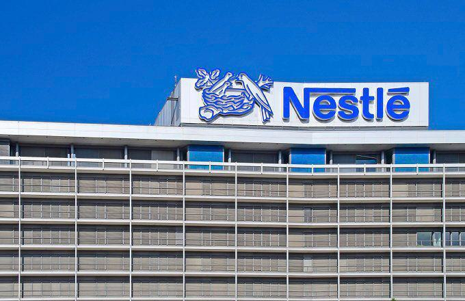

The beverage industry is a dynamic and expansive sector that encompasses a diverse range of products, from alcoholic drinks such as craft beers and wines to non-alcoholic beverages like globally recognized soft drinks, fruit juices, and bottled water. This industry plays a crucial role in the global economy, contributing substantial revenue and generating employment across various regions. Key players within this industry, such as Coca-Cola, PepsiCo, and Anheuser-Busch InBev, have established themselves as dominant forces due to their extensive product portfolios and significant market penetration.

With continuous innovation in flavor, packaging, and distribution, the beverage industry is marked by an ever-evolving competitive landscape. Companies invest heavily in marketing strategies to capture consumer attention, frequently leveraging digital platforms and data analytics to fine-tune their approaches. These strategies are crucial not only for maintaining and enhancing brand visibility but also for expanding market share in an increasingly health-conscious environment where trends shift towards sustainable and healthy beverage options.



The influence of technology on the beverage industry extends beyond production and marketing. The financial dynamics of the industry are increasingly shaped by algorithmic trading, a method that uses complex algorithms and high-frequency trading to execute trades at rapid speeds. This approach allows investors and companies to handle large volumes of trade efficiently, minimizing market impact and optimizing financial performance. Understanding these algorithm-driven processes is essential for stakeholders who navigate the financial aspects of the beverage market.

In this article, we will explore the major companies that dominate the beverage industry, examine their market strategies, and discuss the transformative role of algorithmic trading. This exploration will provide insights into how the industry adapts to shifting market demands and the technological advancements that influence its financial landscape.

## Table of Contents

## Overview of the Beverage Industry

The beverage industry is experiencing substantial growth, with projections indicating that revenues could reach $380.4 billion by 2029. This growth can be attributed to several factors, including increasing global population, urbanization, and rising consumer disposable incomes, which have expanded the consumption base for both alcoholic and non-alcoholic beverages. The industry is characterized by a diverse array of products, from bottled water and carbonated drinks to artisanal spirits and craft beers. 

Despite economic fluctuations, companies within the beverage sector have demonstrated remarkable resilience. This stability is largely due to the sector's classification as part of the consumer staples industry, which encompasses essential goods that consumers purchase regularly, regardless of economic conditions. Drink products are deeply integrated into daily life, with many being considered indispensable.

In terms of market behavior, the beverage industry is supported by its strong positioning within the consumer staples sector. This sector is known for its predictable demand patterns, as products such as soft drinks, bottled water, and basic alcoholic beverages are regarded as essential by many consumers. The consistent demand for these products ensures that companies in the beverage industry can maintain steady cash flow and mitigate the effects of economic downturns more effectively than industries reliant on discretionary spending.

Additionally, the growth trajectory of the beverage industry is bolstered by ongoing innovation and the development of new product lines that cater to emerging consumer trends, such as health and wellness, sustainability, and premiumization. As a result, companies are investing in new formulations that align with consumer preferences for healthier and more environmentally friendly options. This adaptability not only secures existing market shares but also opens new segments for expansion.

In summary, the beverage industry's robust growth forecast and stability in the face of economic challenges highlight its significance within the global consumer staples landscape. Through continued product innovation and market expansion, the industry is well-positioned to sustain its growth trajectory moving towards 2029.

## Top Beverage Companies

PepsiCo, Anheuser-Busch InBev, and Coca-Cola stand as titans in the beverage sector, underpinned by extensive portfolios and formidable global outreach. These corporations command significant market shares, driven by a diverse array of products. PepsiCo's offerings span soft drinks, snack foods, bottled water, and sports drinks, benefiting from iconic brands like Pepsi, Mountain Dew, and Gatorade. Coca-Cola, synonymous with its flagship cola, also offers an array of beverages including juices, enhanced waters, and coffee, with brands such as Sprite, Fanta, and Minute Maid contributing to its impressive market presence. Anheuser-Busch InBev dominates the alcoholic beverage market with its expansive selection of beers and alcoholic drinks, commanding brands like Budweiser, Corona, and Stella Artois.

A pivotal [factor](/wiki/factor-investing) in the success of these companies is their robust brand portfolios, which establish immediate consumer recognition and trust. For example, Coca-Cola's brand valuation remains one of the highest in the world, often cited as a benchmark for marketing excellence. Similarly, PepsiCo's diversification into snacks with Frito-Lay and other subsidiaries ensures steady revenue streams across various consumer segments.

Furthermore, their global distribution networks are intricately designed to maximize penetration and availability. Coca-Cola, for instance, has perfected a "market-served" bottling system, enabling local bottling partners to efficiently cater to regional demands while maintaining the brand’s consistency and quality. PepsiCo and Anheuser-Busch InBev utilize advanced supply chain logistics, leveraging technology and analytics to optimize distribution. This global reach not only ensures product availability but also facilitates rapid adaptation to local market trends and consumer preferences.

In conclusion, the success of PepsiCo, Anheuser-Busch InBev, and Coca-Cola is attributed to their expansive product ranges, strong brand loyalty, and sophisticated distribution strategies, making them dominant players in the global beverage industry.

## Market Dynamics and Trends

The beverage industry is witnessing a marked shift towards non-alcoholic options, which are projected to outpace the growth of their alcoholic counterparts. This trend aligns with increasing consumer interest in health and wellness, as well as evolving lifestyle choices. The non-alcoholic beverage market is thus becoming a focal point for many companies seeking to expand their product offerings and capture new consumer bases.

A significant contributor to this trend is the rise of Ready-to-Drink (RTD) beverages, particularly coffee and tea. RTD options offer convenience and cater to modern, fast-paced lifestyles, prompting a surge in their popularity. These beverages require minimal preparation and are often perceived as healthier alternatives to traditional soft drinks, catering to health-conscious consumers.

Furthermore, sustainability and health consciousness are emerging as pivotal drivers of innovation within the beverage industry. Consumers are increasingly demanding products that not only offer health benefits but are also produced sustainably. This has resulted in companies exploring recyclable packaging, reducing carbon footprints, and utilizing natural ingredients. The shift towards plant-based and organic beverages is a testament to this commitment, as manufacturers seek to appeal to eco-conscious consumers.

In summary, the emphasis on non-alcoholic beverages, coupled with an increased demand for convenience and sustainability, is shaping the future landscape of the beverage industry. These dynamics suggest a continued evolution in consumer preferences, with companies investing in innovative solutions to meet these changing demands.

## Algorithmic Trading in the Beverage Industry

Algorithmic trading is increasingly shaping the financial landscape of the beverage industry. By enabling the execution of large trade volumes swiftly and efficiently, it offers significant advantages to companies and investors alike. This trading approach utilizes computer algorithms to analyze vast datasets, identifying patterns and executing trades at optimal times to maximize gains or minimize losses.

The core advantage of [algorithmic trading](/wiki/algorithmic-trading) lies in its ability to process information at speeds unattainable by human traders. Financial markets today operate on a global scale, involving millions of transactions every second. Algorithms, equipped with [machine learning](/wiki/machine-learning) models and predictive analytics, scan these transactions and macroeconomic indicators to make informed decisions. This capability is particularly crucial in the beverage industry, which, as part of the consumer staples sector, experiences consistent demand and relatively stable stock prices.

For successful algorithmic trading, understanding market patterns is essential. This involves analyzing historical price data, trading volumes, and market sentiment. Statistical models, such as moving averages and mean reversion, are often employed to predict market movements. For instance, the moving average crossover strategy is a popular method wherein trades are executed when a shorter-term moving average crosses a longer-term moving average, indicating bullish or bearish trends.

Algorithmic trading also heavily relies on data analytics. Large datasets are parsed to identify repeating patterns and anomalies. Companies may deploy proprietary algorithms tailored to their specific stock profiles and market objectives. Here's a simple example in Python to calculate a moving average, which is a fundamental component of many trading algorithms:

```python
import pandas as pd

# Sample stock price data
data = {'Date': ['2023-10-01', '2023-10-02', '2023-10-03', '2023-10-04', '2023-10-05'],
        'Price': [150.0, 152.5, 149.5, 151.0, 153.0]}
df = pd.DataFrame(data)

# Calculate the moving average
df['Moving_Average'] = df['Price'].rolling(window=3).mean()

print(df)
```

This code calculates a three-day moving average of stock prices, providing insight into the market's short-term trend.

Overall, algorithmic trading represents a significant shift in how financial transactions are conducted within the beverage industry. As technology advances, its influence is expected to grow, ensuring efficient market operations and the rapid adaptation to evolving trade environments.

## Case Study: PepsiCo

PepsiCo is a prominent player in the beverage industry, boasting a diverse array of product lines that have cemented its position as a market leader. Notable brands such as Pepsi, Frito-Lay, Gatorade, and Aquafina illustrate the company's extensive portfolio, which spans both beverages and snacks. This diversification strategy not only caters to varied consumer preferences but also mitigates risks associated with dependency on a single product category.

Innovative marketing strategies have been a cornerstone of PepsiCo's success. The company leverages global advertising campaigns and strategic partnerships to enhance brand visibility and loyalty. For instance, collaborations with popular sports teams and events have effectively promoted Gatorade as the quintessential sports drink. By aligning with health and wellness trends, PepsiCo has also introduced low-calorie and zero-sugar variants of its beverages, appealing to increasingly health-conscious consumers.

In technology and analytics, PepsiCo has adopted advanced tools to optimize its market operations. The use of data analytics facilitates a comprehensive understanding of consumer behavior, allowing for targeted marketing efforts and efficient inventory management. Moreover, PepsiCo's foray into algorithmic trading exemplifies its forward-thinking approach in financial market operations. Algorithmic trading employs complex mathematical models to execute trades at speeds and frequencies beyond human capability, thus enhancing [liquidity](/wiki/liquidity-risk-premium) and reducing transaction costs.

For example, PepsiCo might use algorithms to analyze historical price data and execute trades automatically when certain market conditions are met. This could involve a simple moving average (SMA) strategy, where buy or sell signals are generated based on the crossing of price averages:

```python
# Example Python code for a simple moving average strategy
import pandas as pd

def moving_average_strategy(prices, short_window=40, long_window=100):
    signals = pd.DataFrame(index=prices.index)
    signals['price'] = prices
    signals['short_mavg'] = prices.rolling(window=short_window, min_periods=1).mean()
    signals['long_mavg'] = prices.rolling(window=long_window, min_periods=1).mean()
    signals['signal'] = 0
    signals['signal'][short_window:] =\
        np.where(signals['short_mavg'][short_window:] > signals['long_mavg'][short_window:], 1.0, 0.0)
    signals['positions'] = signals['signal'].diff()
    return signals

# Assume 'price_data' is a pandas Series of historical prices
# signals = moving_average_strategy(price_data)
```

Through such technological advancements, PepsiCo not only streamlines its financial strategies but also enhances overall operational efficiency. By continually adapting its product offerings and investing in technology, PepsiCo ensures its sustained growth and competitiveness within the fast-evolving beverage industry.

## Conclusion

The beverage industry is witnessing robust growth, primarily fueled by major corporations such as PepsiCo, Anheuser-Busch InBev, and Coca-Cola. These companies leverage their extensive product range and global market reach to meet the evolving demands of consumers. A notable trend is the shift towards healthier, non-alcoholic options, as well as the surge in Ready-to-Drink (RTD) beverages, which cater to contemporary convenience and health-focused lifestyles.

The influence of algorithmic trading is increasingly prominent in shaping the financial dynamics of the beverage sector. By employing complex algorithms to analyze market data and execute trades, companies and investors enhance their trading efficiency and decision-making processes. This technological advancement enables swifter adaptation to market changes and improved investment strategies.

Innovation remains a cornerstone for sustained growth in the beverage industry. Companies are increasingly focusing on sustainable practices and health-oriented products in response to consumer preferences. This includes adopting environmentally friendly manufacturing processes and developing beverages with functional health benefits. By aligning product development with emerging market trends, the industry is well-positioned for continued expansion.

Overall, the synergy of strong market players, smart trading methodologies, and a proactive approach to consumer trends underpin the enduring success and growth potential of the beverage industry.

## References & Further Reading

[1]: Bergstra, J., Bardenet, R., Bengio, Y., & Kégl, B. (2011). ["Algorithms for Hyper-Parameter Optimization."](https://dl.acm.org/doi/10.5555/2986459.2986743) Advances in Neural Information Processing Systems 24.

[2]: ["Advances in Financial Machine Learning"](https://www.amazon.com/Advances-Financial-Machine-Learning-Marcos/dp/1119482089) by Marcos Lopez de Prado

[3]: ["Evidence-Based Technical Analysis: Applying the Scientific Method and Statistical Inference to Trading Signals"](https://www.amazon.com/Evidence-Based-Technical-Analysis-Scientific-Statistical/dp/0470008741) by David Aronson

[4]: ["Machine Learning for Algorithmic Trading"](https://github.com/stefan-jansen/machine-learning-for-trading) by Stefan Jansen

[5]: ["Quantitative Trading: How to Build Your Own Algorithmic Trading Business"](https://www.amazon.com/Quantitative-Trading-Build-Algorithmic-Business/dp/1119800064) by Ernest P. Chan