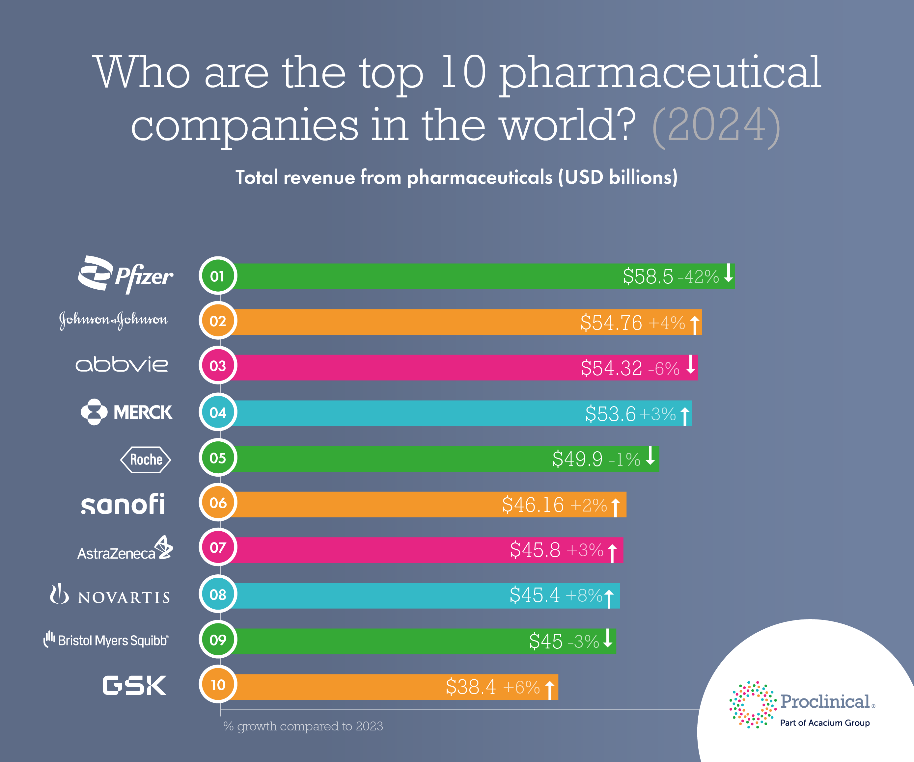

## Table of Contents

## What is biotechnology?

Biotechnology is a field that uses living things to make products or solve problems. It combines biology with technology to create new ways to improve our lives. For example, biotechnology helps farmers grow better crops and helps doctors treat diseases.

One common use of biotechnology is in making medicine. Scientists use biotechnology to create drugs that can fight diseases like cancer or diabetes. They do this by changing the genes of cells to make them produce helpful substances. This has led to many new treatments that save lives.

Biotechnology also helps the environment. It can be used to clean up pollution by using special bacteria that eat harmful chemicals. This is called bioremediation. Biotechnology is a powerful tool that keeps finding new ways to help us live better and healthier lives.

## What qualifies a company as a biotechnology company?

A company is considered a biotechnology company if it uses living things or their parts to make products or solve problems. This can include using cells, genes, or even whole organisms to create new medicines, improve crops, or clean up the environment. For example, a company that develops new drugs by changing the genes of cells to fight diseases like cancer or diabetes would be a biotechnology company.

These companies often work in areas like healthcare, agriculture, and environmental science. In healthcare, they might develop new treatments or vaccines. In agriculture, they might create genetically modified crops that can grow better in tough conditions. And in environmental science, they might use special bacteria to clean up oil spills or other pollution. So, a company is a biotechnology company if its main work involves using biology and technology together to make useful products or solutions.

## How are biotechnology companies ranked by size?

Biotechnology companies are ranked by size mainly by looking at how much money they make and how many people work for them. The amount of money a company makes is called its revenue. If a company has a lot of revenue, it is usually considered bigger. The number of employees is also important. A company with more employees is often seen as larger because it can do more work and handle more projects.

Another way to rank biotechnology companies by size is by looking at their market value. This is how much the company would be worth if someone wanted to buy it. A company with a high market value is seen as bigger and more important in the industry. These different ways of measuring size help people understand which companies are leading in biotechnology and which ones are smaller but still important.

## What are the criteria for inclusion in the list of largest biotechnology companies?

To be included in the list of the largest biotechnology companies, a company needs to have a lot of money coming in, called revenue. They also need to have many employees. These two things help show how big the company is. If a company makes a lot of money and has many workers, it is more likely to be on the list of the largest biotechnology companies.

Another important thing is the company's market value. This is how much the company would be worth if someone wanted to buy it. A high market value means the company is big and important in the biotechnology world. So, to be on the list, a company needs to be big in terms of money, employees, and market value.

## Who are the top 5 largest biotechnology companies globally?

The top 5 largest biotechnology companies in the world are Amgen, Gilead Sciences, Biogen, CSL Limited, and Regeneron Pharmaceuticals. These companies are known for making a lot of money and having many employees. They also have a high market value, which means they are worth a lot if someone wanted to buy them.

Amgen is one of the biggest and makes drugs for serious diseases like cancer and heart problems. Gilead Sciences is famous for its medicines that treat HIV and hepatitis. Biogen focuses on treatments for neurological disorders like multiple sclerosis. CSL Limited, based in Australia, works on blood plasma products and vaccines. Regeneron Pharmaceuticals is known for its work on eye diseases and cancer treatments. These companies are leaders in biotechnology and help improve many people's lives with their products.

## What are the primary products or services offered by the largest biotechnology companies?

The largest biotechnology companies offer a variety of important products and services that help many people. Amgen, one of the biggest, makes drugs that treat serious diseases like cancer and heart problems. Their medicines help people live longer and healthier lives. Gilead Sciences is well-known for its treatments for HIV and hepatitis. These drugs have helped millions of people manage their conditions and live better lives. Biogen focuses on treatments for neurological disorders like multiple sclerosis. Their products help people with these conditions manage their symptoms and improve their quality of life.

CSL Limited, based in Australia, is another major player in biotechnology. They work on blood plasma products and vaccines. Their products help people who need blood transfusions and protect people from diseases. Regeneron Pharmaceuticals is known for its work on eye diseases and cancer treatments. They create medicines that help people see better and fight cancer. These companies are leaders in biotechnology because they offer products and services that make a big difference in people's lives.

## How have the largest biotechnology companies evolved over the past decade?

Over the past decade, the largest biotechnology companies have grown a lot and changed in many ways. They have made more money and hired more people. For example, Amgen has kept working on new drugs for cancer and heart problems. They have also bought other smaller companies to grow even bigger. Gilead Sciences has focused on making their HIV and hepatitis treatments even better. They have also started working on new medicines for other diseases like cancer. Biogen has made progress in treating neurological disorders like multiple sclerosis. They have also faced some challenges, like when one of their drugs did not work as well as hoped.

CSL Limited has grown by focusing on blood plasma products and vaccines. They have expanded into new countries and made their products available to more people. Regeneron Pharmaceuticals has worked on new treatments for eye diseases and cancer. They have also started working on treatments for other conditions like allergies. All these companies have used new technology to make their products better and have spent a lot of money on research to find new treatments. They have also faced challenges like competition from other companies and the need to follow strict rules about making and selling medicines.

## What are the current market trends affecting the largest biotechnology companies?

The biggest biotechnology companies are seeing some important trends in the market right now. One big trend is the focus on personalized medicine. This means making drugs that are tailored to a person's specific genes or health needs. Companies like Amgen and Regeneron are working on this because it can make treatments work better for each patient. Another trend is the use of new technology like gene editing and CRISPR. These tools let scientists change genes to fight diseases in new ways. Biogen and Gilead Sciences are using these technologies to make new treatments for things like cancer and neurological disorders.

There is also a lot of interest in treatments for rare diseases. These are diseases that not many people have, but they can be very serious. Companies like CSL Limited are trying to make drugs for these diseases because there is a big need for them. Another trend is the growing competition from smaller biotech companies. These smaller companies are coming up with new ideas and challenging the big companies. The big companies have to keep up by buying these smaller companies or working with them. All these trends are making the biotechnology market very exciting and fast-changing.

## How do the largest biotechnology companies contribute to global health?

The largest biotechnology companies help global health a lot by making new medicines and treatments. Companies like Amgen and Gilead Sciences make drugs that fight serious diseases like cancer, heart problems, HIV, and hepatitis. These medicines help people live longer and healthier lives all over the world. For example, Gilead's HIV treatments have helped millions of people manage their condition and live better lives. By making these drugs, these companies play a big role in improving health around the globe.

These companies also work on treatments for rare diseases and neurological disorders. Biogen, for instance, focuses on medicines for multiple sclerosis, which helps people with this condition manage their symptoms and improve their quality of life. CSL Limited works on blood plasma products and vaccines, which are important for people who need transfusions and for protecting people from diseases. By doing this work, the largest biotechnology companies help make sure that more people, no matter where they live, can get the treatments they need to stay healthy.

## What are the major challenges faced by the largest biotechnology companies?

The biggest biotechnology companies face many challenges. One big problem is the high cost of making new drugs. It takes a lot of money and time to do research and test new medicines. Sometimes, even after spending a lot of money, a drug does not work well enough to be sold. This can be very disappointing and costly for the companies. Another challenge is the strict rules they have to follow. Governments have many rules about how to make and sell medicines. These rules are important for keeping people safe, but they can make it hard and slow for companies to bring new treatments to the market.

Competition is another big challenge. There are many smaller biotech companies that are coming up with new ideas and trying to take business away from the big companies. To stay ahead, the big companies have to keep up with new technology and sometimes buy these smaller companies. This can be expensive and risky. Also, the big companies have to deal with problems like making sure their medicines are available to people all over the world, especially in poorer countries where people might not be able to afford them. All these challenges make it hard for the largest biotechnology companies to keep growing and helping people.

## How do mergers and acquisitions impact the rankings of biotechnology companies?

Mergers and acquisitions can change the rankings of biotechnology companies a lot. When a big company buys a smaller one, it can grow bigger. The big company gets more money coming in and more employees. This can make it move up in the list of the biggest biotechnology companies. For example, if Amgen buys a smaller company that makes new drugs, Amgen's revenue and market value can go up. This means Amgen might become even bigger and move up in the rankings.

But mergers and acquisitions can also make things harder for other companies. When a big company buys another company, it can take away business from other companies. This can make it harder for them to grow and stay in the top rankings. Also, if a company spends a lot of money on buying another company and it does not work out well, it can lose money and fall in the rankings. So, mergers and acquisitions can shake up the list of the biggest biotechnology companies in many ways.

## What future developments are anticipated in the biotechnology industry that could affect company rankings?

In the future, the biotechnology industry might see big changes that could shake up which companies are the biggest. One big change could be more use of personalized medicine. This means making drugs that fit a person's specific genes or health needs. Companies that can do this well might grow a lot and move up in the rankings. Another change could be more use of new technology like gene editing and CRISPR. These tools let scientists change genes to fight diseases in new ways. Companies that use these technologies to make new treatments could become very important and grow bigger.

Also, there might be more focus on treatments for rare diseases. These are diseases that not many people have, but they can be very serious. Companies that make drugs for these diseases could see a lot of growth because there is a big need for them. Competition from smaller biotech companies could also change things. These smaller companies are coming up with new ideas and could challenge the big companies. If the big companies buy these smaller ones or work with them, it could help them stay on top. All these changes could make the biotechnology industry very exciting and fast-changing, affecting which companies are the biggest.

## References & Further Reading

[1]: Novo Nordisk Annual Report 2022 - [Novo Nordisk](https://www.novonordisk.com/content/dam/nncorp/global/en/investors/irmaterial/annual_report/2023/novo-nordisk-annual-report-2022.pdf)

[2]: Vertex Pharmaceuticals Annual Report 2022 - [Vertex Pharmaceuticals](https://investors.vrtx.com/sec-filings/sec-filing/10-k/0000875320-22-000007)

[3]: Regeneron Pharmaceuticals Overview - [Regeneron Pharmaceuticals](https://www.regeneron.com/about/our-company)

[4]: Moderna COVID-19 Vaccine Information - [Moderna, Inc.](https://www.cdc.gov/vaccines/php/info-by-product/moderna-COVID-19-summary.html)