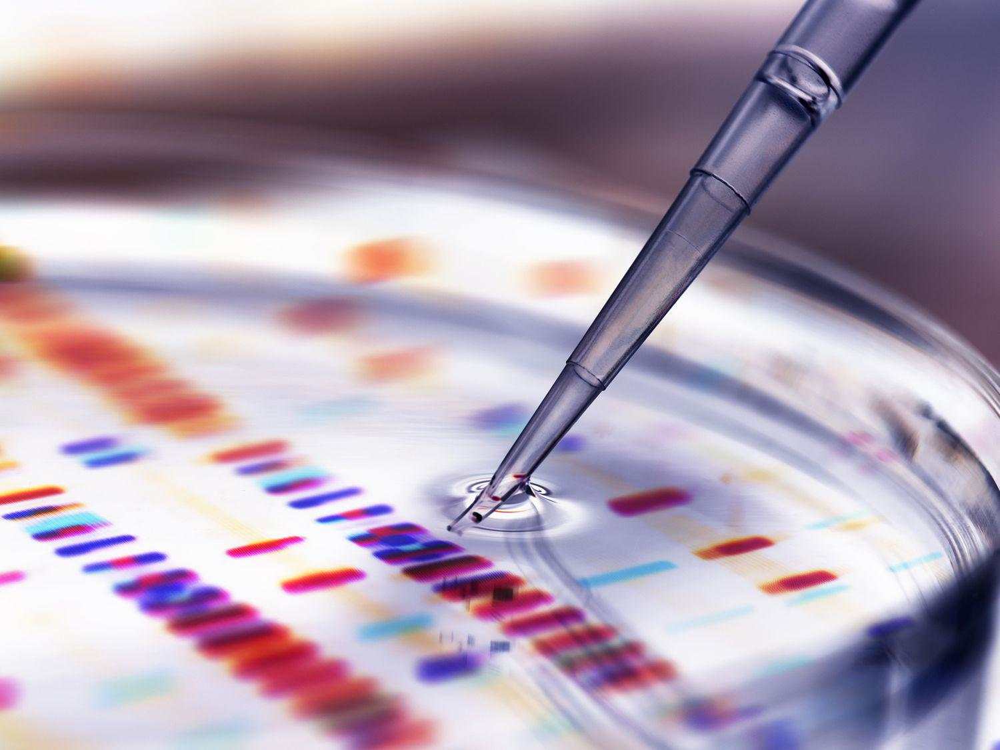

Biotechnology is a rapidly evolving field that merges the principles of biology with technological advancements to devise innovative solutions addressing a broad spectrum of challenges faced by humanity. This interdisciplinary domain integrates various scientific and engineering techniques to harness cellular and biomolecular processes. Its scope covers multiple sectors, notably pharmaceuticals, agriculture, and environmental applications. 

In pharmaceuticals, biotechnology has revolutionized drug development, enabling the creation of biopharmaceuticals, which include vaccines and therapeutic proteins derived from living organisms. These advances have played a pivotal role in developing treatments for previously untreatable diseases, including certain types of cancer and genetic disorders. In agriculture, biotech innovations such as genetically modified crops enhance food security by increasing yield, expanding resistance to pests and diseases, and improving nutritional content. These advancements are crucial for sustaining the global food supply, especially as the population continues to grow.



Biotech companies are at the forefront of these scientific advancements, using cutting-edge research to create treatments for diseases, improve food security, and aid in environmental conservation. Techniques like CRISPR-Cas9 have opened new avenues for genome editing, allowing precise alterations in the DNA of organisms. This holds promise for personalized medicine, where treatments can be tailored to individual genetic profiles, potentially leading to more effective and targeted healthcare solutions.

Economic growth and job creation within the biotechnology industry cannot be overstated. It stands as a pillar for employment opportunities across diverse specialties, ranging from research and development to manufacturing and marketing of biotech products. Moreover, the industry makes substantial contributions to healthcare advancements and environmental sustainability. For instance, industrial biotechnology develops biofuels and biodegradable plastics, providing eco-friendly alternatives to traditional resources.

This article investigates the largest biotech companies leading these advancements, assessing their impact and examining the role of algorithmic trading in biotech investments. Insights into market trends and innovations will be discussed, outlining how this dynamic industry continues to offer solutions to some of the world's most pressing challenges.

## Table of Contents

## The World’s Largest Biotech Companies

The biotechnology sector is characterized by a few dominant entities whose contributions significantly shape the industry's landscape. Novo Nordisk, based in Denmark, is a leading player known for its specialization in diabetes care and hormone replacement therapy. The company has established a strong global presence with its innovations in insulin production and related healthcare solutions, emphasizing sustainability and patient-centric approaches[^1^].

In the United States, Vertex Pharmaceuticals is recognized for its groundbreaking treatments for cystic fibrosis. Vertex employs advanced genetic research techniques to develop therapies that address the root cause of this genetic disorder, setting a precedent for innovative treatments targeting specific mutations[^2^]. Similarly, Regeneron Pharmaceuticals is noted for its focus on biotechnology-based medicinal development. With products like Eylea and Dupixent, Regeneron has made substantial contributions to the treatment of eye diseases and atopic dermatitis, among other conditions[^3^].

Moderna became a household name during the COVID-19 pandemic due to its rapid development and successful deployment of mRNA-based vaccines. This accomplishment not only highlighted Moderna’s agility and expertise in vaccine development but also showcased the potential of mRNA technology in addressing various medical challenges[^4^].

Among these industry giants, companies are frequently assessed based on revenue and market capitalization metrics, which provide insights into their operational scale and financial health. For instance, financial analyses of these companies reveal strategic investments in research and development, fostering long-term growth and competitive positioning in the market.

These leading biotech companies are pivotal in driving innovation and addressing some of the most intricate healthcare challenges globally. Their strategic focus on research, development, and market expansion underscores their sustained impact in the biotechnology sector.

[^1^]: Novo Nordisk Annual Report 2022 - [Novo Nordisk](https://www.novonordisk.com)
[^2^]: Vertex Pharmaceuticals Annual Report 2022 - [Vertex Pharmaceuticals](https://www.vrtx.com)
[^3^]: Regeneron Pharmaceuticals Overview - [Regeneron Pharmaceuticals](https://www.regeneron.com)
[^4^]: Moderna COVID-19 Vaccine Information - [Moderna, Inc.](https://www.modernatx.com)

## Biotech Industry: Sectors and Innovations

The biotechnology industry is characterized by its diverse sectors, each making distinct contributions to science and technology. These sectors include biopharmaceuticals, bio-services, bio-agriculture (bio-agri), bio-industrial, and bioinformatics.

Biopharmaceuticals are a pivotal sector, focusing on the development of drugs and vaccines derived from living organisms. This sector has seen transformative advancements with the introduction of gene therapies and CRISPR technology. Gene therapies involve the modification of genes within an individual's cells to treat or prevent disease, offering a pathway toward personalized medicine. CRISPR technology, a breakthrough in genetic editing, enables precise modifications to DNA, providing new treatments for genetic disorders.

Industrial biotechnology aims to promote environmental sustainability by developing biofuels and bioplastics. Biofuels, created from biological materials, present a renewable energy source that can reduce dependence on fossil fuels. Meanwhile, bioplastics, derived from renewable biomass sources, offer an eco-friendly alternative to conventional plastics, helping to reduce carbon footprints and mitigate pollution.

Bioinformatics is another critical sector that utilizes computational tools to manage, analyze, and interpret biological data. This field supports numerous applications, including drug discovery and genetic research, by providing powerful algorithms and software tools to handle the vast amounts of data generated in modern biological research. By leveraging data analytics and modeling, bioinformatics enhances our understanding of complex biological systems and accelerates the development of new medical therapies.

Together, these sectors underscore the biotech industry's commitment to innovation, addressing global challenges in health, agriculture, and environmental conservation through scientific and technological advancements.

## The Role of Algorithmic Trading in the Biotech Industry

Algorithmic trading is an essential component in the financial operations of the biotech industry, leveraging sophisticated computer programs to execute trades at remarkable speeds and volumes according to predefined criteria. This method offers significant advantages in handling the inherent [volatility](/wiki/volatility-trading-strategies) and complexity of biotech investments. Biotech stocks can be highly volatile due to factors such as clinical trial results, regulatory approvals, and market speculation. Algorithmic trading systems can process vast amounts of information swiftly, enabling investors to respond to market changes in real-time and make informed decisions much faster than traditional trading methods.

One of the primary benefits of [algorithmic trading](/wiki/algorithmic-trading) in this sector is its ability to optimize trade execution. By using algorithms, investors can buy or sell shares at optimal points, minimizing the market impact and reducing transaction costs. The algorithms analyze various trading variables such as price, timing, and [volume](/wiki/volume-trading-strategy) to execute orders in a way that achieves the best possible outcome for the investor. This optimization is crucial in a fast-paced market like biotech, where stock prices can fluctuate rapidly.

Algorithmic trading also offers diversification benefits by allowing for the management of complex investment portfolios. Typically, a diversified portfolio reduces risk by spreading investments across different assets or sectors. In Python, for instance, one could use libraries like `numpy` and `pandas` to calculate and optimize the Sharpe ratio, which measures the performance of an investment compared to a risk-free asset, after adjusting for its risk.

```python
import numpy as np
import pandas as pd

# Simulated return data for biotech investments
returns = pd.DataFrame({
    'Biotech_1': np.random.normal(0.01, 0.02, 1000),
    'Biotech_2': np.random.normal(0.012, 0.025, 1000),
    'Biotech_3': np.random.normal(0.015, 0.022, 1000),
})

# Risk-free rate
risk_free_rate = 0.005

# Calculating the excess returns
excess_returns = returns - risk_free_rate

# Calculating the Sharpe ratio
sharpe_ratio = excess_returns.mean() / excess_returns.std()
```

This code snippet demonstrates how biotech investors can leverage algorithmic trading to manage risk and enhance returns through portfolio diversification. By adjusting their investment strategies based on real-time analysis and execution capabilities, investors are better positioned to capitalize on new market opportunities as they arise.

Furthermore, algorithmic trading aids in the efficiency of investment strategies by providing consistent and emotionless decision-making. Human traders are often influenced by cognitive biases and emotions, which can lead to inconsistent decision-making and errors. Algorithms, however, follow prescribed logic without deviation, ensuring consistency and adherence to the intended strategy. This is particularly valuable in biotech trading, where emotional reactions to news, both positive and negative, can lead to impulsive trading decisions that algorithms can avoid.

In summary, algorithmic trading serves as a crucial tool for managing the distinctive challenges presented by biotech investments. Its ability to optimize trade execution, diversify portfolios, and maintain strategy efficiency provides investors with a robust framework to navigate the complexities of the biotech market.

## Global Biotech Markets and Future Outlook

The global biotechnology market is anticipated to witness substantial growth in the coming decade, driven primarily by technological innovations and heightened demand for healthcare solutions. This growth trajectory is fueled by advancements in areas such as genomics, bioinformatics, and personalized medicine. These innovations are transforming traditional healthcare models by enabling more precise diagnostics and targeted therapies.

The United States remains a pioneer in the biotech sector, largely due to its dense concentration of biotech clusters. Notable regions include the San Francisco Bay Area and Boston, both of which are home to a high density of biotech firms, research institutions, and venture capital activity. These clusters foster an environment conducive to research and development, enabling companies to rapidly innovate and commercialize new products.

Emerging markets, particularly China and India, are rapidly developing their biotech capabilities. China's government has heavily invested in biotechnology as part of its broader strategy for technological leadership. Initiatives such as the "Made in China 2025" plan highlight the country's ambitions to bolster its biotechnology sector. Similarly, India is making strides with supportive government policies and a burgeoning startup ecosystem focused on biotechnology. This shift not only introduces new opportunities but also intensifies competition within the global market.

Despite the promising growth outlook, the biotech industry faces several challenges. Regulatory hurdles remain a significant obstacle, as navigating the complex approval processes for new biotech products can be time-consuming and costly. Ethical considerations, particularly those related to genetic editing and data privacy, also pose challenges that stakeholders must address. Additionally, there is a growing demand for skilled talent, which is essential to support the rapid pace of innovation.

Looking ahead, the future of biotechnology holds exciting potential. Breakthroughs in personalized medicine could revolutionize healthcare by offering treatments tailored to individual genetic profiles. In agriculture, biotechnological advances may lead to more sustainable farming practices, helping to address food security concerns. Additionally, innovations in bio-manufacturing processes are expected to enable more sustainable production methods across various industries.

In conclusion, the global biotechnology market is set on a path of significant expansion and innovation. While challenges persist, the synergistic effect of advanced technologies, supportive ecosystems, and emerging markets promises to propel the industry forward, addressing some of humanity's most critical challenges in health and sustainability.

## Conclusion

The biotechnology industry has emerged as a cornerstone in efforts to advance global health, revolutionize agriculture, and ensure environmental sustainability. By harnessing cutting-edge science and technology, biotech companies have developed groundbreaking solutions that tackle some of the most significant challenges facing humanity today.

Understanding the operations and dynamics of the largest biotech companies is crucial for stakeholders. These companies drive innovation and set industry standards, influencing practices and products across various sectors. Analyzing their strategies and market presence offers valuable insights into the current state and future trajectory of biotechnology.

In recent years, algorithmic trading has burgeoned as a powerful tool within the investment landscape of the biotech sector. It allows for the swift execution of trades based on complex algorithms, providing investors with a competitive advantage. This integration of finance and technology optimizes trade executions, reduces costs, and enhances portfolio diversity, thereby playing a pivotal role in navigating the biotech market's inherent volatility and complexity.

As the biotech industry continues its rapid growth, it remains a vital contributor to solving global issues. The potential for breakthroughs in personalized medicine, sustainable agriculture, and environmental conservation highlights the industry's capacity to reshape society and improve quality of life worldwide. Through persistent innovation and strategic advancements, biotechnology stands poised to address some of the most pressing issues of our time and provide sustainable solutions for the future.

## References & Further Reading

[1]: Novo Nordisk Annual Report 2022 - [Novo Nordisk](https://www.novonordisk.com/content/dam/nncorp/global/en/investors/irmaterial/annual_report/2023/novo-nordisk-annual-report-2022.pdf)

[2]: Vertex Pharmaceuticals Annual Report 2022 - [Vertex Pharmaceuticals](https://investors.vrtx.com/sec-filings/sec-filing/10-k/0000875320-22-000007)

[3]: Regeneron Pharmaceuticals Overview - [Regeneron Pharmaceuticals](https://www.regeneron.com/about/our-company)

[4]: Moderna COVID-19 Vaccine Information - [Moderna, Inc.](https://www.cdc.gov/vaccines/php/info-by-product/moderna-COVID-19-summary.html)