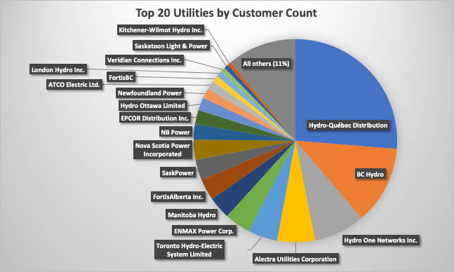

## Table of Contents

## What are the criteria for defining the largest Canadian energy companies?

The largest Canadian energy companies are usually defined by looking at their total revenue, how much they are worth in the market, and how much energy they produce. Revenue is how much money a company makes from selling energy. Market worth, or market capitalization, is the total value of all the company's shares. The amount of energy produced is also important because it shows how big the company is in terms of what it does.

Another way to define the largest energy companies is by looking at how many people they employ and their impact on the economy. Companies that have a lot of employees and contribute a lot to the economy are often seen as big players. For example, if a company helps create jobs and supports other businesses, it can be considered one of the largest. These different measures help us understand which energy companies in Canada are the biggest and most important.

## How is the size of an energy company typically measured?

The size of an energy company is usually measured by looking at its total revenue, market capitalization, and the amount of energy it produces. Revenue is the money the company makes from selling energy. Market capitalization, or market cap, is the total value of all the company's shares. It shows how much the company is worth on the stock market. The amount of energy produced is also important because it tells us how big the company is in terms of its operations.

Another way to measure the size of an energy company is by looking at the number of employees and its economic impact. A company with a lot of employees is often considered large because it supports many jobs. The economic impact is how much the company helps the economy grow. For example, if a company creates jobs and supports other businesses, it can be seen as a big player in the energy sector. These different measures help us understand which energy companies are the biggest and most important.

## Can you name the top three largest Canadian energy companies?

The largest Canadian energy company is Enbridge Inc. Enbridge is known for its pipelines that move oil and natural gas. They make a lot of money and have a big value in the stock market. They also have many employees and help the economy a lot.

The second largest is Suncor Energy Inc. Suncor is famous for making oil from oil sands. They produce a lot of energy and make a lot of money too. Their market value is very high, and they have many people working for them.

The third largest is Canadian Natural Resources Limited (CNRL). CNRL is also involved in oil and gas. They make a lot of money and have a high market value. They produce a lot of energy and have many employees, which helps the economy.

## What types of energy do these companies primarily focus on?

Enbridge Inc. mainly focuses on oil and natural gas. They have big pipelines that move these energy sources across Canada and the United States. This helps people get the energy they need for their homes and businesses.

Suncor Energy Inc. works mostly with oil from oil sands. They take the oil out of the ground and turn it into something that can be used in cars and other machines. This type of energy is important for transportation and industry.

Canadian Natural Resources Limited (CNRL) also deals with oil and natural gas. They find these resources in the ground and then sell them to be used as energy. Their work helps provide energy for many different uses, like heating homes and running factories.

## How have the rankings of these companies changed over the past decade?

Over the past decade, the rankings of the largest Canadian energy companies have shifted a bit but stayed mostly the same. Enbridge Inc. has been at the top for a long time. They have kept their position because they make a lot of money from their pipelines and have a big value in the stock market. Suncor Energy Inc. has been number two for most of the decade. They have stayed strong because they produce a lot of oil from oil sands and make good profits. Canadian Natural Resources Limited (CNRL) has been number three. They have also been consistent because they have a lot of oil and gas resources and make steady money from them.

There have been some small changes in the rankings over the years. For example, sometimes Suncor and CNRL switch places based on their yearly performance. If one company has a really good year with high profits or a big project, it might move up in the rankings. But these changes are usually small and temporary. Overall, Enbridge, Suncor, and CNRL have been the top three for most of the past decade, showing that they are strong and stable companies in the Canadian energy sector.

## What role do these companies play in Canada's economy?

Enbridge, Suncor, and CNRL are very important for Canada's economy. They create a lot of jobs for people. When these companies hire workers, it helps many families have money to spend on things they need. They also pay taxes to the government, which helps pay for things like schools and hospitals. These companies make a lot of money from selling oil and gas, which adds to Canada's wealth.

These companies also help other businesses grow. For example, when they build pipelines or oil sands projects, they need to buy things like steel and machinery. This helps other companies that make these products. They also spend money on research to find new ways to get energy, which can lead to new jobs and technology. Overall, Enbridge, Suncor, and CNRL play a big role in making Canada's economy strong and helping it grow.

## What are the major challenges faced by these energy companies?

One big challenge for Enbridge, Suncor, and CNRL is the changing rules about the environment. Many people and governments want to reduce pollution and stop using oil and gas as much. This means these companies have to follow new laws that can make it harder and more expensive to do business. They also have to find new ways to make energy that are better for the environment, which can be hard and costly.

Another challenge is the ups and downs of the oil and gas market. The prices of oil and gas can change a lot, and when they go down, these companies make less money. This can make it hard for them to plan and invest in new projects. They also face competition from other energy companies around the world, which can make it tough to stay on top.

Lastly, these companies have to deal with building and maintaining big projects like pipelines and oil sands operations. These projects can take a long time and cost a lot of money. There can be problems with local communities who might not want these projects in their area. They also need to make sure their projects are safe and do not harm the environment, which adds more challenges to their work.

## How do these companies contribute to Canada's energy exports?

Enbridge, Suncor, and CNRL play a big role in Canada's energy exports. They help send oil and gas to other countries, which makes Canada a lot of money. Enbridge has big pipelines that move oil and gas from Canada to the United States and other places. This helps Canada sell its energy to other countries and earn money from it. Suncor and CNRL also produce a lot of oil, which they sell to other countries. This helps Canada be a big player in the global energy market.

These companies also work hard to make sure the energy they export is of good quality. They use special ways to get the oil and gas ready for export, so other countries want to buy it. This helps Canada's reputation as a reliable place to get energy. By exporting a lot of oil and gas, these companies help Canada's economy grow and create jobs for people. They are very important for making sure Canada can sell its energy to the world.

## What are the environmental impacts associated with these companies' operations?

The operations of Enbridge, Suncor, and CNRL have big impacts on the environment. They make a lot of oil and gas, which can cause pollution. When they take oil out of the ground, they can harm the land and water. For example, oil sands projects can use a lot of water and leave behind waste that can be bad for the environment. Pipelines can also leak, which can spill oil and hurt animals and plants. These companies also make greenhouse gases, which can make the Earth warmer and change the weather.

These companies are trying to be better for the environment. They are working on new ways to make energy that do not harm the Earth as much. They are also trying to clean up old messes and use less water and energy in their work. But it is hard to change everything quickly, and some people still worry about the damage they cause. Overall, while these companies are important for Canada's economy, their work can have big effects on the environment that they need to keep working on.

## How do these companies invest in renewable energy sources?

Enbridge, Suncor, and CNRL are starting to put money into renewable energy sources like wind, solar, and hydro power. They know that the world wants to use less oil and gas because of climate change. So, they are trying to find new ways to make energy that are better for the environment. Enbridge, for example, has bought companies that make wind and solar power. Suncor is also looking into wind and solar energy and trying to use them more in their business.

These companies are also working on other green projects. CNRL is looking at ways to use geothermal energy, which comes from heat inside the Earth. They are also trying to find new technologies that can help make energy in cleaner ways. By investing in renewable energy, these companies want to be ready for the future and help the environment at the same time. It is a big change for them, but they know it is important to do.

## What are the future projections for these companies in terms of growth and sustainability?

In the future, Enbridge, Suncor, and CNRL are expected to keep growing but also face big challenges. They will need to make more money and find new ways to make energy. They are good at making oil and gas, so they will probably keep doing that. But they also need to grow in new areas like wind and solar power. This will help them stay important in the energy world as more people want clean energy. They will need to spend a lot of money to build new projects and find new technologies.

Sustainability is a big challenge for these companies. They need to find ways to make energy without hurting the environment as much. They are already working on this by investing in renewable energy and trying to use less water and make fewer greenhouse gases. But it will take time and a lot of effort to change their big businesses. If they can do this well, they can help Canada have a strong and green energy future. But if they do not change fast enough, they might lose customers and face more problems with the environment.

## How do government policies affect the operations and strategies of these energy companies?

Government policies have a big impact on how Enbridge, Suncor, and CNRL work and make plans. Rules about the environment make these companies change how they do things. For example, laws that want less pollution mean they have to find new ways to make energy that are cleaner. They might have to spend more money to follow these rules. Also, the government can give them money or help if they do things that are good for the environment, like building wind or solar farms. This can make them want to invest in green energy.

Government policies also affect what these companies can do with their big projects. For example, if the government says they can build a new pipeline, it helps them move more oil and make more money. But if the government says no, it can stop their plans and hurt their business. The government can also change taxes and rules about selling energy to other countries. This can make it easier or harder for these companies to make money. So, they always need to watch what the government is doing and change their plans to fit the new rules.

## References & Further Reading

[1]: Floden, T. (2020). ["Canada's Largest Oil and Gas Companies."](https://finance.yahoo.com/news/12-biggest-canadian-oil-natural-135423048.html) Investopedia.

[2]: Harding, R., & Crooks, E. (2022). ["The Changing Dynamics of the World Oil Market."](https://www.ncbi.nlm.nih.gov/pmc/articles/PMC9117001/) Financial Times.

[3]: Schwartz, R. N., & Weber, B. W. (2006). ["The Equity Trader Course: A Guide to the Art and Science of Professional Trading."](https://onlinelibrary.wiley.com/doi/book/10.1002/9781119201823) Wiley.

[4]: ["Algorithmic and High-Frequency Trading"](https://www.amazon.com/Algorithmic-High-Frequency-Trading-Mathematics-Finance/dp/1107091144) by Álvaro Cartea, Sebastian Jaimungal, and José Penalva.

[5]: ["Canadian Energy Market: An Analysis of Algorithmic Trading Trends."](https://www.linkedin.com/pulse/challenges-algorithmic-trading-short-term-energy-market-ishutin) Journal of Economic Dynamics and Control.