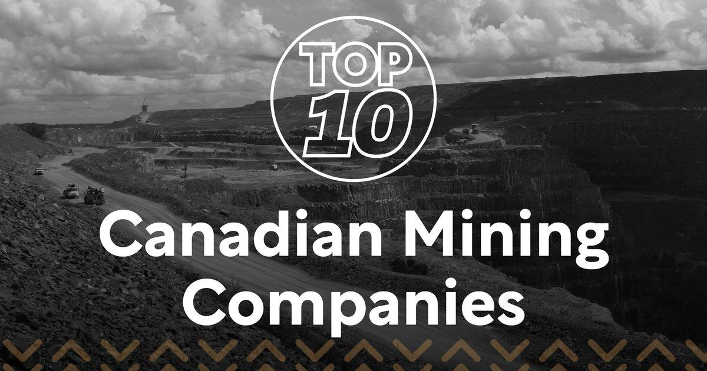

## Table of Contents

## What are the largest Canadian mining companies?

The largest Canadian mining company is Barrick Gold Corporation. It is known for mining gold and copper. Barrick Gold operates in many countries around the world. It is one of the biggest gold producers globally. The company is based in Toronto, Ontario.

Another big Canadian mining company is Teck Resources Limited. Teck mines different metals like copper, zinc, and steelmaking coal. They have operations in Canada, the United States, Chile, and Peru. Teck Resources is also headquartered in Vancouver, British Columbia.

A third major player is Agnico Eagle Mines Limited. This company focuses on gold mining. Agnico Eagle operates in Canada, Finland, and Mexico. Their main office is in Toronto, Ontario. These three companies are important parts of Canada's mining industry.

## What types of minerals do these companies primarily mine?

Barrick Gold Corporation mainly mines gold and copper. They are one of the biggest gold producers in the world. Barrick operates in many countries and their main office is in Toronto, Ontario.

Teck Resources Limited mines different metals like copper, zinc, and steelmaking coal. They have mining operations in Canada, the United States, Chile, and Peru. Teck's headquarters is in Vancouver, British Columbia.

Agnico Eagle Mines Limited focuses on gold mining. They operate mines in Canada, Finland, and Mexico. Their main office is also in Toronto, Ontario.

## Where are the main operations of these companies located?

Barrick Gold Corporation has its main office in Toronto, Ontario. They mine gold and copper in many countries around the world. Some of their big mines are in North America, South America, and Africa. They are known for being one of the biggest gold producers globally.

Teck Resources Limited is based in Vancouver, British Columbia. They mine copper, zinc, and steelmaking coal. Their operations are spread across Canada, the United States, Chile, and Peru. Teck is important for mining these metals and coal.

Agnico Eagle Mines Limited also has its main office in Toronto, Ontario. They focus on gold mining. Their mines are in Canada, Finland, and Mexico. Agnico Eagle is a key player in the gold mining industry in these countries.

## What is the history behind the largest Canadian mining companies?

Barrick Gold Corporation started in 1983. It was founded by Peter Munk and it quickly grew by buying other gold mining companies. Barrick became one of the biggest gold producers in the world. They have mines in many countries like Canada, the United States, and Africa. The company faced some challenges, but it kept growing and now it is based in Toronto, Ontario. Barrick is known for its large gold and copper mines.

Teck Resources Limited has a long history that goes back to the early 1900s. It started as Teck-Hughes Gold Mines Limited in 1913. Over the years, it changed its name and grew by merging with other companies. Teck now mines copper, zinc, and steelmaking coal. They have operations in Canada, the United States, Chile, and Peru. The company is headquartered in Vancouver, British Columbia and is important for mining these metals and coal.

Agnico Eagle Mines Limited was founded in 1957. It began as a small company looking for gold in Canada. Agnico Eagle grew by finding new gold deposits and buying other gold mines. They now operate mines in Canada, Finland, and Mexico. The company's main office is in Toronto, Ontario. Agnico Eagle is known for its focus on gold and for being a key player in the gold mining industry.

## How do these companies contribute to the Canadian economy?

Barrick Gold Corporation, Teck Resources Limited, and Agnico Eagle Mines Limited play a big role in the Canadian economy. They create many jobs for people in Canada. These jobs are not just at the mines, but also in offices and other places related to mining. The companies also pay taxes to the government, which helps fund public services like schools and hospitals. When these companies do well, they bring more money into Canada, which helps the whole economy grow.

These mining companies also help the economy by selling minerals and metals to other countries. For example, Barrick Gold and Agnico Eagle sell gold, which is used in jewelry and electronics. Teck Resources sells copper, zinc, and coal, which are important for building and making things. When other countries buy these resources from Canada, it helps the trade balance and brings in more money. This makes Canada's economy stronger and more stable.

## What are the environmental impacts of these mining operations?

Mining operations from companies like Barrick Gold, Teck Resources, and Agnico Eagle can have big effects on the environment. When they dig for minerals, they can harm the land. They take away trees and plants, which can lead to soil erosion. Mining also uses a lot of water, and sometimes the water can get polluted with chemicals used in mining. This can harm fish and other animals that live in the water. The air can also get polluted from dust and gases from mining machines.

These companies try to reduce their environmental impact. They work on cleaning up after mining is done, which is called reclamation. They plant new trees and fix the land so it can be used again. Barrick Gold, Teck Resources, and Agnico Eagle also try to use less water and find better ways to deal with waste. But, even with these efforts, mining can still cause problems for the environment. It's important for these companies to keep working on ways to mine that are kinder to the Earth.

## How do these companies manage sustainability and corporate social responsibility?

Barrick Gold, Teck Resources, and Agnico Eagle work hard to be sustainable and responsible. They know that mining can hurt the environment, so they try to do things better. They use less water and energy and try to make less waste. They also clean up the land after they finish mining, so it can be used again. These companies also care about the people who live near their mines. They talk to the communities and try to help them. They give money to schools and hospitals and create jobs for local people.

These companies also focus on being good to their workers. They make sure their workers are safe and have good places to work. They also try to be fair and honest in how they do business. They follow rules and laws and try to be open about what they do. Barrick Gold, Teck Resources, and Agnico Eagle know that being sustainable and responsible is important for their business and for the world. They keep working to do better and make less harm to the environment and the communities around them.

## What are the current market trends affecting these mining companies?

The mining industry is always changing, and Barrick Gold, Teck Resources, and Agnico Eagle feel these changes. One big trend is the price of metals like gold, copper, and zinc. When the prices go up, these companies make more money. But when the prices go down, it can be hard for them. Another trend is new technology. Mining companies are using new machines and computers to find and dig up minerals faster and with less harm to the environment. They are also using renewable energy to power their mines, which helps them be more sustainable.

Another important trend is the demand for minerals. More people around the world want things like electric cars and smartphones, which need a lot of metals. This can be good for mining companies because they can sell more of what they find. But it also means they need to find new places to mine and do it in a way that is good for the environment. Governments are also making new rules to make mining safer and better for the planet. Mining companies have to follow these rules, which can change how they work and how much it costs them.

Overall, these trends affect how much money these companies make and how they do their work. They have to keep up with changes in prices, technology, and demand. They also need to follow new rules and find ways to mine that are good for the environment and the communities around them. By doing this, they can keep growing and being successful in the mining industry.

## How do these companies compare to global mining giants?

Barrick Gold, Teck Resources, and Agnico Eagle are big in Canada, but they also compete with mining giants around the world. Barrick Gold is one of the biggest gold producers globally, but it still has to compete with companies like Newmont Corporation from the United States and AngloGold Ashanti from South Africa. These global giants have mines all over the world and they can affect the price of gold and how much Barrick Gold can sell.

Teck Resources mines copper, zinc, and coal, and it competes with companies like BHP from Australia and Glencore from Switzerland. These companies are huge and have a lot of money to spend on new mines and technology. Teck Resources has to work hard to keep up with them and find new ways to mine that are good for the environment. Agnico Eagle focuses on gold and it also faces competition from global giants like Newmont and Barrick itself. These big companies can buy smaller gold mines and grow even bigger, which makes it harder for Agnico Eagle to stay competitive. Overall, Canadian mining companies have to be smart and work hard to compete with the biggest mining companies in the world.

## What technological advancements are these companies implementing in their operations?

Barrick Gold, Teck Resources, and Agnico Eagle are using new technology to make their mining better and safer. They use big machines and computers to find minerals underground. These machines can see deep into the earth and help the companies know where to dig. They also use drones to check their mines from the sky. This helps them see problems and fix them quickly. Another important technology they use is automation. This means they use robots and computers to do some of the work that people used to do. This can make mining faster and safer for workers.

These companies are also working on being kinder to the environment. They use new ways to use less water and energy. For example, they use renewable energy like solar power to run their mines. This helps them save money and be more sustainable. They also use special machines to clean up the water they use, so it doesn't hurt the environment. By using these new technologies, Barrick Gold, Teck Resources, and Agnico Eagle can mine in a way that is good for the planet and the people who live near their mines.

## What are the future prospects and growth strategies for these companies?

Barrick Gold, Teck Resources, and Agnico Eagle are looking to grow in the future. They want to find new places to mine and use new technology to do it better. Barrick Gold is always looking for new gold and copper mines around the world. They want to keep being one of the biggest gold producers. Teck Resources wants to grow its business in copper, zinc, and coal. They are looking for new places to mine these metals and trying to sell more of what they find. Agnico Eagle is also looking for new gold mines, especially in places like Canada and Mexico. They want to keep growing and being a key player in the gold industry.

These companies also have plans to be more sustainable and responsible. They want to use less water and energy and make less waste. They are using new technology to help them do this. For example, they are using renewable energy like solar power to run their mines. They are also working with the communities around their mines to make sure they are doing things in a way that is good for everyone. By doing these things, Barrick Gold, Teck Resources, and Agnico Eagle hope to keep growing and being successful in the future.

## How do these companies navigate regulatory and geopolitical challenges?

Barrick Gold, Teck Resources, and Agnico Eagle have to deal with rules from governments where they mine. These rules can change and can make it harder for them to mine. They have to follow laws about safety, the environment, and how they treat workers. Sometimes, new rules can make mining more expensive or slow down their work. The companies work closely with governments to understand and follow these rules. They also try to be good neighbors by talking to local people and making sure they are happy with the mining.

These companies also face challenges from different countries and politics. They mine in many places around the world, and each place has its own problems. For example, if there is a war or a big change in a country's government, it can affect their mines. They have to be careful and plan for these things. They talk to governments and local leaders to make sure they can keep mining safely. They also try to help the communities around their mines by creating jobs and supporting local projects. By doing this, they hope to keep their mines running smoothly no matter what is happening around them.

## What is Algorithmic Trading in the Mining Industry?

Algorithmic trading, often referred to as algo trading, involves the use of complex algorithms to automate and enhance trading strategies in financial markets. By employing computer programs, vast amounts of market data are analyzed at high speed to identify trading opportunities, respond to market fluctuations, and make trading decisions without direct human intervention. This form of trading has gained [momentum](/wiki/momentum) across various sectors, including the mining industry, where it plays a pivotal role in optimizing stock trading and investment strategies.

In the mining sector, [algorithmic trading](/wiki/algorithmic-trading) is utilized by companies to efficiently manage their stock portfolios and hedge against market risks. By processing real-time data and historical market trends, algorithms can be programmed to execute trades that align with predefined financial objectives and market conditions. This automation enables mining firms to minimize emotional biases that often accompany human trading decisions and allows for precise, timely actions in response to market signals.

Mining companies leverage algorithmic trading by implementing models that assess stock price movements, trading volumes, and macroeconomic indicators to make informed trading decisions. Algorithms can incorporate various trading strategies, such as [trend following](/wiki/trend-following), [arbitrage](/wiki/arbitrage), and [market making](/wiki/market-making). For instance, a trend-following strategy may involve buying stocks when they are on an upward trajectory and selling them when the trend reverses, thus capitalizing on the momentum.

The advent of AI-driven trading platforms has significantly impacted the mining industry. These platforms utilize [artificial intelligence](/wiki/ai-artificial-intelligence) and [machine learning](/wiki/machine-learning) techniques to refine trading algorithms continuously. AI-enhanced systems can adapt to new data inputs, identifying patterns and anomalies that standard statistical methods might overlook. This capability facilitates more accurate forecasts of commodity price movements and market behavior, providing mining companies with a competitive edge in stock trading.

For example, a mining company might apply a machine learning model to predict the future prices of commodities it trades. Consider a simple linear regression model for predicting a mining stock price $Y$ based on historical data:

$$
Y = \beta_0 + \beta_1X_1 + \beta_2X_2 + \ldots + \beta_nX_n + \epsilon
$$

In this equation, $X_1, X_2, \ldots, X_n$ represent various independent variables such as market trends, historical prices, and economic indicators, while $\beta_0, \beta_1, \ldots, \beta_n$ are the coefficients that the model must learn. The term $\epsilon$ represents the error term. By optimizing these coefficients, the model can provide estimates of future stock prices, informing trading strategies.

AI-driven platforms also enhance risk management frameworks within the mining sector. By analyzing large volumes of data and simulating various market scenarios, these platforms assist in developing robust risk mitigation strategies, thus safeguarding investments against [volatility](/wiki/volatility-trading-strategies).

Overall, the integration of algorithmic trading and AI technologies marks a transformative phase for the mining industry. Through advanced computational techniques, mining companies can achieve greater precision in stock trading, optimize their investment strategies, and maintain a competitive position in an increasingly sophisticated financial landscape.

## References & Further Reading

[1]: Bergstra, J., Bardenet, R., Bengio, Y., & Kégl, B. (2011). ["Algorithms for Hyper-Parameter Optimization."](https://papers.nips.cc/paper/4443-algorithms-for-hyper-parameter-optimization) Advances in Neural Information Processing Systems 24.

[2]: ["Advances in Financial Machine Learning"](https://www.amazon.com/Advances-Financial-Machine-Learning-Marcos/dp/1119482089) by Marcos Lopez de Prado

[3]: ["Evidence-Based Technical Analysis: Applying the Scientific Method and Statistical Inference to Trading Signals"](https://www.amazon.com/Evidence-Based-Technical-Analysis-Scientific-Statistical/dp/0470008741) by David Aronson

[4]: ["Machine Learning for Algorithmic Trading"](https://github.com/stefan-jansen/machine-learning-for-trading) by Stefan Jansen

[5]: ["Quantitative Trading: How to Build Your Own Algorithmic Trading Business"](https://www.amazon.com/Quantitative-Trading-Build-Algorithmic-Business/dp/1119800064) by Ernest P. Chan