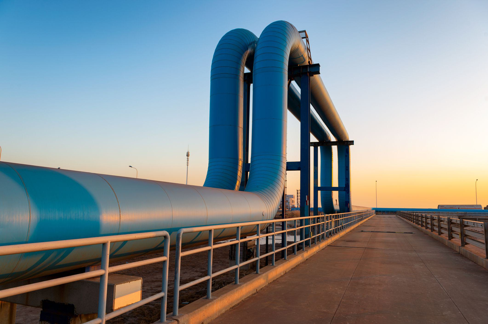

The gas industry in Canada occupies a pivotal position within both the national economy and the broader global energy framework. As the world's fourth-largest oil producer, Canada’s oil and gas sector is integral to international energy supply chains and economic systems. This sector is methodically categorized into three fundamental segments: upstream, midstream, and downstream.

The upstream segment encompasses exploration and production activities, where companies focus on locating and extracting oil and gas reserves. Midstream operations involve the transportation, storage, and wholesale marketing of crude or refined petroleum products. Lastly, downstream activities focus on refining and the distribution of finished products to consumers and various industrial end-users.



A particularly notable feature of Canada's oil reserves is the oil sands, primarily found in the province of Alberta. These deposits represent a significant share of the country's total oil resources. The extraction of oil sands necessitates sophisticated techniques and technologies due to the complexity of separating the viscous bitumen from the sand and clay mixture.

In recent years, algorithmic trading has emerged as an innovative tool within the oil and gas sector, providing enhanced strategies for investment optimization and trading efficiency. By utilizing complex algorithms, companies can analyze vast datasets to predict market trends, manage risks, and make informed trading decisions. This advancement not only improves profitability but also contributes to stabilizing market operations amidst the fluctuating economic environment. 

Overall, Canada's oil and gas industry remains a cornerstone of energy production and economic activity, with advancements in technology and trading promising further efficiency and strategic enhancement.

## Table of Contents

## Overview of the Canadian Oil and Gas Industry

Canada stands as the fourth-largest oil-producing country globally, a position underscored by its extensive oil sands resources. These oil sands, located primarily in the province of Alberta, are a significant component of Canada's oil reserves, contributing greatly to the nation's overall production capacity. The Canadian oil and gas industry operates through a structured segmentation comprising upstream, midstream, and downstream activities.

The upstream sector is pivotal, focusing on exploration and production. This segment encompasses the discovery of new oil and gas deposits and the operational processes involved in extracting them. The challenges in the upstream segment include technological demands for efficient extraction, especially in oil sands, which require advanced methods such as steam-assisted gravity drainage (SAGD) and cyclic steam stimulation (CSS).

The midstream sector involves the transportation and storage of [crude oil](/wiki/crude-oil), natural gas, and refined products. This stage is crucial in ensuring a stable and efficient supply chain from production sites to end-users. Key infrastructure such as pipelines and storage facilities play a vital role in this segment, with companies like Enbridge and TC Energy Corp being prominent players due to their extensive pipeline networks and logistical capabilities.

The downstream sector focuses on refining and marketing, where crude oil is transformed into usable products like gasoline, diesel, and jet fuel. This segment also includes the distribution and sale of these products to consumers. Suncor Energy, Cenovus Energy, and Imperial Oil are major corporations dominating this aspect of the industry, with operations extending from refining processes to retail gas stations across Canada and international markets.

Technological advancements have increasingly influenced the development and direction of the Canadian oil and gas sector. Innovations in drilling and extraction techniques have improved the efficiency and environmental sustainability of oil sands operations. Regulatory policies, particularly those concerning environmental impact and carbon emissions, further shape the industry's landscape, pushing companies towards more sustainable practices. Market demand, fluctuating global oil prices, and geopolitical factors also create dynamic conditions that impact strategic business decisions within the sector.

References:

1. Natural Resources Canada. (2020). Energy and the Economy. Retrieved from https://www.nrcan.gc.ca/
2. Canadian Association of Petroleum Producers. (n.d.). Canada's Oil Sands. Retrieved from https://www.capp.ca/oil/what-are-oil-sands/
3. Enbridge Inc. (2020). Our company. Retrieved from https://www.enbridge.com/
4. TC Energy. (2020). About TC Energy. Retrieved from https://www.tcenergy.com/

## Key Canadian Oil Companies

Canada's oil and gas industry is home to several key players that significantly contribute to the sector's economic footprint. Among the top companies by revenue are Cenovus Energy, Suncor Energy, and Imperial Oil. These corporations play vital roles across various stages of oil and gas production, including exploration, refining, and distribution.

Cenovus Energy is recognized for its substantial operations in oil sands projects, which are crucial to Canada's production capabilities. The company has invested heavily in technology to improve efficiency in oil extraction and minimize environmental impact. Cenovus has also been active in strategic mergers and acquisitions to bolster its production capacity and market position.

Suncor Energy is another prominent entity, distinguished by its integrated business model that spans the entire oil and gas value chain. Suncor is involved in every aspect from the initial exploration to the refining process and the distribution of petroleum products. The company has an extensive portfolio that includes oil sands operations, conventional and offshore oil production, and a robust network of refineries and retail outlets.

Imperial Oil, one of the oldest companies in the sector, combines a similar integrated architectural approach with a strong focus on technological innovation and sustainability. It is a significant contributor to crude oil production and has substantial refining capabilities. Imperial Oil is engaged in a variety of initiatives aimed at reducing greenhouse gas emissions and enhancing energy efficiency in its operations.

In the midstream segment, Enbridge and TC Energy Corp hold significant positions, primarily focusing on the transportation and infrastructure components of the industry. Enbridge operates the world's longest crude oil and liquids transportation system, highlighting its pivotal role in ensuring a steady supply of oil across different regions. TC Energy, meanwhile, emphasizes the development and maintenance of extensive natural gas and liquids pipelines, playing a critical part in the sector's supply chain infrastructure.

These companies continue to adapt to various challenges, including market [volatility](/wiki/volatility-trading-strategies) and regulatory pressures, while also exploring new technologies and sustainable practices to ensure their competitiveness in the global energy market. Their strategic initiatives and significant investments underline their importance to the Canadian and global oil and gas sectors.

## Challenges Facing the Canadian Oil and Gas Sector

Environmental concerns and regulatory challenges are pivotal issues affecting the production and expansion efforts of the Canadian oil and gas sector. The extraction and processing of oil sands, which are abundant in Canada, present significant environmental challenges due to greenhouse gas emissions, water usage, and land disturbance. As a result, regulatory agencies have implemented stringent environmental assessments and operational guidelines, potentially slowing down project approvals and increasing compliance costs for companies. 

Market volatility and fluctuating oil prices present further financial risks. The oil and gas sector is inherently tied to global oil prices, which can be influenced by geopolitical tensions, changes in production levels by major oil-exporting countries, and shifts in global demand patterns. This volatility can lead to uncertain revenue streams for Canadian oil and gas companies, impacting their investment strategies and operational planning.

Additionally, the high cost of oil sands extraction poses a competitiveness issue for Canadian oil in the global markets. Oil sands extraction involves complex and expensive processes, such as surface mining or steam-assisted gravity drainage (SAGD), with the latter requiring substantial energy input. These processes result in higher production costs compared to conventional oil extraction, challenging Canadian producers to compete on price, especially when global oil prices are low.

To manage these challenges, companies may look to technological innovations to reduce costs and improve environmental performance. However, significant investment in research and development is necessary, which may not be feasible for all players in the market amid financial constraints caused by fluctuating prices and regulatory burdens.

## The Role of Algorithmic Trading in the Oil and Gas Sector

Algorithmic trading in the oil and gas sector is transforming how companies manage their trading operations, optimizing efficiency, and enhancing profitability. By utilizing sophisticated algorithms and leveraging large datasets, companies can make informed decisions that significantly reduce trading risks and capitalize on market opportunities.

The primary advantage of [algorithmic trading](/wiki/algorithmic-trading) lies in its ability to process vast amounts of data quickly and accurately. This technology enables oil and gas companies to analyze trends, monitor price fluctuations, and execute trades at optimal times, minimizing human error and maximizing financial returns. Algorithms are designed to recognize patterns and predict market movements, which allows for more strategic trading operations.

The integration of [artificial intelligence](/wiki/ai-artificial-intelligence) (AI) further enhances algorithmic trading by providing a platform for continuous learning and adaptation. Machine learning models can be trained on historical trading data to identify patterns and make predictions about future price movements. This adaptive learning process enables the development of more robust trading strategies tailored to the ever-evolving market conditions.

Moreover, by using AI-powered algorithms, companies can automate the trading process, which increases the speed and efficiency of executing trades. This automation reduces transaction costs and improves market [liquidity](/wiki/liquidity-risk-premium). For example, by implementing Python-based algorithms using libraries like pandas, numpy, and scikit-learn, companies can process and analyze data to make swift trading decisions:

```python
import numpy as np
import pandas as pd
from sklearn.ensemble import RandomForestRegressor

# Sample code to implement a trading strategy based on a random forest model

# Load historical price data
data = pd.read_csv('oil_price_data.csv')

# Feature engineering
data['Price_Change'] = data['Close'].pct_change()
data['SMA_10'] = data['Close'].rolling(window=10).mean()
data['SMA_50'] = data['Close'].rolling(window=50).mean()

# Prepare the data for training
features = data[['Price_Change', 'SMA_10', 'SMA_50']].dropna()
X = features[:-1]
y = features['Price_Change'].shift(-1).dropna()

# Train a random forest model
model = RandomForestRegressor(n_estimators=100)
model.fit(X[:-1], y)

# Predict future price changes
predictions = model.predict(X)

# Simple strategy: Buy when predicted price change is positive, sell otherwise
positions = np.where(predictions > 0, 'Buy', 'Sell')
```

The growing popularity of algorithmic trading strategies is evident among Canadian oil and gas companies, as they seek to optimize their investment strategies amidst volatile markets. Through effective risk management and improved decision-making capabilities, algorithmic trading provides a competitive edge, fostering a more dynamic and responsive trading environment.

In conclusion, algorithmic trading, augmented by artificial intelligence, is reshaping the landscape of the oil and gas sector in Canada. By optimizing trading strategies and enhancing efficiency, this technological advancement plays a pivotal role in ensuring that companies remain competitive and innovative in an increasingly complex global market.

## Future Prospects and Innovations

Technological advancements in the Canadian oil and gas industry hold the potential to significantly reduce costs and improve production efficiency. Innovations in extraction and processing technology, such as enhanced oil recovery (EOR) methods and digital oilfield technologies, are key drivers in this transformation. Enhanced oil recovery techniques, which include methods like thermal recovery, gas injection, and chemical flooding, aim to maximize the extraction of oil from reservoirs, thereby increasing yield and extending the life of oil fields. Digital oilfield technologies, which leverage automation, data analytics, and IoT (Internet of Things) devices, enable better monitoring and optimization of operations, reducing downtime and improving resource management.

The shift towards renewable energy presents both challenges and opportunities for the Canadian oil and gas sector. Increasing investments in solar, wind, and other forms of renewable energy are prompting oil and gas companies to rethink their strategies. These investments are driven by the global demand for cleaner energy sources and the need to address environmental concerns. Canadian oil companies are increasingly investing in renewable energy projects as a way to diversify their portfolios and align with global sustainability goals. This transition not only helps in mitigating environmental impact but also opens new markets and business opportunities.

To maintain competitiveness and ensure sustainability, Canadian oil and gas companies are actively exploring collaborations and innovative practices. Partnerships with technology firms and renewable energy companies are becoming more common, facilitating the integration of cutting-edge solutions into traditional oil and gas operations. Additionally, research and development efforts are focused on creating more efficient processes and environmentally friendly technologies. Companies are also participating in initiatives aimed at reducing greenhouse gas emissions and improving energy efficiency. These collaborative and innovative approaches are essential for navigating the evolving energy landscape and securing a sustainable future for the sector. 

In summary, the future prospects of Canada's oil and gas industry are deeply intertwined with technological innovation and the strategic incorporation of renewable energy. These developments will be crucial in maintaining a balance between economic growth and environmental responsibility, ensuring the sector's relevance in a rapidly changing global energy market.

## Conclusion

The Canadian oil and gas sector remains a vital component of the global energy supply chain, reinforcing Canada's status as a key player in the international energy landscape. The industry's resilience is rooted in its ability to adapt to technological advancements and embrace innovative strategies such as algorithmic trading, which is revolutionizing market operations. Algorithmic trading, by utilizing complex data analytics and [machine learning](/wiki/machine-learning) algorithms, allows companies to optimize trading strategies, mitigate risks, and enhance profitability. This technological shift is crucial as it not only improves operational efficiency but also positions Canadian companies to better respond to rapid market changes and uncertainties.

Moreover, while environmental concerns and fluctuating oil prices continue to pose significant challenges, Canada’s oil and gas sector has consistently shown adaptability and innovation. Efforts to lower the high costs associated with oil sands extraction through technological advancements in both extraction methods and processing techniques have been pivotal. These improvements aim to enhance production efficiency and reduce environmental impact, ensuring the competitiveness of Canadian oil on the global stage.

At the same time, the rise of renewable energy investments presents both challenges and opportunities. Canadian companies must navigate the shift towards cleaner energy sources while remaining competitive in a transitioning energy market. Collaboration and innovative approaches are critical as the sector strives to balance traditional oil and gas operations with sustainable practices.

In conclusion, the Canadian oil and gas industry remains robust and deeply integrated into the global energy supply, even as it faces multifaceted challenges. By leveraging technological innovations and embracing algorithmic trading, Canadian companies are better equipped to maintain their essential role in the international energy market, driving their future growth and sustainability.

## References & Further Reading

[1]: Natural Resources Canada. (2020). ["Energy and the Economy."](https://energy.ca/canadian-energy-sector-overview/) Retrieved from the Government of Canada website.

[2]: Canadian Association of Petroleum Producers. (n.d.). ["Canada's Oil Sands."](https://www.capp.ca/) Retrieved from the Canadian Association of Petroleum Producers' website.

[3]: Enbridge Inc. (2020). ["Our company."](https://www.enbridge.com/~/media/Enb/Documents/Investor%20Relations/2021/ENB_2020_Summary_Report.pdf) Retrieved from the Enbridge Inc. website.

[4]: TC Energy. (2020). ["About TC Energy."](https://www.tcenergy.com/stories/2020/2020-07-02-four-things-you-might-not-know-about-tc-energy-in-the-u.s/) Retrieved from the TC Energy website.