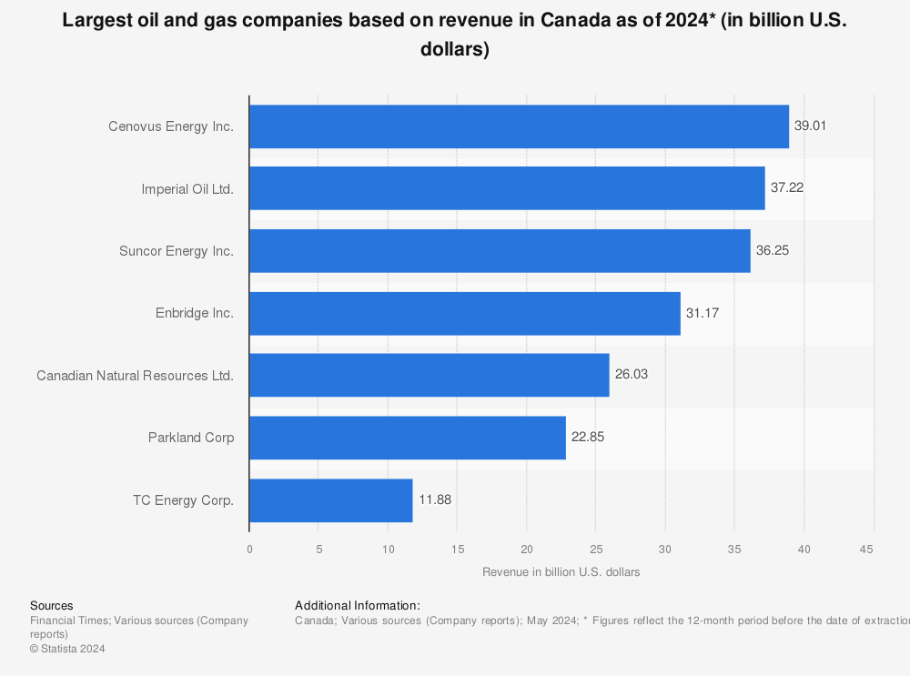

## Table of Contents

## What are the largest oil and gas companies in Canada?

The largest oil and gas companies in Canada are Suncor Energy, Canadian Natural Resources Limited (CNRL), and Imperial Oil. Suncor Energy is one of the biggest because it has a lot of oil sands projects and refineries. It also makes and sells gasoline at Petro-Canada stations. CNRL is another big company that works on oil sands, but it also looks for oil and gas in other places. Imperial Oil, which is partly owned by ExxonMobil, also has big oil sands projects and refineries in Canada.

These companies are important to Canada's economy because they create many jobs and bring in a lot of money. They help Canada be one of the biggest oil producers in the world. Even though they are big, they also have to think about the environment and try to reduce pollution from their work.

## How are these companies ranked in terms of size?

The biggest oil and gas company in Canada is Suncor Energy. It is the largest because it has a lot of oil sands projects and also owns refineries. Suncor makes and sells gasoline at Petro-Canada stations all over Canada. This makes Suncor very important to the country's energy needs.

The second largest company is Canadian Natural Resources Limited, or CNRL. CNRL is big because it works on oil sands too, but it also looks for oil and gas in other places. This makes CNRL a bit different from Suncor because it does more types of work. CNRL is still very important to Canada's oil industry.

The third largest company is Imperial Oil. It is partly owned by ExxonMobil, which is a very big company in the United States. Imperial Oil has big oil sands projects and refineries in Canada. Even though it is third, Imperial Oil is still a big part of Canada's oil and gas industry.

## What is the history of the largest Canadian oil and gas companies?

Suncor Energy started in 1917 as Sun Company of Canada. It grew by buying other companies and finding new oil. In 1979, Suncor bought the oil sands project called Great Canadian Oil Sands, which was a big step. Later, in 1990, Suncor bought Petro-Canada, which helped it sell gasoline at many stations across Canada. Suncor kept growing and now it is the biggest oil and gas company in Canada because it has many oil sands projects and refineries.

Canadian Natural Resources Limited, or CNRL, was started in 1989 by a man named Murray Edwards. CNRL grew quickly by buying other oil and gas companies. It started working on oil sands in 1999, which was important for its growth. CNRL also looks for oil and gas in other places, not just oil sands. This made CNRL the second largest oil and gas company in Canada.

Imperial Oil was founded in 1880 and it has been a big part of Canada's oil industry for a long time. It is partly owned by ExxonMobil, a big American company. Imperial Oil started working on oil sands in the 1960s, which was a big change for the company. It also has refineries that help turn oil into things like gasoline. Imperial Oil is the third largest oil and gas company in Canada and it keeps playing an important role in the country's energy industry.

## What are the main operations of these companies?

Suncor Energy's main operations are focused on oil sands and refining oil. They have big projects in the oil sands where they get oil from the ground. Suncor also owns refineries where they turn the oil into things like gasoline. They sell this gasoline at Petro-Canada stations all over Canada. This makes Suncor a very important company for Canada's energy needs.

Canadian Natural Resources Limited, or CNRL, does a lot of different things. They work on oil sands projects, just like Suncor, but they also look for oil and gas in other places. This means they have a lot of different ways to get oil and gas. CNRL is good at finding new oil and gas and then getting it out of the ground. They are the second biggest company in Canada because they do so many different things.

Imperial Oil, which is partly owned by ExxonMobil, also has big oil sands projects. They started working on oil sands a long time ago and it's still a big part of what they do. Imperial Oil also has refineries where they turn oil into things like gasoline. They are the third biggest company in Canada and they play an important role in making sure Canada has the energy it needs.

## How do these companies contribute to Canada's economy?

Suncor Energy, Canadian Natural Resources Limited (CNRL), and Imperial Oil are very important to Canada's economy. They create a lot of jobs for people. These jobs help people earn money and spend it on things they need. The companies also bring in a lot of money for Canada. This money helps the government pay for things like schools and hospitals. When these companies do well, it helps the whole country do well too.

These companies also help Canada sell oil and gas to other countries. This brings in more money for Canada. When other countries buy Canadian oil and gas, it makes Canada's economy stronger. The money from these sales helps Canada keep growing and doing well. So, these big oil and gas companies are a big part of why Canada's economy is strong.

## What are the environmental impacts of these companies' operations?

The operations of Suncor Energy, Canadian Natural Resources Limited (CNRL), and Imperial Oil have big effects on the environment. They work a lot with oil sands, which means they have to dig up a lot of land to get the oil out. This can hurt the land and make it hard for plants and animals to live there. Also, when they get the oil out, they use a lot of water, and this can make the water dirty. This dirty water can harm rivers and lakes and the animals that live in them.

Another big problem is that these companies make a lot of greenhouse gases. These gases go into the air and make the Earth warmer. This is called climate change, and it can cause a lot of problems like more storms and hotter weather. The companies know this is a problem, so they are trying to find ways to make less pollution. They are looking for new ways to get oil and gas that do not hurt the environment as much. But it is still a big challenge for them.

## What are the key financial metrics for these companies?

Suncor Energy, the biggest oil and gas company in Canada, makes a lot of money every year. In 2022, they made about $58 billion in revenue. Revenue is the money a company gets from selling things. Suncor also made about $9 billion in profit, which is the money left after they pay for everything they need to run their business. They have a lot of money and things they own, called assets, worth about $80 billion. Suncor is good at making money because they have a lot of oil sands projects and they sell gasoline at Petro-Canada stations.

Canadian Natural Resources Limited, or CNRL, is the second biggest company. In 2022, they had about $42 billion in revenue. Their profit was around $11 billion, which is a bit more than Suncor's profit. CNRL has assets worth about $75 billion. They do well because they work on oil sands and also look for oil and gas in other places. This helps them make a lot of money.

Imperial Oil, the third biggest company, made about $50 billion in revenue in 2022. Their profit was around $7 billion. Imperial Oil has assets worth about $40 billion. They are good at making money because they have big oil sands projects and refineries. Even though they are third, they still play a big role in Canada's economy.

## How do these companies compare to international oil and gas giants?

Suncor Energy, CNRL, and Imperial Oil are big in Canada, but they are smaller than some of the biggest oil and gas companies in the world. For example, ExxonMobil, which partly owns Imperial Oil, is much bigger. In 2022, ExxonMobil made about $414 billion in revenue, which is a lot more than what Suncor, CNRL, and Imperial Oil made. ExxonMobil also has a lot more assets, worth around $360 billion. Another big company is Saudi Aramco, which made about $604 billion in revenue in 2022. These international companies are much bigger because they work in many countries and have a lot more oil and gas projects.

Even though Suncor, CNRL, and Imperial Oil are smaller, they are still important. They help Canada be one of the biggest oil producers in the world. These Canadian companies focus a lot on oil sands, which is different from what some international companies do. For example, ExxonMobil and Saudi Aramco have a lot of oil and gas projects all over the world, not just in one country. The Canadian companies are good at what they do, but they are not as big as these international giants.

## What are the major challenges these companies face in the current market?

One big challenge for Suncor Energy, CNRL, and Imperial Oil is the price of oil. Oil prices can go up and down a lot, and when they go down, these companies make less money. This makes it hard for them to plan and spend money on new projects. They also have to compete with other oil companies around the world, which can make it hard to sell their oil at a good price. Another problem is that people are using less oil and gas because they are trying to use cleaner energy like wind and solar power. This means there might be less need for oil and gas in the future, which can hurt these companies' business.

Another challenge is the cost of getting oil out of the ground, especially from oil sands. Oil sands are hard to work with because they need a lot of water and energy to get the oil out. This makes it expensive, and if the price of oil goes down, it can be hard to make money. These companies also have to follow a lot of rules about the environment. They need to find ways to make less pollution and use less water, which can cost a lot of money. All these challenges make it hard for Suncor, CNRL, and Imperial Oil to keep making money and growing their business.

## How are these companies adapting to the global shift towards renewable energy?

Suncor Energy, CNRL, and Imperial Oil are trying to change with the world as more people use renewable energy like wind and solar power. They know that oil and gas might not be as important in the future, so they are looking for new ways to make energy. Suncor is putting money into things like wind power and biofuels, which are fuels made from plants. They are also trying to make their oil sands projects cleaner by using less water and making less pollution. CNRL is looking at ways to capture carbon, which means taking the bad gases they make and storing them safely underground. This can help lower the pollution from their oil and gas work.

Imperial Oil is also working on new ideas to be more friendly to the environment. They are trying to use technology to make their oil sands projects use less energy and water. They are also looking at ways to make their refineries cleaner. All three companies know they need to change to keep making money as the world moves towards renewable energy. They are trying to find a balance between making oil and gas and using new, cleaner ways to make energy. This is a big challenge, but they are working hard to adapt and be ready for the future.

## What are the technological innovations being pursued by these companies?

Suncor Energy is working on new technology to make their oil sands projects better. They are trying to use less water and make less pollution. One way they are doing this is by using steam to get the oil out of the ground, which uses less water than other ways. They are also looking at ways to use renewable energy, like wind power, to help power their projects. This can help them be cleaner and save money too. Suncor is also trying to make biofuels, which are fuels made from plants, to help the environment.

CNRL is working on technology to capture carbon. This means they take the bad gases they make and store them safely underground. This can help lower the pollution from their oil and gas work. They are also trying to find new ways to get oil out of the ground that use less energy and water. This can make their projects cheaper and better for the environment. CNRL knows that they need to use new technology to keep up with the world's changing needs.

Imperial Oil is also looking at new technology to make their oil sands projects cleaner. They are trying to use less energy and water in their projects. They are also working on making their refineries cleaner by using new ways to turn oil into things like gasoline. Imperial Oil knows that technology can help them be better for the environment and keep making money as the world changes.

## What are the future prospects and strategies for growth of these companies?

Suncor Energy, CNRL, and Imperial Oil are looking to the future by trying new things and finding new ways to grow. They know that the world is changing and people are using more renewable energy like wind and solar power. So, these companies are putting money into things like wind power and biofuels. Biofuels are fuels made from plants, which are better for the environment. They are also trying to make their oil sands projects use less water and make less pollution. This can help them save money and be better for the Earth. They are also looking for new places to find oil and gas, not just in Canada, but in other countries too.

These companies are also working on new technology to help them grow. Suncor is trying to use steam to get oil out of the ground, which uses less water. CNRL is working on capturing carbon, which means taking the bad gases they make and storing them safely underground. This can help lower pollution. Imperial Oil is trying to use less energy and water in their projects and make their refineries cleaner. All these new technologies can help these companies make more money and be better for the environment. By trying new things and using new technology, Suncor, CNRL, and Imperial Oil hope to keep growing and be ready for the future.

## References & Further Reading

[1]: Natural Resources Canada. (2020). ["Energy and the Economy."](https://energy.ca/canadian-energy-sector-overview/) Retrieved from the Government of Canada website.

[2]: Canadian Association of Petroleum Producers. (n.d.). ["Canada's Oil Sands."](https://www.capp.ca/) Retrieved from the Canadian Association of Petroleum Producers' website.

[3]: Enbridge Inc. (2020). ["Our company."](https://www.enbridge.com/~/media/Enb/Documents/Investor%20Relations/2021/ENB_2020_Summary_Report.pdf) Retrieved from the Enbridge Inc. website.

[4]: TC Energy. (2020). ["About TC Energy."](https://www.tcenergy.com/stories/2020/2020-07-02-four-things-you-might-not-know-about-tc-energy-in-the-u.s/) Retrieved from the TC Energy website.