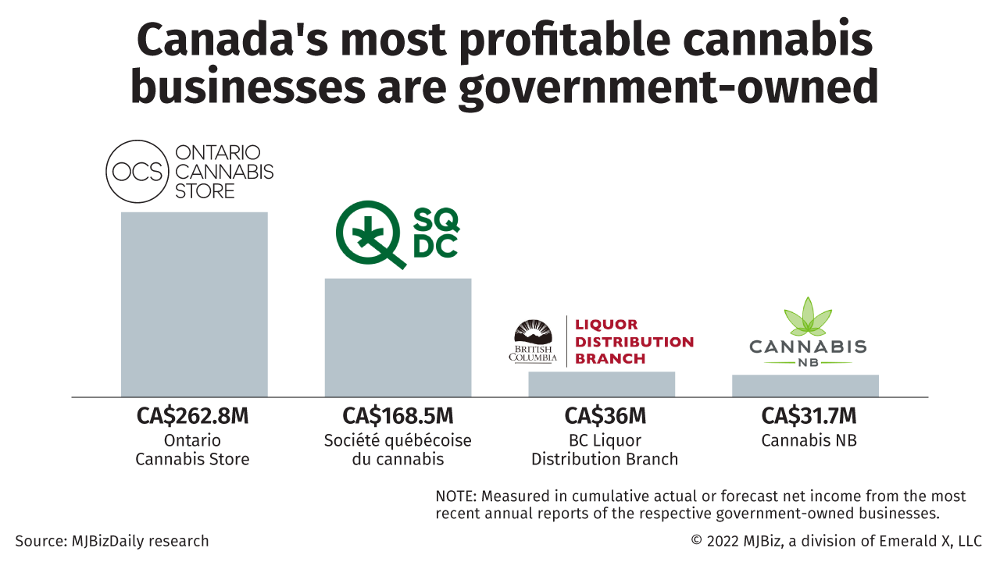

The Canadian cannabis industry has experienced remarkable growth since the legalization of recreational cannabis in October 2018. This transformative legislation positioned Canada as a pioneer in the global cannabis market, leading to the rapid expansion of several Canadian cannabis companies that are now establishing a robust international presence. This dynamic sector has not only spurred economic growth but has also positioned Canada as a leader in setting precedence for cannabis legislation worldwide.

Among the top cannabis companies are industry frontrunners like Tilray Brands, Sundial Growers, and Canopy Growth. These corporations, along with others, are contributing significantly to the country's economy while paving the way for international expansion. Their strong global presence is characterized by strategic partnerships, acquisitions, and diversified product offerings that cater to various segments of the cannabis market, including medical, recreational, and wellness products.

In this expanding industry, the integration of technology, particularly algorithmic trading, is increasingly shaping the landscape. Algorithmic trading involves using computer algorithms to execute trading strategies at speeds and efficiencies that are beyond human capabilities. In the cannabis sector, the adoption of such technology is driving market efficiency and opening up new investment opportunities by optimizing trade executions and minimizing costs associated with trading activities.

This article will explore the largest cannabis companies in Canada and their significant impact on both the domestic and international markets. It will also delve into how the integration of algorithmic trading is offering novel possibilities for investors looking to engage in the cannabis industry. As the market continues to evolve, the interaction between industry growth and technological innovation will undoubtedly play a crucial role in the future trajectory of Canadian cannabis companies.

## Table of Contents

## Top Canadian Cannabis Companies

The Canadian cannabis industry, having achieved significant growth since its nationwide legalization in 2018, is represented by several frontrunners that have established a firm foothold both domestically and internationally. These leading companies are pivotal in expanding the industry, as they are driven by innovation and strategic global operations. Here's an analysis of some of Canada's top cannabis companies, grounded in their revenue and market capitalization.

**Tilray Brands**

Tilray Brands is a prominent player in the medical cannabis sector with expansive global operations. The company has strategically positioned itself through mergers and acquisitions, enhancing its product offerings and distribution networks internationally. Their focus on both recreational and medicinal cannabis products has allowed them to penetrate various markets, maintaining a competitive edge in a rapidly evolving industry.

**Sundial Growers**

Sundial Growers stands out as a versatile entity within the cannabis market, having effectively integrated the liquor and cannabis sectors. This dual-market strategy has allowed Sundial to diversify its revenue streams, stabilizing financial performance and providing growth opportunities. Sundial's commitment to high-quality cannabis products, along with its strategic acquisitions in the liquor space, has reinforced its market standing.

**High Tide**

High Tide is recognized as a dominant cannabis retailer, extending its influence across North America and Europe. The company's emphasis on e-commerce and retail expansions has resulted in a robust presence in key markets. High Tide's vertically integrated operations ensure a seamless supply chain, optimizing product availability and customer satisfaction in international markets.

**TerrAscend**

TerrAscend has carved out a niche based on its premium cannabis brands and dispensaries. The company's focus on high-quality production, alongside strategic dispensary locations, has fueled its reputation for excellence. By catering to a premium segment, TerrAscend has developed strong brand loyalty, positioning itself advantageously in both the Canadian and United States markets.

**Canopy Growth**

Canopy Growth is often heralded as a pioneer within the cannabis industry due to its extensive international outreach and comprehensive product portfolio. The company's innovative strategies, including partnerships and product diversification, have solidified its status as a market leader. Canopy Growth's investment in research and development underscores its commitment to expanding the cannabis narrative beyond recreational use, targeting health and wellness products.

**Village Farms International**

Village Farms International distinguishes itself with a diversified production strategy that targets high-growth markets. Initially rooted in agribusiness, the company's transition into cannabis has been facilitated by its existing infrastructure and expertise in greenhouse operations. This diversification has amplified Village Farms' ability to adapt to market demands and explore new product lines within cannabis and beyond.

**Aurora Cannabis**

Aurora Cannabis is a key figure in the medical cannabis arena with a broad portfolio that caters to both clinical and recreational needs. The company's investments in technology and its vast production capacity enable it to supply a wide range of cannabis-based solutions. Aurora's global footprint, backed by its strategic international partnerships, reinforces its goal of being a leading provider of quality medical cannabis products.

These companies exemplify the resilience and innovative spirit that drives the Canadian cannabis industry forward, each adopting unique strategies to bolster their market positions and expand their influence globally.

## Algorithmic Trading in the Cannabis Sector

Algorithmic trading, often referred to as algo-trading, involves the use of computer systems executing pre-programmed trading instructions to make decisions at speeds and frequencies that are impossible for human traders. In the context of the cannabis industry, [algorithmic trading](/wiki/algorithmic-trading) has begun to play a crucial role, providing enhanced market efficiency and cost-effectiveness.

Algo-trading systems can analyze a vast array of market data and execute trades based on algorithms, which can consider variables such as timing, price, [volume](/wiki/volume-trading-strategy), and market trends. As a result, they are particularly effective in improving market efficiency by minimizing the spread between bid and ask prices and executing trades at optimal moments to maximize profit. Additionally, the automation of trading strategies reduces the costs associated with manual trading, as fewer resources are required to manage trading operations.

Several Canadian cannabis companies have adopted algorithmic trading technologies. For instance, Tilray Brands and Canopy Growth have integrated advanced trading platforms to optimize their market operations. These systems allow these companies to swiftly adapt to market fluctuations, manage risk more effectively, and ensure better [liquidity](/wiki/liquidity-risk-premium) for their stocks. The use of [machine learning](/wiki/machine-learning) within these platforms enables these companies to refine their trading algorithms continuously, enhancing predictive accuracy over time.

However, the integration of algorithmic trading in the cannabis sector is not without its risks. One of the primary concerns is the potential for increased market [volatility](/wiki/volatility-trading-strategies). Algorithms, if not carefully designed, can exacerbate rapid price movements or trigger unintended sell-offs, contributing to market instability. Moreover, there is a risk of systemic failures, where a mistake in coding or a misinterpretation of data could lead to significant financial losses. Companies must therefore implement robust risk management protocols to mitigate these risks.

On the rewarding side, algorithmic trading provides opportunities for improved decision-making, as it leverages vast datasets for analytics, offering insights and forecasts that are beyond traditional capability. It also allows for the execution of complex trading strategies that can capitalize on minor price discrepancies with speed and precision, yielding higher returns.

In summary, algorithmic trading is reshaping the Canadian cannabis industry's approach to the market by enhancing efficiency and reducing costs, though it poses notable risks. As technology continues to advance, the strategic use of algorithmic models is likely to become increasingly integral to sustaining competitive advantage in this burgeoning sector.

## Challenges Facing the Canadian Cannabis Industry

The Canadian cannabis industry, although thriving, faces several significant challenges that continue to impact its growth and stability. A key challenge is regulatory constraints. Since the legalization of cannabis in Canada in October 2018, regulatory frameworks have evolved yet remain stringent. These regulations govern product types, marketing, distribution, and retail, often leading to slow bureaucratic processes that can hamper market entry for new products and create operational inefficiencies for companies. Compliance with Health Canada's regulations also adds to the cost burden for cannabis producers, influencing their overall profitability.

Additionally, the legal cannabis market contends with persistent competition from the illicit market. Despite legalization, the black market continues to thrive, offering lower prices and easy access, thus undermining legal sales. According to Statistics Canada, a significant portion of cannabis consumers still purchase from unlicensed sources, primarily due to lower prices and lack of taxes on illegal products. This ongoing battle places legal companies at a disadvantage, compelling them to work on cost-cutting measures and strategic pricing while adhering to strict quality and safety standards.

Financial performance and profitability challenges are also noteworthy. Many cannabis companies have reported financial losses in recent months, with some facing declining stock prices and market valuation. High production costs, combined with pricing pressures and regulatory compliance expenses, have further strained profitability. Companies are forced to scale operations, streamline processes, and seek strategic partnerships to remain financially viable.

Fluctuating market demand and economic factors further complicate the landscape. Demand for cannabis products can be highly variable, influenced by factors such as consumer trends, economic cycles, and public health initiatives that affect consumer behavior. Moreover, the economic impact of global events such as the COVID-19 pandemic has led to shifts in consumer spending, affecting sales and revenue for cannabis companies. These fluctuations necessitate robust supply chain management and dynamic pricing strategies to align production with market demand efficiently.

In summary, the Canadian cannabis industry must navigate through complex regulatory environments, overcome the challenges posed by the black market, address financial sustainability issues, and adapt to varying market demands to achieve long-term growth and stability.

## Investing in Canadian Cannabis Stocks

Investing in Canadian cannabis stocks has captured the attention of investors due to the industry's rapid growth potential and evolving regulatory landscape. The legalization of cannabis in Canada in 2018 marked a significant shift, enabling companies to operate in a legal market and fostering the development of a formidable cannabis industry. This environment presents a unique opportunity for investors, though it also comes with its own set of challenges.

### Why Investors Are Attracted to Cannabis Stocks

The growth potential of the cannabis industry is one of the major attractions for investors. According to a report by [Grand View Research](https://www.grandviewresearch.com/industry-analysis/legal-marijuana-market), the global legal cannabis market is expected to reach USD 70.6 billion by 2028, with North America playing a crucial role. Canadian companies, being early entrants in the legal cannabis market, are well-placed to capitalize on both domestic and international demand.

Moreover, the diversification of product offerings, including edibles, beverages, and medicinal products, provides multiple revenue streams for these companies. The potential for innovation and new product development continues to attract investors looking for growth opportunities outside traditional sectors.

### Pros and Cons of Investing in the Canadian Cannabis Market

**Pros:**

1. **Market Growth:** The continual expansion of legal markets both in Canada and globally suggests sustained growth prospects for Canadian cannabis companies.
2. **Innovation:** Cannabis companies in Canada are at the forefront of research and development, focusing on creating new cannabis-infused products that appeal to a wider audience.
3. **Strategic Partnerships:** Many Canadian firms have formed strategic partnerships and acquisitions to expand their market reach, which can potentially lead to enhanced shareholder value.

**Cons:**

1. **Regulatory Hurdles:** Despite legalization, cannabis companies face rigorous regulatory requirements that can impact their operational efficiency and market expansion plans.
2. **Market Volatility:** The cannabis sector is known for its significant price volatility, influenced by regulatory changes, market demand shifts, and company performance.
3. **Black Market:** The competition from the illicit cannabis market continues to pose a challenge, affecting the profitability of legal enterprises.

### Analyzing Market Trends and Growth Potential

The Canadian cannabis market is anticipated to grow, driven by increased consumer acceptance and potential policy changes in international markets. The integration of technology, such as precision agriculture and data-driven insights, enables companies to optimize production and reduce costs, enhancing their competitive edge.

Moreover, the use of algorithmic trading in the cannabis sector is likely to improve market efficiency and attract more institutional investors, potentially increasing liquidity and reducing market volatility.

### Tips for Investors Looking to Dive into Cannabis Stocks

1. **Research Companies:** Investors should conduct thorough research on company fundamentals, including financial health, management team, and growth strategy.
2. **Diversify Investments:** To mitigate risks, consider diversifying investments across different segments of the cannabis industry, such as cultivation, retail, and biotech.
3. **Stay Informed:** Keeping abreast of regulatory developments and market trends can help investors make informed decisions and identify new investment opportunities.
4. **Assess Volatility:** Given the sector's volatility, investors should assess their risk tolerance and investment horizon before committing capital to cannabis stocks.

In conclusion, while the Canadian cannabis market presents exciting investment opportunities, it also requires careful consideration of the associated risks and a strategic approach to capital allocation.

## Future Outlook of the Canadian Cannabis Industry

The Canadian cannabis industry is poised for continued growth and expansion, supported by evolving regulatory frameworks, increasing acceptance, and technological advancements. The legalization of cannabis in 2018 set the stage for a burgeoning market, and future prospects appear promising as the industry matures and navigates new opportunities.

**Predictions for Industry Growth and Market Expansion**

The Canadian cannabis market is projected to expand as consumer demand for both recreational and medicinal cannabis products increases. According to Statistics Canada, cannabis sales reached over CAD 4 billion in 2021 and are expected to grow steadily as product offerings diversify and market penetration deepens.[^1] Furthermore, international opportunities could drive further expansion as Canadian companies establish footholds in other legal regions, including parts of Europe and Latin America.

**Potential Policy Changes and Their Effect on the Industry**

Policy developments remain a critical [factor](/wiki/factor-investing) influencing the future landscape of the cannabis industry. Continued advocacy for regulatory adjustments, such as streamlining licensing processes and revising excise taxes, could enhance market accessibility and profitability. Additionally, further clarification and harmonization of cross-border trade policies are essential for optimizing international business operations. As global perspectives on cannabis shift towards acceptance, Canadian companies could benefit from potential changes in international laws, enabling them to explore new markets and partnerships.

**The Role of Technology and Innovation**

Innovation is a driving force behind the industry's evolution. Technological advancements in cultivation techniques, such as precision agriculture and genetically optimized strains, are increasing yield and product quality. Furthermore, the adoption of blockchain for supply chain transparency and [artificial intelligence](/wiki/ai-artificial-intelligence) for consumer insights represents significant strides in operational efficiency and customer satisfaction.

Algorithmic trading, already present in other financial markets, is gradually gaining traction in cannabis stock exchanges. By utilizing automated trading systems, companies and investors can benefit from enhanced market liquidity and reduced transaction costs. This alignment of financial technology with cannabis trading offers a sophisticated approach to market participation, potentially increasing investor confidence and engagement.

In conclusion, the future outlook of the Canadian cannabis industry is characterized by growth potential and opportunities driven by regulatory evolution, market expansion, and technological innovation. As the industry embraces these changes, it is likely to witness increased market integration, enhanced consumer experiences, and sustained economic contributions.

[^1]: Government of Canada, Statistics Canada. "Cannabis Economic Accounts, fourth quarter 2021." January 2022.

## Conclusion

Since the legalization of cannabis in 2018, Canada's cannabis industry has experienced remarkable growth and diversification. The industry has matured to support a wide variety of operations, from cultivation to retail, and has given rise to several prominent companies that are establishing significant international footprints. This growth is underscored by the increasing adoption of technology, such as algorithmic trading, which is transforming how trading occurs in this evolving sector.

Algorithmic trading presents promising potential for the cannabis industry by offering enhanced market efficiency and reduced trading costs. This technological integration provides a strategic advantage, enabling companies to optimize their trading strategies and respond swiftly to market fluctuations. As algorithmic trading continues to gain traction within the industry, it can potentially lead to more stable pricing structures and increased investor confidence.

For investors, the Canadian cannabis market presents both opportunities and challenges. With the industry poised for further growth, investing in cannabis companies offers the potential for substantial returns. However, investors must remain vigilant, taking into account regulatory dynamics, market volatility, and the competitive landscape. An informed approach, incorporating both current market data and an understanding of technological advances like algorithmic trading, will be crucial for successful investment strategies.

Overall, Canada's cannabis industry not only illustrates a remarkable trajectory of growth but also highlights the transformative impact of technology. Investors and companies alike stand to benefit from these developments as they shape the future landscape of the sector.

## References & Further Reading

[1]: ["Grand View Research - Legal Marijuana Market Size & Growth Analysis Report"](https://www.grandviewresearch.com/industry-analysis/legal-marijuana-market) Grand View Research.

[2]: Lopez de Prado, M. (2018). ["Advances in Financial Machine Learning."](https://www.amazon.com/Advances-Financial-Machine-Learning-Marcos/dp/1119482089) Wiley.

[3]: Aronson, D. R. (2007). ["Evidence-Based Technical Analysis: Applying the Scientific Method and Statistical Inference to Trading Signals."](https://www.amazon.com/Evidence-Based-Technical-Analysis-Scientific-Statistical/dp/0470008741) Wiley.

[4]: Jansen, S. (2020). ["Machine Learning for Algorithmic Trading."](https://github.com/stefan-jansen/machine-learning-for-trading) Packt Publishing.

[5]: Chan, E. P. (2009). ["Quantitative Trading: How to Build Your Own Algorithmic Trading Business."](https://github.com/ftvision/quant_trading_echan_book) Wiley Trading.

[6]: Government of Canada, Statistics Canada. (2022). ["Cannabis Economic Accounts, fourth quarter 2021."](https://www150.statcan.gc.ca/n1/pub/12-581-x/12-581-x2022001-eng.pdf) Statistics Canada.