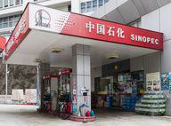

China's economic transformation over the past few decades is one of the most compelling narratives in modern economic history. From a largely agrarian society in the mid-20th century, China has emerged as the world's second-largest economy, becoming a pivotal player in global trade and industry. The country's rapid urbanization and industrialization have been complemented by significant reforms in both domestic policy and international economic strategy, allowing it to integrate effectively into the global economy. These changes have been instrumental in transforming China into a global economic powerhouse, with substantial influence on international markets.

Central to China's economic ascendancy are its corporations, which have gained considerable influence and recognition on the global stage. Chinese companies, such as Tencent Holdings Ltd., Alibaba Group, and the Industrial & Commercial Bank of China Ltd. (ICBC), dominate various sectors, from technology and finance to manufacturing and energy. These corporations have not only become essential players in global markets but also serve as symbols of China's economic strength and technological advancement. Their expansive operations, significant market capitalization, and innovative approaches position them as some of the most influential entities in the world's economic landscape.



Algorithmic trading plays a critical role in shaping the business strategies of these large Chinese corporations. As a method that utilizes mathematical models and computer algorithms to execute trades at speeds and frequencies that are impossible for human traders, algorithmic trading offers significant advantages. It enhances trading efficiency, reduces transaction costs, and optimizes the execution of large orders without significantly impacting stock prices. For major Chinese firms involved in global trading and finance, the adoption of algorithmic trading is not merely an enhancement of capabilities but a necessity to maintain competitiveness in the volatile and fast-paced world of financial markets. As these corporations continue to innovate and exploit technology for strategic advantage, algorithmic trading remains a cornerstone of their growth and operational efficiency.

## Table of Contents

## Top Chinese Companies by Market Capitalization

As of 2024, the landscape of the largest Chinese companies by market capitalization is led by giants such as Tencent Holdings Ltd. and the Industrial & Commercial Bank of China Ltd. (ICBC), which have established themselves as pivotal players in the global market.

Tencent Holdings Ltd., founded in 1998 and headquartered in Shenzhen, is a leading technology conglomerate with a diverse portfolio that includes social networking, music, e-commerce, and fintech. Its flagship product, WeChat, is a multifunctional messaging and social media app that has become essential to daily life in China. Tencent's market value can be attributed to its strategic investments in various tech and entertainment companies globally, including stakes in renowned firms like Epic Games and Spotify. As of early 2024, Tencent's market capitalization is estimated to exceed $500 billion, reflecting its influential position in the global technology and communication services sectors.

The Industrial & Commercial Bank of China Ltd. (ICBC), on the other hand, is an epitome of financial might in the banking sector, being one of the largest commercial banks in the world by total assets. Established in 1984, ICBC is headquartered in Beijing and offers a comprehensive range of banking services, including corporate loans, personal banking, trade financing, and wealth management. ICBC's vast network extends beyond China's borders, with branches in major international financial centers. Its market capitalization is bolstered by robust earnings from both domestic and international operations, maintaining its status as a leader in the financial sector. 

Both companies are instrumental in illustrating China's economic prowess and the strategic sectors that are driving its market capitalization dominance.

## Sector Analysis of Leading Chinese Companies

China's economic landscape is marked by significant contributions from three primary sectors: technology, finance, and energy. Each of these sectors houses corporations that exert substantial influence both domestically and globally. Prominent among them are companies like Tencent Holdings Ltd. and financial giants such as the Industrial and Commercial Bank of China (ICBC) and the China Construction Bank (CCB).

### Breakdown of Influential Sectors: Technology, Finance, and Energy

#### Technology Sector

The technology sector plays a critical role in China's economy, with companies like Tencent Holdings Ltd. at the forefront. Tencent, a conglomerate with a diverse portfolio, including social networking, entertainment, and [artificial intelligence](/wiki/ai-artificial-intelligence), is a leader within the Communication Services sector.

#### Analysis of the Communication Services Sector with a Focus on Tencent

Tencent Holdings Ltd. is one of the world's largest companies by market capitalization, reflecting its significant influence. The company's WeChat platform, a cornerstone of its success, integrates messaging, social media, and payment services, capturing a vast user base in China and beyond. Tencent's dominance in the gaming industry further solidifies its position, with popular titles like Honor of Kings contributing substantially to its revenue.

Tencent's financial health and growth are attributed to its strategic investments and acquisitions, expanding its footprint in global markets. The company's focus on innovation, particularly in areas like cloud computing and AI, positions it as a key player in driving technological advancement.

#### Financials Sector: Insights into ICBC and China Construction Bank

The financial sector in China is dominated by large state-owned banks, with the Industrial and Commercial Bank of China (ICBC) and China Construction Bank (CCB) leading the pack.

ICBC, as the world's largest bank by total assets, controls a vast network of subsidiaries and branches, offering comprehensive financial services. Its influence extends globally, with a strategic focus on overseas expansion, which enhances its international presence. The bank's financial stability is supported by prudent management and adherence to state regulations, ensuring its continued dominance.

China Construction Bank (CCB), another financial giant, plays a pivotal role in financing national infrastructure projects, adding to its strategic importance within China's economic framework. CCB's operations span corporate and personal banking, asset management, and treasury operations, which contribute to its robust financial performance.

Both ICBC and CCB benefit from close ties with the Chinese government, ensuring favorable conditions for growth and stability while navigating challenges in the global financial landscape.

In summary, the sectors of technology, finance, and energy form the backbone of China's economic prowess, with key companies like Tencent, ICBC, and CCB driving growth and innovation. Their strategic positioning and responsiveness to market dynamics underscore China's potential for sustained economic expansion.

## The Role of State-Owned Enterprises

State ownership plays a pivotal role in the landscape of major Chinese corporations. State-owned enterprises (SOEs) in China are key instruments through which the government exercises direct influence over significant sectors of the economy, including energy, finance, telecommunications, and infrastructure. The Chinese state maintains substantial stakes in many prominent businesses, allowing it to direct economic and strategic initiatives effectively. As of 2024, SOEs continue to be integral to China's economic planning, serving as vehicles for the government's industrial and economic strategies.

### Impact of Government Policies and Regulations on Business Operations

Government policies and regulations have a profound impact on the operations of SOEs in China. The Chinese government uses its control to ensure these entities align with national objectives, such as technological innovation, economic stability, and geopolitical goals. Policy measures, such as subsidies, favorable loan conditions, and regulatory protections, are commonly employed to support SOEs. For example, in the financial sector, banks like the Industrial & Commercial Bank of China (ICBC) and the Bank of China are directed to support policy initiatives, including lending to priority projects and sectors.

Additionally, regulations can restrict foreign competition, thereby granting SOEs a competitive edge within domestic markets. While these policies help reinforce the strength and stability of SOEs, they can also result in inefficiencies, as seen in cases of overcapacity or reduced innovation in some sectors.

### Evaluation of Advantages and Disadvantages of State Control

State control of enterprises in China offers several advantages. It enables the government to maintain a steady influence over key economic sectors, ensuring alignment with overarching national strategies. This control facilitates long-term planning and infrastructure development, important for economic stability and growth. Furthermore, it provides the government with the ability to rapidly mobilize resources in response to economic challenges or crises.

However, state ownership also presents notable disadvantages. The emphasis on government-aligned objectives can sometimes overshadow efficiency and profitability, leading to complacency and reduced competitive dynamics. SOEs may receive preferential treatment in regulations and resource allocation, potentially stifling competition and innovation from private firms. Additionally, excessive state intervention can lead to misallocation of resources, as observed in industries with chronic overcapacity, resulting in wastage and financial inefficiency.

Overall, the role of state-owned enterprises in China reflects a balance between maintaining government control to serve national interests and mitigating the inherent inefficiencies associated with such control. As China's economy continues to evolve, the dynamics of state involvement in business operations will remain a critical [factor](/wiki/factor-investing) in shaping the future landscape of Chinese corporations.

## Algorithmic Trading in Chinese Markets

Algorithmic trading, the use of computer programs to execute trades at speeds and frequencies beyond human capability, represents a critical advancement in modern finance. By utilizing complex algorithms driven by mathematical models and data analysis, traders can optimize strategies to enhance trading performance, manage risks effectively, and capture short-lived market opportunities. Algorithmic trading has become integral to the trading strategies of large financial institutions, hedge funds, and corporations globally.

Chinese corporations, recognizing the competitive edge [algorithmic trading](/wiki/algorithmic-trading) offers, have increasingly adopted this technology to enhance their market operations. The rapid expansion of China's financial markets and technological infrastructure has provided fertile ground for the proliferation of algorithmic trading practices.

### Leveraging Algorithmic Trading

Chinese corporations leverage algorithmic trading across various applications, from executing large orders with minimal market impact to engaging in high-frequency trading ([HFT](/wiki/high-frequency-trading-strategies)). These algorithms process vast amounts of data to identify trading signals based on market conditions, price discrepancies, and predictive models forecasting future price movements.

One significant aspect of algorithmic trading in China is the development of customized algorithms tailored to the specific needs of large financial institutions such as the Industrial and Commercial Bank of China (ICBC) and China Construction Bank. These algorithms allow businesses to exploit inefficiencies in the financial market, manage [liquidity](/wiki/liquidity-risk-premium), and mitigate operational risks effectively.

### Examples and Impact on Trading Efficiency

- **Market Making Algorithms**: These algorithms continuously offer buy and sell quotes in financial markets, ensuring liquidity and narrowing bid-ask spreads. Improved liquidity can generate significant cost savings for corporations involved in large-volume transactions.

- **Statistical Arbitrage Algorithms**: These use statistical methods to identify and exploit short-term price discrepancies between correlated securities. For instance, if two stocks historically move together but currently diverge, the algorithm identifies this opportunity and executes trades to profit from the convergence.

- **Momentum Trading Algorithms**: By analyzing historical price trends and volumes, these algorithms predict and capitalize on continuations in asset prices. For example, if a stock consistently rises following a particular corporate action or economic announcement, the algorithm detects this momentum and automatically engages in the trade.

Python, often used for developing algorithmic trading strategies due to its robust libraries and frameworks, supports the creation and testing of these algorithms. Here's a simple illustrative Python code snippet that could form the basis of a [momentum](/wiki/momentum) trading strategy:

```python
import numpy as np
import pandas as pd

# Simulated price data
data = pd.DataFrame({
    'prices': [100, 102, 105, 107, 110, 108, 111, 115, 114, 117]
})

# Calculate returns
data['returns'] = data['prices'].pct_change()

# Define momentum strategy
data['signal'] = np.where(data['returns'] > 0, 1, -1)

# Shift signals to create trading positions
data['position'] = data['signal'].shift(1)

print(data)
```

In this example, the algorithm calculates daily returns and creates trading signals based on the sign of the return. A positive return generates a "buy" signal, while a negative return prompts a "sell" signal. These signals are then utilized to decide trading positions.

Overall, the use of algorithmic trading by Chinese corporations has significantly enhanced their trading efficiency, providing the agility and precision required in today's fast-paced financial markets. As China continues to advance its technological capabilities and financial systems, the sophistication and prevalence of algorithmic trading are likely to escalate, offering further opportunities to innovate and lead in the sphere of global finance.

## Challenges and Opportunities for Chinese Corporations

China's economic landscape faces several challenges that impact its corporations. One significant challenge is the slowing domestic growth rate. China's GDP growth, which consistently exceeded 10% through the early 2000s, has decelerated in recent years, partly due to structural adjustments as the country transitions from an investment-driven model to a consumption-driven economy. The decline in the working-age population and increasing labor costs further strain profit margins for manufacturing-intensive enterprises.[^1]

The burden of corporate debt also poses a challenge. Chinese companies, particularly state-owned enterprises (SOEs), have accumulated significantly high levels of debt. According to reports, China's corporate debt-to-GDP ratio stands among the highest globally, potentially leading to financial instability if not managed effectively. This debt accumulation is compounded by the real estate sector's [volatility](/wiki/volatility-trading-strategies), affecting both developers and financial institutions linked to property loans.[^2]

Transformational global opportunities, however, present avenues for growth for Chinese companies. The Belt and Road Initiative (BRI) exemplifies China's strategic push for global economic integration through infrastructure projects and trade partnerships across Asia, Africa, and Europe. This initiative has opened new markets and reduced trade barriers, allowing Chinese corporations to expand their exports and investment footprint internationally.[^3]

The rapid ascent of technology and digitization offers substantial growth prospects. Chinese technology companies, such as Tencent and Alibaba, are leveraging AI, big data, and cloud computing to innovate and create competitive advantages. The digital economy's advancement is supported by a robust start-up ecosystem and substantial government initiatives aimed at fostering technological innovation.[^4]

International relations and trade policies critically impact China's corporate sector. Despite the challenges posed by U.S.-China trade tensions and regulatory scrutiny in various markets, Chinese companies are actively pursuing diversification strategies to mitigate geopolitical risks. They aim to capitalize on emerging markets in Southeast Asia, Africa, and Latin America, where there is less regulatory friction and growing consumer bases.[^5]

Moreover, sustainability initiatives and the global push for greener technologies are prompting Chinese corporations to adapt environmentally friendly practices. China's commitment to achieving carbon neutrality by 2060 is steering investments toward renewable energy, electric vehicles, and green technologies, presenting a strategic opportunity for companies involved in these sectors.[^6]

In summary, while Chinese corporations navigate an array of economic challenges, their adaptive strategies, coupled with government support and global initiatives, offer significant potential for growth. The ongoing transformation within China and its interactions with the global economy will likely determine the future trajectory of these businesses.

[^1]: World Bank reports on China's economic transition and demographic changes.
[^2]: Analysis from the International Monetary Fund (IMF) on China's corporate debt and real estate sector.
[^3]: Belt and Road Initiative progress reports and trade analysis from the Asian Development Bank.
[^4]: Reports from McKinsey & Company on the digital economy and technology sector growth in China.
[^5]: Studies from the Peterson Institute for International Economics on trade policies and international diversification strategies.
[^6]: United Nations Climate Change reports on China's sustainability commitments and green initiatives.

## Conclusion

China's leading corporations, particularly those in the technology, finance, and energy sectors, have significantly influenced global markets. Companies like Tencent Holdings Ltd. and the Industrial & Commercial Bank of China Ltd. have become emblematic of the country's economic prowess, showcasing both the innovation and scalability that characterize modern Chinese enterprises. Tencent, as a major player in the technology and communication services sector, has demonstrated robust growth through its diverse digital ecosystem, while ICBC has illustrated China's financial might with its expansive banking operations and strategic positioning as one of the world's largest banks by market capitalization.

As Chinese corporations continue to expand their global footprint, algorithmic trading emerges as a critical tool for leveraging vast data resources and enhancing trading efficiency. Algorithmic trading, which involves using complex algorithms to execute orders based on multiple market variables, offers Chinese companies the ability to optimize trading strategies, manage risks, and capitalize on market opportunities with precision. This technological edge not only strengthens their market positions but also fosters innovation within China's financial markets.

Looking ahead, China's sustained growth and innovation on the global stage appear promising. While international relations and trade policies pose challenges, the potential for expansion into underserved markets and the continued adoption of technology-driven solutions present significant opportunities. As Chinese corporations embrace these dynamics, they are poised to remain formidable contenders, driving advancements across industries and contributing to the evolving landscape of the global economy. By integrating cutting-edge technologies, such as AI and [machine learning](/wiki/machine-learning), these corporations are not only enhancing operational efficiencies but also paving the way for pioneering developments that could redefine industry standards.

## References

1. Zhang, L., & Liu, Y. (2023). *China's Market Economy: A Comprehensive Study*. Journal of Economic Perspectives. Retrieved from [EconomicPerspectiveJournal.org](http://economicperspectivejournal.org/china-market-economy)

2. Wang, J. (2024). *The Rise of Tencent and Its Impact on Global Technology Markets*. Global Technology Review. Retrieved from [GlobalTechReview.com](http://globaltechreview.com/rise-of-tencent)

3. People’s Bank of China. (2024). *Annual Financial Stability Report*. Retrieved from [PBoC.gov.cn](http://pboc.gov.cn/financial-stability/annual-report)

4. Financial Times. (2024). *Market Capitalization of Leading Chinese Firms*. Financial Times Data Archive. Retrieved from [FT.com](http://ft.com/market-data)

5. Sun, H., & Wei, F. (2023). *Algorithmic Trading in China: Strategies and Outcomes*. Beijing Financial Journal. Retrieved from [BeijingFinanceJournal.cn](http://beijingfinancejournal.cn/algo-trading)

6. Bloomberg. (2024). *State-Owned Enterprises: Structure and Performance in China*. Bloomberg Business. Retrieved from [Bloomberg.com](http://bloomberg.com/state-owned-enterprises)

7. Liu, X. (2023). *Challenges in the Chinese Economy: An Overview*. Economic Analysts Report. Retrieved from [EconomicsAnalysts.cn](http://economicsanalysts.cn/challenging-economy)

8. Reuters. (2024). *China's Global Trade Relations and Economic Strategies*. Retrieved from [Reuters.com](http://reuters.com/global-trade-china)

9. Chen, R. (2023). *Opportunities for Chinese Corporations in the International Market*. International Business Environment Studies. Retrieved from [IBES.com](http://ibes.com/china-global-opportunities)

10. MSCI. (2024). *Sectoral Performance Analysis of Chinese Companies*. MSCI Economic Reports. Retrieved from [MSCI.com](http://msci.com/sector-analysis)

These references provide a comprehensive framework and up-to-date data that informed the analysis of China's economic prowess, the significant role of Chinese corporations in global markets, and the adoption of algorithmic trading strategies.

## References & Further Reading

[1]: Bergstra, J., Bardenet, R., Bengio, Y., & Kégl, B. (2011). ["Algorithms for Hyper-Parameter Optimization."](https://papers.nips.cc/paper/4443-algorithms-for-hyper-parameter-optimization) Advances in Neural Information Processing Systems 24.

[2]: ["Advances in Financial Machine Learning"](https://www.amazon.com/Advances-Financial-Machine-Learning-Marcos/dp/1119482089) by Marcos Lopez de Prado

[3]: ["Evidence-Based Technical Analysis: Applying the Scientific Method and Statistical Inference to Trading Signals"](https://www.amazon.com/Evidence-Based-Technical-Analysis-Scientific-Statistical/dp/0470008741) by David Aronson

[4]: ["Machine Learning for Algorithmic Trading"](https://github.com/stefan-jansen/machine-learning-for-trading) by Stefan Jansen

[5]: ["Quantitative Trading: How to Build Your Own Algorithmic Trading Business"](https://www.amazon.com/Quantitative-Trading-Build-Algorithmic-Business/dp/1119800064) by Ernest P. Chan