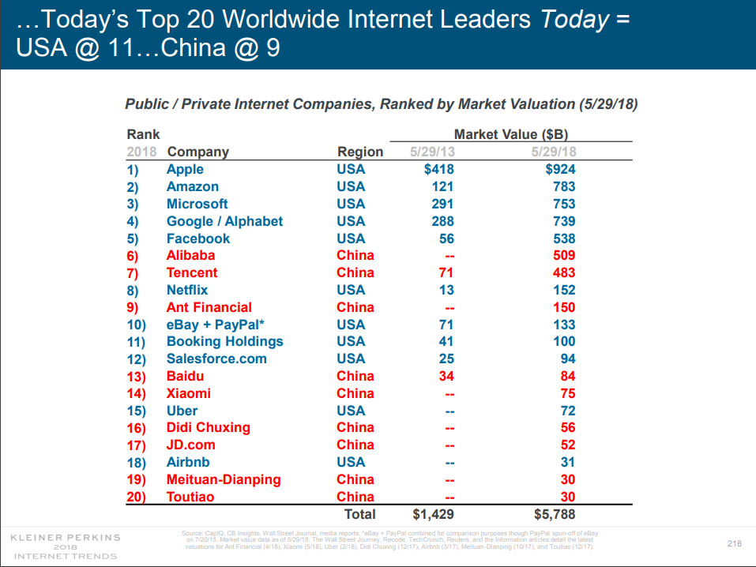

## Table of Contents

## What is considered a 'large' company in China?

In China, a 'large' company is usually defined by the number of employees and the amount of money it makes. The government says a company is large if it has more than 1,000 employees and makes over 400 million yuan in sales each year. This definition helps the government decide which companies need to follow special rules and regulations.

But, people in China might think of a company as 'large' in different ways. For example, if a company is very famous or has a big impact on the economy, people might call it large even if it doesn't meet the government's exact numbers. So, while the official definition is clear, what people think can be different.

## How are the largest Chinese companies ranked?

The largest Chinese companies are ranked mainly by looking at how much money they make each year. This is called revenue. Lists like the Fortune Global 500 or Forbes Global 2000 use this number to put companies in order from the biggest to the smallest. These lists show that companies like State Grid and Sinopec are at the top because they make a lot of money.

But, there are other ways to rank companies too. Some lists look at how much profit a company makes, or how much it is worth on the stock market. For example, the Hurun China 500 list might rank companies based on their value instead of just revenue. This can change which companies are seen as the biggest, because a company might not make the most money but could be very valuable or profitable.

## Which sectors do the largest Chinese companies primarily operate in?

The largest Chinese companies mostly work in energy, finance, and technology. In energy, companies like State Grid and Sinopec are huge because they provide electricity and oil to the whole country. These companies are important because they help keep the lights on and cars running. In finance, big banks like Industrial and Commercial Bank of China (ICBC) and Bank of China handle a lot of money and help businesses and people with their financial needs.

Technology is another big sector where companies like Huawei and Tencent are leaders. Huawei makes phones and other tech products that people use every day, while Tencent runs popular apps like WeChat. These tech companies are growing fast and are very important in China and around the world. They help people stay connected and make life easier with their technology.

Overall, these sectors are key to China's economy. Energy keeps the country running, finance helps with money matters, and technology drives innovation and communication. The biggest companies in these areas are not just big in China, but they are also some of the largest in the world.

## What are the top 5 largest Chinese companies by revenue?

The top 5 largest Chinese companies by revenue are State Grid, Sinopec, China National Petroleum Corporation (CNPC), Industrial and Commercial Bank of China (ICBC), and China Construction Bank (CCB). These companies are giants in their fields. State Grid is the biggest because it provides electricity to most of China. Sinopec and CNPC are huge because they deal with oil and gas, which are very important for the country's energy needs.

ICBC and CCB are big banks that handle a lot of money. They help people and businesses with their financial needs. These banks are important because they keep the economy running smoothly. All these companies make a lot of money each year, which is why they are at the top of the list for the largest Chinese companies by revenue.

## How do the largest Chinese companies compare to global companies in terms of size and revenue?

The largest Chinese companies are some of the biggest in the world when we look at their revenue. For example, State Grid, Sinopec, and China National Petroleum Corporation (CNPC) are often in the top spots on global lists like the Fortune Global 500. These companies make more money each year than many well-known global companies like Walmart or Amazon. This shows how big and important they are not just in China, but around the world.

However, when we look at other measures like market value or profit, the picture can be different. For example, tech giants like Apple or Microsoft might have higher market values than many Chinese companies, even if they don't make as much revenue. Also, some global companies might be more profitable than the biggest Chinese companies. So, while Chinese companies are huge in terms of revenue, they might rank differently when we consider other factors like market value or profit.

## What role do state-owned enterprises play among the largest Chinese companies?

State-owned enterprises (SOEs) are very important among the largest Chinese companies. Many of the biggest companies in China, like State Grid, Sinopec, and China National Petroleum Corporation (CNPC), are owned by the government. These companies are huge and make a lot of money. They are in important industries like energy and transportation. The government uses these companies to help control the economy and make sure that important services are available to everyone.

SOEs also have a big impact on the world. They are not just important in China, but they are some of the biggest companies globally. Because they are so big, they can affect prices and supplies of things like oil and electricity around the world. The Chinese government supports these companies and sometimes gives them special help, like loans or rules that make it easier for them to do business. This helps them stay big and strong, even when they compete with companies from other countries.

## How has the ranking of the largest Chinese companies changed over the past decade?

Over the past decade, the ranking of the largest Chinese companies has seen some big changes. Many state-owned enterprises (SOEs) like State Grid, Sinopec, and China National Petroleum Corporation (CNPC) have stayed at the top because they make a lot of money from energy. But, tech companies like Huawei and Alibaba have grown a lot too. They have moved up the list because more people are using their products and services. This shows that China's economy is changing, with tech becoming more important.

Also, some companies have changed places because of how well they do each year. For example, banks like Industrial and Commercial Bank of China (ICBC) and China Construction Bank (CCB) have been strong, but their exact spots on the list can change based on their profits and how much money they make. Overall, while the biggest companies are still mostly SOEs, the rise of tech companies shows that the future might bring even more changes to the rankings.

## What are the key financial metrics used to evaluate the performance of the largest Chinese companies?

The main financial metrics used to evaluate the performance of the largest Chinese companies are revenue, profit, and market value. Revenue is how much money a company makes from selling its products or services. It's a big deal because it shows how big the company is and how much business it does. Profit is what's left after a company pays all its bills. It tells us if the company is making money or losing it. Market value is how much the company is worth if you added up all its shares. This shows what investors think the company is worth.

These metrics help people see how well a company is doing. For example, a company with high revenue might be very big, but if its profit is low, it might not be doing well. On the other hand, a company with a high market value might be seen as a good investment, even if its revenue isn't the highest. By looking at these numbers, people can understand if a company is growing, making money, and if it's a good place to invest.

## How do the largest Chinese companies contribute to the national economy?

The largest Chinese companies play a big role in the national economy. They help by making a lot of money and creating jobs for many people. For example, companies like State Grid and Sinopec provide important services like electricity and oil, which keep the country running. When these companies do well, they pay taxes to the government, which can use that money to build roads, schools, and hospitals. They also help other businesses grow by buying things from them and working together.

These big companies also help China be strong in the world. They sell their products and services to other countries, which brings in money from outside. This is called exports, and it helps the economy grow. Also, when these companies invest in other countries, it can make China more important in the global market. Overall, the success of these large companies is very important for making China's economy strong and helping the country grow.

## What are the major challenges faced by the largest Chinese companies in the global market?

The largest Chinese companies face many challenges when they try to do business around the world. One big problem is that other countries sometimes don't trust them. This can happen because of political issues between China and other countries. For example, some countries might worry about security or think that Chinese companies are too close to the Chinese government. This can make it hard for these companies to sell their products or services in those countries.

Another challenge is competition. The global market is full of big companies from all over the world, like those from the United States, Europe, and Japan. These companies have been around for a long time and have strong brands that people know and trust. Chinese companies need to work hard to show that their products are just as good, or even better. They also need to deal with different rules and regulations in each country they want to do business in, which can be complicated and expensive.

## How do the largest Chinese companies approach innovation and technology adoption?

The largest Chinese companies put a lot of effort into innovation and technology adoption. They know that to stay big and strong, they need to keep coming up with new ideas and using the latest technology. For example, tech companies like Huawei and Tencent spend a lot of money on research and development. They work on new products like smartphones and apps that people want to use. Even companies in other industries, like State Grid and Sinopec, use technology to make their services better and more efficient. They use things like smart grids and new ways to find oil to stay ahead.

These companies also look outside of China for ideas and technology. They work with universities and other companies around the world to learn new things and bring them back to China. This helps them stay at the front of their industries. For example, they might buy technology from other countries or hire experts to help them. By doing this, they can keep improving their products and services, which helps them stay competitive in the global market.

## What are the future growth prospects for the largest Chinese companies in emerging markets?

The largest Chinese companies have good chances to grow in emerging markets. These are places like Africa, Southeast Asia, and Latin America where economies are growing fast. Chinese companies can sell their products and services there because people in these places need things like phones, cars, and electricity. Also, these companies can build factories and offices in these countries, which can help them make more money and create jobs. By doing this, they can become even bigger and more important around the world.

But, there are also challenges. Sometimes, people in these countries might not trust Chinese companies because of political issues or because they think the companies are too close to the Chinese government. Also, these companies have to follow different rules in each country, which can be hard and expensive. But if they can solve these problems, the largest Chinese companies can do very well in emerging markets. They can help these places grow and at the same time, make their own businesses even stronger.

## References & Further Reading

[1]: Bergstra, J., Bardenet, R., Bengio, Y., & Kégl, B. (2011). ["Algorithms for Hyper-Parameter Optimization."](https://papers.nips.cc/paper/4443-algorithms-for-hyper-parameter-optimization) Advances in Neural Information Processing Systems 24.

[2]: ["Advances in Financial Machine Learning"](https://www.amazon.com/Advances-Financial-Machine-Learning-Marcos/dp/1119482089) by Marcos Lopez de Prado

[3]: ["Evidence-Based Technical Analysis: Applying the Scientific Method and Statistical Inference to Trading Signals"](https://www.amazon.com/Evidence-Based-Technical-Analysis-Scientific-Statistical/dp/0470008741) by David Aronson

[4]: ["Machine Learning for Algorithmic Trading"](https://github.com/stefan-jansen/machine-learning-for-trading) by Stefan Jansen

[5]: ["Quantitative Trading: How to Build Your Own Algorithmic Trading Business"](https://www.amazon.com/Quantitative-Trading-Build-Algorithmic-Business/dp/1119800064) by Ernest P. Chan