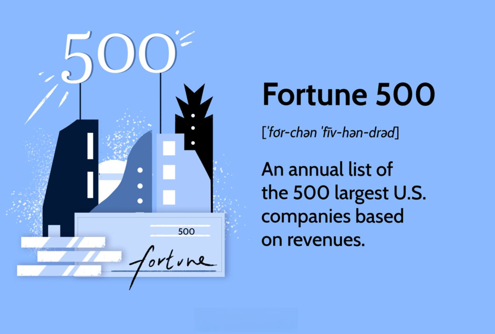

In the ever-evolving global business landscape, the rankings of the largest companies draw significant attention. These rankings unveil insights into economic powerhouses driving innovation, economic growth, and financial markets worldwide. Companies across diverse sectors such as retail, technology, oil, and healthcare are at the forefront of these rankings, reflecting the varied engines that propel global economies. 

This article aims to examine the largest companies in the world by revenue and market capitalization, alongside their pivotal roles in algorithmic trading. By analyzing these corporations, we gain a deeper understanding of how they leverage cutting-edge technologies to sustain their market positions and exert significant influence over global markets. 



In today’s technologically driven environment, the integration of advanced algorithms and big data analytics has become essential for maintaining competitive advantages. Corporations that effectively harness these tools are not only better positioned to optimize their operations but also play critical roles in shaping the global market landscape. Through continuous innovations and strategic deployments, these companies maintain substantial economic impacts that resonate across the globe. 

As we unpack the contributions and strategies of these global giants, we will illustrate the delicate interplay between technological adaptation and economic leadership, providing a comprehensive view of the modern business ecosystem.

## Table of Contents

## Top Market Capitals: The Giants of Industry

Market capitalization is an essential metric that provides insights into a company's size, performance, and growth potential. It is calculated by multiplying the company's current share price by its total number of outstanding shares. Companies with high market capitalization are often seen as industry leaders due to their economic significance and influence over market trends.

Currently, Microsoft stands at the forefront of market capitalization rankings. With its diversified range of products and services, from operating systems and cloud computing to gaming, Microsoft has consolidated its position as a technology leader. Its market value highlights its robust revenue-generating capacity and strategic innovation efforts.

Apple follows closely, driven by its iconic product lineup, including the iPhone, iPad, and MacBook. Apple's brand loyalty and continual innovation, particularly in consumer electronics, contribute significantly to its market capitalization. The company’s emphasis on integrating hardware and software ecosystems creates a compelling user experience, further solidifying its market position.

Another noteworthy company is Nvidia, a leader in the semiconductor industry. Nvidia's impact is primarily felt in graphics processing and AI applications, crucial areas driving modern technological advancement. Its innovation in GPU technology powers critical developments in gaming, automotive, and data centers.

While American companies like Microsoft, Apple, and Nvidia dominate these rankings, there are significant entries from Asia and Europe. For instance, the Taiwan Semiconductor Manufacturing Company (TSMC) highlights Asia's critical role in global tech manufacturing. TSMC's capabilities in producing advanced semiconductor chips are vital to the technology supply chain, emphasizing the global interconnectivity in tech innovation.

High market capitalization in sectors such as semiconductors and consumer electronics underscores continued technological advancements. Companies in these sectors are heavily investing in R&D to stay ahead, leading to faster, more efficient processors, and smarter consumer devices.

These industry giants' financial prowess and their contributions to technological trends underscore their pivotal role in shaping the economic landscape. They epitomize successful adaptation to market demands and continuous innovation, providing a blueprint for others aiming to scale similar heights in the global marketplace.

## Revenue Leaders: From Retail to Oil

Walmart, Amazon, and China Petroleum & Chemical Corp., commonly known as Sinopec, are among the top global companies ranked by revenue. These enterprises exemplify the substantial financial performance and market influence that come with catering to extensive consumer bases and trading in essential goods.

Retail and oil companies usually generate significant revenues thanks to their diverse clientele and the indispensable nature of their products and services. Walmart and Amazon, as leaders in the retail sector, benefit from vast customer reach and high-[volume](/wiki/volume-trading-strategy) sales, facilitated by their expansive networks of physical and digital stores. These factors contribute to their ability to capture a significant share of the consumer market, reinforcing their positions as major players in the global economy.

Walmart, headquartered in the United States, is known for its extensive network of discount department stores, supermarkets, and hypermarkets. Its business model focuses on providing a wide range of products at competitive prices, which are attractive to cost-conscious consumers. Walmart’s revenue, reaching over half a trillion dollars annually, underscores its dominance in the retail sector and its significant impact on consumer purchasing patterns across various markets.

Amazon, another American giant, has revolutionized the retail landscape with its e-commerce platform. The company's logistics infrastructure, advanced technology deployment, and membership programs like Amazon Prime have enabled it to achieve substantial revenue growth. Its customer-centric approach, combined with innovations in cloud services through Amazon Web Services (AWS), amplifies its influence beyond traditional retail, affecting various sectors globally.

China Petroleum & Chemical Corp. (Sinopec) highlights the importance of energy and oil industries in the global revenue rankings. As one of China's largest oil refining, gas, and petrochemical conglomerates, Sinopec plays a crucial role in meeting energy demands both domestically and internationally. The company's significant revenue figures reflect its expansive operations, including exploration, production, and commercialization of oil and gas products, which are essential components of the energy supply chain.

Retailers and oil corporations like Walmart, Amazon, and Sinopec must navigate complex supply chains that contribute to their economic dominance. These supply chains involve an intricate web of suppliers, manufacturers, distributors, and logistics providers, all working in tandem to ensure the smooth delivery of goods and services. Efficient supply chain management is crucial for maintaining market penetration and scaling operations to meet burgeoning consumer demands worldwide.

The financial success of these revenue leaders highlights their scale of operations and capability to penetrate markets effectively. Their substantial revenue figures not only reflect the size of their customer bases but also illustrate their strategic utilization of resources, mergers and acquisitions, and investments in technology and infrastructure. These strategies enhance their operational efficiencies and competitive positioning, ensuring sustained growth and influence in the global market landscape.

## The Role of Algorithmic Trading in Large Corporations

Algorithmic trading has fundamentally transformed how large corporations engage in financial markets by enabling them to execute trades with unparalleled speed and precision. Automated systems, which form the backbone of [algorithmic trading](/wiki/algorithmic-trading), rely on intricate mathematical models to analyze market data and execute transactions. These models enable trades at speeds far exceeding human capabilities, thereby providing corporations with a significant competitive advantage.

Technology sector giants are at the forefront of utilizing algorithmic trading to refine their trading strategies. By incorporating large volumes of real-time data and sophisticated algorithms, these corporations can dynamically adjust their trading positions, capitalize on market trends, and evade potential risks. The efficacy of algorithmic trading is exemplified by its domination in trading volumes on major stock exchanges. Estimates suggest that algorithmic trades account for a substantial portion of equity market transactions, highlighting their pivotal role in contemporary finance.

Moreover, corporations leverage big data analytics and [artificial intelligence](/wiki/ai-artificial-intelligence) to enhance their algorithmic trading systems. By processing vast datasets, these technologies aid in identifying patterns and insights that inform trading decisions, thus optimizing profitability while minimizing exposure to market [volatility](/wiki/volatility-trading-strategies). Python, a popular programming language in this field, offers libraries like NumPy and Pandas for data manipulation and analysis, while [machine learning](/wiki/machine-learning) frameworks such as TensorFlow and PyTorch can be used to develop predictive models based on historical trading data.

Here is an example of Python code that showcases a simplified moving average crossover strategy, a common approach in algorithmic trading:

```python
import pandas as pd

# Load historical stock price data
data = pd.read_csv('stock_data.csv')
data['Short_MA'] = data['Close'].rolling(window=40).mean()
data['Long_MA'] = data['Close'].rolling(window=100).mean()

# Identify buy and sell signals
data['Signal'] = 0
data.loc[data['Short_MA'] > data['Long_MA'], 'Signal'] = 1
data.loc[data['Short_MA'] < data['Long_MA'], 'Signal'] = -1

# Print the signals
print(data[['Date', 'Signal']])
```

This code calculates short and long-term moving averages of a stock's closing prices to determine potential buy and sell points, exemplifying how algorithmic systems can aid in developing systematic trading strategies.

In conclusion, algorithmic trading has become indispensable for large corporations seeking to enhance their market performance. Its reliance on automation, data analytics, and artificial intelligence enables these entities to execute trades with superior efficiency and strategic foresight, ensuring sustained profitability in the volatile financial markets.

## Impact of Global Corporations on Economy and Innovation

Global corporations significantly contribute to technological innovation and economic development by investing heavily in research and development (R&D). These investments not only lead to the creation of new products and services but also drive advancements in industrial processes and technologies. In 2022, global spending on R&D by leading corporations reached $1.375 trillion, with companies like Alphabet, Huawei, and Microsoft leading the charge, as reported by the Global Innovation 1000 study by Strategy&.

Through such R&D investments, global corporations exercise a profound impact on job creation, both directly within their companies and indirectly in external industries that support their operations. According to the World Economic Forum, the technology sector alone accounts for millions of jobs worldwide, as technological advancements necessitate specialized skill sets and create new opportunities across various fields.

These corporations, as industry leaders, have the power to set market trends and standards. Their innovative outputs become benchmarks that shape consumer expectations and drive market competition. For instance, Apple's introduction of the smartphone revolutionized mobile communication and spurred a cascade of innovations across the technology sector.

Resource allocation and strategic investments made by these corporations can significantly affect global markets and national economies. Their capacity to scale operations and enter new markets influences supply chains and economic activities at multiple levels. A notable example is Amazon's investment in logistics and fulfillment centers that transformed retail distribution models globally.

Comprehending the role of these large corporations provides valuable insights into potential future economic and technological trends. Their efforts in sustainability and green technology illustrate a shift toward more environmentally conscious practices, which is likely to become prominent in global economic strategies. As the influence of these corporations spans continents and industries, understanding their operations and strategic directions is crucial for predicting economic futures and fostering innovation. This knowledge aids smaller firms and startups in aligning their growth strategies with these market leaders, ultimately contributing to a more cohesive and progressive economic landscape.

## Conclusion

The rankings of the largest global corporations highlight their pivotal roles in driving economic and technological progress. These corporations, with their substantial revenues and significant market capitalizations, are primary architects of the global market environment. Companies like Microsoft, Apple, and Walmart not only cement themselves as economic powerhouses through impressive financial metrics but also serve as innovation leaders that inspire other firms to follow their lead.

Algorithmic trading exemplifies the strategic use of technology among these giants, as it allows them to execute trades with remarkable speed and efficiency. By deploying sophisticated algorithms and processing vast amounts of data, these corporations can make enhanced financial decisions that optimize profitability while mitigating risks. The prevalence of algorithmic trading in the financial operations of these large firms underscores their commitment to utilizing cutting-edge technology to maintain a competitive edge.

For smaller entities aiming for growth, there is much to learn by observing the strategies and innovations of these global giants. Whether it's adopting their use of technology to improve efficiency or emulating their research and development practices to foster innovation, these corporations offer a wealth of actionable insights.

As the market landscape continues to evolve, it is clear that these giants will maintain their influential roles in shaping both our economic future and our interactions on a global scale. Their decisions, strategies, and innovations will continue to reverberate throughout the global economy, impacting everything from job creation to technological advancements. Understanding the dynamics that propel these corporations forward provides key insights into the future directions of industries worldwide.

## References & Further Reading

[1]: Bergstra, J., Bardenet, R., Bengio, Y., & Kégl, B. (2011). ["Algorithms for Hyper-Parameter Optimization."](https://proceedings.neurips.cc/paper/2011/file/86e8f7ab32cfd12577bc2619bc635690-Paper.pdf) Advances in Neural Information Processing Systems 24.

[2]: ["Advances in Financial Machine Learning"](https://www.amazon.com/Advances-Financial-Machine-Learning-Marcos/dp/1119482089) by Marcos Lopez de Prado

[3]: ["Evidence-Based Technical Analysis: Applying the Scientific Method and Statistical Inference to Trading Signals"](https://www.semanticscholar.org/paper/Evidence-Based-Technical-Analysis%3A-Applying-the-and-Aronson/3b33df8737f1772e9e14d66a08c9696f140a2ee1) by David Aronson

[4]: ["Machine Learning for Algorithmic Trading"](https://github.com/stefan-jansen/machine-learning-for-trading) by Stefan Jansen

[5]: ["Quantitative Trading: How to Build Your Own Algorithmic Trading Business"](https://www.amazon.com/Quantitative-Trading-Build-Algorithmic-Business/dp/1119800064) by Ernest P. Chan

[6]: PwC. (2022). [Global Innovation 1000](https://www.strategyand.pwc.com/gx/en/insights/innovation1000.html) Study, Strategy&.

[7]: World Economic Forum. [Technology and Innovation](https://www.weforum.org/stories/2024/06/top-10-emerging-technologies-of-2024-impact-world/) Insights.