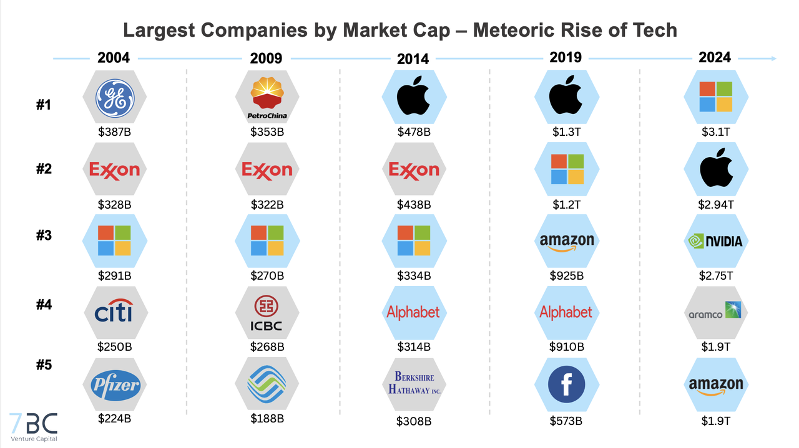

## Table of Contents

## What is market capitalization?

Market capitalization, often called market cap, is the total value of all the shares of a company. You can find it by multiplying the number of shares a company has by the price of one share. It shows how big a company is in terms of money. For example, if a company has 1 million shares and each share costs $50, the market cap would be $50 million.

Market cap is important because it helps investors understand a company's size and compare it with other companies. It can tell you if a company is a small, medium, or large business. Investors often use market cap to decide which companies to invest in. A bigger market cap usually means a company is more stable, but it can also mean it might not grow as fast as smaller companies.

## How is market capitalization calculated?

Market capitalization is calculated by multiplying the total number of a company's shares by the current price of one share. For example, if a company has 2 million shares and each share is worth $10, the market capitalization would be $20 million. This calculation gives you the total value of the company based on what people are willing to pay for its shares at that moment.

This number can change every day because the price of shares goes up and down. If the share price goes up, the market capitalization goes up too. If the share price goes down, the market capitalization goes down. It's a simple way to see how much the whole company is worth in the stock market.

## Why is market capitalization important for evaluating companies?

Market capitalization is important for evaluating companies because it shows how big a company is in terms of money. When you know a company's market cap, you can compare it with other companies to see which one is bigger or smaller. This helps investors understand where a company stands in the market. For example, a company with a high market cap might be seen as more stable and less risky, while a company with a lower market cap might be seen as riskier but with more potential for growth.

Market cap also helps investors make decisions about where to put their money. If an investor wants to invest in big, stable companies, they might look for companies with a high market cap. On the other hand, if they want to invest in smaller companies that might grow a lot, they might look for companies with a lower market cap. By using market cap, investors can choose the right kind of companies for their investment goals.

## What are the current top 10 companies by market capitalization?

The current top 10 companies by market capitalization are led by big tech and finance companies. As of the latest data, Apple is number one with a market cap of over $2 trillion. Microsoft is close behind in second place with a market cap of around $1.9 trillion. Saudi Aramco, the oil giant, is third with a market cap of about $1.8 trillion. Alphabet, the company behind Google, is fourth with a market cap of around $1.5 trillion. Amazon rounds out the top five with a market cap of roughly $1.4 trillion.

The next five companies include NVIDIA, which is known for its graphics processing units, with a market cap of about $1.2 trillion. Tesla, the electric vehicle maker, comes in at number seven with a market cap of around $800 billion. Meta Platforms, formerly known as Facebook, is eighth with a market cap of about $750 billion. Berkshire Hathaway, the conglomerate run by Warren Buffett, is ninth with a market cap of roughly $700 billion. Finally, TSMC, a major semiconductor company, completes the top 10 with a market cap of around $600 billion. These numbers can change as stock prices go up and down, but these companies are currently the biggest in the world by market value.

## How has the list of largest companies by market capitalization changed over the past decade?

Over the past decade, the list of the largest companies by market capitalization has seen significant changes, reflecting shifts in technology, energy, and consumer trends. At the start of the decade, companies like ExxonMobil and PetroChina were among the top, showing the dominance of the energy sector. However, as technology took over, companies like Apple, Microsoft, and Amazon rose to the top. Apple, for instance, became the first company to reach a $1 trillion market cap in 2018, and later $2 trillion in 2020, showcasing the growth of tech giants.

The rise of new tech companies like Alphabet and Tesla also marked a shift. Alphabet, which owns Google, entered the top ranks as the internet became more central to daily life. Tesla, led by Elon Musk, grew rapidly due to the increasing focus on electric vehicles and sustainable energy. Meanwhile, traditional giants like General Electric fell out of the top ranks, showing how quickly market dynamics can change. Overall, the past decade has been defined by the rise of technology and a move away from traditional industries like energy and manufacturing.

## What industries are most represented in the list of largest companies by market capitalization?

The industries most represented in the list of largest companies by market capitalization are technology and energy. Technology companies like Apple, Microsoft, Alphabet, Amazon, and NVIDIA make up a big part of the list. These companies are important because they make products and services that many people use every day, like smartphones, computers, and internet services. Their growth over the past few years shows how much people rely on technology.

Energy is another big industry on the list, with companies like Saudi Aramco. This shows that even though technology is growing fast, energy is still very important. Energy companies help the world run by providing oil and other fuels. The mix of technology and energy in the top companies shows that both new and traditional industries can be very valuable.

## How does market capitalization correlate with a company's financial health?

Market capitalization can give you a quick idea of how big a company is, but it doesn't tell you everything about its financial health. A company's market cap is based on the price people are willing to pay for its shares, which can go up or down every day. This price can be influenced by many things, like how people feel about the company or what's happening in the economy. So, a high market cap might mean people think the company is doing well, but it doesn't show if the company is making money or if it has a lot of debt.

To really understand a company's financial health, you need to look at other things too, like its profits, how much debt it has, and how well it's managing its money. For example, a company might have a high market cap but also a lot of debt, which could be risky. Or, a company might have a lower market cap but be making good profits and growing steadily. So, while market cap is a useful number to know, it's just one piece of the puzzle when you're trying to figure out if a company is financially healthy.

## What role do stock prices play in determining market capitalization?

Stock prices are really important when it comes to figuring out a company's market capitalization. Market cap is just the total number of a company's shares multiplied by the price of one share. So, if the stock price goes up, the market cap goes up too, and if the stock price goes down, the market cap goes down. This means that changes in the stock price can make a big difference in how much a company is worth according to the market.

Stock prices can change for lots of reasons, like how well the company is doing, what's happening in the economy, or even what people think about the company. When lots of people want to buy a company's stock, the price goes up because there's more demand. If people start selling the stock, the price can go down. So, the stock price is like a daily report card on what people think about the company, and it directly affects the company's market capitalization.

## Can you explain the impact of mergers and acquisitions on a company's market capitalization?

When companies merge or one company buys another, it can change their market capitalization a lot. If two companies join together, their market caps add up to make a bigger total market cap for the new, bigger company. For example, if Company A has a market cap of $100 billion and Company B has a market cap of $50 billion, when they merge, the new company's market cap could be around $150 billion. But, the stock price might go up or down after the merger because people might think the new company will do better or worse. So, the final market cap could be different from just adding the two together.

Sometimes, when a company buys another company, it pays more than the market cap of the company it's buying. This is called paying a premium. For example, if Company C wants to buy Company D, and Company D's market cap is $20 billion, Company C might offer $25 billion to buy it. This means the total market cap of Company C after the acquisition would go up by more than just Company D's market cap. The stock price of Company C might also change based on whether people think the acquisition was a good idea or not. So, mergers and acquisitions can really shake things up and change how much a company is worth in the stock market.

## How do global economic conditions affect the market capitalization of companies?

Global economic conditions can have a big impact on the market capitalization of companies. When the economy is doing well, people feel more confident about investing and spending money. This can make stock prices go up, which means the market cap of companies goes up too. For example, if there's a lot of growth and jobs, people might buy more stocks, pushing up the prices. Also, if interest rates are low, it's cheaper for companies to borrow money to grow, which can make investors think the company will do better in the future, so they might pay more for the stock.

On the other hand, when the economy is struggling, it can hurt market caps. If there's a recession or a lot of uncertainty, people might sell their stocks because they're worried about losing money. This can make stock prices fall, and so the market cap of companies goes down. For instance, during a financial crisis, like the one in 2008, many companies saw their market caps drop a lot because people were scared and didn't want to invest. Also, if inflation is high, it can make people less willing to spend or invest, which can also push down stock prices and market caps.

## What are the differences between market capitalization and other valuation metrics like enterprise value?

Market capitalization and enterprise value are both ways to figure out how much a company is worth, but they look at different things. Market capitalization, or market cap, is pretty simple. It's just the total number of a company's shares multiplied by the price of one share. This tells you what the market thinks the company is worth right now. It's easy to find and understand, but it doesn't take into account things like debt or cash the company has.

Enterprise value, on the other hand, gives you a more complete picture of a company's value. It starts with the market cap but then adds the company's debt and subtracts its cash and cash equivalents. This means enterprise value shows what it would cost to buy the whole company, including taking on its debt and getting its cash. It's a bit more complicated to calculate, but it's useful for understanding the real cost of buying a company, especially if you're thinking about a merger or acquisition. So, while market cap is a snapshot of what the market thinks, enterprise value gives you a fuller picture of the company's financial situation.

## How can investors use market capitalization data to make informed investment decisions?

Investors can use market capitalization data to understand how big a company is and where it stands compared to others. When you know a company's market cap, you can see if it's a small, medium, or large company. This helps you decide what kind of company you want to invest in. If you're looking for stable, big companies, you might choose ones with a high market cap. If you want to invest in smaller companies that might grow a lot, you'd look for ones with a lower market cap. By comparing market caps, you can also see how a company is doing over time and how it stacks up against its competitors.

Market capitalization also helps investors see how the market feels about a company. If a company's market cap goes up, it means people are willing to pay more for its shares, which might mean they think the company is doing well or will do well in the future. On the other hand, if the market cap goes down, it could mean people are worried about the company or think it won't do as well. By watching these changes, investors can make smarter choices about when to buy or sell stocks. But remember, market cap is just one piece of information. It's important to look at other things like a company's profits, debt, and how well it's managing its money to get a full picture of its health.

## What is Understanding Market Capitalization?

Market capitalization, often referred to as "market cap," is a critical financial metric used to assess the size and financial strength of publicly traded companies. It is calculated by multiplying the current share price by the total number of outstanding shares. Mathematically, it is expressed as:

$$
\text{Market Capitalization} = \text{Share Price} \times \text{Total Outstanding Shares}
$$

This metric serves as an indicator of a company's market valuation and is commonly used by investors to gauge its size relative to others.

**Importance in Assessing Company Size and Financial Strength**

Market capitalization provides a snapshot of a company's market value, reflecting investor sentiment and market perceptions of its future prospects. It is crucial for investors in assessing a company’s size because it enables comparisons with other companies, not just based on financial statements, but on market valuation. Larger market caps typically suggest that a company is well-established with stable revenue streams, whereas smaller market caps may indicate potential for growth but entail higher risk.

**Impact on Investor Perception and Decision-Making**

The size of a company's market cap influences investor perception significantly. Large-cap companies, with market capitalizations of $10 billion or more, are often seen as low-risk investments due to their established market presence and financial stability. On the other hand, small-cap companies (less than $2 billion market cap) might be perceived as riskier but potentially rewarding investments due to their growth potential. Mid-cap companies, with market caps between $2 billion and $10 billion, are often viewed as a balanced investment option offering growth with moderate risk.

**Comparisons Between Market Cap Categories**

Market capitalization categories help investors make decisions based on risk tolerance, growth expectations, and investment strategies. Large-cap companies are typically industry leaders with significant market influence. Mid-cap companies may represent emerging industries or growing companies within established sectors. Small-cap companies offer opportunities for high growth but [carry](/wiki/carry-trading) higher risks due to less market power and financial resources.

**Trends and Shifts in Rankings of Top Companies**

Market capitalization rankings are dynamic, influenced by numerous factors including financial performance, market conditions, and economic trends. Companies such as Apple, Microsoft, and Saudi Aramco have consistently maintained top positions due to their innovation, global reach, and robust financial performance. Trends such as technological advancements, changing consumer preferences, and geopolitical factors can cause shifts in these rankings. Emerging industries, particularly in technology and renewable energy, often witness rapid changes in market capitalization rankings driven by innovation and investor interest.

In conclusion, market capitalization is a vital metric for understanding a company's financial health and its standing relative to other market players. It influences how investors perceive investment opportunities, shaping their strategies based on different market cap categories. The ongoing shifts in market capitalization rankings reflect the evolving landscape of global business, driven by innovation and changing economic conditions.

## References & Further Reading

[1]: Bergstra, J., Bardenet, R., Bengio, Y., & Kégl, B. (2011). ["Algorithms for Hyper-Parameter Optimization."](https://papers.nips.cc/paper/4443-algorithms-for-hyper-parameter-optimization) Advances in Neural Information Processing Systems 24.

[2]: ["Advances in Financial Machine Learning"](https://www.amazon.com/Advances-Financial-Machine-Learning-Marcos/dp/1119482089) by Marcos Lopez de Prado

[3]: ["Evidence-Based Technical Analysis: Applying the Scientific Method and Statistical Inference to Trading Signals"](https://www.amazon.com/Evidence-Based-Technical-Analysis-Scientific-Statistical/dp/0470008741) by David Aronson

[4]: ["Machine Learning for Algorithmic Trading"](https://github.com/PacktPublishing/Machine-Learning-for-Algorithmic-Trading-Second-Edition) by Stefan Jansen

[5]: ["Quantitative Trading: How to Build Your Own Algorithmic Trading Business"](https://www.amazon.com/Quantitative-Trading-Build-Algorithmic-Business/dp/0470284889) by Ernest P. Chan