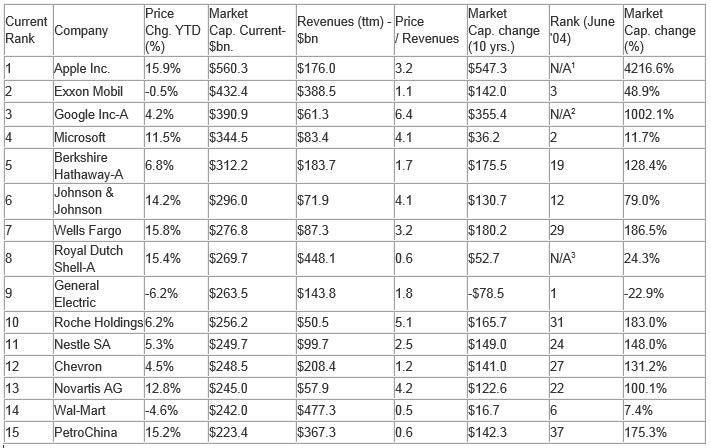

Market capitalization is a key financial metric used to determine the size and value of a publicly traded company. It is calculated by multiplying the current share price of a company by its total number of outstanding shares. This metric provides an indication of a company's overall value in the market and serves as an essential determinant for classifying companies into various categories such as large-cap, mid-cap, and small-cap. Large-cap companies, typically with market capitalizations exceeding $10 billion, are typically seen as stable, with market perceptions often viewing them as leaders in their industries. In contrast, small-cap companies possess higher growth potential but may present greater risk to investors.

Algorithmic trading refers to the use of computer algorithms to automate trading processes based on predefined criteria such as timing, price, or quantity. This type of trading has dramatically transformed financial markets by enhancing trading efficiency and liquidity. High-frequency trading (HFT), a subset of algorithmic trading, executes orders at incredibly rapid speeds, often completing transactions within milliseconds. This technological advancement has led to increased market dynamics, influencing stock price volatility and creating new challenges alongside substantial opportunities for market participants.

This article centers around the largest companies by market capitalization and their involvement within the scope of algorithmic trading. These companies often leverage their substantial resources to harness cutting-edge trading technologies, integrating proprietary algorithms within their operations to maintain competitive advantages. The purpose of this discussion is to explore how these dominant market forces intersect with advanced trading strategies, impacting their market positions and the broader financial ecosystem.

Understanding the influence of these leading companies in employing algorithmic trading strategies is vital. Their actions not only drive significant portions of daily trading volumes but also shape market practices and regulatory considerations. In an era where technology and finance are increasingly intertwined, recognizing how market capitalization leaders utilize algorithmic trading provides key insights into future developments and emerging trends in global financial markets.

## Table of Contents

## Understanding Market Capitalization

Market capitalization, often referred to as "market cap," is a critical financial metric used to assess the size and financial strength of publicly traded companies. It is calculated by multiplying the current share price by the total number of outstanding shares. Mathematically, it is expressed as:

$$
\text{Market Capitalization} = \text{Share Price} \times \text{Total Outstanding Shares}
$$

This metric serves as an indicator of a company's market valuation and is commonly used by investors to gauge its size relative to others.

**Importance in Assessing Company Size and Financial Strength**

Market capitalization provides a snapshot of a company's market value, reflecting investor sentiment and market perceptions of its future prospects. It is crucial for investors in assessing a company’s size because it enables comparisons with other companies, not just based on financial statements, but on market valuation. Larger market caps typically suggest that a company is well-established with stable revenue streams, whereas smaller market caps may indicate potential for growth but entail higher risk.

**Impact on Investor Perception and Decision-Making**

The size of a company's market cap influences investor perception significantly. Large-cap companies, with market capitalizations of $10 billion or more, are often seen as low-risk investments due to their established market presence and financial stability. On the other hand, small-cap companies (less than $2 billion market cap) might be perceived as riskier but potentially rewarding investments due to their growth potential. Mid-cap companies, with market caps between $2 billion and $10 billion, are often viewed as a balanced investment option offering growth with moderate risk.

**Comparisons Between Market Cap Categories**

Market capitalization categories help investors make decisions based on risk tolerance, growth expectations, and investment strategies. Large-cap companies are typically industry leaders with significant market influence. Mid-cap companies may represent emerging industries or growing companies within established sectors. Small-cap companies offer opportunities for high growth but [carry](/wiki/carry-trading) higher risks due to less market power and financial resources.

**Trends and Shifts in Rankings of Top Companies**

Market capitalization rankings are dynamic, influenced by numerous factors including financial performance, market conditions, and economic trends. Companies such as Apple, Microsoft, and Saudi Aramco have consistently maintained top positions due to their innovation, global reach, and robust financial performance. Trends such as technological advancements, changing consumer preferences, and geopolitical factors can cause shifts in these rankings. Emerging industries, particularly in technology and renewable energy, often witness rapid changes in market capitalization rankings driven by innovation and investor interest.

In conclusion, market capitalization is a vital metric for understanding a company's financial health and its standing relative to other market players. It influences how investors perceive investment opportunities, shaping their strategies based on different market cap categories. The ongoing shifts in market capitalization rankings reflect the evolving landscape of global business, driven by innovation and changing economic conditions.

## What is Algorithmic Trading?

Algorithmic trading refers to the use of computer algorithms to execute trading strategies in financial markets. These algorithms follow pre-set instructions for trade execution, encompassing timing, price, and [volume](/wiki/volume-trading-strategy). The primary goal of [algorithmic trading](/wiki/algorithmic-trading) is to optimize the efficiency of trades by minimizing market impact and maximizing potential profits.

The development of algorithmic trading dates back to the early 1970s when electronic exchanges first emerged, allowing for automated trade execution. However, significant advancements occurred in the late 1990s and early 2000s with the proliferation of high-speed internet and computing power. High-frequency trading ([HFT](/wiki/high-frequency-trading-strategies)) became a prominent subset of algorithmic trading in this period, characterized by rapid trade execution at microsecond speeds to exploit small price discrepancies.

Key technologies and methods employed in algorithmic trading include high-frequency trading, [machine learning](/wiki/machine-learning) algorithms, statistical [arbitrage](/wiki/arbitrage), and quantitative analysis. High-frequency trading leverages powerful computing systems to execute a large number of orders at extremely fast speeds, often taking advantage of small market inefficiencies. Machine learning algorithms, on the other hand, are employed to analyze vast datasets, identify patterns, and adapt trading strategies based on historical data and current market conditions.

Algorithmic trading has numerous benefits, including increased speed and efficiency in trade execution and reduced costs. It allows for the execution of complex strategies with precision and discipline, removing human emotions from the trading process. This can lead to better pricing and improved [liquidity](/wiki/liquidity-risk-premium) in financial markets, as algorithms can swiftly react to market changes and execute trades instantaneously.

However, algorithmic trading also presents challenges and controversies. One of the primary concerns is its impact on market stability. The rapid execution of large volumes of trades can contribute to increased [volatility](/wiki/volatility-trading-strategies) and, in extreme cases, cause flash crashes—sudden, significant drops in asset prices within a short time frame. The May 6, 2010, flash crash is a notable example where the Dow Jones Industrial Average plummeted about 1,000 points within minutes before quickly recovering.

Regulatory scrutiny has intensified as algorithmic trading has grown, with various measures introduced to mitigate potential risks. Regulations often focus on enhancing transparency, implementing circuit breakers to halt trading during extreme volatility, and ensuring fair access to market data and trading infrastructure.

In conclusion, while algorithmic trading offers significant advantages in terms of speed, efficiency, and cost reduction, it also poses challenges that necessitate careful management and regulation to preserve market integrity. Understanding these dynamics is crucial for investors, regulators, and market participants as algorithmic trading continues to evolve and shape modern financial markets.

## Top Companies by Market Capitalization

As of 2023, the current list of the largest companies by market capitalization represents a dynamic snapshot of the global economy. Market capitalization, calculated as the product of a company's outstanding shares and its current share price, serves as a metric of a company's overall market value and financial strength.

### Current List of the Largest Companies

The largest companies by market capitalization are predominantly concentrated in the technology and consumer sectors. Companies typically appearing at the top include Apple Inc., Microsoft Corporation, Saudi Aramco, Alphabet Inc. (Google's parent company), and Amazon.com Inc. These corporations consistently leverage technological advances to maintain and expand their market value.

### Factors Driving Market Dominance

Several factors contribute to the market dominance of these companies:

1. **Innovation**: Companies like Apple and Amazon continue to lead through continuous innovation in their product offerings, integrating cutting-edge technology and expanding their ecosystem. Apple's focus on expanding its service-based revenue and Amazon's diversification into new business lines like cloud computing and AI illustrate strategic innovation.

2. **Global Reach**: The international presence of these companies allows them to tap into emerging economies, broadening their consumer base. For instance, Microsoft's global cloud infrastructure provides services to businesses worldwide, influencing its market cap positively.

3. **Financial Performance**: Strong financial metrics, including revenue growth, profit margins, and cash reserves, have helped these corporations secure investor confidence. Companies like Microsoft and Alphabet routinely post robust earnings reports, reinforcing their market leadership.

### Case Studies of Rapid Growth

The rapid market capitalization growth of certain companies offers insightful case studies. Tesla, Inc., for instance, experienced significant market cap growth over the past decade, driven by its pioneering role in the electric vehicle industry and strategic moves into energy solutions. Its focus on sustainable technology and innovation in automotive technology contributed to its ascent.

Similarly, NVIDIA Corporation saw its market capitalization surge due to its dominance in the graphics processing unit (GPU) market and strategic investment in AI and data center solutions. The increased demand for processing power in these fields supported NVIDIA's substantial market cap growth.

### Projected Trends and Potential Contenders

Looking forward, emerging sectors like renewable energy, biotechnology, and [artificial intelligence](/wiki/ai-artificial-intelligence) have the potential to introduce new leaders in market capitalization. Companies investing heavily in these areas could rise in prominence as they capture market share in burgeoning industries.

Furthermore, geopolitical shifts and changes in global trade policies might affect market dynamics, providing opportunities for companies based in developing economies to ascend the rankings. Agile firms that effectively manage these macroeconomic changes may emerge as significant players.

In summary, the largest companies by market capitalization maintain their standings through innovation, global outreach, and strong financial results. Understanding these dynamics offers investors and market observers valuable insights into potential future shifts in market leadership.

## Involvement of Top Companies in Algorithmic Trading

Major companies listed on stock exchanges often employ algorithmic trading strategies to enhance trading efficiency, capitalize on market opportunities, and manage large trading volumes with precision. The integration of these strategies is not only a testament to their technological prowess but also a significant [factor](/wiki/factor-investing) in maintaining their market dominance.

One primary example of a corporation prominently leveraging algorithmic trading is Goldman Sachs. The firm has developed complex proprietary algorithms designed to execute trades across various asset classes at optimal speeds and prices. These algorithms evaluate vast datasets in real-time, identifying trends and executing trades based on pre-defined criteria. The implementation of such technology has facilitated a reduction in transaction costs, enhanced liquidity provisioning, and contributed significantly to the firm's revenue streams. In fact, a substantial portion of Goldman's trades is executed via algorithmic strategies, highlighting its vital role in operations.

Another noteworthy player is Morgan Stanley, which integrates machine learning elements within its algorithmic trading frameworks. By incorporating advanced analytics, Morgan Stanley can refine its market predictions and adapt rapidly to shifting market conditions. Their proprietary algorithms employ predictive analytical models that enhance trade success rates and profitability. Such strategic implementation aids Morgan Stanley in maintaining competitiveness in the volatile financial markets.

The influence of algorithmic trading on revenue and market positioning is profound. For many top firms, a significant share of profits stems from activities linked to trading. By optimizing execution speed and minimizing human error, algorithmic trading enhances their ability to engage in high-frequency trading, thereby increasing the volume and success of trades executed. This automation also allows these companies to engage in strategies such as arbitrage, [market making](/wiki/market-making), and statistical trading with greater efficiency.

Looking towards the future, the role of algorithmic trading in supporting company growth appears poised for expansion. With the ongoing development of artificial intelligence and machine learning, trading algorithms are expected to become even more sophisticated. These technological advancements could lead to further efficiency improvements and strategic advantages for companies adept at integrating these innovations. Furthermore, the expansion of digital assets and the evolution of new markets are likely to present additional opportunities for algorithmic optimization.

In summary, the adoption and evolution of algorithmic trading strategies by major companies are integral to maintaining their market dominance and driving future growth. As technology progresses, these firms are likely to remain at the forefront, using cutting-edge algorithms to navigate and influence an increasingly complex financial landscape.

## Impact of Algorithmic Trading on Market Dynamics

Algorithmic trading, also known as algo trading, has a profound influence on stock price volatility and market liquidity. By employing pre-programmed algorithms to perform trades at speeds and frequencies beyond human capability, this method significantly enhances liquidity. More orders are executed in less time, facilitating smoother transitions and reducing the bid-ask spreads, thus improving overall market efficiency.

The distribution of trading volume between human traders and algo-driven trades has shifted dramatically, with algorithms now accounting for a substantial portion of trading activities. According to a 2019 report by the Bank for International Settlements, algorithmic trading is estimated to contribute to 60-73% of equity trading volume in the United States, showcasing its dominance over traditional human-driven trades. This shift underscores the power and pervasiveness of technology in contemporary financial markets.

However, while algorithmic trading boosts liquidity, it is also associated with potential market stability risks. One significant concern is the occurrence of flash crashes, where rapid, automated trade executions can lead to severe market disruptions within a short period. The Flash Crash of May 6, 2010, is a notable example when the Dow Jones Industrial Average plunged about 1,000 points within minutes, primarily due to high-frequency trading algorithms acting in concert.

Large-cap companies play a pivotal role in shaping the algorithmic trading landscape. With vast resources, these companies invest heavily in developing sophisticated trading algorithms that enhance their market positioning and competitive advantage. Their influence is profound, as they not only drive significant market volumes but also set trends and standards within the industry.

Regulatory bodies, in response to the challenges posed by high-frequency and algorithmic trading, have implemented measures to mitigate associated risks. Regulators like the U.S. Securities and Exchange Commission (SEC) have introduced circuit breakers, which halt trading temporarily if prices fluctuate beyond predetermined thresholds within a short timeframe. Such mechanisms aim to curtail the velocity of trading and prevent systemic shocks, thereby maintaining market order and stability.

In summary, while algorithmic trading brings notable advantages in terms of speed and efficiency, it also necessitates careful consideration of its impact on market dynamics and stability. Balancing innovation with robust regulatory frameworks is crucial to harness the full potential of algo trading while safeguarding the integrity of financial markets.

## Conclusion

Market capitalization and algorithmic trading represent two significant aspects of the modern financial landscape, intertwining to shape the dynamics of global markets. Market capitalization serves as a barometer of a company's size, stability, and financial strength, directly influencing investor perceptions and strategies. Companies with substantial market capitalizations wield considerable influence in financial markets, often setting trends that smaller firms follow.

Algorithmic trading, on the other hand, harnesses cutting-edge technologies, including high-frequency trading and machine learning algorithms, to execute trades with unprecedented speed and efficiency. This technological advancement allows the largest companies to enhance their market positions by streamlining operations and maximizing profits. Consequently, these entities drive significant volumes of trading activity, affecting market liquidity and volatility.

For investors and market observers, understanding the relationship between market capitalization and algorithmic trading is crucial. The largest companies' integration of algorithmic strategies informs investment decisions and portfolio management tactics. Investors must remain cognizant of how these companies utilize technology to maintain their competitive edges, as this knowledge can provide a strategic advantage in anticipating market shifts.

Looking ahead, algorithmic trading will undoubtedly continue to evolve, adopting emerging technologies such as quantum computing and advanced data analytics. These advancements will likely further refine trading strategies, potentially enhancing decision-making processes in financial markets. The ongoing development of these technologies suggests a future where market reactions are increasingly swift and efficient, albeit possibly more complex to predict.

Continuing research and monitoring of these financial innovations are essential. They offer insights into market behaviors and inform regulatory policies aimed at maintaining market stability. As algorithmic trading becomes increasingly sophisticated, it is imperative that market participants and regulators work collaboratively to ensure a balanced and resilient financial ecosystem. This ongoing exploration into market capitalization and algorithmic trading will support informed decision-making, fostering a deeper understanding of market operations and safeguarding against potential systemic risks.

## References & Further Reading

[1]: Bergstra, J., Bardenet, R., Bengio, Y., & Kégl, B. (2011). ["Algorithms for Hyper-Parameter Optimization."](https://papers.nips.cc/paper/4443-algorithms-for-hyper-parameter-optimization) Advances in Neural Information Processing Systems 24.

[2]: ["Advances in Financial Machine Learning"](https://www.amazon.com/Advances-Financial-Machine-Learning-Marcos/dp/1119482089) by Marcos Lopez de Prado

[3]: ["Evidence-Based Technical Analysis: Applying the Scientific Method and Statistical Inference to Trading Signals"](https://www.amazon.com/Evidence-Based-Technical-Analysis-Scientific-Statistical/dp/0470008741) by David Aronson

[4]: ["Machine Learning for Algorithmic Trading"](https://github.com/PacktPublishing/Machine-Learning-for-Algorithmic-Trading-Second-Edition) by Stefan Jansen

[5]: ["Quantitative Trading: How to Build Your Own Algorithmic Trading Business"](https://www.amazon.com/Quantitative-Trading-Build-Algorithmic-Business/dp/0470284889) by Ernest P. Chan