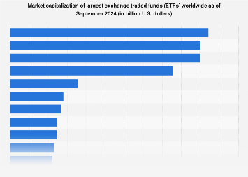

## Table of Contents

## What is an ETF?

An ETF, or Exchange-Traded Fund, is a type of investment that works a bit like a mutual fund but can be bought and sold on a stock exchange, just like a stock. It's a way for people to invest in a bunch of different things at once, like stocks, bonds, or commodities, without having to buy each one separately. This makes it easier and often cheaper for people to diversify their investments.

ETFs are popular because they offer a lot of flexibility. You can buy and sell them anytime during the trading day at the current market price, unlike mutual funds which are only priced at the end of the day. This means you can react quickly to changes in the market. Also, ETFs often have lower fees than mutual funds, which can save you money over time.

## What does 'developed market' mean in the context of ETFs?

A 'developed market' in the context of ETFs refers to countries that have strong, stable economies with advanced financial systems. These countries usually have high standards of living, good infrastructure, and well-regulated markets. Examples of developed markets include the United States, Japan, and most countries in Western Europe. When you invest in an ETF that focuses on developed markets, you're putting your money into companies from these countries.

ETFs that target developed markets can be a good choice if you're looking for stability and lower risk compared to investing in emerging or frontier markets. These ETFs often include a mix of large, well-known companies that have been around for a long time and are less likely to experience big swings in value. However, because these markets are already well-developed, the potential for high growth might be lower than in less developed markets.

## Why might someone invest in a developed market ETF?

Someone might invest in a developed market [ETF](/wiki/etf-trading-strategies) because it's a safe and steady way to grow their money. These ETFs include companies from countries with strong economies, like the U.S., Japan, and many in Europe. Because these countries have good rules and systems in place, the companies there are usually stable and less likely to have big ups and downs in their value. This makes developed market ETFs a good choice if you want to avoid too much risk.

Another reason is that developed market ETFs are easy to buy and sell. You can trade them on the stock market just like you would with a single stock. This means you can quickly change your investments if you need to. Plus, these ETFs often have lower fees than other types of funds, which can save you money over time. So, if you're looking for a simple and cost-effective way to invest in well-established companies, a developed market ETF might be a good fit.

## What are the largest developed market ETFs available?

The largest developed market ETFs are usually the ones that track big, well-known indexes. One of the biggest is the Vanguard FTSE Developed Markets ETF (VEA). This ETF follows the FTSE Developed All Cap ex US Index, which includes companies from countries like Japan, the UK, and Canada, but not the U.S. It's popular because it's big, with lots of different companies, and it has low fees, which means you keep more of your money.

Another big one is the iShares MSCI EAFE ETF (EFA). This ETF tracks the MSCI EAFE Index, which stands for Europe, Australasia, and Far East. It includes companies from places like France, Germany, Australia, and Japan. Like the VEA, it's a good choice if you want to invest in a lot of different companies from developed countries outside the U.S. Both of these ETFs are easy to buy and sell, and they help you spread your risk because they include so many different companies.

There's also the SPDR S&P World ex-US ETF (SPDW). This ETF follows the S&P Developed Ex-U.S. BMI Index, which includes companies from developed countries all over the world, except the U.S. It's another way to invest in a broad range of companies from stable economies. These three ETFs are among the largest and most popular choices for people looking to invest in developed markets.

## How do the top developed market ETFs differ in terms of their investment focus?

The Vanguard FTSE Developed Markets ETF (VEA) focuses on a wide range of companies from developed countries around the world, but it doesn't include companies from the U.S. It follows the FTSE Developed All Cap ex US Index, which means it includes big, medium, and small companies from places like Japan, the UK, and Canada. This ETF is popular because it gives you a lot of variety and has low fees, which helps you keep more of your money.

The iShares MSCI EAFE ETF (EFA) also avoids U.S. companies, but it focuses on a specific group of developed markets. It tracks the MSCI EAFE Index, which stands for Europe, Australasia, and Far East. This means it includes companies from countries like France, Germany, Australia, and Japan. Like the VEA, it's a good choice if you want to invest in many different companies from developed countries outside the U.S., but it has a slightly different mix of countries.

The SPDR S&P World ex-US ETF (SPDW) takes a broader approach. It follows the S&P Developed Ex-U.S. BMI Index, which includes companies from all developed countries around the world, except the U.S. This ETF gives you a very wide range of companies from stable economies, making it another good option for diversifying your investments in developed markets. Each of these ETFs has its own way of spreading your money across different companies and countries, but they all aim to help you invest in strong, established economies.

## What are the expense ratios of the largest developed market ETFs?

The expense ratio of an ETF is how much it costs to manage the fund, and it's usually a small percentage of your investment. For the Vanguard FTSE Developed Markets ETF (VEA), the expense ratio is really low at just 0.05%. This means if you invest $10,000, you'll pay only $5 a year in fees. The VEA is a popular choice because it's cheap to own and gives you a lot of variety in developed markets outside the U.S.

The iShares MSCI EAFE ETF (EFA) has a slightly higher expense ratio of 0.32%. So, if you put $10,000 into this ETF, you'll pay $32 a year in fees. Even though it's a bit more expensive than the VEA, it's still a good option if you want to invest in companies from Europe, Australasia, and the Far East. The SPDR S&P World ex-US ETF (SPDW) has an expense ratio of 0.04%, which is even lower than the VEA. If you invest $10,000 in the SPDW, you'll only pay $4 a year in fees. This ETF is a great choice if you want to spread your money across many developed countries around the world, except the U.S., and keep your costs really low.

## How have the largest developed market ETFs performed historically?

The Vanguard FTSE Developed Markets ETF (VEA) has done pretty well over the years. If you had put money into VEA ten years ago, it would have grown by about 4-5% each year on average, not counting the fees. This ETF includes a lot of different companies from places like Japan, the UK, and Canada, so it's a good way to spread your risk. It's also really cheap to own, which means you keep more of your money.

The iShares MSCI EAFE ETF (EFA) has had similar results. Over the last ten years, EFA has grown by about 4-5% each year on average, before fees. This ETF focuses on companies from Europe, Australia, and the Far East, so it's a bit different from VEA but still gives you a lot of variety. The fees for EFA are a bit higher than VEA, but it's still a good choice if you want to invest in those specific regions.

The SPDR S&P World ex-US ETF (SPDW) has also performed well. In the last ten years, it has grown by around 4-5% each year on average, before fees. This ETF includes companies from all developed countries around the world except the U.S., so it's a great way to diversify your investments. It's also very cheap to own, with one of the lowest fees among these ETFs.

## What are the key risks associated with investing in developed market ETFs?

Investing in developed market ETFs can be safe, but there are still some risks to think about. One big risk is that the whole market can go down. Even though developed markets are usually stable, they can still have bad times. If a lot of people start selling their stocks because they're worried about the economy, the value of your ETF could drop. Also, changes in the world can affect these markets. Things like political problems, big economic changes, or even natural disasters in countries where the companies are based can make the ETF's value go down.

Another risk is that even though ETFs help you spread your money around, they still focus on certain countries or regions. If something bad happens in one of those places, it could hurt the whole ETF. For example, if there's a big problem in Europe, an ETF that includes a lot of European companies might lose value. Also, currency changes can be a risk. If you're investing in companies that use different currencies, and those currencies get weaker compared to your own, it can make your investment worth less when you change it back to your home currency.

## How can one evaluate the performance of a developed market ETF?

To evaluate the performance of a developed market ETF, you need to look at a few important things. First, check the ETF's total return over different time periods, like one year, three years, or five years. This tells you how much the ETF has grown or shrunk. You can find this information on financial websites or the ETF's own website. Also, compare the ETF's performance to a benchmark, like a stock market index. If the ETF is supposed to follow the MSCI EAFE Index, for example, see if it's doing better or worse than that index. This helps you understand if the ETF is doing a good job at what it's supposed to do.

Another thing to look at is the ETF's risk and how steady its performance has been. You can do this by looking at measures like the standard deviation, which shows how much the ETF's value goes up and down. If the standard deviation is high, the ETF can be more risky because its value might change a lot. You can also look at the beta, which tells you how the ETF moves compared to the overall market. A beta of more than 1 means the ETF might go up or down more than the market, which can be riskier. By looking at these things, you can get a good idea of how well the ETF is doing and how much risk you're taking on.

## What are the tax implications of investing in developed market ETFs?

When you invest in developed market ETFs, you need to think about taxes. If the ETF pays out dividends, you'll have to pay taxes on those. Dividends are like little payments the ETF gives you from the money it makes. How much tax you pay depends on where you live and what kind of dividends they are. Some dividends are taxed less than others. Also, if you sell your ETF for more money than you paid for it, you'll have to pay capital gains tax. This is a tax on the profit you make from selling your investment. How long you hold the ETF before selling it can change how much tax you pay. If you hold it for more than a year, you might pay less tax than if you sell it sooner.

Another thing to think about is where the ETF is based. If it's based in another country, you might have to pay taxes in that country too. This is called foreign withholding tax, and it's taken out of the dividends before you get them. But you might be able to get some of that money back when you do your taxes at home. It's a good idea to talk to a tax expert to understand all this better. They can help you figure out how to pay the least amount of taxes and keep more of your money.

## How do developed market ETFs fit into a diversified investment portfolio?

Developed market ETFs can be a great way to make your investment portfolio more diverse. When you invest in these ETFs, you're putting your money into companies from countries with strong economies, like the U.S., Japan, and many in Europe. This helps spread your risk because if one company or country has a bad time, the others might still do well. By including developed market ETFs, you're not putting all your eggs in one basket. Instead, you're investing in a lot of different companies from stable places, which can make your investments safer and more balanced.

Adding developed market ETFs to your portfolio also gives you a chance to grow your money in a steady way. These ETFs often include big, well-known companies that have been around for a long time. They might not grow as fast as companies in newer markets, but they're usually more reliable. This can be a good fit if you want some parts of your portfolio to be more stable while you take bigger risks with other investments. So, by mixing developed market ETFs with other types of investments, you can create a portfolio that's both safe and has the potential to grow.

## What advanced strategies can be used with developed market ETFs for experienced investors?

Experienced investors can use something called tactical asset allocation with developed market ETFs. This means they change how much they invest in these ETFs based on what's happening in the market. If they think the market is going to do well, they might put more money into developed market ETFs. But if they think the market is going to go down, they might take some money out and put it into other investments that are safer. This can help them make more money when the market is good and lose less when it's bad. It takes a lot of watching the market and knowing what's going on, but it can be a smart way to use developed market ETFs.

Another strategy is using developed market ETFs for hedging. This means they use these ETFs to protect other parts of their investments. For example, if an investor has a lot of money in U.S. stocks, they might buy a developed market ETF that focuses on Europe or Japan. If the U.S. market goes down, the European or Japanese market might not go down as much, or might even go up. This can help balance out the losses in the U.S. part of their portfolio. It's like having an insurance policy for their investments. By using these advanced strategies, experienced investors can make their portfolios stronger and more able to handle different market conditions.

## What are the Algo Trading Strategies for VEA?

Algorithmic trading strategies provide a systematic approach to trading that can enhance the performance of investments in VEA (Vanguard FTSE Developed Markets ETF). There are several strategies commonly applied to ETFs like VEA:

### 1. Momentum Trading

Momentum trading strategies capitalize on the strength of market trends by buying assets that are rising and selling those that are falling. This strategy can be implemented for VEA by analyzing recent price performances and moving averages, such as the 50-day and 200-day moving averages. 

For example, a basic [momentum](/wiki/momentum) strategy might involve buying VEA if its 50-day moving average crosses above the 200-day moving average and selling when the reverse occurs.

### 2. Mean Reversion

Mean reversion strategies predict that asset prices will revert to their historical mean or average level. These strategies can be implemented for VEA by setting buy and sell signals based on historical price deviations. 

This can be executed using statistical measures such as the Z-score:

$$
Z = \frac{(P_t - \bar{P})}{\sigma}
$$

where $P_t$ is the current price, $\bar{P}$ is the historical average price, and $\sigma$ is the standard deviation.

### 3. Arbitrage Strategies

Arbitrage strategies take advantage of price inefficiencies between VEA and other related securities or ETFs. By simultaneously buying and selling VEA and another correlated asset, traders can exploit price differences for profit.

For instance, pairs trading with another similar ETF might involve monitoring the relative performance and entering trade pairs when there is a statistically significant divergence.

### 4. Statistical Arbitrage

Statistical [arbitrage](/wiki/arbitrage) involves complex statistical and quantitative models to identify mispricings of VEA based on historical price data and regressions. Implementing high-frequency trading models can enhance strategy precision and execution speed.

### Analysis of Back-Tested Data

Back-testing these strategies using historical data is crucial to verify their effectiveness. By simulating trades using Python with historical VEA data, traders can evaluate the performance, risk, and profitability of each strategy.

Example Python code for back-testing a mean reversion strategy:

```python
import pandas as pd

def mean_reversion_strategy(data, window_size, z_threshold):
    data['rolling_mean'] = data['Close'].rolling(window_size).mean()
    data['rolling_std'] = data['Close'].rolling(window_size).std()
    data['z_score'] = (data['Close'] - data['rolling_mean']) / data['rolling_std']

    buy_signals = data[data['z_score'] < -z_threshold]
    sell_signals = data[data['z_score'] > z_threshold]

    return buy_signals, sell_signals

# Assuming `df` is a DataFrame with VEA historical closing prices
buy, sell = mean_reversion_strategy(df, 20, 2)
```

### Risk Management Techniques

Implementing effective risk management techniques is vital when employing [algorithmic trading](/wiki/algorithmic-trading) strategies for VEA. Key techniques include:

- **Stop-Loss Orders:** Automatically sell VEA to prevent excessive losses if the price falls below a predetermined level.
- **Position Sizing:** Control the amount invested in VEA to ensure diversification and manage risk exposure.
- **Turnover Limits:** Set limits on how frequently trades can be executed to manage transaction costs and reduce slippage.

### Case Studies and Implementation

Several investors have successfully implemented algorithmic trading strategies for ETFs like VEA. By using a diversified portfolio of strategies such as momentum and [statistical arbitrage](/wiki/statistical-arbitrage), traders have achieved consistent returns while controlling risk.

Investors aiming to implement these strategies can start by using trading platforms offering back-testing capabilities and coding environments to test and refine their models. Tools such as QuantConnect and Alpaca offer APIs that facilitate algorithmic trading with Python.

In summary, exploring various algorithmic trading strategies, leveraging historical data, and employing robust risk management practices can optimize trading outcomes for investors engaging with VEA.

## References & Further Reading

[1]: ["Exchange-Traded Funds and Index Funds"](https://www.fidelity.com/learning-center/smart-money/etf-vs-index-fund) by CFA Institute

[2]: ["Advances in Financial Machine Learning"](https://www.amazon.com/Advances-Financial-Machine-Learning-Marcos/dp/1119482089) by Marcos Lopez de Prado

[3]: ["Algorithmic Trading and DMA: An Introduction to Direct Access Trading Strategies"](https://archive.org/details/algorithmictradi0000john) by Barry Johnson

[4]: ["The Creation and Redemption of ETF Shares"](https://www.etf.com/sections/etf-basics/what-etf-creation-redemption-mechanism) by ETF.com

[5]: Palomar, D. P., & Munoz, J. Q. (2010). ["Practical algorithms for a class of fairness measures."](https://assets.cambridge.org/97805217/62229/frontmatter/9780521762229_frontmatter.pdf) Mathematical Programming, 125(1), 95-129.