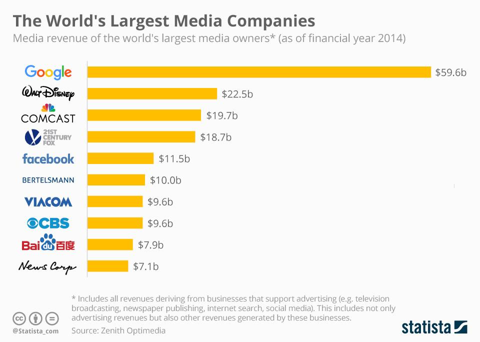

## Table of Contents

## What are entertainment companies?

Entertainment companies are businesses that create and provide different types of entertainment for people. This can include movies, TV shows, music, video games, and live events like concerts or sports games. These companies work to make things that people enjoy and want to spend time with. They often have teams of people who write stories, make music, or design games, and they use technology and creativity to bring their ideas to life.

These companies also need to think about how to share their entertainment with the world. They might use theaters, TV channels, streaming services, or the internet to reach people. Sometimes, they work with other businesses to help get their movies, shows, or music out to more people. Entertainment companies need to keep up with what people like and change their ideas to stay popular. This means they are always trying new things and looking for new ways to entertain people.

## How are entertainment companies categorized?

Entertainment companies are often grouped by the type of entertainment they make. Some focus on movies and are called film studios. Others make TV shows and are known as television networks or production companies. There are also music labels that work with musicians to create and sell music. Video game companies design and sell games for people to play. Each type of company has its own way of making and sharing entertainment with people.

Another way to categorize entertainment companies is by how big they are. Some are huge, like big movie studios or global music labels, and they have a lot of money and resources to make big projects. These are often called major companies. Smaller companies might focus on special kinds of entertainment or work with less money. They are sometimes called indie or independent companies. Both types of companies can make great entertainment, but they do things differently because of their size.

Lastly, entertainment companies can also be grouped by how they share their products. Some companies use old ways like movie theaters or CDs, while others use new technology like streaming services or online platforms. This can change how people enjoy their entertainment and can affect how successful a company is. Companies that can use new technology well often have an advantage in reaching more people quickly.

## What criteria are used to determine the largest entertainment companies?

The largest entertainment companies are often determined by how much money they make each year. This is called revenue. When a company has a lot of revenue, it means a lot of people are buying their movies, music, or games. Another way to measure size is by how many people work for the company. Big companies have many employees who help make and sell their entertainment products.

Another important criterion is how well-known the company is around the world. Companies that are famous in many countries are usually considered big. They often have offices in different places and work with people from all over the world. Finally, the size of a company can also be judged by how many different kinds of entertainment they make. Some big companies do not just make movies; they also make TV shows, music, and video games. This makes them very large and influential in the entertainment world.

## Who are the top 5 largest entertainment companies in the world?

The top 5 largest entertainment companies in the world are Disney, Comcast, Sony, Warner Bros. Discovery, and Netflix. These companies make a lot of money each year and are known all over the world. Disney is famous for movies like "The Lion King" and owns theme parks. Comcast owns NBC and Universal Studios, making TV shows and movies. Sony makes movies, video games, and electronics. Warner Bros. Discovery creates movies, TV shows, and owns channels like HBO. Netflix is known for streaming TV shows and movies that people watch online.

These companies are big because they make many different kinds of entertainment. Disney, for example, makes movies, TV shows, and runs theme parks. Comcast has TV channels and movie studios. Sony makes movies, video games, and even cameras. Warner Bros. Discovery owns many TV channels and makes movies and shows. Netflix focuses on streaming but also makes its own TV shows and movies. All these companies have a lot of people working for them and reach people all over the world.

## What types of entertainment do these companies produce?

Disney makes a lot of different kinds of entertainment. They make movies like "Frozen" and "The Avengers." They also make TV shows that you can watch on channels like Disney Channel or on their streaming service, Disney+. Disney also runs theme parks where people can ride roller coasters and meet characters from their movies. They even make toys and clothes with their characters on them.

Comcast, which owns NBC and Universal Studios, makes movies and TV shows too. You might have seen movies like "Jurassic Park" or "Fast & Furious" that they made. They also make TV shows that you can watch on channels like NBC or on their streaming service, Peacock. Sony is another big company. They make movies like "Spider-Man" and "Men in Black." Sony also makes video games like "The Last of Us" and "God of War." They even make electronics like TVs and cameras.

Warner Bros. Discovery makes movies like "Harry Potter" and "The Batman." They also make TV shows that you can watch on channels like HBO or on their streaming service, Max. Netflix is known for streaming movies and TV shows. They make their own shows like "Stranger Things" and "The Crown." People all over the world watch Netflix on their computers, phones, or TVs.

## How do these companies generate their revenue?

These big entertainment companies make money in different ways. Disney earns money from selling tickets to their movies in theaters, from people watching their shows on Disney+, and from visitors to their theme parks. They also sell toys and clothes with their characters on them, which brings in more money. Comcast makes money by selling ads on their TV channels like NBC and by people watching movies and shows on Peacock. They also earn from selling tickets to movies made by Universal Studios.

Sony makes money by selling tickets to their movies and by people buying their video games. They also earn from selling their electronics like TVs and cameras. Warner Bros. Discovery earns money from selling ads on their TV channels like HBO and from people watching movies and shows on Max. They also make money from selling tickets to their movies in theaters. Netflix makes money mainly from people paying to watch movies and shows on their streaming service. They don't have ads, so all their money comes from what people pay to use Netflix.

## What is the market share of the largest entertainment companies?

Disney has a big part of the entertainment market. They make a lot of money from their movies, TV shows, and theme parks. Disney also has Disney+, which is very popular. People all over the world watch Disney's movies and shows, so they have a large share of the market. Disney's market share is around 15% to 20% of the global entertainment industry.

Comcast, Sony, Warner Bros. Discovery, and Netflix also have big parts of the market. Comcast makes money from TV ads and their streaming service, Peacock. They also earn from Universal Studios movies. Sony makes money from movies, video games, and electronics. Warner Bros. Discovery earns from TV ads and their streaming service, Max. Netflix earns from people paying to watch their shows and movies. Together, these companies have a market share that ranges from 5% to 10% each, depending on the part of the entertainment industry you look at.

These companies are big because they make many different kinds of entertainment. Disney, Comcast, Sony, Warner Bros. Discovery, and Netflix all reach people all over the world. They use different ways to make money, like selling tickets, ads, and streaming services. This helps them have a large share of the entertainment market.

## How have mergers and acquisitions affected the size and scope of these companies?

Mergers and acquisitions have made these big entertainment companies even bigger. When one company buys another, it can do more things and reach more people. For example, Disney bought Marvel and Lucasfilm, which let them make movies like "The Avengers" and "Star Wars." This made Disney's movies more popular and helped them earn more money. Comcast bought NBCUniversal, which gave them TV channels and movie studios. This helped Comcast make more TV shows and movies and reach more people with their entertainment.

These big deals also help companies grow in new ways. When WarnerMedia merged with Discovery to become Warner Bros. Discovery, they combined their TV channels and streaming services. This made them stronger in the TV and streaming world. Sony has bought game studios to make more video games, which helped them grow in the gaming part of entertainment. Netflix started making their own shows and movies, which made them different from other streaming services. All these mergers and acquisitions have helped these companies get bigger and do more things in the entertainment world.

## What are the global operations and reach of the largest entertainment companies?

The largest entertainment companies have global operations that reach people all over the world. Disney has theme parks in places like the United States, Japan, France, and China. They also show their movies and TV shows in many countries. People can watch Disney's entertainment on Disney+, which is available in many parts of the world. Comcast, which owns NBC and Universal Studios, has TV channels that people watch in different countries. They also make movies that are popular around the world and can be seen on their streaming service, Peacock, in many places.

Sony makes movies and video games that people enjoy in many countries. They sell their electronics like TVs and cameras all over the world too. Warner Bros. Discovery has TV channels like HBO that people watch in many countries. They also make movies and shows that are popular globally and can be watched on their streaming service, Max, in many places. Netflix is known for streaming movies and TV shows that people watch all over the world. They make their own shows and movies that are popular in many countries, and their service is available in almost every country.

## How do the largest entertainment companies adapt to new technologies and trends?

The biggest entertainment companies always try to keep up with new technologies and trends. They do this by using new ways to share their movies, shows, and games with people. For example, Disney made Disney+ to let people watch their movies and shows online. Comcast started Peacock to do the same thing. These companies also use social media to talk to people and share news about their entertainment. They know that people like to watch things on their phones and computers, so they make sure their movies and shows are easy to find online.

These companies also change what they make to match what people like. For example, when video games got very popular, Sony started making more games. When people started watching more shows online, Netflix began making their own shows and movies. These companies also use new technology like virtual reality and 3D movies to make their entertainment more exciting. By always trying new things and listening to what people want, these big companies stay popular and keep making money.

## What are the challenges faced by the largest entertainment companies in maintaining their market position?

The biggest entertainment companies face many challenges to stay at the top. One big challenge is competition. There are always new companies trying to make movies, shows, and games. These new companies can sometimes make things that people like more than what the big companies make. Another challenge is that people's tastes change. What was popular last year might not be popular this year. So, the big companies need to keep making new and different things to keep people interested. They also need to spend a lot of money to make big movies and shows, and if these don't do well, it can be a big problem for them.

Another challenge is technology. New ways of watching movies and shows, like streaming services, are changing how people enjoy entertainment. The big companies need to keep up with these changes and make sure their movies and shows are easy to watch on phones, computers, and TVs. They also need to deal with problems like people sharing accounts on streaming services or watching movies and shows without paying. Keeping up with all these changes and challenges is hard, but the biggest entertainment companies work hard to stay on top and keep people happy with their entertainment.

## What future trends are likely to impact the largest entertainment companies?

In the future, big entertainment companies will face changes because of new technology and what people want. Streaming services like Netflix and Disney+ will become even more important. More people will watch movies and shows online instead of going to theaters or watching TV. This means companies need to make sure their movies and shows are easy to find and watch online. They might also start using new technology like virtual reality to make their entertainment more exciting. People might watch movies and shows in new ways, like using special glasses that make them feel like they are part of the story.

Another big trend will be what people like to watch. People's tastes change, and companies need to keep up. They might make more shows and movies about things like the environment or social issues. Also, more people want to see different kinds of stories and characters. This means companies will need to make entertainment that shows many different kinds of people and experiences. Keeping up with these changes will be a challenge, but it will also help big entertainment companies stay popular and make money.

## References & Further Reading

[1]: Lopez de Prado, M. (2018). ["Advances in Financial Machine Learning."](https://www.amazon.com/Advances-Financial-Machine-Learning-Marcos/dp/1119482089) Wiley.

[2]: Aronson, D. R. (2006). ["Evidence-Based Technical Analysis: Applying the Scientific Method and Statistical Inference to Trading Signals."](https://www.amazon.com/Evidence-Based-Technical-Analysis-Scientific-Statistical/dp/0470008741) Wiley.

[3]: Jansen, S. (2020). ["Machine Learning for Algorithmic Trading: Predictive models to extract signals from market and alternative data for systematic trading strategies with Python."](https://www.amazon.com/Machine-Learning-Algorithmic-Trading-alternative/dp/1839217715) Second Edition, Packt Publishing.

[4]: Chan, E. P. (2008). ["Quantitative Trading: How to Build Your Own Algorithmic Trading Business."](https://github.com/ftvision/quant_trading_echan_book) Wiley.

[5]: Comcast Corporation. (2022). 2022 Annual Report. [Link to Comcast's 2022 Annual Report](https://www.cmcsa.com/financials/annual-reports).

[6]: The Walt Disney Company. (2022). 2022 Annual Report. [Link to Disney's 2022 Annual Report](https://thewaltdisneycompany.com/app/uploads/2023/02/2022-Annual-Report.pdf).

[7]: Sony Group Corporation. (2022). 2022 Annual Report. [Link to Sony's 2022 Annual Report](https://www.sony.com/en/SonyInfo/News/Press/202208/22-029E/).