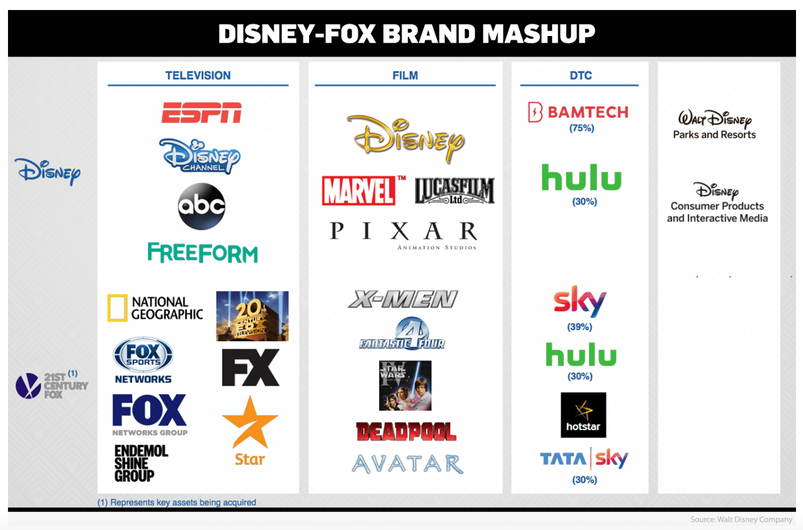

The global entertainment industry represents a dynamic and rapidly evolving landscape that combines creativity, technology, and commerce. As one of the most influential sectors worldwide, it encompasses various domains such as film, television, music, gaming, and live performances. The expansion of digital technology and internet connectivity has considerably enhanced the reach and engagement of entertainment content, making it accessible to a global audience in unprecedented ways. Key players in this industry include major media firms and entertainment companies known for their robust portfolios and market influence. Among these, companies such as Comcast, Disney, and Sony stand out for their diversified operations and sustained innovation, which have driven substantial financial performance and market capitalization.

The exploration of the largest entities within the entertainment sector reveals significant insights into their financial metrics and strategic undertakings. These companies have continually adapted to changing consumer preferences and technological advancements, ensuring their dominance across various entertainment channels. Their expansions into streaming services, gaming, and other digital platforms underscore the sector's fluid nature and highlight the importance of strategic adaptability.



In recent years, algorithmic trading has emerged as a significant influence on investment strategies concerning these companies. This approach uses sophisticated algorithms to execute trades and navigate the complex stock market landscape, allowing investors to leverage vast amounts of data for precise decision-making. As algorithmic trading becomes more prevalent, its impact on the financial strategies of entertainment companies underscores the increasingly intertwined nature of technology, finance, and media.

Understanding the intersection of entertainment and finance offers valuable insights for investors eager to navigate the complexities of this ever-evolving industry. By recognizing the patterns and trends that govern the interactions between media innovation and financial performance, investors can identify potential opportunities and risks within the sector, ultimately facilitating more informed decision-making processes.

## Table of Contents

## The Dominance of Key Players

Comcast, Disney, and Sony are widely recognized as dominant forces in the global entertainment industry. This dominance is attributed to their comprehensive and diverse portfolios, which encompass various segments such as streaming, gaming, and traditional media.

**Comcast** operates an extensive array of businesses, including NBCUniversal and the popular streaming service Peacock. The company's robust presence in both cable television and broadband internet services further amplifies its influence. In 2022, Comcast reported revenues of approximately $121.4 billion, underscoring its significant market power[^1]. The company's acquisition strategy, such as its purchase of Sky Group, has bolstered its international reach, making it a key player on a global scale.

**Disney** stands as another titan in the entertainment industry, with a portfolio that spans film production, theme parks, and streaming services like Disney+. The launch of Disney+ has allowed the company to tap into the lucrative streaming market, attracting millions of subscribers worldwide. Disney's strategic acquisitions, including the purchase of 21st Century Fox, have expanded its content library and market capitalization. In fiscal year 2022, Disney reported revenues of $82.7 billion[^2]. Such figures highlight the company's substantial economic footprint.

**Sony** is a powerhouse in both the entertainment and technology sectors. Its ventures into gaming through Sony Interactive Entertainment and the PlayStation brand, in particular, have been notably successful. Sony Pictures, the company's film production arm, also contributes significantly to its financial performance. With a reported revenue of approximately $88.6 billion in 2022, Sony's diverse business model supports its sustained growth and influence[^3]. The company's broad product offerings and technological innovations make it an attractive option for investors seeking exposure to various entertainment and technology markets.

Together, Comcast, Disney, and Sony's global reach and diverse offerings underscore their attractiveness to investors. Their strategic expansion and adaptation to changes in consumer preferences and technological advances continue to secure their positions at the forefront of the entertainment industry.

[^1]: Comcast Corporation. (2022). 2022 Annual Report. [Link to Comcast's 2022 Annual Report]

[^2]: The Walt Disney Company. (2022). 2022 Annual Report. [Link to Disney's 2022 Annual Report]

[^3]: Sony Group Corporation. (2022). 2022 Annual Report. [Link to Sony's 2022 Annual Report]

## Emerging Technologies and Streaming

Netflix and Warner Bros. Discovery have established themselves as leaders in the streaming services market, marking a significant departure from traditional media. As consumer preferences have shifted towards on-demand and digital content, these companies have capitalized on technological advancements to reach a broader audience. Streaming services have become integral to the media landscape, offering personalized and accessible content to users worldwide, thereby influencing cultural norms and media consumption patterns.

The transition from traditional media formats, such as cable television, to digital platforms is a defining trend in the entertainment industry. This shift is driven by several key factors, including the proliferation of high-speed internet access, the widespread use of smart devices, and the development of sophisticated streaming technologies. These advancements have enabled streaming services to deliver high-quality content instantaneously, enhancing user experience and engagement.

Netflix has been at the forefront of this transformation, leveraging data analytics to tailor its content offerings to individual preferences. Through algorithms that analyze viewing habits, Netflix can recommend personalized content, keeping users engaged and subscribed. This strategy not only increases user satisfaction but also boosts the company's competitiveness in an increasingly crowded market.

Warner Bros. Discovery, formed from the merger of WarnerMedia and Discovery, has also made significant strides in the streaming arena. The company offers a vast array of content spanning films, television series, and documentaries, attracting a global audience. Its strategic focus on leveraging well-established brands and franchises has enabled it to capture market share and foster a loyal subscriber base.

The growth of the streaming sector is further fueled by the continuous evolution of content delivery technologies, such as adaptive bitrate streaming, which adjusts video quality based on the viewer's internet bandwidth. Such innovations ensure a seamless viewing experience across different devices, making streaming an appealing alternative to traditional broadcast methods.

As consumer preferences continue to evolve, the demand for streaming services is expected to increase, prompting further innovation and competition in the sector. Companies that can effectively utilize technological advancements and understand changing consumer behaviors are likely to maintain their leadership positions and drive the industry's future trajectory.

## The Role of Algorithmic Trading in the Entertainment Sector

Algorithmic trading refers to the use of advanced mathematical models and computer algorithms to automate the execution of trades in the financial markets based on pre-defined criteria. This approach has seen significant adoption in the entertainment sector, which includes a variety of companies engaged in media, film, and digital content production. The implementation of [algorithmic trading](/wiki/algorithmic-trading) in this sector has resulted in several key advantages that have reshaped how trades are conducted.

Firstly, algorithmic trading enables the processing of large volumes of data at high speed, which is crucial for making informed investment decisions in a market characterized by rapid information flow. Entertainment companies often experience significant stock price [volatility](/wiki/volatility-trading-strategies) due to events such as new product releases, mergers, and fluctuations in consumer demand. Algorithms can analyze relevant data points across a variety of sources—including financial reports, market news, and social media trends—to quickly identify patterns that could influence stock prices. For example, if a new movie release greatly outperforms box office expectations, an algorithm can promptly adjust trading positions to capitalize on the anticipated stock price increase.

Moreover, algorithmic trading allows for precise execution of trades. Traditional trading methods may involve manual input from traders, which can introduce delays and errors. By contrast, algorithms execute trades based on predetermined criteria and strategies with minimal human intervention, thus reducing the likelihood of mistakes. This is particularly beneficial in managing time-sensitive opportunities in the fast-moving entertainment market. For example, if a streaming service announces a surprise partnership that could boost its subscriber base, algorithms can quickly execute buy orders to take advantage of any upward movement in stock prices.

Algorithmic trading also facilitates the development of sophisticated financial strategies. These strategies often rely on statistical analyses and [backtesting](/wiki/backtesting) to gauge their effectiveness under various market conditions. For instance, a statistical [arbitrage](/wiki/arbitrage) strategy may involve identifying discrepancies in the pricing of related stocks and exploiting these differences for profit. Backtesting allows investors to simulate the performance of such strategies using historical data before deploying them in live markets. Python, with libraries such as NumPy and pandas, serves as a popular tool for developing and backtesting algorithmic strategies. The code snippet below illustrates a simple example of backtesting a moving average crossover strategy.

```python
import pandas as pd

# Load historical stock data
data = pd.read_csv('historical_stock_data.csv')

# Calculate moving averages
data['Short_MA'] = data['Close'].rolling(window=50).mean()
data['Long_MA'] = data['Close'].rolling(window=200).mean()

# Generate trading signals
data['Signal'] = 0
data.loc[data['Short_MA'] > data['Long_MA'], 'Signal'] = 1
data.loc[data['Short_MA'] < data['Long_MA'], 'Signal'] = -1

# Calculate returns
data['Returns'] = data['Close'].pct_change()
data['Strategy_Returns'] = data['Signal'].shift(1) * data['Returns']

# Calculate cumulative returns
cumulative_strategy_returns = (1 + data['Strategy_Returns'].dropna()).cumprod()
print(cumulative_strategy_returns)
```

As algorithmic trading continues to evolve, it heavily influences financial strategies within the entertainment industry. Investors are increasingly adopting data-driven techniques to navigate the complexities of a market that is not only affected by traditional financial metrics but also by technological advancements and shifts in consumer preferences. Hence, algorithmic trading stands as a powerful tool to harness the potential of the entertainment sector in the ever-changing financial landscape.

## Investment Opportunities

Investors can access the vast potential of the entertainment industry through various investment avenues, enabling them to benefit from the growth and innovation within this sector. One primary method of investment is through direct stock purchases of entertainment giants such as Comcast, Disney, and Sony. These companies, characterized by their robust financial performance and extensive market reach, offer attractive opportunities for investors seeking exposure to the broader entertainment landscape.

Exchange-traded funds (ETFs) provide another investment pathway, allowing individuals to invest in a diversified portfolio of entertainment stocks. ETFs typically track an index or a collection of assets within the entertainment industry, thereby offering a balanced risk profile and enabling investors to benefit from the sector's overall performance without concentrating their capital on a single entity. This diversified approach helps mitigate idiosyncratic risks associated with individual companies.

For investors interested in foreign entertainment companies, American Depositary Receipts (ADRs) present an appealing option. ADRs represent shares in foreign companies and allow U.S. investors to trade these shares on American stock exchanges. By investing in ADRs, individuals can gain exposure to international entertainment firms like Sony, headquartered in Japan, thereby expanding their investment horizons beyond domestic borders.

Despite the promising investment opportunities, the entertainment sector also poses various risks. Market volatility is a significant concern, as stock prices can be influenced by fluctuating consumer preferences, technological advancements, and regulatory changes. Moreover, the rapid pace of innovation, while offering substantial growth potential, may disrupt established business models and introduce new competitive dynamics. As a result, entertainment companies are constantly required to adapt and innovate to remain competitive, creating a complex risk environment for investors.

To mitigate these risks, diversification is a key strategy. By spreading investments across multiple companies and sub-sectors within entertainment, investors can reduce the impact of poor performance from any single entity. Diversified portfolios are less susceptible to volatility, as losses in one area may be offset by gains in another, leading to a more stable overall performance.

In conclusion, the entertainment industry offers a wide array of investment opportunities, each with its potential risks and rewards. By strategically leveraging direct stock purchases, ETFs, and ADRs, investors can diversify their portfolios to achieve a balanced exposure to this dynamic and rapidly evolving sector.

## Conclusion

The global entertainment industry remains a lucrative sector with substantial growth potential. As it continues to evolve, major firms such as Comcast, Disney, and Sony are pivotal in setting trends and influencing the pace of industry development. These companies leverage their extensive portfolios and global reach to secure their dominance, making them attractive to both consumers and investors alike.

For investors, it is essential to conduct thorough research into these leading companies and the market forces at play. One promising strategy is the consideration of algorithmic trading, which uses sophisticated computer algorithms to execute trades based on predetermined criteria. This approach allows for efficient management of large data volumes and enhances decision-making precision in a sector as dynamic and volatile as entertainment.

Furthermore, staying informed about industry trends and technological advancements is crucial for making informed investment decisions. The rapid shift toward digital and streaming platforms underscores the need for investors to remain adaptable and responsive to changes. By doing so, they can capitalize on opportunities while effectively mitigating risks associated with market volatility and competitive dynamics.

## References & Further Reading

[1]: Lopez de Prado, M. (2018). ["Advances in Financial Machine Learning."](https://www.amazon.com/Advances-Financial-Machine-Learning-Marcos/dp/1119482089) Wiley.

[2]: Aronson, D. R. (2006). ["Evidence-Based Technical Analysis: Applying the Scientific Method and Statistical Inference to Trading Signals."](https://www.amazon.com/Evidence-Based-Technical-Analysis-Scientific-Statistical/dp/0470008741) Wiley.

[3]: Jansen, S. (2020). ["Machine Learning for Algorithmic Trading: Predictive models to extract signals from market and alternative data for systematic trading strategies with Python."](https://www.amazon.com/Machine-Learning-Algorithmic-Trading-alternative/dp/1839217715) Second Edition, Packt Publishing.

[4]: Chan, E. P. (2008). ["Quantitative Trading: How to Build Your Own Algorithmic Trading Business."](https://github.com/ftvision/quant_trading_echan_book) Wiley.

[5]: Comcast Corporation. (2022). 2022 Annual Report. [Link to Comcast's 2022 Annual Report](https://www.cmcsa.com/financials/annual-reports).

[6]: The Walt Disney Company. (2022). 2022 Annual Report. [Link to Disney's 2022 Annual Report](https://thewaltdisneycompany.com/app/uploads/2023/02/2022-Annual-Report.pdf).

[7]: Sony Group Corporation. (2022). 2022 Annual Report. [Link to Sony's 2022 Annual Report](https://www.sony.com/en/SonyInfo/News/Press/202208/22-029E/).