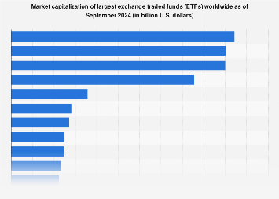

## Table of Contents

## What is an Exchange-Traded Fund (ETF)?

An Exchange-Traded Fund (ETF) is a type of investment that works like a basket. It holds a collection of different investments, like stocks, bonds, or commodities, all in one package. You can buy and sell shares of an ETF on a stock exchange, just like you would with a single stock. This makes it easy for people to invest in a broad range of assets without having to buy each one separately.

ETFs are popular because they offer diversification, which means spreading out your investments to reduce risk. Instead of putting all your money into one company's stock, you can invest in an ETF that includes many different companies. This way, if one company does poorly, it won't hurt your entire investment as much. ETFs also tend to have lower fees than other types of funds, making them a cost-effective choice for many investors.

## How do ETFs differ from mutual funds?

ETFs and mutual funds are both ways to invest in a group of assets, but they have some key differences. One big difference is how you buy and sell them. ETFs trade on a stock exchange, just like individual stocks. This means you can buy or sell them anytime during the trading day at the current market price. On the other hand, mutual funds are bought and sold at the end of the trading day based on their net asset value (NAV). This means you have to wait until the market closes to get the price for the day.

Another difference is in their structure and costs. ETFs usually have lower expense ratios than mutual funds because they are designed to be more passive investments, often tracking an index like the S&P 500. Mutual funds, especially actively managed ones, can have higher fees because they involve more work from fund managers who try to beat the market. Additionally, ETFs are more tax-efficient. When you sell shares of an [ETF](/wiki/etf-trading-strategies), you usually don't trigger capital gains for other investors in the fund, unlike with mutual funds where selling shares can lead to taxable events for everyone in the fund.

## What are the benefits of investing in ETFs?

Investing in ETFs can be a smart choice for many people. One big benefit is that ETFs offer a lot of variety. When you buy an ETF, you're not just putting your money into one company. Instead, you're investing in a whole bunch of companies or assets all at once. This is called diversification, and it helps spread out your risk. If one company in the ETF does badly, it won't hurt your whole investment as much because you have many other companies in there too.

Another advantage of ETFs is that they usually have lower fees than other types of investments like mutual funds. This means you get to keep more of your money instead of paying it in fees. ETFs are also easy to buy and sell because they trade on stock exchanges just like regular stocks. You can buy or sell them anytime during the trading day, which gives you more control over your investments. Plus, ETFs are often very tax-efficient, which can save you money when it comes time to pay taxes on your investment gains.

## What are the largest ETFs by total assets under management?

The biggest ETF by total assets under management is the SPDR S&P 500 ETF Trust (SPY). This ETF tracks the S&P 500 index, which includes 500 of the largest companies in the United States. Because it's so popular and follows such a well-known index, SPY has a lot of money invested in it. As of the latest data, it manages over $500 billion in assets.

The second largest ETF is the iShares Core S&P 500 ETF (IVV), which also tracks the S&P 500 index. IVV is similar to SPY but has slightly lower fees, which makes it attractive to investors looking to save on costs. It has around $400 billion in assets under management. Another big ETF is the Vanguard S&P 500 ETF (VOO), which comes in third place. Like the others, it tracks the S&P 500 and has about $350 billion in assets. These three ETFs are popular because they give investors a simple way to invest in a broad range of the U.S. economy.

## Which sectors do the largest ETFs focus on?

The biggest ETFs, like the SPDR S&P 500 ETF Trust (SPY), the iShares Core S&P 500 ETF (IVV), and the Vanguard S&P 500 ETF (VOO), focus on a wide range of sectors because they track the S&P 500 index. This index includes 500 of the largest companies in the U.S., so these ETFs give you a little bit of everything. You'll find companies from sectors like technology, healthcare, finance, consumer goods, and more all mixed together in these ETFs. This makes them a good choice if you want to invest in the overall U.S. economy without [picking](/wiki/asset-class-picking) specific sectors.

While these big ETFs cover many sectors, some ETFs focus on just one sector. For example, the Technology Select Sector SPDR Fund (XLK) focuses only on technology companies. Another example is the Health Care Select Sector SPDR Fund (XLV), which invests in healthcare companies. These sector-specific ETFs can be a good choice if you believe a certain sector will do better than others or if you want to balance your investments across different areas of the economy.

## How have the largest ETFs performed over the past year?

Over the past year, the biggest ETFs like the SPDR S&P 500 ETF Trust (SPY), the iShares Core S&P 500 ETF (IVV), and the Vanguard S&P 500 ETF (VOO) have done pretty well. These ETFs all track the S&P 500, which is a group of 500 big companies in the U.S. Because they follow the same index, their performance has been very similar. The S&P 500 had a good year, with gains around 20-25%. That means if you had invested $100 in any of these ETFs a year ago, you'd have about $120-$125 now.

Sector-specific ETFs had mixed results over the past year. The Technology Select Sector SPDR Fund (XLK) did really well because technology companies had a strong year. It went up by about 30-35%. On the other hand, the Health Care Select Sector SPDR Fund (XLV) didn't do as well, with gains around 5-10%. This shows that different sectors can have very different performances, even when the overall market is doing okay.

## What are the expense ratios of the top ETFs?

The expense ratio is like a fee you pay for investing in an ETF. It's a percentage of your investment that goes to the company managing the ETF. For the biggest ETFs that track the S&P 500, the expense ratios are pretty low. The SPDR S&P 500 ETF Trust (SPY) has an expense ratio of about 0.09%. That means for every $1,000 you invest, you pay about 90 cents a year in fees. The iShares Core S&P 500 ETF (IVV) has an even lower expense ratio, at around 0.03%. So for the same $1,000, you'd only pay about 30 cents a year. The Vanguard S&P 500 ETF (VOO) is also very cheap, with an expense ratio of about 0.03%.

For sector-specific ETFs, the expense ratios can be a bit different. The Technology Select Sector SPDR Fund (XLK) has an expense ratio of about 0.10%, which means you'd pay $1 a year for every $1,000 invested. The Health Care Select Sector SPDR Fund (XLV) has a similar expense ratio, also around 0.10%. These fees are still pretty low, but they're a bit higher than the broad market ETFs like SPY, IVV, and VOO. Keeping an eye on these expense ratios can help you save money over time, especially if you're investing a lot.

## How do the largest ETFs manage their portfolios?

The biggest ETFs, like the SPDR S&P 500 ETF Trust (SPY), the iShares Core S&P 500 ETF (IVV), and the Vanguard S&P 500 ETF (VOO), manage their portfolios by tracking the S&P 500 index. This means they try to match the performance of the S&P 500 as closely as possible. To do this, they buy shares of all the companies in the S&P 500 in the same proportions as the index. For example, if Apple makes up 7% of the S&P 500, these ETFs will have about 7% of their money in Apple stock. This way, when the S&P 500 goes up or down, the ETFs go up or down by about the same amount.

Sector-specific ETFs, like the Technology Select Sector SPDR Fund (XLK) and the Health Care Select Sector SPDR Fund (XLV), manage their portfolios a bit differently. Instead of tracking a broad index like the S&P 500, they focus on companies in just one sector. For example, XLK only invests in technology companies, and XLV only invests in healthcare companies. These ETFs track specific sector indexes, like the Technology Select Sector Index or the Health Care Select Sector Index. They buy shares of the companies in these indexes in the same proportions as the index, so their performance closely follows the performance of that sector.

## What are the key risks associated with investing in the largest ETFs?

Investing in the biggest ETFs, like those that track the S&P 500, comes with some risks. One big risk is that the overall market can go down. Since these ETFs are tied to the performance of the S&P 500, if the stock market has a bad year, your investment will likely go down too. Another risk is that these ETFs are heavily weighted toward certain big companies. For example, if a few big companies like Apple or Microsoft do poorly, it can drag down the whole ETF, even if other companies are doing well. This is called concentration risk, and it's something to keep in mind when you're investing in these broad market ETFs.

There are also risks specific to sector ETFs, like those focusing on technology or healthcare. If you invest in a sector ETF, your investment is tied to how well that one sector does. If the technology sector has a bad year, for example, your investment in a technology ETF will likely go down too. This can be riskier than investing in a broad market ETF because you're putting all your eggs in one basket. Another thing to watch out for is that ETFs have expense ratios, which are fees you pay for investing in them. While the fees for the biggest ETFs are usually low, they can still eat into your returns over time, especially if you're investing a lot of money.

## How do the largest ETFs compare in terms of liquidity and trading volume?

The biggest ETFs, like the SPDR S&P 500 ETF Trust (SPY), the iShares Core S&P 500 ETF (IVV), and the Vanguard S&P 500 ETF (VOO), have a lot of [liquidity](/wiki/liquidity-risk-premium) and high trading [volume](/wiki/volume-trading-strategy). Liquidity means how easy it is to buy or sell an ETF without affecting its price too much. These ETFs are very liquid because so many people trade them every day. For example, SPY often has the highest trading volume of any ETF, with millions of shares changing hands daily. This means you can buy or sell SPY quickly and easily, at any time during the trading day, without worrying about big price changes.

IVV and VOO also have high liquidity and trading volume, though not quite as high as SPY. Still, they are among the most traded ETFs on the market. This makes them good choices if you want to be able to get in and out of your investment easily. Sector-specific ETFs, like the Technology Select Sector SPDR Fund (XLK) and the Health Care Select Sector SPDR Fund (XLV), also have good liquidity and trading volume, though usually less than the big S&P 500 ETFs. But they still trade enough that you can buy and sell them without much trouble.

## What strategies do the largest ETFs use to track their underlying indices?

The biggest ETFs, like the SPDR S&P 500 ETF Trust (SPY), the iShares Core S&P 500 ETF (IVV), and the Vanguard S&P 500 ETF (VOO), use a strategy called full replication to track the S&P 500 index. This means they buy all the stocks in the S&P 500 in the same amounts as the index. For example, if a company like Apple makes up 7% of the S&P 500, these ETFs will put about 7% of their money into Apple stock. This way, the ETFs can closely match the performance of the S&P 500. It's like trying to copy the index exactly, so when the S&P 500 goes up or down, the ETFs go up or down by about the same amount.

Sector-specific ETFs, like the Technology Select Sector SPDR Fund (XLK) and the Health Care Select Sector SPDR Fund (XLV), use similar strategies to track their specific sector indexes. XLK, for instance, tracks the Technology Select Sector Index by buying all the tech companies in that index in the same proportions. XLV does the same thing but for healthcare companies. These ETFs aim to match the performance of their sector indexes as closely as possible. By focusing on just one sector, they can give investors a way to bet on how well that sector will do, but they also take on more risk because they're not as diversified as broad market ETFs.

## How do geopolitical events impact the performance of the largest ETFs?

Geopolitical events can have a big effect on the performance of the biggest ETFs, like those that track the S&P 500. When something big happens in the world, like a war, a trade dispute, or a big election, it can make the stock market go up or down. For example, if there's a trade war between the U.S. and China, it can hurt companies that do a lot of business with China. Since these ETFs hold a lot of stocks from big companies, if those companies do poorly because of the trade war, the ETFs will go down too. On the other hand, if a geopolitical event makes people feel more confident about the economy, like a peace agreement, it can make the stock market and the ETFs go up.

Sector-specific ETFs can be even more affected by geopolitical events because they focus on just one part of the economy. For example, if there's a new law that helps the technology industry, like tax breaks for tech companies, the Technology Select Sector SPDR Fund (XLK) might go up a lot. But if there's a new rule that hurts the healthcare industry, like limits on drug prices, the Health Care Select Sector SPDR Fund (XLV) might go down. Because these ETFs are not as spread out as the big S&P 500 ETFs, they can feel the ups and downs from geopolitical events more strongly.

## References & Further Reading

[1]: [Foucher, I. (2010). "Exchange-Traded Funds (ETFs): Structure & Trading"](https://www.semanticscholar.org/paper/Drug-induced-infiltrative-lung-disease.-Camus-Foucher/bd89a839d275cc62328fba276e334f697a257330). BASKET Journal of Financial Markets.

[2]: Madhavan, A. (2016). ["Exchange-Traded Funds: Market Structure, Regulation, and Implications for Financial Stability."](https://www.nber.org/system/files/working_papers/w24250/w24250.pdf) CFA Institute Research Foundation.

[3]: ["High-Frequency Trading: New Realities for Traders, Markets, and Regulators"](https://www.semanticscholar.org/paper/High-frequency-trading-%3A-new-realities-for-traders%2C-Easley-Prado/e1b693a045a0554198a83b127f534f17592ebb08) by David Kuk.

[4]: Hasbrouck, J. (2009). ["The Flash Crash: Impact of High-Speed Trading on an Electronic Market."](https://www.cftc.gov/sites/default/files/idc/groups/public/@economicanalysis/documents/file/oce_flashcrash0314.pdf) The Journal of Finance.

[5]: ["Algorithmic Trading and DMA: An Introduction to Direct Access Trading Strategies"](https://www.semanticscholar.org/paper/Algorithmic-trading-%26-DMA-%3A-an-introduction-to-Johnson/aa5de1ab883d5e23b6651faa7c1807586d688e4b) by Barry Johnson.

[6]: ["The ETF Handbook: How to Value and Trade Exchange Traded Funds"](https://books.google.com/books/about/The_ETF_Handbook.html?id=ayORCgAAQBAJ) by David J. Abner.