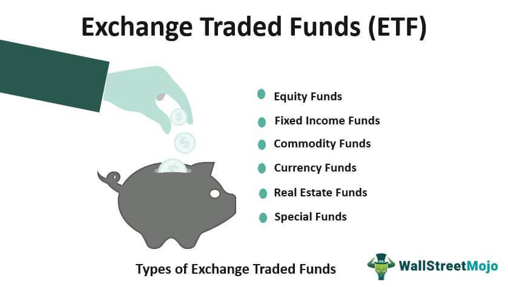

Exchange-traded funds (ETFs) have increasingly become a central element in the domain of modern investing. With their inherent ability to provide investors with diversified exposure, ETFs offer access to a wide variety of asset classes, including stocks, bonds, and commodities. This diversification is one of their primary attractions, as it allows investors to spread risk across multiple investments. An essential characteristic that differentiates ETFs from traditional mutual funds is their cost-effectiveness. ETFs usually have lower expense ratios, as they are often passively managed, tracking specific indices as opposed to requiring the active management associated with traditional mutual funds. This translates to reduced management fees, enhancing overall returns for investors.

Liquidity is another pivotal advantage of ETFs. Unlike mutual funds, which are priced only at the close of the trading day, ETFs trade on stock exchanges throughout the day, allowing investors to buy and sell shares whenever the stock market is open. This intraday trading feature provides greater flexibility and immediacy in executing trades, empowering investors to react promptly to market movements.

This article aims to examine the expansive landscape of the largest ETFs globally, analyzing their significance within the investment ecosystem. A focal point of this investigation is the influence of algorithmic trading, or algo trading, on ETF markets—a dynamic element that has reshaped trading mechanics significantly. Algorithmic trading utilizes programmed strategies to execute trades, often at high speeds and volumes, thereby enhancing market efficiency through tighter spreads and improved price accuracies.

The content herein includes an analysis of the biggest ETFs by assets, delving into how their size and structure contribute to market stability and reduced risks. Additionally, the mechanics of algorithmic trading within ETFs will be scrutinized, assessing the intersection of technology and finance. The convergence of these factors, ETFs’ growing prominence, and the rise of algo trading collectively shape contemporary investing strategies, offering both opportunities and challenges for individual and institutional investors alike.

## Table of Contents

## Understanding Exchange-Traded Funds (ETFs)

Exchange-traded funds (ETFs) are investment funds that are traded on stock exchanges, similar to individual stocks. They are designed to track the performance of a specific index, commodity, or a basket of assets, such as stocks or bonds. By holding a diverse array of underlying assets, ETFs offer investors exposure to a broad market sector or even the entire market, depending on the ETF's objectives.

One of the key mechanisms that enable ETFs to function effectively is the arbitrage mechanism. This mechanism ensures that ETF prices remain close to their net asset value (NAV). When the market price of an ETF deviates from its NAV, arbitrageurs enter the market to exploit the price difference. For instance, if the ETF is trading at a price higher than its underlying assets, arbitrageurs will buy the underlying assets and sell the ETF shares, thereby pushing prices back in line. Conversely, if the ETF is undervalued, arbitrageurs will buy ETF shares and sell the underlying assets. This process helps maintain the ETF's price stability and aligns it with its NAV.

ETFs offer a number of advantages to investors, such as diversification and cost-effectiveness. Diversification is achieved because a single [ETF](/wiki/etf-trading-strategies) can provide exposure to a wide range of securities across various sectors or asset classes, reducing the risk associated with individual investments. Moreover, ETFs typically have lower expense ratios compared to mutual funds, primarily due to their passive management style and lower operational costs.

Another benefit of ETFs is their flexibility in trading. Investors can buy and sell ETF shares throughout the trading day at market prices, similar to stocks. This intraday trading capability allows investors to react quickly to market developments and manage their portfolios with greater agility.

The transparency offered by ETFs is another [factor](/wiki/factor-investing) that appeals to many investors. Most ETFs disclose their holdings on a daily basis, allowing investors to know exactly which assets they are exposed to. This transparency enables investors to make informed decisions based on the underlying assets of the ETF.

In summary, ETFs are versatile investment vehicles that provide investors with diversified exposure to various asset classes. The combination of an efficient [arbitrage](/wiki/arbitrage) mechanism, cost-effectiveness, trading flexibility, and transparency makes ETFs an attractive choice for both individual and institutional investors seeking to build well-rounded investment portfolios.

## The Largest ETFs: An Overview

Exchange-traded funds (ETFs) have become integral to modern investment strategies, providing investors with diverse, cost-effective, and flexible investment options. Among these, a select group of ETFs stands out due to their large asset sizes and significant market influence. One of the most prominent examples is the SPDR S&P 500 ETF (SPY), which is designed to track the performance of the S&P 500 Index, representing one of the most comprehensive benchmarks of the US equities market.

The SPDR S&P 500 ETF (SPY) aims to mirror the performance of the S&P 500 by investing in a portfolio of stocks that closely replicates the index's composition. As one of the largest ETFs by asset size, SPY provides investors with exposure to a broad swath of the US economy, including both growth and value stocks from major sectors. Its [liquidity](/wiki/liquidity-risk-premium) and size make it a preferred choice for both retail and institutional investors looking to capitalize on market trends with minimized risk.

Another significant player in the ETF landscape is the Vanguard FTSE Emerging Markets Fund (VWO). VWO offers exposure to emerging markets, which are characterized by high growth potential and increased [volatility](/wiki/volatility-trading-strategies) compared to established markets. By investing in a diverse basket of stocks from regions such as China, Brazil, and India, VWO provides opportunities for investors to tap into the economic growth of developing nations. The fund's investment strategy focuses on capital growth by targeting markets with rapid industrialization and expansion.

Similarly, the iShares Core S&P 500 ETF (IVV) is another major ETF that tracks the S&P 500 Index. IVV is known for its low expense ratio and high liquidity, making it an attractive option for cost-conscious investors seeking to mimic the returns of the US large-cap segment. The fund's strategic focus on large, established companies offers investors a stable and predictable investment experience.

The large size and stability of ETFs like SPY, VWO, and IVV contribute significantly to market stability. Their broad diversification reduces unsystematic risk by spreading investments across various sectors and regions. This diversification, coupled with their liquidity, helps in maintaining market balance even during times of increased volatility. For instance, during market downturns, the substantial inflow and outflow capabilities of these ETFs ensure that large-scale trades can be executed without significantly disrupting stock prices.

Overall, the influence of large ETFs is profound, providing essential market functions such as price discovery and liquidity while enabling investors to achieve diversified exposure with reduced risks. Their widespread adoption highlights the importance of such instruments in constructing robust investment portfolios, contributing to both individual financial goals and broader market health.

## Algorithmic Trading in ETF Markets

Algorithmic trading, commonly known as algo trading, employs computer algorithms to execute trades at speeds and volumes unattainable by human traders. This approach is particularly pivotal in the exchange-traded fund (ETF) markets due to its impact on market efficiency and pricing accuracy. High-frequency trading ([HFT](/wiki/high-frequency-trading-strategies)), a subset of algo trading, plays a significant role in ensuring that ETF prices remain closely aligned with their net asset values (NAVs).

High-frequency traders use sophisticated algorithms to capitalize on small price discrepancies that might exist between an ETF's market price and its NAV. By engaging in rapid buying and selling of ETFs and their underlying assets, these traders help reduce arbitrage opportunities, leading to tighter bid-ask spreads and more accurate pricing. As a result, HFT contributes to improving market liquidity and reducing transaction costs for investors. According to a study conducted by the Journal of Finance, the presence of HFT reduces the average bid-ask spread by about 21%, thus enhancing market efficiency and stability (source: Journal of Finance, Vol. 67, No. 6, 2012).

Several studies have shown that [algorithmic trading](/wiki/algorithmic-trading) in the ETF market promotes market stability by decreasing price volatility. For instance, research published in the "Review of Financial Studies" indicates that markets with a higher presence of algorithmic traders experience lower volatility and increased trade [volume](/wiki/volume-trading-strategy) consistency (source: Review of Financial Studies, Vol. 22, No. 6, 2009). This stabilization arises because automated strategies quickly adjust to new information, minimizing the impact of sudden price swings caused by large discretionary trades.

For investors, leveraging the benefits of high-frequency trading in ETFs introduces both opportunities and challenges. The key advantage lies in the improved market liquidity and reduced trading costs. However, investors must also be aware of the potential downsides. The rapid nature of HFT can occasionally lead to "flash crashes," where prices undergo dramatic, short-term fluctuations with little warning. The most prominent example of a flash crash occurred on May 6, 2010, when the Dow Jones Industrial Average dropped nearly 1,000 points within minutes before recovering a large portion by the market's close.

Investors should maintain a balanced perspective on the influence of algorithmic trading in ETF markets. While it offers substantial benefits, such as increased liquidity and enhanced price accuracy, it also introduces risks related to market stability during periods of abnormal market conditions. As technology and algorithmic trading strategies continue to evolve, so too will their effects on ETF markets and investor strategies. Regularly monitoring and adapting to these changes will be essential for optimizing investment outcomes.

## The Impact of Largest ETFs and Algo Trading on Investment Strategies

The size and popularity of large exchange-traded funds (ETFs) have a profound effect on both individual and institutional investment strategies. Large ETFs, by virtue of their substantial assets under management, offer investors robust liquidity and efficient access to a diversified range of asset classes. This breadth of exposure is instrumental in mitigating risk and enhancing portfolio performance.

**Risk Reduction Through Diversification**

Large-cap and emerging market ETFs play a pivotal role in risk management strategies. Large-cap ETFs, such as the SPDR S&P 500 ETF (SPY), provide investors with exposure to the most established companies, which are generally considered less volatile. Conversely, emerging market ETFs like the Vanguard FTSE Emerging Markets Fund (VWO) offer exposure to rapidly growing economies, albeit with higher volatility. By incorporating both large-cap and emerging market ETFs into a portfolio, investors can achieve a balance of stability and growth potential, effectively reducing overall risk.

**Algorithmic Trading: Influence on Trading Patterns and Liquidity**

Algorithmic trading has become integral to the operation of ETF markets, significantly impacting trading patterns, liquidity, and pricing. Algorithms execute trades at high speed, allowing for the swift reaction to market changes and discrepancies in ETF pricing relative to their net asset value (NAV). This automated trading reduces price inefficiencies, ensuring that ETF prices remain close to the value of the underlying assets. High-frequency trading (HFT), a subset of algorithmic trading, contributes to this efficiency by providing continuous liquidity, thereby narrowing bid-ask spreads and reducing transaction costs for investors.

Numerous studies underscore the importance of algorithmic trading in maintaining market stability. By continuously adjusting ETF prices in response to market signals, algorithmic trading minimizes arbitrage opportunities and prevents large price swings caused by sudden demand or supply shocks.

**Strategies Leveraging Stability and Predictability**

Investors can capitalize on the stability and predictability offered by large ETFs and algorithmic trading through various strategies. One approach is to focus on sector rotation, aligning investment allocations with macroeconomic trends while using ETFs for sector-based exposure. This strategy is facilitated by the liquidity and low transaction costs provided by large ETFs.

Moreover, the predictability of ETF pricing, maintained by algorithmic trading, allows investors to employ systematic investment strategies, such as value averaging or dollar-cost averaging, with greater confidence. These strategies benefit from regular contributions and withdrawals, relying on the consistent liquidity of large ETFs.

Moving forward, as the ETF market continues its expansion and sophistication, investors must remain vigilant of technological and market developments. Strategies that incorporate the attributes of large ETFs and advanced algorithmic trading will be critical in achieving optimized investment outcomes.

## Conclusion

The landscape of exchange-traded funds (ETFs) is continually advancing, underpinned by the rapid development of trading technologies and evolving investor preferences. This evolution is transforming the financial markets, making it imperative for investors to grasp the intricacies of large ETFs and the influence of algorithmic trading. These components are pivotal for capitalizing on emerging market opportunities and achieving favorable investment outcomes.

Large ETFs, by virtue of their sizeable asset bases and diversified holdings, have become critical in shaping investment strategies. They offer a mechanism for risk reduction while providing exposure to a broad range of asset classes, including large-cap equities and emerging markets. This capability is significant in an investment climate characterized by volatility and uncertainty.

Algorithmic trading plays a crucial role in ETF markets, enhancing liquidity, tightening bid-ask spreads, and ensuring price movements remain consistent with underlying values. This has led to more efficient markets where investors can execute trades swiftly and at reduced costs. However, as algorithmic trading becomes more sophisticated, it presents a dual-edge: providing benefits such as enhanced market efficiency but also posing challenges like increased market volatility due to high-frequency trading activities.

As the ETF market expands and becomes more intricate, sophistication in trading and investment strategies will be increasingly important. Investors must be proactive in understanding and adapting to trends and technological advances. Staying informed about ongoing developments is essential for optimizing investment strategies in an ever-evolving market landscape, enabling investors to make informed decisions that align with their financial goals. By leveraging the stability and predictability offered by large ETFs and algorithmic mechanisms, investors can effectively navigate the complexities of modern financial markets.

## References & Further Reading

[1]: [Foucher, I. (2010). "Exchange-Traded Funds (ETFs): Structure & Trading"](https://www.semanticscholar.org/paper/Drug-induced-infiltrative-lung-disease.-Camus-Foucher/bd89a839d275cc62328fba276e334f697a257330). BASKET Journal of Financial Markets.

[2]: Madhavan, A. (2016). ["Exchange-Traded Funds: Market Structure, Regulation, and Implications for Financial Stability."](https://www.nber.org/system/files/working_papers/w24250/w24250.pdf) CFA Institute Research Foundation.

[3]: ["High-Frequency Trading: New Realities for Traders, Markets, and Regulators"](https://www.semanticscholar.org/paper/High-frequency-trading-%3A-new-realities-for-traders%2C-Easley-Prado/e1b693a045a0554198a83b127f534f17592ebb08) by David Kuk.

[4]: Hasbrouck, J. (2009). ["The Flash Crash: Impact of High-Speed Trading on an Electronic Market."](https://www.cftc.gov/sites/default/files/idc/groups/public/@economicanalysis/documents/file/oce_flashcrash0314.pdf) The Journal of Finance.

[5]: ["Algorithmic Trading and DMA: An Introduction to Direct Access Trading Strategies"](https://www.semanticscholar.org/paper/Algorithmic-trading-%26-DMA-%3A-an-introduction-to-Johnson/aa5de1ab883d5e23b6651faa7c1807586d688e4b) by Barry Johnson.

[6]: ["The ETF Handbook: How to Value and Trade Exchange Traded Funds"](https://books.google.com/books/about/The_ETF_Handbook.html?id=ayORCgAAQBAJ) by David J. Abner.