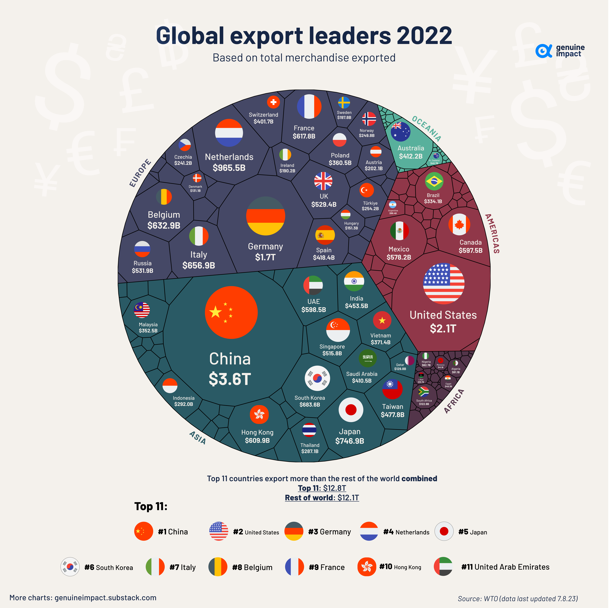

## Table of Contents

## What does it mean for a country to be a large exporter of goods?

When a country is a large exporter of goods, it means that it sends a lot of products to other countries. These products can be anything from cars and electronics to food and clothing. Being a big exporter is important because it helps the country's economy grow. When a country exports a lot, it earns money from other countries. This money can be used to improve things like schools, hospitals, and roads.

Exporting a lot of goods also creates jobs for people in the country. When factories and farms produce more to send abroad, they need more workers. This means more people can find work and earn money to support their families. However, being a large exporter can also have challenges. Sometimes, if a country relies too much on exports, it can be affected by what happens in other countries. If those countries stop buying as much, it can hurt the exporting country's economy.

## Which country is currently the largest exporter of goods in the world?

China is currently the largest exporter of goods in the world. It sends a lot of different things to other countries, like electronics, clothes, and toys. China has many factories that make these products, and it can make them cheaply. This is why many other countries buy things from China.

Being the biggest exporter helps China's economy a lot. It earns a lot of money from selling these goods to other countries. This money helps China build better roads, schools, and hospitals. It also creates many jobs for people in China, which is good for the people living there.

## What types of goods are most commonly exported by the top exporting countries?

The top exporting countries often send out a variety of goods, but some types are more common than others. For example, China, which is the biggest exporter, sends a lot of electronics like smartphones and computers, as well as clothes and toys. These items are popular all over the world because China can make them cheaply and in large amounts. Other countries, like the United States, also export a lot of electronics, but they also send out a lot of airplanes and cars. These are high-tech products that many other countries want to buy.

Germany is another top exporter, and it is known for sending out cars and machinery. German cars, like those made by BMW and Mercedes, are famous for their quality and are sold all over the world. Machinery from Germany is also very popular because it is well-made and reliable. Japan, another big exporter, sends out a lot of cars and electronics too. Japanese cars, like those from Toyota and Honda, are known for being reliable and efficient. These countries show that while electronics and cars are common among top exporters, each country has its own specialties.

## How has the ranking of the largest exporters changed over the past decade?

Over the past decade, the ranking of the largest exporters has seen some changes, but China has remained at the top. China has continued to grow its exports, especially in electronics, clothes, and machinery. The United States, which used to be the top exporter, has stayed in second place. The U.S. exports a lot of airplanes, cars, and also electronics. Germany has held steady in third place, with its strong exports of cars and machinery.

Other countries have also seen shifts in their rankings. Japan has moved down a bit, now usually ranking fourth or fifth, still exporting a lot of cars and electronics. South Korea has climbed up the list, becoming a bigger exporter of electronics and cars. Countries like the Netherlands and Canada have also seen some changes in their positions, with the Netherlands often ranking high due to its role as a trade hub in Europe. Overall, while the top spots have been stable, there have been some movements in the middle ranks.

## What economic factors contribute to a country becoming a leading exporter?

A country becomes a leading exporter because of a few important economic factors. First, it needs to be good at making things cheaply. This means having factories that can make a lot of products quickly and at a low cost. Countries like China and South Korea are good examples because they have many factories that can do this. Another important [factor](/wiki/factor-investing) is having workers who are skilled and can make high-quality products. Countries like Germany and Japan are known for this. They make things like cars and electronics that people all over the world want to buy.

Another key factor is having good trade deals with other countries. These deals can make it easier and cheaper to send products to other places. For example, the United States has trade agreements that help it export airplanes and cars. Also, a country needs good ports and transportation systems to get goods to other countries quickly. The Netherlands is a good example because it has great ports that help it be a big exporter. All these factors together help a country become a leading exporter and grow its economy.

## How do trade agreements influence a country's export volumes?

Trade agreements help a country send more of its goods to other countries. These agreements make it easier and cheaper to trade because they often lower taxes on goods that are being sent from one country to another. For example, if a country has a trade deal with another, they might not have to pay as much money to send their cars or electronics. This makes their products cheaper for people in other countries to buy, so more people buy them. As a result, the country can sell more of its goods and its export numbers go up.

Trade agreements also help by making rules clearer and more predictable. When countries know what the rules are, they can plan better and feel more sure about sending their goods abroad. This can lead to more companies wanting to export because they know they won't face sudden changes or high costs. Overall, trade agreements can really boost a country's export volumes by making trade easier, cheaper, and more predictable.

## What role do natural resources play in a country's export strategy?

Natural resources are really important for a country's export strategy. When a country has a lot of natural resources like oil, gas, or minerals, it can sell these to other countries. For example, countries like Saudi Arabia and Russia have a lot of oil, so they export a lot of it. This helps their economy because they earn a lot of money from selling these resources. Countries with lots of natural resources can focus on exporting them because other countries need them for things like energy and making products.

But relying too much on natural resources can also be risky. If the prices of these resources go down, the country's economy can be hurt because it makes less money from exports. Also, if a country only focuses on selling its natural resources, it might not develop other parts of its economy, like making things or providing services. So, while natural resources can be a big part of a country's export strategy, it's important for countries to think about other ways to grow their economy too.

## How do technological advancements affect a country's export capabilities?

Technological advancements help a country send more goods to other countries. When a country has new technology, it can make things faster and cheaper. For example, if a country has new machines that make cars quicker, it can make more cars to sell to other places. This means the country can export more and earn more money. Also, new technology can help make better products. If a country can make smartphones that are better than others, more people around the world will want to buy them. This helps the country sell more of its goods abroad.

But, technology can also make it harder for some countries to export. If a country does not keep up with new technology, it might not be able to make things as well as other countries. For example, if a country is still using old machines to make clothes, it might not be able to compete with countries that have new, faster machines. This can make it harder for the country to sell its goods to other places. So, while technology can help a country export more, it also means countries need to keep learning and improving to stay competitive.

## What are the challenges faced by countries trying to increase their export volumes?

Countries that want to send more goods to other places face many challenges. One big problem is competition. Other countries might be able to make the same things cheaper or better. For example, if a country wants to sell more cars, it has to compete with countries like Japan and Germany, which are known for making good cars. Another challenge is having the right technology. If a country does not have new machines or ways to make things, it can be hard to make enough goods to send to other countries. Also, if a country does not have good roads, ports, or trains, it can be hard to get the goods to other places quickly and cheaply.

Another challenge is trade rules. Sometimes, other countries put taxes on goods that come from abroad. These taxes can make the goods more expensive, so people might not want to buy them. Trade agreements can help, but they can be hard to make. Countries also need to think about their natural resources. If a country relies too much on selling things like oil or minerals, it can be risky if the prices of these things go down. Finally, countries need skilled workers to make good products. If there are not enough people who know how to make things well, it can be hard to increase exports. All these challenges make it tough for countries to send more of their goods to other places.

## How do global economic trends impact the export performance of leading countries?

Global economic trends can really affect how well the biggest exporting countries do. When the world economy is doing well, people in other countries have more money to spend on things like cars and electronics. This means countries that make these things, like China, the United States, and Germany, can sell more of their goods. But if the world economy slows down, people might not buy as much. This can hurt the export numbers for these countries because fewer people are buying their products. Also, changes in what people want to buy can impact exports. If people start wanting more green technology, countries that make these products can see their exports go up.

Another way global trends affect exports is through changes in money values. If a country's money gets weaker compared to other countries, its goods become cheaper for people abroad to buy. This can help the country sell more of its products. But if the money gets stronger, its goods become more expensive, and exports might go down. Also, big events like trade wars or new trade rules can change how much a country can export. For example, if two big countries start a trade war, they might put taxes on each other's goods, making it harder to sell things. So, the world economy and big events can really change how well a country does with its exports.

## What strategies can countries employ to maintain or improve their position as top exporters?

Countries can use different strategies to stay or become top exporters. One way is to make things better and cheaper. This means using new technology and having good factories that can make a lot of products quickly. For example, if a country can make smartphones that are better than others, more people will want to buy them. Also, countries can focus on making things that people around the world want, like cars or electronics. Another important strategy is to have good trade deals with other countries. These deals can make it easier and cheaper to send products abroad. Countries should also work on having good roads, ports, and trains to get goods to other places quickly.

Another strategy is to use natural resources smartly. If a country has a lot of oil or minerals, it can sell these to other countries. But it's important not to rely too much on these resources because their prices can go up and down. Countries should also train their workers to be skilled and make high-quality products. This can help them compete with other countries. Finally, countries need to keep an eye on global economic trends. If the world economy is doing well, they can sell more. But if it slows down, they need to find new ways to keep their exports strong. By using these strategies, countries can stay or become top exporters.

## How do geopolitical tensions affect international trade and export rankings?

Geopolitical tensions can really change how countries trade with each other. When countries don't get along, they might put taxes or rules on goods coming from the other country. This makes those goods more expensive and harder to sell. For example, if two big countries start a trade war, they might put high taxes on each other's products. This can make it tough for companies in those countries to sell their things abroad. As a result, their export numbers might go down, and they might not be at the top of the export rankings anymore.

Also, geopolitical tensions can make countries look for new places to sell their goods. If a country can't sell to another because of tensions, it might try to sell more to other countries. This can change which countries are the biggest exporters. For example, if a country finds new markets to sell to, its export numbers might go up, and it could move up in the rankings. But if another country loses its main markets because of tensions, its export numbers might drop, and it could fall in the rankings. So, geopolitical tensions can really shake up the world of international trade and change which countries are the top exporters.

## References & Further Reading

[1]: Bergstra, J., Bardenet, R., Bengio, Y., & Kégl, B. (2011). ["Algorithms for Hyper-Parameter Optimization."](https://papers.nips.cc/paper/4443-algorithms-for-hyper-parameter-optimization) Advances in Neural Information Processing Systems 24.

[2]: ["Advances in Financial Machine Learning"](https://www.amazon.com/Advances-Financial-Machine-Learning-Marcos/dp/1119482089) by Marcos Lopez de Prado

[3]: ["Evidence-Based Technical Analysis: Applying the Scientific Method and Statistical Inference to Trading Signals"](https://onlinelibrary.wiley.com/doi/book/10.1002/9781118268315) by David Aronson

[4]: ["Machine Learning for Algorithmic Trading"](https://github.com/stefan-jansen/machine-learning-for-trading) by Stefan Jansen

[5]: ["Quantitative Trading: How to Build Your Own Algorithmic Trading Business"](https://www.amazon.com/Quantitative-Trading-Build-Algorithmic-Business/dp/1119800064) by Ernest P. Chan