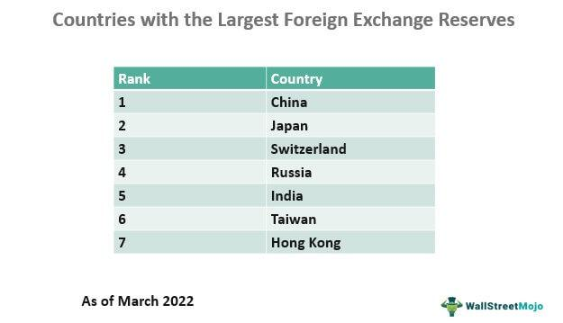

Foreign exchange reserves represent a vital component of a nation's economic framework, serving as a measure of its financial resilience and its capability to uphold its currency's value. These reserves, typically comprised of foreign currencies, gold, and other reserve assets, are indispensable for ensuring economic stability, particularly in times of economic shocks or volatility in global markets. By examining the dynamics of forex reserves, one gains critical insights into global economic trends and the stability of financial markets.

Algorithmic trading has emerged as a significant technological advancement, reshaping how forex reserves are managed and optimized. This sophisticated trading method utilizes complex algorithms to execute trades with high speed and precision, thereby enhancing the efficiency of reserve management. Central banks and financial institutions leverage these algorithms to optimize trading strategies, hedge against various market risks, and maintain liquidity, thereby playing a transformative role in the forex market.



This article explores the significant rankings of countries based on their foreign exchange reserves, illustrating the strategic positioning and economic health of these nations. Additionally, it analyzes how algorithmic trading is used to revolutionize forex markets, influencing economic strategies at both national and global levels. Understanding these elements is crucial for recognizing the intricate connections between forex reserves, global economic health, and financial market stability.

## Table of Contents

## Understanding Foreign Exchange Reserves

Foreign exchange reserves are a critical component of a nation's financial strategy, embodying the holdings of various international currencies at a central bank. These reserves play a fundamental role in underpinning a country's economic health, as they are utilized to support the national currency, particularly in times of economic distress or when facing volatile international markets.

The primary purpose of these reserves is to ensure the country's currency remains stable during fluctuations and shocks in the global economy. For instance, during a sudden depreciation of the national currency, a country can use its forex reserves to buy back its currency in the foreign exchange market, thereby exerting upward pressure on its value. This process is crucial to moderating exchange rate volatility and preserving investor confidence.

Moreover, foreign exchange reserves serve as a buffer to ensure that a nation can meet its international obligations, such as paying off debts or financing imports, especially when the country's regular sources of foreign currencies may not suffice. For example, a country might need to step in to finance import requirements or manage foreign debt repayments when export revenues fall short due to adverse trade conditions. By maintaining significant reserves, nations can reinforce their financial positions, preparing themselves to tackle sudden financial upheavals without compromising economic stability.

In addition to stabilizing national currencies, foreign exchange reserves are employed to influence monetary policy. A central bank might adjust interest rates or engage in open market operations, utilizing foreign reserves to regulate the money supply and control inflation. These strategies are crucial in managing the macroeconomic objectives of a country, including economic growth and price stability.

In essence, the strategic accumulation and management of foreign exchange reserves are indispensable for countries to navigate the complexities of international finance, ensure the stability of their currencies, and sustain their economic resilience in the face of unforeseen challenges.

## Top Countries by Forex Reserves

China holds the largest foreign exchange reserves in the world, driven by its export-oriented economic strategy. This approach has consistently allowed China to maintain favorable trade balances, accumulating substantial reserves over time. The People's Bank of China, the central bank, manages these reserves, which are primarily held in major currencies such as the U.S. dollar, euro, and yen. These reserves not only aid in stabilizing the yuan but also provide financial strength to manage international trade fluctuations and economic policy adjustments.

Japan is another leading nation in foreign exchange reserves. The country's reserves are bolstered by its expansive export sector, particularly in automobiles and electronics. The Bank of Japan plays a pivotal role in managing these reserves, utilizing them to preserve economic stability and supplement monetary policy measures. Japan's reliance on exports necessitates maintaining significant foreign reserves to buffer against exchange rate [volatility](/wiki/volatility-trading-strategies) and support the yen during market fluctuations.

Switzerland ranks prominently in terms of foreign exchange reserves, benefiting from its financial sector's robustness and prudent economic policies. The Swiss National Bank oversees these reserves, which are strategically used to ensure currency stability, particularly for the Swiss franc, known for its safe-haven status. Switzerland's reserves are indicative of its strong economic fundamentals and its role as a global financial hub.

The countries leading in foreign exchange reserves offer a window into global trade dynamics and economic strategies. A considerable reserve toolkit allows nations to mitigate potential economic shocks and engage more dynamically within the international trade ecosystem. Monitoring these leaders in reserves provides insights into their economic health and strategic positioning on the global stage.

## Role of Algorithmic Trading in Forex Markets

Algorithmic trading in the [forex](/wiki/forex-system) markets refers to the use of advanced algorithms and computational techniques to execute trades with speed and precision. This practice significantly influences forex reserve management and shapes market dynamics by enhancing the efficiency and accuracy of trading operations.

Algorithms, or algos, are employed by central banks and financial institutions to develop optimized trading strategies. By analyzing vast amounts of financial data, these algos can identify trends and patterns that might not be visible to the human eye. This capability allows institutions to hedge against various risks associated with forex markets, such as exchange rate volatility and [liquidity](/wiki/liquidity-risk-premium) fluctuations. For instance, utilizing a mean-reversion strategy, an algorithm can execute trades when the price deviates from its historical average, thus exploiting short-term price inefficiencies.

The primary function of [algorithmic trading](/wiki/algorithmic-trading) is to enhance market liquidity. By automating the buying and selling processes, algorithms facilitate smoother transactions, reducing the bid-ask spread. This reduction in transaction costs benefits not only large institutions but also smaller market participants by making the trading ecosystem more inclusive and efficient.

Furthermore, algorithmic trading equips central banks with sophisticated tools for forecasting and managing their forex reserves. Predictive models employed by algorithms can simulate various economic scenarios, providing insights into future market conditions. These models help in making informed decisions regarding the allocation and utilization of reserves. For instance, an algorithm may incorporate Monte Carlo simulations to predict the likely future paths of currency values based on historical data, thereby assisting in strategic reserve management.

The integration of [machine learning](/wiki/machine-learning) and [artificial intelligence](/wiki/ai-artificial-intelligence) in algorithmic trading further enhances its capabilities. Machine learning models can adapt to changing market conditions by learning from new data, which improves the performance of trading strategies over time. This adaptability is crucial in forex markets, where economic indicators and geopolitical events can rapidly alter market sentiments.

To illustrate the process of algorithmic trading in forex markets, consider the following simplified Python code snippet that demonstrates a basic mean-reversion strategy:

```python
import numpy as np
import pandas as pd

# Generate simulated price series
np.random.seed(42)
price_data = pd.Series(np.random.normal(0, 0.1, 1000)).cumsum() + 100

# Define mean-reversion trading strategy
def mean_reversion_strategy(data, window_size=20, threshold=1.0):
    rolling_mean = data.rolling(window=window_size).mean()
    rolling_std = data.rolling(window=window_size).std()
    z_score = (data - rolling_mean) / rolling_std
    buy_signals = z_score < -threshold
    sell_signals = z_score > threshold
    return buy_signals.astype(int) - sell_signals.astype(int)

signals = mean_reversion_strategy(price_data)

# Display the first few signals
print(signals.head())
```

In this example, the algorithm calculates the rolling mean and standard deviation of the price series to identify buy and sell signals based on a predefined threshold. Such strategies exemplify the application of algorithmic techniques to improve forex market operations.

Overall, algorithmic trading is a cornerstone of modern forex markets, offering enhanced market liquidity and robust frameworks for reserve management and risk mitigation. This technological advancement not only optimizes trading operations but also provides crucial insights for strategic economic decisions.

## Special Considerations in Foreign Exchange

Sanctions and geopolitical tensions have profound effects on a country's capacity to utilize its foreign exchange reserves. Such impacts have been notably observed in Russia's recent challenges, where international sanctions have restricted access to significant portions of its reserves. The freezing of assets held in foreign accounts limits a nation's ability to defend its currency or engage in international trade, demonstrating how geopolitical factors can alter the landscape of foreign exchange management.

Currency composition is another crucial [factor](/wiki/factor-investing) influencing how reserves are managed and deployed. Countries often hold reserves in a mix of currencies to optimize flexibility and reduce risk. This composition typically includes major currencies like the US dollar, Euro, Japanese yen, and British pound. The choice of these currencies is guided by factors including trade relationships, relative currency stability, and the liquidity of the currency in international markets. For example, countries with deep trade links with the US might hold a larger portion of their reserves in US dollars to facilitate smoother transactions.

International relations also profoundly affect how reserves are utilized. A nation's diplomatic ties and economic partnerships can dictate reserve usage strategies. For instance, favorable trade agreements or alliances may prompt a nation to allocate reserves to support the currency of a strategic partner. Conversely, strained relations might necessitate strategic diversification to mitigate risks associated with potential economic stand-offs.

Strategic management of foreign exchange reserves is vital to maintaining economic stability and fostering international trade confidence. Nations must carefully balance their reserve composition and deployment strategies to protect their economies from external shocks. This includes establishing policies that navigate the complexities of international law, financial regulations, and economic diplomacy. By actively managing reserve allocation and adjusting strategies in response to geopolitical developments, countries can better withstand economic pressures and enhance global market confidence. 

Overall, the ability to predict and respond to international challenges while maintaining a robust reserve strategy plays a pivotal role in safeguarding economic resilience and securing a country's position in the global economy.

## Conclusion

Maintaining robust foreign exchange reserves is essential for economic stability and safeguarding a nation's currency value. These reserves function as a buffer against economic uncertainties and are integral to a country's ability to control inflation, manage exchange rate fluctuations, and meet international payment obligations. Countries with large reserves have significant leverage in global economic trade, allowing them to influence market conditions and protect their economies against external shocks.

The strategic use of algorithmic trading has increasingly become a part of managing these reserves. With its ability to execute trades rapidly and efficiently, algorithmic trading optimizes reserve management and boosts market positioning by minimizing risks and maximizing returns. This technology can enhance liquidity and precision in forex markets, thus improving the overall effectiveness of reserve deployment.

Monitoring forex reserve rankings is crucial as it offers valuable insights into the economic health of countries and reflects geopolitical relations that influence global markets. Patterns and shifts in these rankings can indicate changes in trade balances, resource allocations, and strategic financial policies adopted by different countries. Understanding these dynamics helps anticipate potential geopolitical tensions and economic adjustments, providing a comprehensive picture of the global economic landscape.

## References & Further Reading

[1]: ["International Reserves and Foreign Currency Liquidity - Guidelines for a Data Template"](https://www.imf.org/en/Publications/Manuals-Guides/Issues/2016/12/31/International-Reserves-and-Foreign-Currency-Liquidity-Guidelines-for-a-Data-Template-40117) by the International Monetary Fund

[2]: ["Foreign Exchange Reserves."](https://en.wikipedia.org/wiki/List_of_countries_by_foreign-exchange_reserves) Bank for International Settlements

[3]: ["Exchange Rate Stabilization and Managed Floating: Is There a Third Way?"](https://www.wallstreetmojo.com/managed-floating-exchange-rate/) by Michael W. Klein and Jay C. Shambaugh

[4]: ["Algorithmic and High-Frequency Trading"](https://assets.cambridge.org/97811070/91146/frontmatter/9781107091146_frontmatter.pdf) by Álvaro Cartea, Sébastien Jaimungal, and José Penalva

[5]: ["Algorithmic Trading and DMA: An Introduction to Direct Access Trading Strategies"](https://www.semanticscholar.org/paper/Algorithmic-trading-%26-DMA-%3A-an-introduction-to-Johnson/aa5de1ab883d5e23b6651faa7c1807586d688e4b) by Barry Johnson