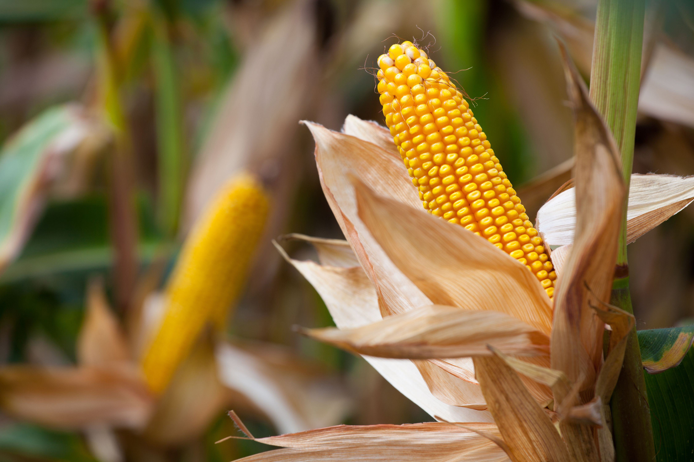

Corn is one of the most significant agricultural commodities produced globally, serving diverse roles across various sectors. As a staple food, it provides essential nutrients to billions of people worldwide. In agriculture, it is a fundamental component of animal feed, supporting the livestock industries that many economies depend on. Furthermore, corn is a key ingredient in numerous industrial products, from biofuels to bioplastics, underscoring its versatility and importance in modern industry.

Understanding the global corn production landscape becomes crucial for investors and policymakers due to its extensive impact on economies and industries. The dynamics of corn production are influenced by multiple factors, including climatic conditions, technological advancements, and international trade policies. As a major commodity, fluctuations in its production can have far-reaching effects on global food security, energy markets, and trade balances.



This article aims to provide a comprehensive overview of the global corn production ecosystem. It highlights the major corn-producing countries and examines the economic and environmental factors influencing their production capabilities. Additionally, the article will explore the increasingly significant role of algorithmic trading in the corn markets, as these advanced trading techniques have transformed how commodities like corn are traded. Recognizing and understanding these elements is essential for stakeholders involved in the global corn supply chain, enabling them to make informed decisions in a rapidly evolving agricultural landscape.

## Table of Contents

## Major Corn-Producing Countries

The global corn production landscape is shaped by a few dominant players, each contributing significantly to the overall supply. The United States stands at the forefront of corn production, benefiting from its expansive arable land, favorable climate, and advanced agricultural technology. With its highly efficient farming practices, the U.S. accounts for approximately one-third of the world's corn production, positioning itself as both a major producer and exporter [1].

China ranks second in global corn production, catering mainly to its domestic needs due to the country's vast population. With a focus on internal consumption, China's corn industry is pivotal in sustaining its food security and supporting its livestock sector. Despite the high [volume](/wiki/volume-trading-strategy) of production, limited arable land compared to its population size constrains its export capacity [2].

Brazil emerges as a significant player in the corn market, not only producing substantial quantities but also becoming a key exporter. Favorable weather conditions, coupled with large-scale farming operations, allow Brazil to maintain a strong presence in the international corn trade. Moreover, government policies and investment in agricultural technologies have bolstered Brazil's corn production capabilities [3].

Argentina also makes notable contributions to global corn supplies, leveraging its extensive agricultural land and a favorable climate for corn cultivation. As a significant exporter, Argentina primarily supplies corn to neighboring countries and the global market, aiding in balancing supply and demand dynamics worldwide [4].

India, though not the largest producer, plays a vital role in the corn industry. Indian corn primarily serves the domestic market, catering to the needs of its diverse population and burgeoning animal feed industry. Despite facing challenges like fluctuating monsoons and limited access to technology, India's corn sector continues to grow steadily [5].

The European Union (EU), viewed collectively, ranks as a major corn producer. With countries like France and Romania leading the charge, the EU contributes significantly to regional and global corn production. The varying climates and soil conditions across the member states offer diverse growing conditions, enhancing the overall output of corn within the union [6].

These major corn-producing countries are integral to meeting the global demand for corn, whether for food, animal feed, or industrial purposes. Understanding their roles and capacities is essential for navigating the complexities of the international corn market.

References:  
[1] USDA Foreign Agricultural Service. (2021). "Grain: World Markets and Trade."  
[2] FAO. (2020). "FAOSTAT database: Crops."  
[3] "Global Corn Production and Yield." World Bank, 2020.  
[4] Ministry of Agroindustry, Argentina. (2021). "Annual Report on Agricultural Production."  
[5] Ministry of Agriculture & Farmers Welfare, Government of India. (2021). "Agricultural Statistics at a Glance."  
[6] European Commission, Directorate-General for Agriculture and Rural Development. (2020). "EU Agricultural Markets Briefs: Corn."

## Trends and Challenges in Corn Production

Global corn demand continues to climb, driven by its diverse applications in both food and industry sectors. Corn is a fundamental ingredient in an array of products including sweeteners, starches, and ethanol, while also being a primary feedstock for livestock. This multiplicity of uses ensures corn's steady demand trajectory. However, corn production faces several significant challenges that could affect supply dynamics.

**Climate Change and Environmental Factors**

Climate change introduces substantial unpredictability into corn production. Increasing temperatures, altered precipitation patterns, and more frequent extreme weather events such as droughts and floods affect crop yields. Corn is particularly sensitive to temperature variations during its pollination phase, which can lead to reduced yield under heat stress. This relationship is significant given that the optimal temperature range for corn growth is narrowly circumscribed between 20°C and 30°C [1]. Deviations from this range can have deleterious effects on yield.

Moreover, climate-induced soil degradation, water scarcity, and pest proliferation threaten corn production sustainability. Adaptation mechanisms, such as developing heat and drought-resistant corn variants, and employing water management strategies, are crucial to mitigating these challenges.

**Policy Changes and Their Impacts**

Policy landscapes, encompassing government subsidies and trade agreements, significantly influence corn production and distribution. Subsidies can artificially inflate production, affecting global market balances. Countries such as the United States, one of the largest corn producers, offer substantial subsidies to domestic farmers. These subsidies aim to stabilize farmer incomes but can lead to overproduction, impacting global prices and trade dynamics.

Trade agreements also dictate corn markets by regulating tariffs and quotas. For instance, trade policies under pacts such as the USMCA (United States-Mexico-Canada Agreement) directly influence corn flow across borders in North America. Similarly, import tariffs imposed by major corn-importing countries can alter export strategies for producing countries. These policy instruments can either facilitate or hinder international market access and require constant monitoring by stakeholders to navigate the complex market ecosystem effectively.

In conclusion, while global demand for corn remains robust, the challenges posed by climate change and evolving policy frameworks require significant attention and strategy. Addressing these factors through innovation and international cooperation is essential for maintaining corn's role as a staple commodity in the global market.

**References:**

[1] Zhao, C., et al. "Temperature increase reduces global yields of major crops in four independent estimates." Proceedings of the National Academy of Sciences, vol. 114, no. 35, 2017, pp. 9326-9331.

## Corn and the Role of Algorithmic Trading

Algorithmic trading has introduced transformative changes to the commodity markets, corn included. This trading methodology utilizes algorithms to execute trades at speeds and frequencies that surpass human capabilities. By leveraging mathematical models and vast arrays of market data, [algorithmic trading](/wiki/algorithmic-trading) enhances market efficiency and [liquidity](/wiki/liquidity-risk-premium).

One of the prime advantages of algorithmic trading in the corn markets is its capacity for high-frequency trading ([HFT](/wiki/high-frequency-trading-strategies)). HFT uses computer algorithms to trade large volumes within fractions of a second. These algorithms can identify minute price discrepancies and take advantage of [arbitrage](/wiki/arbitrage) opportunities, thus ensuring more liquidity in the market. For instance, if a sudden increase in corn demand is detected, algorithmic strategies can immediately initiate buy orders, whereas traditional trading approaches might take substantially longer to respond.

Moreover, algorithmic trading systems incorporate a range of market indicators. These indicators can be anything from simple moving averages to complex, custom-designed signals that analyze price trends, trading volumes, and historical data patterns. By continuously analyzing these indicators, algorithmic systems can make informed predictions and decisions on the optimal times to execute trades, enhancing both profit margins and market stability.

The integration of [machine learning](/wiki/machine-learning) models in algorithmic trading represents a significant leap forward in predictive analytics. Machine learning techniques enable trading algorithms to learn from past market behavior, recognize emerging patterns, and adjust strategies accordingly. Through techniques such as supervised learning, algorithms can be trained to forecast corn price trends based on past data, identifying key patterns that signal price movements. 

For example, using a regression algorithm, one could model the corn price $P_t$ at time $t$ as:

$$
P_t = \beta_0 + \beta_1X_1 + \beta_2X_2 + \cdots + \beta_nX_n + \epsilon
$$

where $X_1, X_2, \ldots, X_n$ are different predictor variables such as historical prices, trading volumes, and external economic factors, while $\epsilon$ is the error term capturing the unpredictability.

In practical settings, a simple machine learning code snippet could look like:

```python
from sklearn.linear_model import LinearRegression
import numpy as np

# Sample data: historical factors influencing corn prices
X = np.array([[5.1, 3.5], [4.9, 3.0], [6.2, 3.3]])  # Example features like previous prices and trade volumes
y = np.array([7.0, 6.8, 6.5])  # Corn prices

# Creating a linear regression model
model = LinearRegression()

# Training the model
model.fit(X, y)

# Predicting future corn price
future_factors = np.array([[5.8, 3.3]])
predicted_price = model.predict(future_factors)
print("Predicted Corn Price:", predicted_price)
```

In conclusion, algorithmic trading is reshaping the landscape of corn markets by offering enhanced trading speed, predictive insights, and improved market liquidity. As these technologies continue to evolve, they will likely play an increasingly pivotal role in the efficient functioning of corn markets globally.

## The Future of Corn Production and Trading

Technological advancements are poised to significantly enhance the efficiency of corn production, with precision agriculture leading the charge. Precision agriculture involves the use of technologies like GPS, drones, and IoT devices to monitor and optimize field-level agricultural processes. The adoption of these technologies can result in more precise applications of fertilizer and water, reducing waste and boosting yields. For instance, variable rate technology (VRT) allows farmers to apply inputs like seeds and chemicals at varying rates across a field, optimizing plant growth and resource use.

Sustainability is becoming an imperative in corn production due to growing environmental concerns. Practices such as crop rotation, no-till farming, and integrated pest management are increasingly adopted to mitigate environmental impacts. These practices help in maintaining soil health, reducing greenhouse gas emissions, and preserving biodiversity. Moreover, they align with the broader goals of sustainable agriculture, which seeks to balance productivity with environmental stewardship.

On the trading front, the evolution of algorithmic trading continues to reshape market dynamics, with [artificial intelligence](/wiki/ai-artificial-intelligence) (AI) playing an increasingly crucial role. Algorithmic trading systems execute trades based on predefined criteria, allowing for rapid response to market changes and enhanced liquidity. Machine learning, a subset of AI, can be utilized to analyze vast datasets to discover patterns that might not be apparent to human traders. This capability enhances predictive accuracy in trading strategies, offering a competitive edge. Python is often used in developing these systems, given its robust libraries for data analysis, such as NumPy and pandas.

For example, a simple Python script using pandas might analyze historical corn prices to predict future trends:

```python
import pandas as pd
from sklearn.model_selection import train_test_split
from sklearn.ensemble import RandomForestRegressor

# Load historical corn price data
data = pd.read_csv('corn_prices.csv')

# Preprocess data (e.g., converting dates, handling missing values)
data['Date'] = pd.to_datetime(data['Date'])
data = data.dropna()

# Feature selection
X = data[['Day', 'Month', 'Year']]  # Basic time features
y = data['Price']

# Split data into train and test sets
X_train, X_test, y_train, y_test = train_test_split(X, y, test_size=0.2, random_state=42)

# Train a RandomForest model
model = RandomForestRegressor(n_estimators=100, random_state=42)
model.fit(X_train, y_train)

# Predict and evaluate
predictions = model.predict(X_test)
print("Predicted corn prices:", predictions)
```

As technology and trade practices evolve, innovation will remain key to navigating future challenges in corn production and trading. Balancing technological adoption with sustainable practices will be crucial for meeting global demands and minimizing environmental impacts.

## Conclusion

Corn remains a vital crop in global agriculture, influencing economies and industries worldwide. Its multifaceted applications, spanning food, animal feed, and industrial sectors, underscore its significance as a staple commodity. The ability of corn to bolster economic activities in producing countries arises from its integration into a wide range of products, from biofuels to biodegradable plastics, thus sustaining its demand across various markets.

Understanding the major players in corn production, primarily the United States, China, Brazil, Argentina, and India, is essential for stakeholders, including investors and policymakers. These countries not only lead in production volumes but also play crucial roles in shaping global corn trade dynamics. Technological advancements in these nations, particularly in agriculture and trading technologies, continue to drive productivity and efficiency. In the United States, for instance, the adoption of genetically modified crop strains and advanced agricultural methods like precision farming enables higher yields and reduced resource usage.

Future prospects for corn production and trading hinge on adopting sustainable practices and integrating advanced technologies. As environmental concerns rise, sustainable practices will become integral, ensuring that corn production aligns with global environmental goals. This includes adopting climate-smart agricultural methods, optimizing resource use, and minimizing environmental footprints.

Moreover, technological integration remains pivotal. Precision agriculture technologies, such as drones and satellite imagery, will likely advance corn production by facilitating better resource management and yield predictions. Similarly, the continuous evolution of algorithmic trading, often augmented by machine learning and artificial intelligence, is expected to impact market dynamics profoundly. These technologies can enhance market prediction accuracy, facilitate efficient market operations, and offer competitive advantages to participants.

In conclusion, as a critical component of global agriculture, corn's future is intertwined with advancements in sustainable farming practices and trading technologies. Stakeholders must leverage these innovations to navigate the complexities of the global corn market and meet the ever-growing demands efficiently and sustainably.

## References & Further Reading

[1]: USDA Foreign Agricultural Service. (2021). ["Grain: World Markets and Trade"](https://fas.usda.gov/data/grain-world-markets-and-trade-03082024) 

[2]: FAO. (2020). ["FAOSTAT database: Crops"](https://www.fao.org/faostat/en/) 

[3]: World Bank. (2020). ["Global Corn Production and Yield"](https://data.worldbank.org/indicator/AG.PRD.CREL.MT)

[4]: Ministry of Agroindustry, Argentina. (2021). ["Annual Report on Agricultural Production"](https://apps.fas.usda.gov/newgainapi/api/Report/DownloadReportByFileName?fileName=Agricultural%20Biotechnology%20Annual_Buenos%20Aires_Argentina_10-20-2021.pdf)

[5]: Ministry of Agriculture & Farmers Welfare, Government of India. (2021). ["Agricultural Statistics at a Glance"](https://desagri.gov.in/document-report/agricultural-statistics-at-a-glance-2021/)

[6]: European Commission, Directorate-General for Agriculture and Rural Development. (2020). ["EU Agricultural Markets Briefs: Corn"](https://commission.europa.eu/about-european-commission/departments-and-executive-agencies/agriculture-and-rural-development_en)

[7]: Zhao, C., et al. (2017). ["Temperature increase reduces global yields of major crops in four independent estimates."](https://pubmed.ncbi.nlm.nih.gov/28811375/) Proceedings of the National Academy of Sciences

[8]: Stefan Jansen. (2020). ["Machine Learning for Algorithmic Trading: Predictive models to extract signals from market and alternative data for systematic trading strategies with Python, 2nd Edition"](https://www.amazon.com/Machine-Learning-Algorithmic-Trading-alternative/dp/1839217715) 

[9]: Marcos Lopez de Prado. (2018). ["Advances in Financial Machine Learning"](https://www.wiley.com/en-us/Advances+in+Financial+Machine+Learning-p-9781119482086) 

[10]: Ernest P. Chan. (2009). ["Quantitative Trading: How to Build Your Own Algorithmic Trading Business"](https://www.amazon.com/Quantitative-Trading-Build-Algorithmic-Business/dp/0470284889)