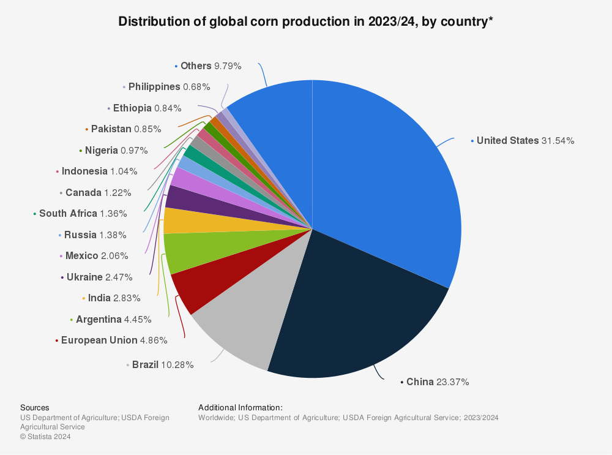

## Table of Contents

## What is corn and why is it important globally?

Corn, also known as maize, is a type of grain that comes from a plant called Zea mays. It is a tall plant with big leaves and ears that have rows of kernels. People grow corn all over the world because it is easy to grow and can be used in many ways. You can eat corn fresh off the cob, or you can dry it and grind it into flour to make bread and other foods. Corn is also used to feed animals and to make things like corn syrup, ethanol, and even plastic.

Corn is very important around the world for many reasons. First, it is a big part of the food supply. Many people in places like Mexico, Central America, and parts of Africa rely on corn as a main part of their diet. It is also used to feed animals that give us meat, milk, and eggs. Second, corn is important for the economy. Countries that grow a lot of corn, like the United States, Brazil, and Argentina, can sell it to other countries. This helps their farmers make money and helps other countries get the food they need. Overall, corn plays a big role in feeding people and supporting economies around the world.

## Which country is the largest producer of corn in the world?

The United States is the largest producer of corn in the world. They grow a lot of corn because they have big farms and good weather for it. The states in the middle of the country, like Iowa and Illinois, grow most of the corn. 

Corn is important for the United States because they use it for many things. They feed it to animals, make it into food for people, and even turn it into fuel for cars. Because they produce so much corn, they can also sell it to other countries, which helps their economy.

## How much corn does the United States produce annually?

The United States produces a lot of corn every year. In recent years, they have been growing around 15 billion bushels of corn. A bushel is a way to measure corn, and it's about the size of a big basket. This amount of corn is so big that it could fill up a lot of swimming pools!

Corn is important for the United States because they use it in many ways. They feed it to animals like cows and chickens, which helps them grow big and healthy. People also eat corn in many forms, like corn on the cob, popcorn, and corn syrup in drinks and sweets. Plus, they turn some of the corn into ethanol, which is a kind of fuel for cars. Because they grow so much corn, the United States can also sell it to other countries, which helps their farmers make money and supports the economy.

## What percentage of the world's corn production comes from China?

China is one of the biggest corn producers in the world, but it doesn't produce as much corn as the United States. About 20% of the world's corn comes from China. This means that one out of every five bushels of corn grown around the world is from China.

Corn is very important in China. They use it to feed animals like pigs and chickens, which helps them have enough meat for people to eat. They also use corn to make food for people, like corn flour for bread and corn oil for cooking. Even though China grows a lot of corn, they still need to buy some from other countries to have enough for everyone.

## How has Brazil's corn production changed over the last decade?

Over the last ten years, Brazil's corn production has grown a lot. In the beginning of the decade, Brazil was producing around 70 million tons of corn each year. By the end of the decade, this number had jumped to over 100 million tons. This big increase happened because farmers in Brazil started using better seeds and farming methods. They also started growing corn in more places, especially in the second crop season after soybeans.

Corn is really important for Brazil. They use it to feed animals like cows and chickens, which helps them have enough meat for people to eat. They also use corn to make things like corn oil and ethanol, which is a kind of fuel for cars. Because Brazil grows so much corn, they can sell it to other countries, which helps their farmers make money and supports the country's economy. This growth in corn production has made Brazil one of the top corn producers in the world, right after the United States.

## What are the main uses of corn in the top producing countries?

In the United States, corn is used in many ways. They use a lot of corn to feed animals like cows, pigs, and chickens. This helps them have enough meat, milk, and eggs for people to eat. Corn is also turned into food for people, like corn on the cob, popcorn, and corn syrup in drinks and sweets. Another big use of corn in the United States is to make ethanol, which is a kind of fuel for cars. Because they grow so much corn, they can also sell it to other countries, which helps their farmers make money and supports the economy.

In China, corn is mainly used to feed animals like pigs and chickens. This helps them have enough meat for people to eat. They also use corn to make food for people, like corn flour for bread and corn oil for cooking. Even though China grows a lot of corn, they still need to buy some from other countries to have enough for everyone. Corn is very important for China's food supply and economy.

In Brazil, corn is used to feed animals like cows and chickens, just like in the United States and China. This helps them have enough meat for people to eat. They also use corn to make things like corn oil and ethanol, which is a kind of fuel for cars. Because Brazil grows so much corn, they can sell it to other countries, which helps their farmers make money and supports the country's economy.

## What factors contribute to a country's ability to produce large amounts of corn?

Several things help a country grow a lot of corn. Good weather is very important. Corn needs a lot of sun and enough rain to grow well. Places like the middle of the United States have great weather for corn. Also, having big fields helps. Countries with a lot of land can plant more corn and use big machines to take care of it. Using good seeds and farming methods also makes a big difference. New kinds of seeds can grow more corn on the same amount of land. Farmers who know a lot about growing corn and use the best ways to take care of their fields can produce more corn.

Another important thing is having the right tools and technology. Big machines like tractors and harvesters make it easier to plant and pick corn. Countries that can afford these machines can grow more corn faster. Also, having good ways to store and move corn after it's picked helps a lot. If a country can keep corn fresh and send it to places where people need it, they can sell more corn and make more money. All these things together help countries like the United States, China, and Brazil produce a lot of corn.

## How do climate and soil conditions affect corn production in major producing countries?

Climate and soil conditions are very important for growing corn. In the United States, the middle part of the country, like Iowa and Illinois, has perfect weather for corn. It gets a lot of sun and just the right amount of rain. The soil there is also very good because it is rich and full of nutrients that corn needs to grow big and strong. This helps the United States grow a lot of corn every year.

In China, the weather can be different in different parts of the country. Some places, like the northeast, have good weather for corn with warm summers and enough rain. The soil in these areas is also good for growing corn. But in other parts of China, the weather might be too dry or too wet, which can make it hard to grow corn. So, China has to work hard to use the best places for corn and make sure the soil stays healthy.

Brazil has a lot of different climates and soils too. The southern part of Brazil has good weather for corn, with warm temperatures and enough rain. The soil there is also good for growing corn. But in other parts of Brazil, like the north, the weather can be too hot and wet, which can make it hard to grow corn. Brazil has been getting better at growing corn in different places by using new seeds and farming methods that work well with the local climate and soil.

## What are the economic impacts of corn production on the global market?

Corn production has a big effect on the world's economy. Countries that grow a lot of corn, like the United States, China, and Brazil, can sell it to other countries. This helps their farmers make money and supports their economy. When these countries produce more corn, the price of corn around the world can go down. This is good for countries that need to buy corn because it means they can get it cheaper. But it can be hard for farmers in countries that don't produce as much corn because they might not be able to sell their corn for a good price.

Corn is used in many different ways, which also affects the economy. It is used to feed animals like cows, pigs, and chickens, which helps keep the price of meat, milk, and eggs steady. Corn is also turned into food for people, like corn syrup in drinks and sweets, and ethanol, which is a kind of fuel for cars. When there is a lot of corn, the price of these things can go down, which is good for people who buy them. But if there is not enough corn, the price of these things can go up, which can make life harder for people who need to buy them.

## How do advancements in agricultural technology influence corn yields in leading countries?

Advancements in agricultural technology have a big impact on how much corn countries like the United States, China, and Brazil can grow. New kinds of seeds, called hybrid seeds, can grow more corn on the same amount of land. These seeds are made to be strong and resist diseases and bad weather. Farmers also use big machines like tractors and harvesters to plant and pick corn faster and easier. These machines help farmers take care of more land and grow more corn.

Using technology also helps farmers use the right amount of water and fertilizer. Tools like drip irrigation systems make sure the corn gets just enough water without wasting any. Sensors in the fields can tell farmers when the soil needs more nutrients, so they can add the right amount of fertilizer. This makes the corn grow better and helps farmers save money. All these new technologies help countries grow more corn, which is good for their economy and the world's food supply.

## What are the environmental concerns associated with large-scale corn production?

Large-scale corn production can cause problems for the environment. One big issue is that growing a lot of corn can use up a lot of water. Corn needs a lot of water to grow well, and in some places, there might not be enough water for all the corn fields. This can make the soil dry and hurt other plants and animals that live nearby. Also, farmers often use a lot of chemicals like fertilizers and pesticides to help the corn grow. These chemicals can get into rivers and lakes and make the water dirty. This can harm fish and other animals that live in the water.

Another concern is that growing corn can lead to less variety in plants and animals. When farmers use a lot of land to grow only corn, it can push out other kinds of plants and animals. This can make it hard for them to live and grow. Also, when farmers clear new land to grow more corn, it can mean cutting down forests or plowing up grasslands. This can release a lot of carbon into the air, which can make the Earth warmer. So, while corn is important for food and the economy, it's important to think about how we grow it to help protect the environment.

## How do international trade policies affect the global corn market and production strategies?

International trade policies have a big impact on the global corn market. When countries put rules on how much corn they can buy or sell, it changes the price of corn around the world. For example, if a country puts a tax on corn coming into their country, it can make corn more expensive there. This might make farmers in other countries want to sell their corn to that country because they can get a better price. But it can also make it hard for farmers in the country with the tax because they have to compete with more expensive corn from other places.

These trade policies also affect how farmers decide to grow their corn. If a country knows they can sell a lot of corn to another country because of a good trade deal, they might plant more corn. This can help them make more money. But if another country puts limits on how much corn they can buy, farmers might decide to grow less corn or try to sell it somewhere else. So, trade policies can make farmers change their plans and can affect how much corn is grown and where it goes.

## What is the role of algorithmic trading in relation to corn?

Algorithmic trading has introduced transformative changes to the commodity markets, corn included. This trading methodology utilizes algorithms to execute trades at speeds and frequencies that surpass human capabilities. By leveraging mathematical models and vast arrays of market data, [algorithmic trading](/wiki/algorithmic-trading) enhances market efficiency and [liquidity](/wiki/liquidity-risk-premium).

One of the prime advantages of algorithmic trading in the corn markets is its capacity for high-frequency trading ([HFT](/wiki/high-frequency-trading-strategies)). HFT uses computer algorithms to trade large volumes within fractions of a second. These algorithms can identify minute price discrepancies and take advantage of [arbitrage](/wiki/arbitrage) opportunities, thus ensuring more liquidity in the market. For instance, if a sudden increase in corn demand is detected, algorithmic strategies can immediately initiate buy orders, whereas traditional trading approaches might take substantially longer to respond.

Moreover, algorithmic trading systems incorporate a range of market indicators. These indicators can be anything from simple moving averages to complex, custom-designed signals that analyze price trends, trading volumes, and historical data patterns. By continuously analyzing these indicators, algorithmic systems can make informed predictions and decisions on the optimal times to execute trades, enhancing both profit margins and market stability.

The integration of [machine learning](/wiki/machine-learning) models in algorithmic trading represents a significant leap forward in predictive analytics. Machine learning techniques enable trading algorithms to learn from past market behavior, recognize emerging patterns, and adjust strategies accordingly. Through techniques such as supervised learning, algorithms can be trained to forecast corn price trends based on past data, identifying key patterns that signal price movements. 

For example, using a regression algorithm, one could model the corn price $P_t$ at time $t$ as:

$$
P_t = \beta_0 + \beta_1X_1 + \beta_2X_2 + \cdots + \beta_nX_n + \epsilon
$$

where $X_1, X_2, \ldots, X_n$ are different predictor variables such as historical prices, trading volumes, and external economic factors, while $\epsilon$ is the error term capturing the unpredictability.

In practical settings, a simple machine learning code snippet could look like:

```python
from sklearn.linear_model import LinearRegression
import numpy as np

# Sample data: historical factors influencing corn prices
X = np.array([[5.1, 3.5], [4.9, 3.0], [6.2, 3.3]])  # Example features like previous prices and trade volumes
y = np.array([7.0, 6.8, 6.5])  # Corn prices

# Creating a linear regression model
model = LinearRegression()

# Training the model
model.fit(X, y)

# Predicting future corn price
future_factors = np.array([[5.8, 3.3]])
predicted_price = model.predict(future_factors)
print("Predicted Corn Price:", predicted_price)
```

In conclusion, algorithmic trading is reshaping the landscape of corn markets by offering enhanced trading speed, predictive insights, and improved market liquidity. As these technologies continue to evolve, they will likely play an increasingly pivotal role in the efficient functioning of corn markets globally.

## References & Further Reading

[1]: USDA Foreign Agricultural Service. (2021). ["Grain: World Markets and Trade"](https://fas.usda.gov/data/grain-world-markets-and-trade-03082024) 

[2]: FAO. (2020). ["FAOSTAT database: Crops"](https://www.fao.org/faostat/en/) 

[3]: World Bank. (2020). ["Global Corn Production and Yield"](https://data.worldbank.org/indicator/AG.PRD.CREL.MT)

[4]: Ministry of Agroindustry, Argentina. (2021). ["Annual Report on Agricultural Production"](https://apps.fas.usda.gov/newgainapi/api/Report/DownloadReportByFileName?fileName=Agricultural%20Biotechnology%20Annual_Buenos%20Aires_Argentina_10-20-2021.pdf)

[5]: Ministry of Agriculture & Farmers Welfare, Government of India. (2021). ["Agricultural Statistics at a Glance"](https://desagri.gov.in/document-report/agricultural-statistics-at-a-glance-2021/)

[6]: European Commission, Directorate-General for Agriculture and Rural Development. (2020). ["EU Agricultural Markets Briefs: Corn"](https://commission.europa.eu/about-european-commission/departments-and-executive-agencies/agriculture-and-rural-development_en)

[7]: Zhao, C., et al. (2017). ["Temperature increase reduces global yields of major crops in four independent estimates."](https://pubmed.ncbi.nlm.nih.gov/28811375/) Proceedings of the National Academy of Sciences

[8]: Stefan Jansen. (2020). ["Machine Learning for Algorithmic Trading: Predictive models to extract signals from market and alternative data for systematic trading strategies with Python, 2nd Edition"](https://www.amazon.com/Machine-Learning-Algorithmic-Trading-alternative/dp/1839217715) 

[9]: Marcos Lopez de Prado. (2018). ["Advances in Financial Machine Learning"](https://www.wiley.com/en-us/Advances+in+Financial+Machine+Learning-p-9781119482086) 

[10]: Ernest P. Chan. (2009). ["Quantitative Trading: How to Build Your Own Algorithmic Trading Business"](https://www.amazon.com/Quantitative-Trading-Build-Algorithmic-Business/dp/0470284889)