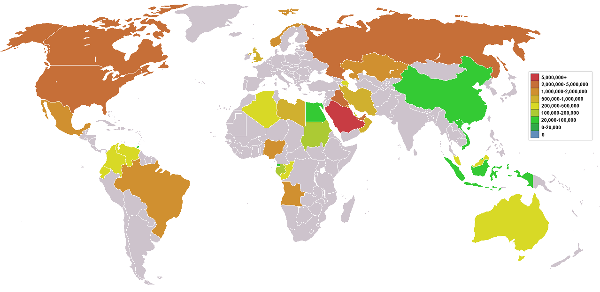

## Table of Contents

## What is an oil exporter?

An oil exporter is a country or company that sells oil to other countries or companies. Oil is a very important resource because it is used to make gasoline, which powers cars and other vehicles. It is also used to make many other products like plastics and chemicals. Countries that have a lot of oil in their land can sell it to other countries that need it. This can help them earn a lot of money.

Some of the biggest oil exporters in the world are countries like Saudi Arabia, Russia, and the United States. These countries have large amounts of oil and they sell it to other countries that do not have enough oil of their own. Being an oil exporter can be very important for a country's economy because it can bring in a lot of money. However, it can also cause problems if the country depends too much on oil and does not develop other parts of its economy.

## Which country is the largest oil exporter in the world?

Saudi Arabia is the largest oil exporter in the world. It has a lot of oil in its land, more than many other countries. This makes it very important in the world of oil. Saudi Arabia is part of a group called OPEC, which is made up of countries that work together to control the price and supply of oil.

Saudi Arabia exports a lot of oil to many different countries. This helps it earn a lot of money. The money from oil helps the country's economy grow. But, it also means that Saudi Arabia needs to be careful not to depend too much on oil. If the price of oil goes down or if people start using less oil, it could be a problem for the country.

## How is the ranking of oil exporters determined?

The ranking of oil exporters is determined by looking at how much oil a country sends to other countries. This amount is usually measured in barrels per day. A barrel is a unit used to measure oil, and one barrel is about 42 gallons. Countries that send out more barrels of oil each day are ranked higher than countries that send out less.

To get the numbers for the rankings, people use data from different sources like government reports and international organizations. These organizations keep track of how much oil is being exported and imported around the world. The rankings can change over time because the amount of oil a country exports can go up or down depending on things like how much oil they find, how much they produce, and what is happening in the world's economy.

## What are the top 5 oil exporting countries?

The top 5 oil exporting countries are Saudi Arabia, Russia, the United States, Iraq, and the United Arab Emirates. Saudi Arabia is number one because it has a lot of oil and sends out more than any other country. Russia comes in second because it also has a lot of oil and sends it to many places. The United States is third because it produces a lot of oil and exports it too. Iraq and the United Arab Emirates round out the top five, both sending out a lot of oil to other countries.

These countries are important because they help meet the world's need for oil. Oil is used for many things like making gasoline for cars, heating homes, and making plastics. The amount of oil these countries export can change because of things like new oil discoveries, changes in how much oil they produce, and what is happening in the world's economy. Keeping track of how much oil they export helps us understand how the world uses oil and how it affects different countries.

## How does oil export impact a country's economy?

Oil exports can have a big impact on a country's economy. When a country exports a lot of oil, it can earn a lot of money. This money can help the country build roads, schools, and hospitals. It can also help the government pay for other things people need. For example, Saudi Arabia uses money from oil to help its people and grow its economy. This can make the country richer and help people have better lives.

But there can also be problems if a country depends too much on oil. If the price of oil goes down or if people start using less oil, the country might not earn as much money. This can make it hard for the government to pay for things people need. Also, if a country focuses only on oil, it might not develop other parts of its economy, like farming or making things. This can be a problem if the oil runs out or if the world starts using less oil. So, it's important for countries to use their oil money wisely and try to grow other parts of their economy too.

## What are the major oil exporting regions in the world?

The Middle East is one of the biggest oil exporting regions in the world. Countries like Saudi Arabia, Iraq, and the United Arab Emirates have a lot of oil. They send it to many other countries. This helps them earn a lot of money. The Middle East is important because it has so much oil that the world needs.

Another big oil exporting region is North America. The United States, Canada, and Mexico all export oil. The United States has become a big exporter because it found a lot of oil in places like Texas and North Dakota. Canada also sends out a lot of oil, especially from Alberta. Mexico has oil too, and it helps its economy by exporting it.

Russia and some countries in South America, like Venezuela and Brazil, are also important oil exporters. Russia has a lot of oil and it sends it to many places in Europe and Asia. Venezuela and Brazil have oil too, but they sometimes have problems with how much they can send out. These regions all play a big part in making sure the world has enough oil.

## How have oil export volumes changed over the past decade?

Over the past decade, oil export volumes have gone up and down because of many different reasons. One big reason is how much oil countries can find and produce. For example, the United States found a lot of oil in places like Texas and North Dakota, so it started exporting more oil. Also, countries like Saudi Arabia and Russia kept sending out a lot of oil, but sometimes they would change how much they sent because of what was happening in the world's economy. If the price of oil went up, they might send out more oil to earn more money. If the price went down, they might send out less to try to make the price go back up.

Another reason oil export volumes changed is because of things like new technology and new rules. New technology helped countries find and get oil out of the ground more easily. This meant they could send out more oil. But sometimes, new rules about the environment made it harder for countries to produce and export as much oil. For example, some countries started to care more about climate change and made rules to use less oil. This could make oil export volumes go down. Overall, oil export volumes have changed a lot over the past ten years because of these and other reasons.

## What are the challenges faced by oil exporting countries?

Oil exporting countries face many challenges. One big challenge is that they can depend too much on oil. If the price of oil goes down or if people start using less oil, these countries might not earn as much money. This can make it hard for the government to pay for things people need, like schools and hospitals. Also, if a country focuses only on oil, it might not develop other parts of its economy, like farming or making things. This can be a problem if the oil runs out or if the world starts using less oil.

Another challenge is that oil can cause problems with the environment. When countries produce and export a lot of oil, it can harm the air, water, and land. This can make people sick and hurt animals and plants. Oil exporting countries need to be careful about how they handle oil to protect the environment. They also need to think about new rules that might make it harder to produce and export oil. These rules can come from their own country or from other countries that want to fight climate change.

## How do geopolitical factors influence oil exports?

Geopolitical factors can have a big impact on oil exports. When countries do not get along or there are wars, it can make it hard for oil to move from one place to another. For example, if there is a problem in the Middle East, it might stop oil from getting to other countries. This can make the price of oil go up because there is less oil to go around. Also, some countries might decide not to sell oil to other countries because of political reasons. This can change how much oil is exported and where it goes.

Another way geopolitical factors affect oil exports is through groups like OPEC. OPEC is a group of countries that work together to control how much oil they produce and export. They do this to try to keep the price of oil stable. If the countries in OPEC decide to produce less oil, the price of oil can go up because there is less oil available. But if they decide to produce more oil, the price can go down. This can be good or bad for oil exporting countries depending on what they want to happen with the price of oil.

## What role do oil reserves play in a country's export capacity?

Oil reserves are very important for a country's ability to export oil. Reserves are the amount of oil that a country has in the ground. If a country has a lot of oil reserves, it can produce more oil and send more of it to other countries. This can help the country earn a lot of money. For example, Saudi Arabia has a lot of oil reserves, so it can export a lot of oil and be one of the biggest oil exporters in the world.

But having a lot of oil reserves is not the only thing that matters. A country also needs to be able to get the oil out of the ground and send it to other places. This can be hard if the country does not have the right technology or if there are problems with getting the oil to other countries. Also, the size of the oil reserves can change over time. If a country uses up its oil reserves too quickly, it might not be able to export as much oil in the future. So, it's important for countries to manage their oil reserves carefully to keep exporting oil for a long time.

## How do oil export policies vary among the top exporting countries?

Oil export policies can be different in each of the top exporting countries. Saudi Arabia, being part of OPEC, often works with other countries to decide how much oil to produce and export. They do this to try to keep the price of oil stable. Sometimes, Saudi Arabia will change how much oil it exports based on what is happening in the world's economy. If the price of oil is low, they might export less oil to try to make the price go up. If the price is high, they might export more to earn more money.

Russia, another big oil exporter, also changes its oil export policies based on what is happening in the world. Russia is not part of OPEC, but it sometimes works with them to control how much oil is produced. Russia has to think about its own economy and what other countries need when it decides how much oil to export. The United States has become a big oil exporter too, and its policies can change based on new laws and what people want. Sometimes, the U.S. government will put rules in place to control how much oil is exported, especially if there are concerns about the environment or the economy.

Iraq and the United Arab Emirates also have their own ways of handling oil exports. Iraq often has to deal with problems in its country that can affect how much oil it can send out. The United Arab Emirates, like Saudi Arabia, is part of OPEC and works with other countries to decide on oil production and exports. Both countries have to balance their own needs with what is happening in the world to make sure they can keep exporting oil and [earning](/wiki/earning-announcement) money from it.

## What future trends are predicted for global oil exports?

In the future, global oil exports might change because of new technology and more people caring about the environment. New technology like electric cars and renewable energy could make people use less oil. This could mean countries that export oil might not sell as much. Also, more countries are making rules to fight climate change. These rules could make it harder for countries to produce and export oil. So, oil exporting countries might need to find new ways to make money if people start using less oil.

But oil will still be important for a while. Many countries still need oil for things like making gasoline for cars and heating homes. So, oil exports will probably keep happening, but maybe not as much as before. Countries that export oil might try to find more oil or use new ways to get oil out of the ground. They will also need to be careful about how they handle oil to protect the environment. Overall, the future of oil exports will depend on what people do and what new technology comes out.

## References & Further Reading

[1]: Adam, M., & Guett, B. (2021). ["Influence of the Oil Market on Global Economy: A Systematic Review."](https://www.sciencedirect.com/science/article/pii/S0166497222001705) Global Energy and Economic Review.

[2]: U.S. Energy Information Administration. ["Annual Energy Outlook 2021."](https://www.eia.gov/outlooks/aeo/tables_side.php)

[3]: Goldstein, M. A., & Kavajecz, K. A. (2000). ["Eighths, sixteenths, and market depth: Changes in tick size and liquidity provision on the NYSE."](https://papers.ssrn.com/sol3/papers.cfm?abstract_id=979088) Journal of Financial Economics, 56(1), 125-149.

[4]: DeFilippo, A. (2022). ["Algorithmic Trading in Oil and Gas Markets: Challenges and Opportunities."](https://www.spglobal.com/commodityinsights/en/market-insights/podcasts/focus/030823-algo-trading-algorithmic-power-markets-energy-crisis-jurgen-mayerhofer-enspired-interview-volatility-renewables-gas) Energy Trading Journal.

[5]: Kellas, F. J., & Norley, D. A. (2015). ["The Impact of Algorithmic Trading on Commodity Markets."](https://onlinelibrary.wiley.com/doi/full/10.1002/9781118540190.wbeic084) Journal of Commodity Markets, 2(1), 55-71.

[6]: Parra, F. I., & Anandan, R. (2017). ["Geopolitical Risks and their Impact on Oil Markets."](https://www.sciencedirect.com/science/article/pii/S014098832300717X) Geopolitical Risk Review.

[7]: ["Advances in Financial Machine Learning"](https://www.amazon.com/Advances-Financial-Machine-Learning-Marcos/dp/1119482089) by Marcos Lopez de Prado

[8]: Friedmann, J., & Sandalow, D. (2021). ["The Shale Dilemma: A Global Perspective on Fracking and Shale Development."](https://www.jstor.org/stable/j.ctv75d8x4) Energy Observer Press.

[9]: Helm, D. (2013). ["The Carbon Crunch: How We're Getting Climate Change Wrong—and How to Fix It."](https://onlinelibrary.wiley.com/doi/abs/10.1111/j.1744-540X.2013.00720.x) Yale University Press.