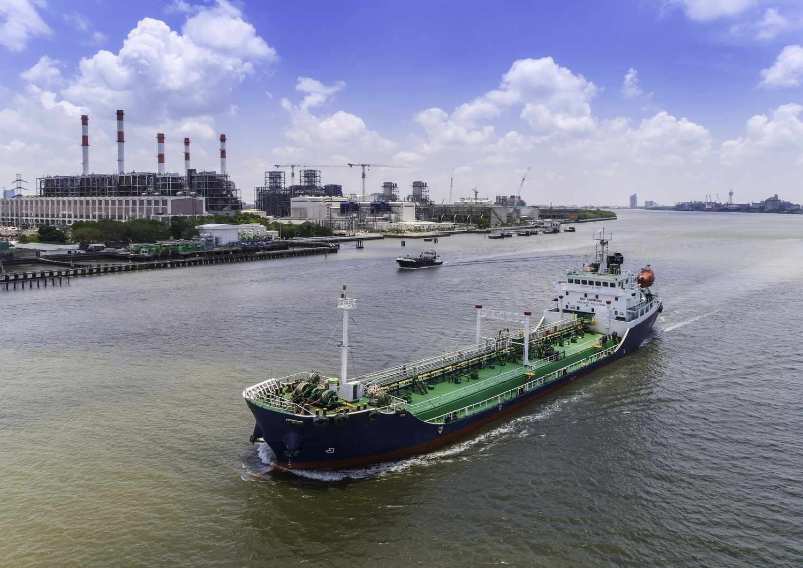

Crude oil remains a highly sought-after commodity, maintaining its status as the most traded product globally. Its significance extends beyond energy production, influencing sectors such as transportation, manufacturing, and even financial markets. The global oil export landscape is of paramount importance to investors, traders, and policymakers alike. An in-depth understanding of oil exporters aids stakeholders in making informed decisions regarding trade balances, geopolitical strategy, and economic planning.

Algorithmic trading in oil markets introduces both opportunities and challenges. These automated trading systems can analyze vast datasets quickly and execute trades more efficiently than human traders. However, they also add complexity to the markets, sometimes resulting in unforeseen market behavior. As algorithmic trading becomes increasingly prevalent, its impact on oil markets cannot be overstated.



This article explores key aspects of the oil market, including the biggest oil exporters, the role of the largest producers, and the influence of algorithmic trading. Understanding these elements provides valuable insights into current and future market dynamics critical for navigating the complex and ever-evolving global oil landscape.

## Table of Contents

## Top Oil Exporting Countries

Saudi Arabia is the largest oil exporter globally, consistently leading with substantial annual revenues from its oil reserves. As a member of the Organization of the Petroleum Exporting Countries (OPEC), Saudi Arabia holds significant sway over global oil pricing and production levels. The country's oil export capacity is underpinned by its vast reserves, with the Ghawar oil field, the largest conventional oil field in the world, playing a pivotal role in its output capabilities. Saudi Arabia's oil industry is predominantly managed by Saudi Aramco, the state-owned enterprise that also stands as the most valuable company in the world due to its substantial earnings from oil exports.

Russia ranks as the second-largest oil exporter, contributing a substantial share to the global oil market. The Russian economy is heavily reliant on its energy sector, with exports of crude oil and natural gas forming a significant portion of its GDP. The country's energy strategy has been largely influenced by its geopolitical goals, with Europe being a major recipient of its oil exports. Russia's vast reserves in Siberia and the Russian Far East are crucial to maintaining its export levels.

Canada holds the third position in terms of [crude oil](/wiki/crude-oil) exports, benefiting primarily from its oil sands reserves in Alberta. These reserves represent a significant portion of the non-conventional oil production, which involves more complex extraction processes such as bitumen mining and in-situ production techniques. Canada's oil export market strongly leans towards the United States, due to the geographical proximity and the integrated North American energy market framework.

The United States and Iraq also play vital roles in the global oil export arena. The U.S. has shifted from a net importer to a significant exporter due to advances in hydraulic fracturing (fracking) technology, which has unlocked substantial oil reserves in shale formations. This has allowed the U.S. to augment its presence in international markets, challenging traditional exporters. Iraq, with its rich oil fields located primarily in the Basra region, remains a key player, although its export potential is sometimes undulated by internal and regional conflicts.

The dynamic interconnectedness between oil-producing nations and the ever-shifting geopolitical landscape often influences global oil export patterns. Trade policies, production cuts, and international agreements such as those fostered by OPEC and its allies, all contribute to the complexities surrounding oil exportation. Countries frequently reposition their strategies to adapt to these changes, impacting pricing, availability, and global economic stability.

## Global Oil Production Insights

The United States currently holds the distinction of being the largest oil producer in the world, primarily due to the exploitation of shale resources. The advent of hydraulic fracturing, commonly known as fracking, has allowed the U.S. to vastly increase its production output. This technique involves injecting a high-pressure mixture of water, sand, and chemicals into underground rock formations, enabling the extraction of oil and gas deposits previously deemed unreachable. Consequently, the U.S. has seen a significant rise in its daily oil production, reaching over 11 million barrels per day in recent years[^1^].

Saudi Arabia and Russia are also major players in oil production, and their output levels have substantial effects on global markets. Saudi Arabia's oil production is largely governed by its state-owned enterprise, Saudi Aramco, which controls vast reserves and maintains the ability to scale production in response to market needs. As a leading member of the Organization of the Petroleum Exporting Countries (OPEC), Saudi Arabia often plays a crucial role in managing global oil supply levels to stabilize prices.

Russia, another top oil-producing nation, operates extensively in its large Siberian oil fields. The country’s output is predominantly managed by major companies like Rosneft and Gazprom Neft, which are responsible for a substantial portion of Russia's daily exports. The geopolitical influence of these production levels cannot be overstated, as changes in output from Saudi Arabia and Russia can profoundly impact global oil prices.

Understanding the production capabilities of these key players is vital for projecting future trends in oil exports. Advances in technology and shifts in energy policy in major producing countries may alter production levels and thus ripple through global energy markets. Stakeholders must consider factors such as reserve accessibility, geopolitical stability, technological innovation, and OPEC agreements when evaluating future oil production and export scenarios.

[^1^]: U.S. Energy Information Administration. "Annual Energy Outlook 2021." Available: https://www.eia.gov/forecasts/aeo/pdf/AEO2021.pdf

## The Role of Algorithmic Trading in Oil Markets

Algorithmic trading in oil markets utilizes computer algorithms to execute trades based on predefined criteria, offering significant benefits and challenges. This technology enhances market [liquidity](/wiki/liquidity-risk-premium) by increasing the [volume](/wiki/volume-trading-strategy) and speed of trade executions. Higher liquidity typically leads to narrower bid-ask spreads, benefiting both buyers and sellers. However, this speed also introduces complexities, such as sudden market swings or "flash crashes," driven by rapid, automated execution in response to volatile market conditions.

Various trading strategies are implemented through [algorithmic trading](/wiki/algorithmic-trading). One common strategy is [trend following](/wiki/trend-following), where algorithms identify and capitalize on asset price trends. For example, algorithms may use moving averages to determine entry and [exit](/wiki/exit-strategy) points. A simple trend-following strategy might employ a moving average crossover, where a short-term average crosses above a long-term average, signaling a buying opportunity:

```python
def moving_average(data, window_size):
    return data.rolling(window=window_size).mean()

short_term = moving_average(prices, 5)
long_term = moving_average(prices, 20)

buy_signal = (short_term > long_term) & (short_term.shift() <= long_term.shift())
```

Another popular strategy is mean reversion, which assumes that prices will revert to their historical average over time. Algorithms employing this strategy aim to profit from deviations from the mean. A mean-reversion approach could involve trading on z-score thresholds:

```python
mean = prices.mean()
std_dev = prices.std()
z_score = (prices - mean) / std_dev

sell_signal = z_score > 2  # Example threshold for selling
buy_signal = z_score < -2  # Example threshold for buying
```

These strategies, among others, are executed with minimal human intervention, enabling rapid decision-making and trade execution. As algorithmic trading continues to evolve, its impact on oil market efficiency and [volatility](/wiki/volatility-trading-strategies) remains significant. Market participants must consider both the benefits and the potential risks associated with high-speed electronic trading to navigate these dynamic markets effectively.

## Impact of Geopolitical Events on Oil Exports

Geopolitical events play a pivotal role in shaping the dynamics of global oil exports. These events often induce volatility in the market, disrupting supply chains, altering trade routes, and impacting the prices of oil and its derivatives. 

One prominent example is Russia's invasion of Ukraine in 2022. This invasion triggered extensive international sanctions against Russia, one of the largest oil exporters in the world. The European Union, United States, and other allies imposed restrictions on Russian oil imports, leading to significant shifts in oil supply and trade routes. Consequently, European countries sought alternative suppliers, thereby increasing demand from regions such as the Middle East and the United States. These sanctions also caused disruptions in the energy market, contributing to fluctuations in global oil prices and affecting supply chains worldwide.

Sanctions and trade embargoes can dramatically change the flow of oil. For instance, restrictions on Iranian oil exports due to its nuclear program significantly impacted global supply. Such actions reduce the availability of oil on the international market, leading to potential increases in prices. Conversely, countries like Venezuela have faced similar sanctions, which drastically reduced their oil export capabilities, further tightening the global oil supply.

Investors and traders must pay close attention to these geopolitical developments to make informed decisions. Changes in trade policies, political instability in oil-rich regions, and diplomatic tensions can rapidly alter market conditions. By monitoring geopolitical events, stakeholders can forecast possible disruptions and adapt their strategies accordingly to mitigate risks associated with oil export fluctuations. This proactive approach is essential for maintaining stability and making strategic investments in the volatile oil market.

## Economic Implications of Oil Export Surplus and Deficit

Countries with an oil export surplus, such as Saudi Arabia and Russia, possess increased influence over global markets due to their ability to adjust supply levels and impact oil prices. These nations often accumulate significant foreign reserves, providing them with greater economic stability and the capacity to invest in other sectors or extend their geopolitical influence. The excess revenue generated from oil exports contributes to the fiscal budget, supporting public services, infrastructure, and social programs.

Conversely, nations with an oil export deficit may face economic challenges, particularly those heavily reliant on oil imports. These countries often experience strained trade balances, necessitating alternative strategies to mitigate dependency on foreign oil. A trade deficit resulting from energy imports can weaken a national currency, increase inflationary pressures, and lead to a higher cost of living. To demonstrate the impact quantitatively, consider the balance of trade equation, where $BOT = X - M$, with $X$ representing exports and $M$ imports. A negative $BOT$ indicates a deficit, commonly seen in oil-importing nations that grapple with the financial burden of purchasing energy supplies at elevated prices.

Understanding these dynamics is crucial for national economic planning. Oil-exporting countries must judiciously manage their surplus to prevent overdependence on oil revenues, which can be prone to volatility due to fluctuating global oil prices. Diversification of the economy plays a critical role in ensuring long-term financial health and resilience against external shocks. Meanwhile, oil-importing nations must explore energy diversification, enhance energy efficiency, and develop strategic oil reserves to buffer against potential market disruptions.

In conclusion, the economic implications of oil export surpluses and deficits underscore the need for prudent fiscal management, strategic economic planning, and the diversification of energy resources. This understanding facilitates the development of robust economic policies that enhance stability and mitigate the risks associated with global energy market fluctuations.

## The Future of Oil Exports and Algorithmic Trading

The future of oil exports and algorithmic trading is shaped by a complex interplay of technological advancements and shifting energy policies. The global push towards renewable energy sources is a significant [factor](/wiki/factor-investing) influencing the trajectory of oil exports. As countries strive to meet their carbon reduction goals, the demand for fossil fuels, including oil, faces potential decline. This transition, driven by environmental concerns and technological innovations in renewable energy, suggests a gradual decrease in reliance on oil, subsequently impacting the volume and profitability of oil exports.

Meanwhile, algorithmic trading is expected to continuously evolve, playing a critical role in oil markets by enhancing market volatility management and operational efficiency. Algorithms, designed to process vast amounts of market data in real-time, execute trades with precision based on pre-determined criteria. This not only increases market efficiency by providing liquidity but also poses challenges, such as the potential for abrupt market movements due to the speed and volume of automated trades. 

The development of more sophisticated algorithms that incorporate [machine learning](/wiki/machine-learning) and [artificial intelligence](/wiki/ai-artificial-intelligence) could lead to better market predictions and reduce the risk of unexpected volatility. An advanced algorithm might use a predictive model to anticipate market shifts, allowing traders to hedge risks more effectively. For instance, sentiment analysis algorithms can gauge market sentiment from news and social media, providing insights that influence trading decisions.

Stakeholders in the oil market must adapt to both technological advancements and evolving energy policies. This requires a keen focus on developing resilient strategies that cater to both current market conditions and future trends. Energy companies, investors, and policymakers need to invest in research and development to explore alternative energy sources while optimizing oil production and trading strategies through technology.

Moreover, regulatory frameworks need to be established or revised to manage the implications of algorithmic trading on market stability. Effective regulation can mitigate risks such as market manipulation and flash crashes, ensuring a level playing field in financial markets.

In summary, the convergence of renewable energy adoption and advancements in algorithmic trading presents both challenges and opportunities for the future of oil exports. Proactive adaptation to these changing landscapes will be essential for stakeholders aiming to maintain relevance and profitability in the global energy market.

## Conclusion

Oil exports continue to play a crucial role in the global economy, affected by a multitude of factors that include geopolitical events, technological advancements, and shifts in production capabilities. As key commodities, oil exports facilitate international trade and influence national economies, dictating trade balances and economic stability. 

Algorithmic trading has emerged as a significant force in the oil market, offering both opportunities and complexities. By leveraging automated systems to execute trades based on predefined parameters, market participants can achieve increased efficiency and liquidity. However, this technology also introduces challenges, such as heightened market volatility and unexpected price swings. Traders and institutions employ various strategies, ranging from trend following to statistical [arbitrage](/wiki/arbitrage), to capitalize on these market dynamics.

For investors, traders, and policymakers, a comprehensive understanding of these contributing factors is essential to effectively navigate the constantly evolving oil market landscape. This involves staying informed about geopolitical developments, technological innovations in trading systems, and shifting global energy policies. Additionally, the ongoing transition towards renewable energy sources injects uncertainty into the future of oil exports, prompting a need for adaptation and forward-thinking strategies.

Embracing these elements will be crucial for stakeholders intent on making informed decisions, managing risks, and capturing the opportunities presented by the complex interplay of the current global oil market.

## References & Further Reading

[1]: Adam, M., & Guett, B. (2021). ["Influence of the Oil Market on Global Economy: A Systematic Review."](https://www.sciencedirect.com/science/article/pii/S0166497222001705) Global Energy and Economic Review.

[2]: U.S. Energy Information Administration. ["Annual Energy Outlook 2021."](https://www.eia.gov/outlooks/aeo/tables_side.php)

[3]: Goldstein, M. A., & Kavajecz, K. A. (2000). ["Eighths, sixteenths, and market depth: Changes in tick size and liquidity provision on the NYSE."](https://papers.ssrn.com/sol3/papers.cfm?abstract_id=979088) Journal of Financial Economics, 56(1), 125-149.

[4]: DeFilippo, A. (2022). ["Algorithmic Trading in Oil and Gas Markets: Challenges and Opportunities."](https://www.spglobal.com/commodityinsights/en/market-insights/podcasts/focus/030823-algo-trading-algorithmic-power-markets-energy-crisis-jurgen-mayerhofer-enspired-interview-volatility-renewables-gas) Energy Trading Journal.

[5]: Kellas, F. J., & Norley, D. A. (2015). ["The Impact of Algorithmic Trading on Commodity Markets."](https://onlinelibrary.wiley.com/doi/full/10.1002/9781118540190.wbeic084) Journal of Commodity Markets, 2(1), 55-71.

[6]: Parra, F. I., & Anandan, R. (2017). ["Geopolitical Risks and their Impact on Oil Markets."](https://www.sciencedirect.com/science/article/pii/S014098832300717X) Geopolitical Risk Review.

[7]: ["Advances in Financial Machine Learning"](https://www.amazon.com/Advances-Financial-Machine-Learning-Marcos/dp/1119482089) by Marcos Lopez de Prado

[8]: Friedmann, J., & Sandalow, D. (2021). ["The Shale Dilemma: A Global Perspective on Fracking and Shale Development."](https://www.jstor.org/stable/j.ctv75d8x4) Energy Observer Press.

[9]: Helm, D. (2013). ["The Carbon Crunch: How We're Getting Climate Change Wrong—and How to Fix It."](https://onlinelibrary.wiley.com/doi/abs/10.1111/j.1744-540X.2013.00720.x) Yale University Press.