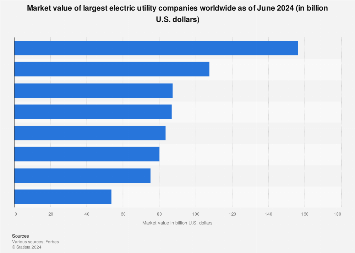

## Table of Contents

## What is a utility company?

A utility company is a business that provides essential services to the public. These services include electricity, water, natural gas, and sometimes even internet and phone services. People need these services every day, so utility companies are very important. They make sure that homes and businesses have the power and water they need to function properly.

Utility companies often have to follow special rules set by the government. This is because they provide services that everyone needs, and it's important that they do it fairly and at a reasonable price. Sometimes, utility companies are the only ones providing these services in a certain area, which is called a monopoly. Because of this, governments keep a close eye on them to make sure they are not charging too much or providing bad service.

## Why are utility companies important globally?

Utility companies are really important all over the world because they provide services that everyone needs every day. They give us electricity to light up our homes and power our devices, water for drinking and cleaning, and natural gas for cooking and heating. Without these services, life would be much harder. People wouldn't be able to do simple things like turn on a light, take a shower, or cook a meal. That's why utility companies are so important no matter where you are in the world.

Also, utility companies help keep societies running smoothly. They make sure that hospitals, schools, and businesses have the services they need to work properly. If a hospital loses power, it can be very dangerous for the patients. If schools don't have water, kids can't wash their hands or drink. Businesses need these services to make products and provide services to customers. So, utility companies are not just important for individual homes, but for the whole community and the economy.

## How is the size of a utility company measured?

The size of a utility company can be measured in different ways. One common way is by looking at how many customers it serves. A big utility company might serve millions of people, while a smaller one might only serve a few thousand. The number of customers shows how many people rely on the company for services like electricity, water, or gas.

Another way to measure the size of a utility company is by looking at its revenue. Revenue is the money the company makes from selling its services. A company with a lot of revenue is usually bigger because it means it's selling a lot of services to a lot of people. Sometimes, people also look at how many employees the company has. A company with more employees might be bigger because it needs more people to run its operations and serve its customers.

## Which are the top 5 largest utility companies in the world?

The top 5 largest utility companies in the world are measured by how much money they make and how many people they serve. The first one is State Grid Corporation of China. It's the biggest because it makes a lot of money and serves a huge number of people in China. The second one is Enel, which is from Italy. It serves many people in Europe and other places around the world. The third one is Electricité de France (EDF), which is a big company in France and also serves customers in other countries. The fourth one is Tokyo Electric Power Company (TEPCO) from Japan. It's very important in Tokyo and other parts of Japan. The fifth one is Korea Electric Power Corporation (KEPCO) from South Korea. It serves a lot of people in South Korea and is one of the biggest in Asia.

These companies are very important because they give electricity to millions of homes and businesses. They help keep the lights on and the economy running. Each company is different because of where they are and what they do, but they all play a big role in making sure people have the power they need every day.

## What types of services do the largest utility companies provide?

The largest utility companies around the world mainly provide electricity. They make sure that homes, schools, hospitals, and businesses have the power they need to work properly. For example, State Grid Corporation of China and Tokyo Electric Power Company (TEPCO) focus a lot on electricity. They build big power plants and long power lines to send electricity to millions of people. Without them, people wouldn't be able to turn on lights, use computers, or charge their phones.

Some of these big companies also offer other important services. For instance, Enel from Italy and Electricité de France (EDF) not only provide electricity but also natural gas. Natural gas is used for cooking, heating homes, and sometimes even making electricity. Korea Electric Power Corporation (KEPCO) also provides electricity and works on new ways to make energy that are better for the environment. These companies help make sure that people have the energy they need in different forms, which is really important for everyday life.

## How do utility companies impact the economy of a country?

Utility companies have a big impact on a country's economy because they provide the services that everyone needs to live and work. When utility companies do a good job, they make sure that homes, schools, hospitals, and businesses have electricity, water, and sometimes gas. This helps the economy because people can go to work, kids can go to school, and businesses can make and sell things. If utility companies don't do a good job, it can slow down the economy. For example, if there's no electricity, factories can't run, and people can't use their computers or lights.

Utility companies also create jobs and spend money in the areas where they work. They hire people to build power plants, fix power lines, and help customers. This means more people have jobs and can spend money on things they need. Also, utility companies often invest in new technology to make energy in better ways. This can help the economy grow because new technology can create new jobs and make things more efficient. Overall, utility companies are very important for keeping the economy strong and helping it grow.

## What are the challenges faced by large utility companies?

Large utility companies face many challenges. One big challenge is keeping up with the growing demand for energy. As more people move to cities and use more electricity and water, utility companies have to find ways to make and deliver more services. This can be hard because building new power plants or water treatment facilities takes a lot of time and money. Also, they have to make sure that the services they provide are reliable. If the power goes out or the water stops, it can cause big problems for people and businesses.

Another challenge is dealing with environmental issues. Many people want utility companies to use cleaner ways to make energy, like wind or solar power, instead of using coal or gas that can harm the environment. This means utility companies have to invest in new technology and change how they do things, which can be expensive and difficult. They also have to follow strict rules set by the government to protect the environment. These rules can make it harder for them to do their job and can sometimes raise the cost of the services they provide.

Lastly, large utility companies have to manage their costs and keep their services affordable. They need to make enough money to keep running and growing, but they also have to make sure that people can pay for the services they need. This can be tough because the costs of building and maintaining power plants and other infrastructure can be very high. If they charge too much, people might not be able to afford it, but if they charge too little, they might not have enough money to keep everything working well. Balancing these costs and keeping customers happy is a big challenge for utility companies.

## How do regulations affect the operations of global utility companies?

Regulations have a big impact on how global utility companies work. Governments set rules that utility companies must follow to make sure they provide safe and reliable services. These rules can be about how much they can charge for electricity or water, how they treat the environment, and how they keep their services working well. For example, a rule might say that a company has to use a certain amount of clean energy, like wind or solar power, instead of coal or gas. This can make it harder for the company to do its job because it might need to spend a lot of money on new technology.

Another way regulations affect utility companies is by making sure they don't charge too much for their services. Since utility companies often have no competition and everyone needs their services, governments watch them closely to make sure they are fair. This means the companies have to go through a lot of paperwork and checks to change their prices. It can take a long time to get approval for any changes, which can make it hard for the company to respond quickly to new costs or problems. Even though these rules can make things more difficult for utility companies, they are important for keeping services safe, reliable, and affordable for everyone.

## What role do renewable energy sources play in the strategies of large utility companies?

Renewable energy sources like wind, solar, and hydro power are becoming more and more important for large utility companies. These companies are starting to use more renewable energy because it's better for the environment. People and governments want cleaner energy, so utility companies are investing in wind farms, solar panels, and other ways to make energy that don't pollute the air or water. Using renewable energy also helps utility companies save money in the long run because once the equipment is set up, the energy is free. This can make their services cheaper for customers and help them compete with other companies.

Another reason utility companies are focusing on renewable energy is that it helps them follow the rules set by governments. Many countries have laws that say utility companies have to use a certain amount of clean energy. If they don't, they can get in trouble or have to pay fines. By using more renewable energy, utility companies can meet these rules and avoid problems. Plus, using renewable energy can make the companies look good to customers and investors who care about the environment. So, renewable energy is a big part of their plans for the future.

## How have mergers and acquisitions shaped the landscape of global utility companies?

Mergers and acquisitions have really changed the way big utility companies work around the world. When one company buys another or when two companies join together, it can make them bigger and stronger. This means they can serve more people and offer more services. For example, if a company that provides electricity buys a company that provides natural gas, it can offer both services to its customers. This can help the company make more money and be more important in the market. Also, when companies get bigger through mergers and acquisitions, they can spend more money on new technology and ways to make energy that are better for the environment.

But mergers and acquisitions can also create problems. Sometimes, when companies get too big, it can be hard for them to manage everything well. They might have to deal with different rules in different countries, and it can be hard to make sure everyone is happy. Also, when big companies buy smaller ones, it can make it harder for new companies to start up and compete. This can mean less choice for customers and higher prices. Governments often watch these mergers and acquisitions closely to make sure they don't cause too many problems and that they are good for everyone, not just the companies involved.

## What are the future trends expected in the utility sector?

In the future, more and more utility companies will use renewable energy sources like wind, solar, and hydro power. This is because people and governments want energy that doesn't harm the environment. Utility companies are already building more wind farms and solar panels. They are also finding new ways to store energy so it can be used when the sun isn't shining or the wind isn't blowing. Using renewable energy can help utility companies save money in the long run and make their services cheaper for customers. It also helps them follow the rules set by governments that say they have to use more clean energy.

Another big trend in the utility sector is using smart technology. This includes things like smart meters that help people see how much energy they are using and save money. Utility companies are also using technology to make their power grids smarter. This means they can fix problems faster and make sure the power stays on. Smart technology can also help utility companies work better with other companies that provide services like internet and phone. This can make everything more connected and easier to use for customers. In the future, smart technology will be a big part of how utility companies work.

Lastly, utility companies will need to think more about how they can serve their customers better. This means making their services more reliable and affordable. They will also need to find new ways to work with customers, like offering plans that let people use more energy when it's cheaper. Utility companies will also need to keep up with new technology and rules set by governments. This can be hard, but it's important for making sure everyone has the energy they need in a way that's good for the environment and the economy.

## How do global utility companies manage sustainability and environmental impact?

Global utility companies are working hard to be more sustainable and reduce their impact on the environment. They are doing this by using more renewable energy sources like wind, solar, and hydro power. These sources don't produce harmful pollution like coal or gas do. Utility companies are building more wind farms and solar panels, and they are finding new ways to store energy so it can be used when it's needed. By using renewable energy, utility companies can help the environment and also save money in the long run. This makes their services cheaper for customers and helps them follow the rules set by governments that say they have to use more clean energy.

Another way utility companies manage sustainability is by using smart technology. They are putting in smart meters that help people see how much energy they are using and save money. They are also making their power grids smarter so they can fix problems faster and keep the power on. Smart technology helps utility companies use energy more efficiently and reduce waste. This is good for the environment because it means less energy is used overall. Utility companies are also trying to be more open about their environmental impact. They share information with the public and work with governments and other groups to find new ways to be more sustainable.

## References & Further Reading

[1]: Bergstra, J., Bardenet, R., Bengio, Y., & Kégl, B. (2011). ["Algorithms for Hyper-Parameter Optimization."](https://papers.nips.cc/paper/4443-algorithms-for-hyper-parameter-optimization) Advances in Neural Information Processing Systems 24.

[2]: ["Advances in Financial Machine Learning"](https://cie-advances.asme.org/GR-8-01/publication/fetch.php/advances_in_financial_machine_learning.pdf) by Marcos Lopez de Prado

[3]: ["Evidence-Based Technical Analysis: Applying the Scientific Method and Statistical Inference to Trading Signals"](https://www.amazon.com/Evidence-Based-Technical-Analysis-Scientific-Statistical/dp/0470008741) by David Aronson

[4]: ["Machine Learning for Algorithmic Trading"](https://github.com/stefan-jansen/machine-learning-for-trading) by Stefan Jansen

[5]: ["Quantitative Trading: How to Build Your Own Algorithmic Trading Business"](https://books.google.com/books/about/Quantitative_Trading.html?id=j70yEAAAQBAJ) by Ernest P. Chan