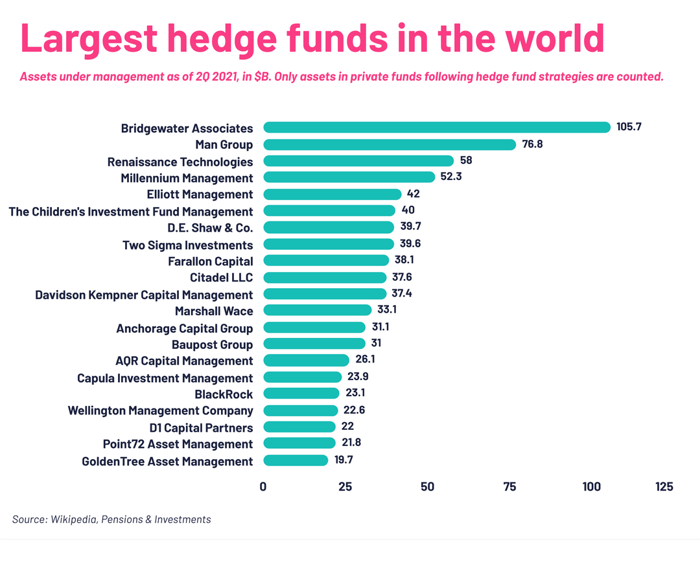

## Table of Contents

## What is a hedge fund?

A hedge fund is a type of investment fund that pools money from investors to buy different kinds of assets. The goal is to make money for the investors, often by using strategies that are more flexible and riskier than those used by regular investment funds. Hedge funds are usually only open to wealthy people and big organizations because they can be risky and have high fees.

Hedge fund managers use many different strategies to try to make money. They might bet on stocks going up or down, invest in bonds, or even use complex financial tools like derivatives. Because they can use these advanced strategies, hedge funds can sometimes make a lot of money, but they can also lose a lot. This is why they are considered more risky than other types of investments.

## Why are hedge funds important in the global financial market?

Hedge funds are important in the global financial market because they help make the market more flexible and active. They do this by using different strategies to buy and sell assets. This can help keep prices fair and make the market more efficient. For example, if a hedge fund thinks a stock is too expensive, they might sell it, which can help bring the price down to a more reasonable level.

Also, hedge funds bring in a lot of money from investors all over the world. This money can be used to invest in different kinds of assets, like stocks, bonds, and real estate. By doing this, hedge funds help spread money around the global economy. This can help businesses grow and create jobs. So, hedge funds play a big role in keeping the global financial market strong and healthy.

## How are hedge funds different from mutual funds?

Hedge funds and mutual funds are both types of investment funds that collect money from investors to buy different kinds of assets. However, they are different in many ways. One big difference is who can invest in them. Hedge funds are usually only open to rich people and big organizations, while mutual funds are available to anyone who wants to invest. This is because hedge funds can be riskier and have higher fees than mutual funds.

Another difference is in the strategies they use. Hedge funds can use more flexible and riskier strategies to try to make money. For example, they might bet on stocks going up or down, or use complex financial tools like derivatives. Mutual funds, on the other hand, usually follow a more straightforward approach, focusing on buying a mix of stocks or bonds that match the fund's goals. This makes mutual funds generally less risky than hedge funds.

Lastly, the way they are regulated is different. Hedge funds have fewer rules to follow than mutual funds. This means they can do things that mutual funds can't, like borrowing money to invest or selling assets they don't own. This flexibility can help hedge funds make more money, but it also makes them riskier. Mutual funds, with their stricter rules, are seen as safer but may not offer the same potential for high returns.

## What criteria are used to determine the size of a hedge fund?

The size of a [hedge fund](/wiki/hedge-fund-trading-strategies) is mainly determined by the total amount of money it manages, which is called assets under management (AUM). This is the sum of all the money that investors have put into the fund. The more money a hedge fund has, the bigger it is considered to be. Another way to measure the size of a hedge fund is by looking at the number of investors it has. A fund with more investors usually has more money to manage, making it larger.

In addition to AUM and the number of investors, the size of a hedge fund can also be influenced by its performance and reputation. A hedge fund that has a good track record of making money for its investors might attract more money and grow bigger over time. Also, a well-known hedge fund might be able to bring in more investors and more money, which can make it larger. So, while AUM is the main way to measure the size of a hedge fund, other factors like performance and reputation can also play a role.

## Which is the largest hedge fund in the world currently?

The largest hedge fund in the world right now is Bridgewater Associates. It was started by Ray Dalio in 1975 and has grown a lot since then. Bridgewater manages around $120 billion in assets. That's a lot of money! They use a special way of investing called the "All Weather" strategy, which tries to make money no matter what is happening in the economy.

Bridgewater is not just big because of the money it manages. It's also known for its unique way of working. They have a culture where everyone gives feedback to each other, even the boss. This is called "radical transparency." It helps them make better decisions and learn from their mistakes. Because of its size and different way of doing things, Bridgewater is a very important player in the world of hedge funds.

## How has the ranking of the largest hedge funds changed over the past decade?

Over the past decade, the ranking of the largest hedge funds has seen some big changes. Bridgewater Associates has stayed at the top for a long time. They managed to keep their spot as the biggest hedge fund, even as the financial world changed a lot. But other funds have moved up and down in the rankings. For example, AQR Capital Management used to be one of the biggest, but they dropped a bit in the rankings because they had some tough years.

Another big change was the rise of new hedge funds. Some new funds, like Citadel, grew a lot and moved up in the rankings. Citadel, run by Ken Griffin, became one of the biggest hedge funds in the world. They did really well, especially during times when the market was going up and down a lot. Overall, the past ten years showed that even the biggest hedge funds can change a lot, with some staying strong at the top and others moving around in the rankings.

## What are the investment strategies commonly used by the largest hedge funds?

The largest hedge funds often use a mix of different investment strategies to try to make money for their investors. One common strategy is called "long/short equity." This means they buy stocks they think will go up in value (going long) and sell stocks they think will go down in value (going short). This can help them make money no matter if the market is going up or down. Another strategy is called "[global macro](/wiki/global-macro-strategy)," where the fund looks at big economic trends around the world and tries to make money from them. For example, they might bet on what will happen to interest rates or currency values.

Some of the biggest hedge funds also use a strategy called "multi-strategy," where they use many different ways to invest at the same time. This can include trading in stocks, bonds, commodities, and even using complex financial tools like derivatives. By doing this, they try to spread out their risk and find the best opportunities to make money. Bridgewater Associates, for example, is known for its "All Weather" strategy, which tries to make money in any kind of economic situation by balancing different types of investments. This approach helps them stay steady even when the market is unpredictable.

## How do the largest hedge funds manage risk?

The largest hedge funds manage risk by using many different strategies. One way they do this is by spreading out their investments across different kinds of assets, like stocks, bonds, and commodities. This is called diversification. By not putting all their money into one thing, they can reduce the chance of losing a lot if one investment goes bad. They also use something called hedging, which means they make investments that can help protect them from big losses. For example, if they think a stock might go down, they might buy something that will go up if the stock goes down, balancing out their risk.

Another way big hedge funds manage risk is by using advanced computer models and data analysis. They use these tools to look at a lot of information and figure out what might happen in the market. This helps them make smarter decisions and avoid big risks. They also have strict rules about how much risk they can take, called risk management policies. These rules help them keep their investments safe and make sure they don't take too many chances. By combining these different methods, the largest hedge funds try to keep their investors' money safe while still trying to make a good return.

## What are the geographical distributions of the largest hedge funds?

The largest hedge funds are mostly based in the United States, especially in cities like New York and Connecticut. New York City is a big hub for finance, so it's no surprise that many top hedge funds, like Bridgewater Associates and Citadel, have offices there. Connecticut, particularly Greenwich, is also home to many big hedge funds because it's close to New York and has a good environment for businesses. These places in the US are important because they have lots of skilled people and good connections to the global financial market.

Outside of the US, London in the United Kingdom is another important place for hedge funds. It's a major financial center in Europe, and many big hedge funds have offices there to take advantage of the European market. Some hedge funds also have offices in Asia, especially in cities like Hong Kong and Singapore. These cities are important because they are big financial centers in Asia, and having an office there helps hedge funds tap into the fast-growing Asian markets. So, while the biggest hedge funds are mainly in the US, they also have a presence in other key financial hubs around the world.

## Who are the key figures or managers behind the largest hedge funds?

Ray Dalio is the key figure behind Bridgewater Associates, the largest hedge fund in the world. He started the fund in 1975 and has been a big influence in the hedge fund world. Dalio is known for his "All Weather" strategy, which tries to make money no matter what is happening in the economy. He also came up with the idea of "radical transparency," where everyone in the company gives feedback to each other to make better decisions. His leadership has helped Bridgewater grow into a huge hedge fund.

Ken Griffin is the key person behind Citadel, another one of the biggest hedge funds. He started Citadel in 1990 and has grown it into a major player in the financial world. Griffin is known for his smart trading strategies and his ability to make money even when the market is going up and down a lot. He also focuses on using technology and data to make better investment decisions. Under his leadership, Citadel has become one of the top hedge funds in the world.

## How do regulatory environments affect the operations of the largest hedge funds?

Regulatory environments have a big impact on how the largest hedge funds operate. In the United States, the Securities and Exchange Commission (SEC) sets rules that hedge funds have to follow. These rules can limit what hedge funds can do, like how much they can borrow or what kinds of investments they can make. For example, the Dodd-Frank Act made new rules after the 2008 financial crisis to make the financial system safer. This means hedge funds have to report more information and follow stricter rules to protect investors and the economy.

Outside the US, different countries have their own rules that can affect hedge funds too. In Europe, the Alternative Investment Fund Managers Directive (AIFMD) sets rules for hedge funds and other alternative investments. These rules can make it harder for hedge funds to do business in Europe, but they also help protect investors. Because hedge funds operate in many countries, they have to deal with a lot of different regulations. This can make things more complicated, but it also helps keep the financial system stable and safe.

## What impact do the largest hedge funds have on global economic trends?

The largest hedge funds have a big impact on global economic trends because they manage a lot of money and use it to invest in different things around the world. When these hedge funds buy or sell a lot of stocks, bonds, or other assets, it can change the prices of those things. For example, if a big hedge fund decides to buy a lot of a certain stock, the price of that stock might go up. This can influence what other investors do and affect how the whole market moves. Because hedge funds can use a lot of money to make big bets, they can even change how the economy works in different countries.

Another way the largest hedge funds affect global economic trends is by using their strategies to take advantage of what's happening in the world. They look at big things like interest rates, inflation, and what different countries are doing with their economies. By making smart guesses about these trends, hedge funds can make money for their investors. But their actions can also make these trends stronger or weaker. For example, if many hedge funds bet that a country's currency will go down, they might sell a lot of that currency, which can make it go down even more. So, the biggest hedge funds are important players in the global economy, and what they do can have a big impact on everyone.

## References & Further Reading

[1]: Bergstra, J., Bardenet, R., Bengio, Y., & Kégl, B. (2011). ["Algorithms for Hyper-Parameter Optimization."](https://proceedings.neurips.cc/paper/2011/file/86e8f7ab32cfd12577bc2619bc635690-Paper.pdf) Advances in Neural Information Processing Systems 24.

[2]: ["Advances in Financial Machine Learning"](https://www.amazon.com/Advances-Financial-Machine-Learning-Marcos/dp/1119482089) by Marcos Lopez de Prado

[3]: ["Evidence-Based Technical Analysis: Applying the Scientific Method and Statistical Inference to Trading Signals"](https://www.amazon.com/Evidence-Based-Technical-Analysis-Scientific-Statistical/dp/0470008741) by David Aronson

[4]: ["Machine Learning for Algorithmic Trading"](https://github.com/PacktPublishing/Machine-Learning-for-Algorithmic-Trading-Second-Edition) by Stefan Jansen

[5]: ["Quantitative Trading: How to Build Your Own Algorithmic Trading Business"](https://www.amazon.com/Quantitative-Trading-Build-Algorithmic-Business/dp/1119800064) by Ernest P. Chan