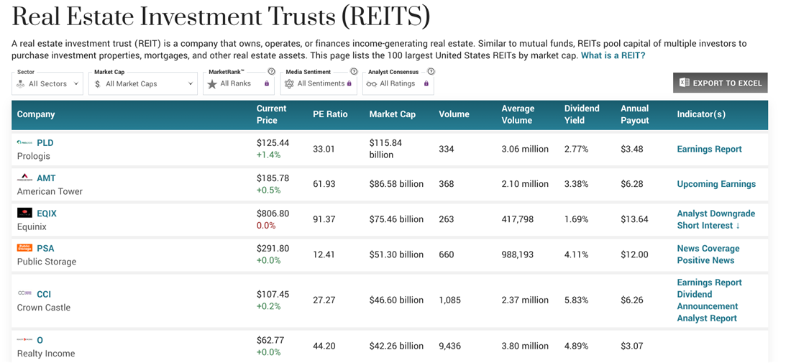

## Table of Contents

## What is a hotel company?

A hotel company is a business that owns, operates, or manages hotels. These companies can have hotels in one city, across a country, or all around the world. They provide places for people to stay when they travel for work or vacation. Some hotel companies are big and own many hotels, while others might only have a few.

Hotel companies offer different types of rooms and services to meet the needs of their guests. Some hotels might be fancy and expensive, while others are simple and cheaper. They often have amenities like restaurants, pools, and gyms. Hotel companies also make sure their hotels are clean and safe for everyone who stays there.

## What is a Real Estate Investment Trust (REIT)?

A Real Estate Investment Trust, or REIT, is a company that owns, operates, or finances income-generating real estate. It's like a big group of people pooling their money together to buy buildings, like shopping centers, apartments, or hotels, and then they share the money those buildings make. REITs are set up so that anyone can invest in real estate without having to buy a whole building themselves.

REITs have to follow special rules to keep their special tax status. One big rule is that they must pay out at least 90% of their taxable income as dividends to their shareholders every year. This means people who invest in REITs can get regular payments, kind of like getting rent from a property, but without having to manage the property themselves.

## How do hotel companies and REITs differ?

Hotel companies and REITs both deal with real estate, but they do it in different ways. A hotel company runs hotels. They might own the hotels, or they might just manage them. Their main job is to make sure the hotels are nice places for people to stay. They take care of everything from the rooms to the restaurants and pools. They make money by charging guests to stay at their hotels.

REITs, on the other hand, are more like big investment groups. They own different kinds of buildings, like hotels, but also other things like shopping centers and apartments. People invest in REITs to get a share of the money those buildings make. REITs don't run the day-to-day operations of the buildings. They just own them and collect the income. They have to pay most of that income back to the people who invest in them.

So, the big difference is that hotel companies focus on running hotels and making them good places to stay, while REITs focus on owning different kinds of real estate and sharing the income with investors.

## What are the criteria for determining the size of hotel companies and REITs?

The size of a hotel company is usually determined by how many rooms they have and how many hotels they own or manage. A bigger hotel company will have more rooms spread across more hotels. They might have hotels in many different cities or even countries. The number of employees can also show how big a hotel company is, because bigger companies need more people to run all their hotels.

For REITs, size is often measured by the total value of the real estate they own. This is called their "market capitalization" or "market cap." A REIT with a higher market cap owns more valuable properties. Another way to measure the size of a REIT is by the amount of money they make from renting out their properties, which is called their "revenue." Bigger REITs usually have more properties and make more money from them.

## Who are the top 5 largest hotel companies in the world?

The top 5 largest hotel companies in the world are Marriott International, Hilton Worldwide Holdings Inc., InterContinental Hotels Group (IHG), Wyndham Hotels & Resorts, and Accor. These companies have thousands of hotels and hundreds of thousands of rooms all around the world. Marriott International is the biggest, with over 8,000 properties and more than 1.4 million rooms. Hilton is not far behind, with over 7,000 hotels and more than 1 million rooms.

IHG comes in third, operating more than 6,000 hotels and over 880,000 rooms. Wyndham Hotels & Resorts has about 9,000 hotels but fewer rooms than IHG, with around 800,000 rooms. Accor rounds out the top 5, with over 5,300 hotels and more than 750,000 rooms. These companies not only have a lot of hotels, but they also have many different brands to meet the needs of all kinds of travelers, from luxury to budget-friendly options.

## Who are the top 5 largest hotel REITs in the world?

The top 5 largest hotel REITs in the world are Host Hotels & Resorts, Ryman Hospitality Properties, Apple Hospitality REIT, Park Hotels & Resorts, and Sunstone Hotel Investors. These REITs own lots of hotels and make money by renting them out. Host Hotels & Resorts is the biggest, with a market cap of over $12 billion and owning around 70 properties. Ryman Hospitality Properties comes in second, with a market cap of about $5 billion and owning around 6 hotels, but these are big and famous, like the Gaylord hotels.

Apple Hospitality REIT is the third largest, with a market cap of around $3.5 billion and over 200 hotels. Park Hotels & Resorts has a market cap of about $3 billion and owns around 40 hotels, many of which are in big cities. Sunstone Hotel Investors rounds out the top 5, with a market cap of about $2 billion and owning around 15 hotels. These REITs let people invest in hotels without having to run them, and they share the money they make with their investors.

## What are the key financial metrics to evaluate the performance of hotel companies and REITs?

To evaluate how well a hotel company is doing, you can look at some key financial numbers. One important number is the "revenue per available room" or RevPAR. This shows how much money the hotel makes from each room, considering both how many rooms are filled and how much they charge for them. Another number to check is the "average daily rate" or ADR, which tells you how much guests pay on average for a room. The "occupancy rate" is also key because it shows what percentage of the rooms are being used. A hotel company that has high RevPAR, ADR, and occupancy rate is usually doing well. Also, looking at the company's "net income" and "earnings before interest, taxes, depreciation, and amortization" or EBITDA can give you a good idea of its overall financial health.

For REITs, the important financial numbers are a bit different. One key number is the "funds from operations" or FFO, which shows how much money the REIT is making from its properties, without counting things like depreciation. Another important number is the "dividend yield," which tells you how much money the REIT is paying back to its investors compared to the price of the REIT's shares. The "net asset value" or NAV is also useful because it shows how much the REIT's properties are worth. A REIT with a high FFO, a good dividend yield, and a strong NAV is usually doing well. Also, looking at the REIT's "total return," which includes both the dividends and any increase in the share price, can give you a full picture of how it's performing for investors.

## How do global economic conditions affect the operations of large hotel companies and REITs?

Global economic conditions can have a big impact on how well large hotel companies do. When the economy is doing well, people have more money to spend on travel and vacations, which means more guests for hotels. This can lead to higher room rates and more money for hotel companies. But when the economy is not doing well, people might not travel as much because they want to save money. This can mean fewer guests and less money for hotels. Also, things like currency exchange rates can affect how much international travelers want to stay at hotels in different countries. If a country's currency gets weaker, it might attract more tourists, but it can also make it more expensive for the hotel to buy things they need.

REITs that own hotels are also affected by global economic conditions. When the economy is strong, the value of their properties can go up, and they can charge more rent. This means more money for the REIT and more dividends for investors. But if the economy is weak, the value of their properties might go down, and they might have to lower the rent to keep tenants. This can mean less money for the REIT and smaller dividends for investors. Also, interest rates can affect REITs because they often borrow money to buy properties. If interest rates go up, it can cost more for the REIT to borrow money, which can affect their profits.

## What are the growth strategies employed by the largest hotel companies and REITs?

The largest hotel companies often grow by opening new hotels in new places. They might build new hotels from scratch or buy existing ones. They also like to add new brands to their company, which helps them reach more types of travelers. For example, they might have luxury brands for people who want to spend a lot of money, and budget brands for people who want to save money. Another way they grow is by making their hotels better, like adding new restaurants or pools, so more people want to stay there. They also use technology to make it easier for people to book rooms and to make their stay more enjoyable.

REITs that own hotels grow in different ways. They often buy more hotels to add to their collection. This can help them make more money from rent. They might also sell some of their hotels if they think they can get a good price, and then use that money to buy even better hotels. REITs also try to make their hotels better so they can charge more rent. They might fix up old hotels or add new features that guests will like. Another way they grow is by working with other companies, like hotel management companies, to help run their hotels better and make more money.

## How do the largest hotel companies and REITs manage their brand portfolios?

The largest hotel companies manage their brand portfolios by having different kinds of hotels for different kinds of travelers. They might have fancy hotels for people who want to spend a lot of money, and simple hotels for people who want to save money. They also try to have hotels in many different places, like big cities and vacation spots. This way, they can reach more people and make more money. They keep their brands strong by making sure each hotel is nice and that people have a good time when they stay there. They also use advertising and special deals to make people want to stay at their hotels.

REITs that own hotels manage their brand portfolios a bit differently. They focus on owning hotels that will make them a lot of money. They might own hotels from different hotel companies, so they have a mix of brands. They work with hotel management companies to make sure the hotels are run well and that guests are happy. This helps them keep the value of their hotels high and make more money from rent. They also keep an eye on which brands are doing well and might buy more hotels from those brands or sell hotels from brands that are not doing as well.

## What role do technology and innovation play in the operations of leading hotel companies and REITs?

Technology and innovation are super important for the biggest hotel companies. They use computers and special software to help people book rooms easily on their phones or computers. They also use technology to make the stay better for guests, like letting them use their phones to check in or unlock their room doors. Some hotels even have robots that help with things like bringing towels to rooms or answering questions at the front desk. By using new technology, hotel companies can make their hotels more modern and fun, which makes more people want to stay there.

REITs that own hotels also use technology and innovation to do better. They use special computer programs to keep track of how well their hotels are doing and to decide which hotels to buy or sell. They also work with hotel companies that use new technology to make the hotels they own more popular and profitable. For example, if a hotel uses a cool new app that makes it easier for guests to order room service, the REIT can charge more rent for that hotel. By staying up to date with technology, REITs can make more money and keep their investors happy.

## How do environmental, social, and governance (ESG) factors influence the strategies of the largest hotel companies and REITs?

Environmental, social, and governance ([ESG](/wiki/esg-investing)) factors are really important for the biggest hotel companies. They try to be good to the environment by using less water and energy in their hotels. They might put in special lights that use less power or systems that save water. They also care about social stuff, like making sure their workers are treated well and that they help out in the communities where their hotels are. Governance means they want to run their business in a fair and honest way, so people trust them. By focusing on ESG, hotel companies can attract more guests who care about these things and make their hotels more popular.

REITs that own hotels also pay attention to ESG factors. They want to own hotels that are good for the environment, so they might choose hotels that use green energy or have programs to recycle. They also look at how the hotels treat their workers and if they help out in the community. Good governance is important too, because REITs want to make sure the hotels they own are run in a way that is fair and honest. By focusing on ESG, REITs can make their hotels more valuable and attract more investors who care about these things.

## References & Further Reading

[1]: Bergstra, J., Bardenet, R., Bengio, Y., & Kégl, B. (2011). ["Algorithms for Hyper-Parameter Optimization."](https://papers.nips.cc/paper/4443-algorithms-for-hyper-parameter-optimization) Advances in Neural Information Processing Systems 24.

[2]: ["Advances in Financial Machine Learning"](https://www.amazon.com/Advances-Financial-Machine-Learning-Marcos/dp/1119482089) by Marcos Lopez de Prado

[3]: ["Evidence-Based Technical Analysis: Applying the Scientific Method and Statistical Inference to Trading Signals"](https://www.amazon.com/Evidence-Based-Technical-Analysis-Scientific-Statistical/dp/0470008741) by David Aronson

[4]: ["Machine Learning for Algorithmic Trading"](https://github.com/stefan-jansen/machine-learning-for-trading) by Stefan Jansen

[5]: ["Quantitative Trading: How to Build Your Own Algorithmic Trading Business"](https://books.google.com/books/about/Quantitative_Trading.html?id=j70yEAAAQBAJ) by Ernest P. Chan