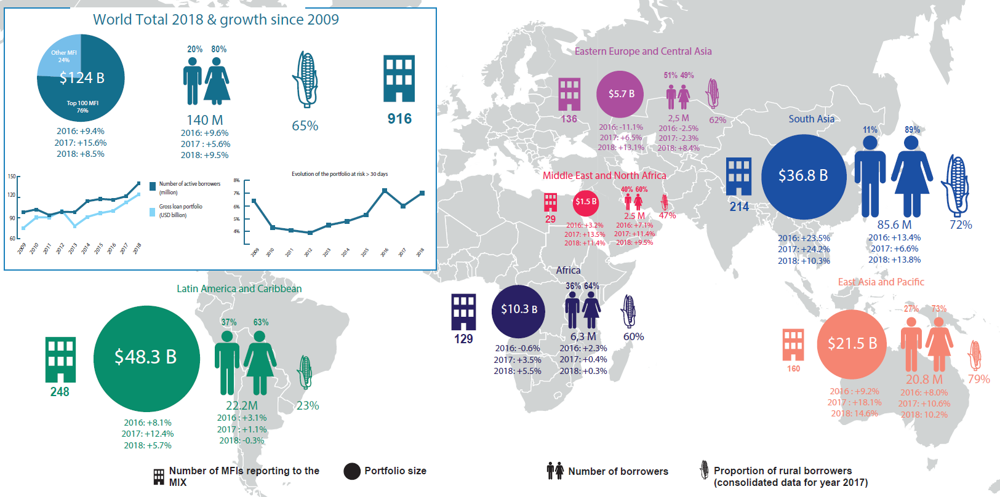

## Table of Contents

## What is a microfinance institution?

A microfinance institution is a type of organization that provides small loans and other financial services to people who do not have access to traditional banks. These people are often poor or living in rural areas where banks are not available. Microfinance institutions help them start or grow small businesses, manage their money, and improve their lives.

These institutions offer more than just loans. They also provide services like savings accounts, insurance, and financial education. By doing this, they help people learn how to handle money better and become more financially stable. Microfinance has become popular around the world because it helps lift people out of poverty and gives them a chance to build a better future.

## How do microfinance institutions differ from traditional banks?

Microfinance institutions and traditional banks both deal with money, but they work in different ways. Traditional banks usually need people to have a lot of money or good credit to get a loan. They also often have branches in big cities and towns. Microfinance institutions, on the other hand, focus on helping people who don't have much money or can't get loans from banks. They work in places where banks don't go, like rural areas or poor neighborhoods.

Another big difference is the size of the loans. Traditional banks give out big loans, often for things like buying a house or starting a big business. Microfinance institutions give out small loans, sometimes as little as a few dollars. These small loans help people start or grow very small businesses, like selling food or crafts. This makes a big difference for people who need just a little bit of money to improve their lives.

Lastly, microfinance institutions often offer more than just loans. They help people learn about money by offering classes and advice on saving and spending. Traditional banks might offer some of these services, but they usually focus more on the bigger financial needs of their customers. Microfinance institutions aim to help people become more financially stable over time, not just give them money.

## What are the criteria used to determine the size of a microfinance institution?

The size of a microfinance institution can be measured in different ways. One way is by looking at how much money it has to lend out, which is called its loan portfolio. A bigger loan portfolio means the institution is larger because it can help more people with loans. Another way to measure size is by the number of people the institution serves. If it has a lot of customers, it's considered bigger because it's reaching more people.

Another important measure is the number of branches or offices the institution has. More branches mean the institution can cover a larger area and help more people in different places. The size can also be looked at by the amount of money it gets from donors or investors. More funding usually means the institution can grow and do more work.

Lastly, the size of a microfinance institution can be seen in the number of employees it has. More staff can mean the institution is bigger and can handle more work and serve more clients. All these factors together help decide how big a microfinance institution is.

## Which country hosts the largest microfinance institution?

The largest microfinance institution in the world is Banco Compartamos, which is in Mexico. Banco Compartamos started in 1990 to help poor people in Mexico get small loans. Over time, it grew a lot and became very big. It now helps millions of people with loans, savings accounts, and other financial services.

Banco Compartamos is different from other microfinance institutions because it is also a bank. This means it can offer more services than just small loans. It has many branches all over Mexico, so it can reach a lot of people. Being the biggest microfinance institution, it plays a big role in helping people in Mexico improve their lives and become more financially stable.

## What is the largest microfinance institution by total assets?

The largest microfinance institution by total assets is Banco Compartamos, which is based in Mexico. Banco Compartamos started in 1990 to help poor people get small loans. Over the years, it grew a lot and became very big. It now has a lot of money in its total assets, which means it can help even more people with loans, savings accounts, and other financial services.

Banco Compartamos is special because it is also a bank. This means it can offer more services than just small loans. It has many branches all over Mexico, so it can reach a lot of people. Being the biggest microfinance institution by total assets, it plays a big role in helping people in Mexico improve their lives and become more financially stable.

## How does the largest microfinance institution by client base operate?

The largest microfinance institution by client base is also Banco Compartamos in Mexico. They work by giving small loans to people who can't get money from regular banks. These loans help people start or grow small businesses, like selling food or making things to sell. Banco Compartamos also helps people save money and learn about how to use money wisely. They have many offices all over Mexico, so they can help a lot of people in different places.

Banco Compartamos started in 1990 and has grown a lot since then. They now help millions of people with their financial needs. They not only give loans but also teach people how to manage their money better. This helps people become more financially stable over time. By reaching so many clients, Banco Compartamos plays a big role in helping people in Mexico improve their lives.

## What are the top three largest microfinance institutions by loan portfolio?

The top three largest microfinance institutions by loan portfolio are Banco Compartamos in Mexico, BRAC in Bangladesh, and ASA in Bangladesh. Banco Compartamos has the biggest loan portfolio. They started in 1990 and now help millions of people with small loans to start or grow their businesses. BRAC is the second largest. They began in 1972 and work to help poor people in Bangladesh and other countries. ASA is the third largest. They started in 1978 and focus on giving small loans to people who can't get help from regular banks.

These institutions are important because they help a lot of people who don't have much money. Banco Compartamos, BRAC, and ASA all give small loans, but they also offer other services like savings accounts and financial education. This helps people learn how to manage their money better and become more financially stable. By having big loan portfolios, these institutions can reach more people and make a bigger difference in their lives.

## How have the largest microfinance institutions impacted poverty alleviation?

The largest microfinance institutions, like Banco Compartamos in Mexico, BRAC in Bangladesh, and ASA in Bangladesh, have made a big difference in helping people get out of poverty. They do this by giving small loans to people who can't get money from regular banks. These loans help people start or grow small businesses, like selling food or making things to sell. When people can earn more money from their businesses, they can buy more things they need and have a better life. This helps lift them out of poverty because they can take care of themselves and their families better.

These institutions also offer more than just loans. They help people save money and learn about how to use money wisely. This is important because it helps people become more financially stable over time. For example, BRAC and ASA in Bangladesh not only give loans but also teach people how to manage their money better. By doing this, they help people not just for a short time but for the long term. Overall, the work of these big microfinance institutions has helped millions of people around the world improve their lives and move out of poverty.

## What are the challenges faced by the largest microfinance institutions in expanding their services?

The largest microfinance institutions face many challenges when they try to grow their services. One big challenge is getting enough money to lend out. They need to find investors or donors who believe in their work and are willing to give them money. This can be hard because some people think microfinance is risky. Another challenge is reaching more people in remote or poor areas. These places might not have good roads or communication, so it's hard for the institutions to set up new branches and help more people.

Another challenge is making sure their services are fair and helpful. Sometimes, when microfinance institutions grow very big, they might start charging higher interest rates to make more money. This can hurt the poor people they are trying to help. Also, as they grow, they need to keep teaching people about money and helping them in the right way. If they don't, people might not use their services correctly and could end up in more debt. Balancing growth with fairness and education is a big challenge for these institutions.

Overall, the biggest microfinance institutions want to help more people get out of poverty, but they have to overcome many hurdles to do so. They need to find ways to get more money, reach more people, and keep their services fair and educational. It's a tough job, but when they do it right, they can make a big difference in the lives of millions of people around the world.

## How do the largest microfinance institutions incorporate technology in their operations?

The largest microfinance institutions use technology to make their work easier and help more people. They use computers and the internet to keep track of loans and savings accounts. This makes it faster and easier to see who owes money and who has paid back their loans. They also use mobile phones to reach people in faraway places. With a mobile app, people can apply for loans, check their savings, and make payments without going to a branch. This is really helpful for people who live far from the city or have busy lives.

Technology also helps these institutions teach people about money. They can use videos and online lessons to show people how to save and spend wisely. This way, more people can learn at their own pace, even if they can't go to a class. By using technology, the biggest microfinance institutions can reach more people and help them become more financially stable. It's a big part of how they keep growing and making a difference in people's lives.

## What role do the largest microfinance institutions play in financial inclusion?

The largest microfinance institutions, like Banco Compartamos in Mexico and BRAC and ASA in Bangladesh, play a big role in financial inclusion. They help people who can't get money from regular banks by giving them small loans. These loans help people start or grow small businesses, which can make a big difference in their lives. By doing this, microfinance institutions make sure that even poor people can get the money they need to improve their lives. This is important because it means more people can take part in the economy and have a chance to do better.

These institutions also offer other services that help with financial inclusion. They help people save money and learn about how to use money wisely. This is important because it helps people become more financially stable over time. By offering these services, the largest microfinance institutions make sure that more people can join the financial world. They reach out to people in remote areas and poor neighborhoods, making sure that everyone has a chance to be part of the financial system. This helps create a fairer world where more people can benefit from financial services.

## How do regulatory environments affect the operations of the largest microfinance institutions?

The rules and laws in different countries can really change how the biggest microfinance institutions work. These rules are called the regulatory environment. Some places have strict rules about how much interest microfinance institutions can charge on loans. This can make it hard for them to make enough money to keep helping people. Other places might have rules about who can get loans and how much they can borrow. These rules can limit how many people the institutions can help and how they can help them.

On the other hand, some countries have rules that help microfinance institutions grow. For example, if the government gives them special support or makes it easier for them to get money from investors, they can help more people. But even then, they have to follow a lot of rules to make sure they are doing things the right way. Balancing these rules with their goals to help poor people can be tricky. The regulatory environment can either make it easier or harder for the largest microfinance institutions to reach more people and make a bigger difference in fighting poverty.

## References & Further Reading

[1]: CGAP, A Technical Guide on the Use of Technology by Microfinance Institutions. ["Technology for Microfinance"](https://www.cgap.org/sites/default/files/CGAP-Technical-Guide-Appraisal-Guide-for-Microfinance-Institutions-Mar-2008.pdf), Consultative Group to Assist the Poor (CGAP).

[2]: Lo, A. W. (2017). ["Adaptive Markets: Financial Evolution at the Speed of Thought"](https://archive.org/details/adaptivemarketsf0000loan), Princeton University Press.

[3]: Narayan, A., & Nyamongo, E. (2016). ["Financial Access Survey"](https://www.jstor.org/stable/26752383), International Monetary Fund Working Paper.

[4]: Gomber, P., Arndt, B., Lutat, M., & Uhle, T. (2011). ["High-Frequency Trading"](https://papers.ssrn.com/sol3/papers.cfm?abstract_id=1858626), Facts and Figures.

[5]: Bhatt, B. M., & Bhatt, S. K. (2015). ["Technological Innovations in Banking"](https://www.icommercecentral.com/open-access/factors-affecting-customers-adoption-of-mobile-banking-services.pdf) (1st ed.) Palgrave Macmillan.