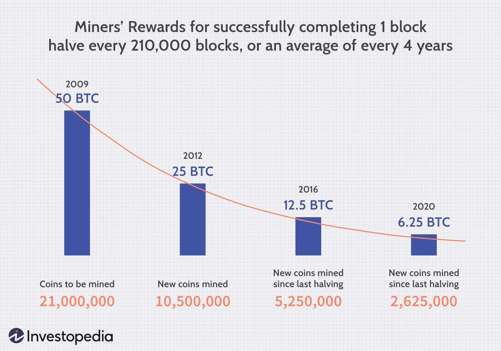

The global mining industry plays an indispensable role in the economic vitality of nations around the world. By extracting vital raw materials, it serves as the backbone for various industries, including manufacturing, construction, and technology. Metals such as copper, iron, and aluminum are foundational to infrastructure and technology developments, while precious metals like gold and silver have financial and industrial applications.

Mining companies are at the forefront of sourcing these critical materials, ensuring their availability for diverse applications. Their operations are expansive, often spanning continents, and involve intricate processes of exploration, extraction, and refinement. The financial performance of these mining firms is a significant indicator of the industry's health, often reflecting broader economic trends due to their foundational role.



In recent years, strategic innovations such as algorithmic trading have begun reshaping how these companies operate in the global market. Algorithmic trading applies advanced computational models to optimize pricing and enhance the timing of market operations, contributing to improved profitability and operational efficiency.

Focusing on the largest mining firms reveals crucial insights into the scale and influence of the mining sector globally. These organizations dramatically shape the economic landscapes of the regions in which they operate, often acting as major employers and drivers of secondary industries. The evolution of their strategic initiatives, including technological advancements and sustainability efforts, reflect ongoing shifts in the industry that continue to impact the global economy.

## Table of Contents

## Overview of the Mining Industry

The mining industry encompasses the extraction of various valuable minerals and metals crucial for global infrastructure and technological advancements. Minerals such as copper, iron ore, gold, and coal are integral to sectors like manufacturing, energy, and transportation, highlighting the industry's multifaceted impact. 

Copper, for example, is a fundamental component of electrical wiring and electronics due to its excellent conductivity, while iron ore serves as the primary raw material for steel production, essential in construction and transportation. Gold, beyond its traditional roles in jewelry and finance, is increasingly used in electronics and health care for its conductive and non-corrosive properties. Coal, although gradually being replaced by cleaner energy sources, has historically been a major energy source and remains critical in regions where energy diversification lags.

Mining operations vary significantly, from small-scale exploration entities to massive multinational corporations, each playing a role in the intricate supply chain of raw materials. These organizations employ substantial capital and technology to explore, extract, and process minerals, impacting local and global economies. Multinational companies, due to their expansive operations, often have significant influences on market trends and commodity pricing.

Geographically, several key nations dominate the mining industry landscape. China, Australia, Brazil, and the United States stand out due to their rich mineral resources and advanced mining technologies. China, for instance, leads in the production of rare earth elements critical for modern electronics and renewable energy technologies. Australia and Brazil are renowned for their abundant iron ore reserves, driving significant export activities. The United States remains a key player through its diverse mineral production and mining technology innovations.

These countries host some of the world's leading mining companies, which not only contribute to their respective economies but also to global supply chains for essential materials. Consequently, the strategic operations and decisions made within these countries reverberate throughout international markets, affecting supply, demand, and pricing of fundamental materials. 

The mining industry's landscape is thus shaped by its operational diversity, the pivotal role of certain minerals in the global economy, and the influential countries and companies leading the way. As such, it stands as a cornerstone of the modern economic infrastructure, continuously adapting to meet evolving demands and challenges.

## Top 10 Largest Mining Companies in the World

The mining industry is characterized by a few dominant companies that have emerged as the largest players globally, both in terms of revenue and market capitalization. This segment explores these influential firms, their core products, strategic approaches, and financial metrics.

Glencore, headquartered in Switzerland, stands out as one of the most significant entities in the mining and commodity trading business. With its diversified operations spanning metals, minerals, energy, and agricultural products, Glencore plays a pivotal role in the supply chain of various raw materials. According to their 2022 financial reports, Glencore's revenue reached approximately $203.75 billion. The company’s strategic focus lies in maintaining a balanced portfolio of mining assets while leveraging its vast trading network to optimize pricing and enhance market reach.

Jiangxi Copper, based in China, is one of the leading copper producers in the world. The company’s main products include copper cathodes, copper rods, and various precious metals as by-products. Jiangxi Copper has strategically positioned itself to capitalize on the rising demand for copper, driven by the global shift towards renewable energy and electric vehicles. In 2022, the company recorded a revenue of roughly $43 billion, highlighting its substantial influence on the copper market. Jiangxi Copper's strategy is heavily focused on expanding operational efficiencies and investing in technological innovation to reduce production costs.

The BHP Group, an Anglo-Australian multinational, is another prominent figure within the mining sector. BHP specializes in iron ore, metallurgical coal, copper, and petroleum. Its extensive operations are primarily located in Australia and the Americas. BHP's revenue for 2022 was reported at approximately $65 billion. The company emphasizes value over [volume](/wiki/volume-trading-strategy), prioritizing high-margin assets and sustainability initiatives, which include reducing greenhouse gas emissions and investing in renewable energy sources. This strategic focus aids in cushioning the impact of market fluctuations and enhancing long-term profitability.

Other leading mining companies, which are not as elaborated here, include Rio Tinto, Anglo American, and Vale. Each of these companies contributes significantly to different sectors within the mining industry, from aluminum production to iron ore extraction. For example, Vale, a Brazilian company, is a top producer of iron ore and nickel, while Rio Tinto is known for its aluminum and copper operations.

The combined influence of these top mining firms shapes the global mining landscape, impacting both the supply and pricing of key resources fundamental for industrial development. Their strategic decisions not only affect their financial outcomes but also have broader implications for global economic stability and environmental sustainability.

## Algorithmic Trading in the Mining Sector

Algorithmic trading is revolutionizing various sectors of the global economy, and the mining industry is no exception. As part of the broader commodity markets, mining firms are increasingly incorporating [algorithmic trading](/wiki/algorithmic-trading) strategies to optimize their financial performance and enhance operational efficiencies.

At its core, algorithmic trading involves the use of computer programs to execute trading decisions at speeds and frequencies that are impossible for a human trader to achieve. This technology leverages mathematical models and historical market data to identify trading opportunities, thereby optimizing pricing and improving market timing. In the mining sector, where price fluctuations are common due to factors such as geopolitical events or natural disasters, algorithmic trading provides a mechanism to hedge against such volatilities.

Mining companies, like Glencore and BHP Group, use algorithmic trading to manage their large and diverse product portfolios effectively. These strategies allow firms to conduct high-frequency trades that mitigate risk and take advantage of market inefficiencies. For instance, algorithmic models can predict optimal times to buy and sell commodities based on supply-demand dynamics, historical price patterns, and external factors such as shifts in regulatory policies or technological advancements.

A case study of Rio Tinto, one of the leading mining corporations, illustrates the impact of algorithmic trading strategies. Rio Tinto has integrated [machine learning](/wiki/machine-learning) algorithms to predict future trends in the aluminum and copper markets. By analyzing vast datasets that include historical prices, trading volumes, and macroeconomic indicators, these algorithms enable the company to make more informed decisions on when to enter or [exit](/wiki/exit-strategy) positions, thereby reducing costs and increasing profit margins. 

Similarly, enhanced [liquidity](/wiki/liquidity-risk-premium) operations have been achieved by companies like Vale, which employs algorithmic trading to navigate the highly volatile iron ore market. The firm's algorithms automatically execute trades that adjust its market exposure and inventory levels, ensuring that it remains competitive even during periods of economic uncertainty.

Overall, algorithmic trading is providing mining companies with a strategic advantage by allowing them to respond swiftly to market changes. This technological adoption not only enhances profitability but also aligns with the broader shift towards digital transformation in the industry. The ability to leverage vast amounts of data to drive efficient trading strategies marks a significant advancement in how mining firms operate and compete on a global scale.

## Challenges and Opportunities in the Mining Industry

The mining industry faces several significant challenges that continue to influence its operations and strategic decisions. Among these, environmental regulations are paramount, as they dictate how mining activities must be conducted to minimize ecological impact. Stringent regulations often require companies to adopt new technologies or processes that can add to operational costs. For instance, compliance with emissions standards or waste management practices may necessitate expensive upgrades to existing infrastructure.

Market [volatility](/wiki/volatility-trading-strategies) poses another critical challenge. Fluctuations in commodity prices can significantly affect the profitability of mining operations. Factors such as global economic conditions, currency exchange rates, and changing demand for raw materials can cause instability in pricing. This volatility requires mining companies to devise robust risk management strategies to hedge against adverse price movements and ensure stable cash flows.

Geopolitical risks also play a major role. Mining companies often operate in regions with unstable political environments or in jurisdictions with unpredictable regulatory frameworks. Political instability can lead to disruptions in operations, such as strikes or changes in law, which might severely affect the continuity and profitability of projects.

Despite these challenges, the mining industry has considerable opportunities for growth. Technological innovation stands out as a key area where mining firms can enhance efficiency and reduce costs. Automation, digitalization, and the use of [artificial intelligence](/wiki/ai-artificial-intelligence) and machine learning models can streamline operations, improve safety, and optimize resource extraction processes.

Sustainable practices offer another avenue for advancement. There is increasing pressure on mining companies to pursue sustainable mining, aiming to reduce their environmental footprint and improve social outcomes. Companies investing in renewable energy sources for operations, implementing water-saving technologies, and rehabilitating mining sites contribute positively to their public image and may benefit from regulatory incentives.

Moreover, exploring untapped markets represents a strategic opportunity. As global demand for certain minerals and metals grows, particularly those critical for emerging technologies such as electric vehicles and renewable energy systems, mining companies can target resource-rich but underdeveloped regions. This approach can lead to the discovery of new deposits, providing long-term growth potential.

Strategic partnerships and mergers are crucial for addressing these challenges and capitalizing on opportunities. Collaborations can lead to resource and risk sharing, facilitating access to new technologies and expertise. Mergers and acquisitions allow companies to combine their strengths, optimize resource use, and expand their market reach, driving future growth. These strategic alliances can be vital for smaller firms lacking the means to independently undertake large-scale projects or technological transformations.

Overall, while the mining industry is confronted with several significant challenges, strategic and innovative approaches can unlock substantial opportunities for growth and development.

## The Future of the Mining Industry

The mining industry is on the brink of significant transformation over the next decade, driven by digital advancements and the necessity for sustainable practices. As the demand for raw materials continues to evolve, driven by both technological advancements and environmental imperatives, mining companies will need to adapt swiftly to maintain relevance and profitability.

Digital transformation is poised to redefine how mining operations are conducted. Technologies such as artificial intelligence, machine learning, and automation are expected to enhance operational efficiencies and reduce costs. For instance, autonomous vehicles and drones can improve the safety and efficiency of mining operations by performing tasks such as surveying hazardous sites and transporting materials without human intervention. Machine learning algorithms can analyze vast datasets to optimize extraction processes and predict equipment failures before they occur, thus minimizing downtime and maintenance costs.

Here is a simple Python illustration of how predictive maintenance might be implemented:

```python
import numpy as np
from sklearn.ensemble import RandomForestRegressor
from sklearn.model_selection import train_test_split
from sklearn.metrics import mean_squared_error

# Example dataset: features are sensor readings, target is time to failure
data = np.random.rand(1000, 20)  # 1000 samples, 20 features
target = np.random.rand(1000) * 100  # Random time to failure

# Split data into training and test sets
X_train, X_test, y_train, y_test = train_test_split(data, target, test_size=0.2, random_state=42)

# Train a random forest regressor
model = RandomForestRegressor(n_estimators=100, random_state=42)
model.fit(X_train, y_train)

# Predict and evaluate model performance
predictions = model.predict(X_test)
error = mean_squared_error(y_test, predictions)

print(f'Predicted Mean Squared Error: {error:.2f}')
```

The emphasis on sustainable practices is also altering the mining landscape. Companies are increasingly adopting eco-friendly technologies and practices, such as renewable energy sources and water recycling systems, to minimize their environmental footprint. This shift is largely driven by the rising importance of Environmental, Social, and Governance ([ESG](/wiki/esg-investing)) criteria, which assess a company’s ethical impact and sustainability. As investors and stakeholders place greater emphasis on ESG metrics, mining companies that adopt these practices are likely to enjoy enhanced reputations and competitive advantages.

Emerging markets, particularly in Asia and Africa, are set to influence the demand for minerals and metals. As these regions experience rapid industrialization and urbanization, the demand for construction materials, energy resources, and manufacturing inputs is expected to surge. Simultaneously, the global push for green technologies, such as electric vehicles and solar panels, will likely increase the demand for specific metals like lithium, cobalt, and copper.

The future trajectory of the mining industry will require an agile approach, seamlessly integrating technological innovation with sustainability imperatives. Companies that successfully navigate these changes will not only drive profitability but also contribute to a more sustainable and equitable global economy. As the industry evolves, the strategic adoption of digital technologies and ESG practices will be pivotal in shaping its future.

## Conclusion

In summarizing the key points related to the largest mining firms, it is evident that these entities play a pivotal role in shaping the global economy. Mining companies like Glencore, Jiangxi Copper, and BHP Group contribute significantly to the supply chain by extracting and distributing essential raw materials, including metals and minerals like copper, iron ore, and gold. These resources are foundational to various industries and indispensable for economic development, supporting sectors ranging from manufacturing to energy and transportation.

The strategic operations of these companies are increasingly influenced by technological advancements and the integration of algorithmic trading, which enhance their market positioning by optimizing pricing strategies and improving profitability. This technological shift is indicative of a broader trend within the industry, emphasizing efficiency and strategic market engagement.

Moreover, the mining industry is undergoing continuous evolution driven by a crucial focus on sustainability and adherence to environmental, social, and governance (ESG) criteria. Initiatives geared towards sustainable practices, technological innovation, and exploring untapped markets present both challenges and opportunities, allowing firms to navigate the complexities of environmental regulations and market volatility.

As the industry progresses towards digitization and sustainable practices, mining companies are expected to adapt to emerging demands influenced by green technologies and ESG imperatives. This ongoing transformation highlights the industry's capacity to influence future market dynamics and its critical role in supporting global industrialization through the sustainable supply of raw materials.

## References & Further Reading

[1]: ["Algorithmic Trading: A Practitioner's Guide"](https://www.amazon.com/Algorithmic-Trading-Practitioners-Jeffrey-Bacidore/dp/0578715236) by Barry Johnson

[2]: ["Mining Economics and Strategy"](https://books.google.com/books/about/Mining_Economics_and_Strategy.html?id=nPVb3AHHVgYC) by Ian C. Runge

[3]: Alford, C., Eykman, K., & Venton, P. (2020). ["Digital Transformation Initiative: Mining and Metals Industry."](https://link.springer.com/article/10.1007/s42461-020-00262-1) World Economic Forum.

[4]: ["The Business of Mining: Bridging Theory and Practice for Management"](https://journals.sagepub.com/doi/pdf/10.1177/1946756718820582) by Odwyn Jones and Eric Lilford

[5]: Otto, J. M., Andrews Speed, P., & Bastida, E. (1998). ["Mining Royalties: A Global Study of Their Impact on Investors, Government, and Civil Society."](https://www.semanticscholar.org/paper/Mining-Royalties%3A-A-Global-Study-of-Their-Impact-on-Otto-Andrews/d9fd641f9e84c1991c3abea346716dbb3dab9d33) World Bank Publications.