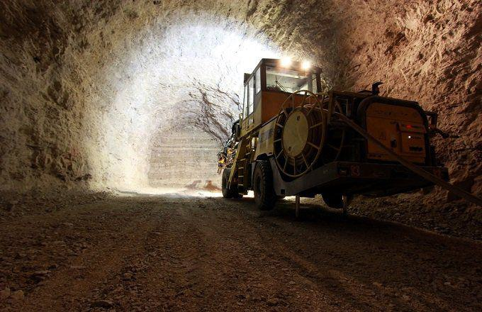

Understanding the landscape of the mining industry is crucial, especially when considering the significant players based in China. As a dominant force in the global mining sector, China is home to numerous companies leading the charge in this field. These firms have a substantial economic impact worldwide, influencing various industries and economies. For context, China's role in the global mining industry is underscored by its significant production of essential minerals such as coal, iron ore, copper, and gold. This production capability supports global supply chains and contributes to economic stability.

The Chinese mining companies are not only pivotal to the domestic economy but also affect international markets by setting trends and prices through their vast output. Consequently, the economic ramifications of their operations stretch across borders, often dictating market dynamics in related sectors. Importantly, these companies are integrating advancements in technology, notably algorithmic trading, into their operations. Algorithmic trading, which was initially more prominent in financial markets, is making its way into mining. This technology is allowing companies to optimize trade strategies, manage risks better, and improve overall efficiency in managing their supply chains.

Algorithmic trading involves the use of complex algorithms to execute trades at speeds and frequencies that are impossible for human traders to achieve. This integration into the mining sector exemplifies how traditional industries intersect with cutting-edge technologies to enhance performance and sustainability. By adapting to such technological advancements, Chinese mining firms are setting a precedent for how industries can evolve in the modern era. The focus of this article is to explore these largest mining firms in China, examining how they operate and the transformational role of algorithmic trading within the mining sector.

## Table of Contents

## Overview of the Chinese Mining Sector

China's mining industry has experienced remarkable growth over the past few decades, establishing itself as one of the largest and most influential in the world. This growth is largely attributed to the country's abundant natural resources. China is rich in a variety of minerals including coal, iron ore, copper, and gold, among others. These resources have fueled the country's industrial expansion and supported significant infrastructure development, domestically and internationally.

Coal remains a cornerstone of China's mining sector. It accounts for a substantial portion of the nation's energy mix, reflecting its role in powering China's economic growth. Iron ore and copper are also critical, especially given their importance in construction and electronics manufacturing. The abundant supply of these minerals gives China a competitive edge in several global markets.

Government policies and economic strategies have been instrumental in accelerating mining activities. The Chinese government has implemented a series of supportive policies that have streamlined processes, provided financial incentives, and encouraged foreign investment. These policies have enabled the sector to expand rapidly and to remain resilient in the face of global economic fluctuations.

China's mining industry is integral to the global supply chain. The minerals extracted in China are not only used domestically but are also exported, influencing international market prices and availability. China's position in the supply chain impacts several industries, from technology to construction materials, making it a pivotal player in the global economy.

Efforts towards sustainable and environmentally friendly mining practices are underway, driven by both domestic and international pressure to address environmental concerns. The Chinese government has been advocating for greener mining techniques and has introduced regulations aimed at reducing the environmental impact of mining activities. Nonetheless, the industry faces challenges in fully transitioning to sustainable practices due to technological, financial, and logistical constraints. The move towards sustainability is a work in progress, requiring innovation and collaboration across the industry to overcome the hurdles involved.

Overall, China's mining sector is a dynamic and vital component of the global mining landscape. Its ability to adapt and grow amidst the challenges of sustainability and market fluctuation will continue to shape its influence worldwide.

## Top Mining Firms in China

Several mining firms are prominent in China's mining sector due to their extensive operations, output levels, and influence within the industry. These companies not only contribute significantly to the domestic economy but also exert influence on a global scale.

China Shenhua Energy Company Limited stands out as a leading entity in coal and energy production. It is the largest coal company in the world by reserves and production [volume](/wiki/volume-trading-strategy). As of recent years, Shenhua's coal output has been substantial, reinforcing China's position as the largest global producer and consumer of coal. The company also diversifies its operations by investing in power generation, coal liquefaction, and coal chemicals, enhancing its vertical integration.

The China National Coal Group Corporation, often referred to as China Coal Group, is another significant player in the coal industry. Ranked as the second-largest coal mining firm in China, its operations span coal production, trade, and mining equipment manufacturing. Known for its significant contribution to domestic coal supply, China Coal Group supports China's energy needs extensively while also exploring cleaner energy production methods and sustainable mining practices.

Aluminum Corporation of China Limited (Chalco) is a central stakeholder in China's non-ferrous metal sector. As one of the largest producers of alumina and primary aluminum, Chalco holds a crucial role in the global aluminum market. The company's operations extend beyond aluminum production to include mining and refining of bauxite, as well as other metals like copper and rare earth elements. Chalco’s strategic expansions and technological innovations have enabled it to maintain competitiveness in a volatile international market.

Zijin Mining Group Co., Ltd. is a leading force in gold and copper production, both in China and on an international level. Known for its aggressive expansion strategy, Zijin has acquired several mining projects globally, establishing itself in significant gold and copper mining operations worldwide. The firm's focus on sustainable and cost-efficient mining practices underscores its commitment to maintaining its competitive edge in the global mining industry.

These corporations not only strengthen China's mining capabilities but also play influential roles globally. Their operations affect international trade dynamics, commodity prices, and technological innovations in mining. As China continues to evolve its mining industry towards sustainability and efficiency, the global impact of these top firms is expected to grow correspondingly.

## Algo Trading in Mining

Algorithmic trading, significantly influential in finance, has increasingly permeated the mining industry. This adoption arises from the need to optimize trading strategies and manage financial risks more proficiently. At its core, [algorithmic trading](/wiki/algorithmic-trading) involves the use of complex mathematical models and computational power to make automated trading decisions. These algorithms can process vast amounts of data, allowing for real-time adjustments to market changes, a critical advantage in volatile commodity markets.

The mining industry, which deals heavily in commodities like minerals and metals, benefits significantly from algorithmic strategies. With advancements in technology enabling real-time data processing, mining companies can enhance decision-making capabilities through more precise predictive analytics. This immediate data response facilitates timely buying and selling decisions, aligning with market conditions to maximize returns and minimize losses.

One practical application of algorithmic trading in mining is in the optimization of supply chains. By using algorithms, companies can predict demand and supply fluctuations, adjust their procurement strategies, and ensure efficient inventory management. This predictive ability helps avoid overproduction or underproduction scenarios, leading to cost savings and improved resource allocation.

Moreover, algorithmic trading aids in risk management strategies, particularly in hedging against price [volatility](/wiki/volatility-trading-strategies). For example, mining firms can use algorithms to evaluate price trends and execute trades that lock in favorable prices for future production. This approach stabilizes revenue streams and shields the company from unexpected market downturns.

The automation inherent in algorithmic trading also reduces human error and increases operational efficiency. Automated systems can execute trades faster than any human, ensuring optimal pricing and timing. This efficiency results in lower transaction costs and diminishes the likelihood of costly mistakes.

In summary, the integration of algorithmic trading into mining operations represents a significant technological advance. It not only optimizes financial outcomes through enhanced trading strategies and risk management but also streamlines supply chain management, thereby offering substantial economic benefits. As the industry continues to embrace technological innovation, algorithmic trading is poised to become an indispensable tool for mining companies seeking sustained growth and competitiveness.

## The Impact of Technology on Mining Operations

Technology is transforming the mining industry by enhancing safety, efficiency, and productivity. Automation and advanced technological systems are becoming key components of modern mining operations. One notable technological advancement is algorithmic trading, which, although originating in the finance sector, is now being utilized within the mining industry to optimize trade strategies and manage financial risks.

In addition to algorithmic trading, technology plays a significant role in mineral processing and exploration. Sophisticated software models and high-precision equipment enable precise identification and extraction of minerals, minimizing waste and increasing yield. Technologies such as remote sensing, drones, and geographic information system (GIS) mapping provide faster and more accurate data collection, allowing for detailed exploration and assessment of potential mining sites.

The introduction of autonomous vehicles and machinery is significantly reducing human workforce risks in mining operations. These machines can work continuously in hazardous environments without the need for human intervention, thus minimizing accidents and improving operational efficiency. Autonomous haul trucks, drills, and loaders are increasingly common in mining sites, thereby reducing human error and operational costs.

Data analytics is another crucial technology in mining operations. By leveraging big data and real-time analytics, mining companies can optimize asset management and make informed operational decisions. Data-driven insights enable predictive maintenance of equipment, which reduces downtime and operational costs. Establishing correlations between different datasets can help identify inefficiencies and potential improvement areas in mining processes.

The integration of [artificial intelligence](/wiki/ai-artificial-intelligence) (AI) and [machine learning](/wiki/machine-learning) in the mining industry signals promising advancements. AI algorithms can analyze complex datasets to improve decision-making processes, enhance exploration precision, and increase ore recovery rates. Machine learning models can predict equipment failures before they occur, thereby improving maintenance schedules and reducing unexpected downtime. These intelligent systems also facilitate better resource management and ore classification, ultimately boosting productivity and profitability.

In conclusion, technology is fundamentally changing how mining operations are conducted. From exploration to mineral processing and safety, technological advancements are making the industry more efficient and sustainable. As these technologies continue to evolve, their integration will likely lead to even greater innovations and improvements in mining operations worldwide.

## Challenges Facing the Industry

The Chinese mining industry, while experiencing significant growth, is not without its challenges. A primary area of concern is environmental sustainability. As one of the largest mining sectors globally, the industry's environmental footprint is substantial. Stakeholders, including the government, local communities, and international bodies, are increasingly demanding sustainable practices to minimize environmental degradation. This includes reducing carbon emissions, managing waste effectively, and restoring ecosystems post-extraction.

Regulatory changes further compound these challenges. China frequently updates its mining regulations to align with its broader environmental and economic objectives, requiring firms to adapt swiftly. This dynamic regulatory environment can increase operational costs and necessitate strategic realignment for compliance, impacting both small and large mining entities.

Economic fluctuations, such as commodity price volatility and global market shifts, also pose strategic challenges. Mining firms must navigate these uncertainties while maintaining profitability. The complexities of global supply chains, affected by geopolitical tensions and trade policies, add additional layers of complexity to operations.

Technological adoption presents both opportunities and challenges. While technology boosts efficiency and safety, it requires a skilled workforce capable of leveraging new tools and systems. The transition towards more automated and technologically advanced operations can lead to workforce displacement, raising employment concerns and creating a need for retraining programs to equip workers with relevant skills.

Risk management and ethical mining practices are areas needing innovation. Companies are increasingly scrutinized for their operational ethics, including labor practices and community relations. The industry must develop sophisticated risk management strategies to anticipate and mitigate environmental, financial, and operational risks while maintaining ethical transparency.

Addressing these challenges requires a multifaceted approach, balancing innovation with sustainability and regulatory compliance, while ensuring that technological advancements and workforce dynamics are harmoniously aligned.

## Conclusion

China remains a powerhouse in the global mining sector, with a significant global footprint that illustrates its influential role in various industries worldwide. The largest mining firms in China, such as China Shenhua Energy, China National Coal Group, and Zijin Mining Group, have not only bolstered the domestic economy but have also become integral cogs in the global supply chain. These firms contribute considerably to economic stability, ensuring a stable supply of crucial resources like coal, iron ore, and copper, which are vital for numerous industrial applications.

As China continues to advance its mining operations, the integration of technology, particularly algorithmic trading, offers promising new avenues for growth and efficiency. Algorithmic trading enables these companies to optimize trade strategies and manage financial risks more effectively, leveraging real-time data processing and advanced algorithms to make informed decisions. This technological shift has the potential to streamline operations, reduce costs, and enhance profitability, thereby positioning Chinese mining firms at the forefront of a more dynamic and competitive global market.

The evolution of the mining industry is characterized by an ongoing need to address various challenges through innovation and strategic foresight. Environmental sustainability, regulatory compliance, and workforce adaptation to technological advancements are among the key areas that require continued focus. By embracing technological solutions such as artificial intelligence, machine learning, and automation, Chinese mining firms can better navigate these complexities while minimizing their environmental footprint and enhancing operational safety.

China's mining landscape provides valuable insights into how technology and traditional industries can effectively converge. By leveraging technological advancements, these firms can transform operational models, improve resource management, and contribute to sustainable economic growth. As the global mining industry advances, the experiences of Chinese mining giants illustrate the potential for integrating technology with traditional practices to drive significant improvements in efficiency, safety, and environmental stewardship.

## References & Further Reading

[1]: Lichtenstein, J., & Swem, N. (2021). ["Algorithmic Trading and Information."](https://pubmed.ncbi.nlm.nih.gov/34724806/) Journal of Financial Markets.

[2]: Song, Y., & Tapio, P. (2021). ["China’s Mining and Mineral Sector: A Green Perspective."](https://www.sciencedirect.com/science/article/abs/pii/S0301420722007140) Sustainability, 13(13), 7007.

[3]: Lopez de Prado, M. (2018). ["Advances in Financial Machine Learning."](https://www.amazon.com/Advances-Financial-Machine-Learning-Marcos/dp/1119482089) Wiley.

[4]: Jansen, S. (2018). ["Machine Learning for Algorithmic Trading."](https://github.com/stefan-jansen/machine-learning-for-trading) Packt Publishing.

[5]: Earthsecurity. (2019). ["The New Geopolitics of Minerals."](https://www.academia.edu/51656801/The_new_geopolitics_of_minerals) Earth Security Group.

[6]: Kitco. (2022). ["China's Zijin Mining pushes for sustainability."](https://www.kitco.com/news/off-the-wire/2024-12-09/ukraines-key-coking-coal-mine-still-operating-russians-close) Kitco News.

[7]: Aronson, D. (2007). ["Evidence-Based Technical Analysis: Applying the Scientific Method and Statistical Inference to Trading Signals."](https://www.amazon.com/Evidence-Based-Technical-Analysis-Scientific-Statistical/dp/0470008741) Wiley.

[8]: Chan, E. P. (2009). ["Quantitative Trading: How to Build Your Own Algorithmic Trading Business."](https://github.com/ftvision/quant_trading_echan_book) Wiley.