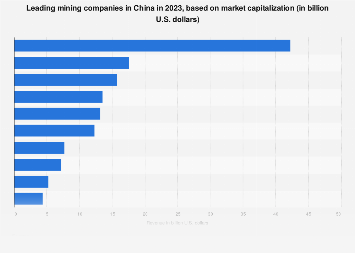

## Table of Contents

## What are the largest mining companies in China?

The largest mining company in China is China Shenhua Energy Company. It is a big company that mines coal. Coal is used to make electricity. China Shenhua Energy also moves coal from mines to places where it is used. This company is very important in China because it helps keep the lights on and factories running.

Another big mining company is Aluminum Corporation of China Limited, also called Chinalco. This company mines bauxite, which is used to make aluminum. Aluminum is used in many things, like cars and airplanes. Chinalco is also important because it helps make products that people use every day.

A third large mining company is China Minmetals Corporation. This company mines many different metals like copper and zinc. These metals are used in construction and electronics. China Minmetals helps build things and make technology that people need.

## How are these mining companies ranked in terms of size?

The largest mining company in China is China Shenhua Energy Company. It is the biggest because it produces a lot of coal. Coal is very important for making electricity in China. China Shenhua Energy also has a big business moving coal from mines to where it is needed. This makes it a very important company in China.

The second largest is Aluminum Corporation of China Limited, or Chinalco. It is big because it mines a lot of bauxite, which is used to make aluminum. Aluminum is used in many things like cars and airplanes. Chinalco is important because it helps make products that people use every day.

The third largest is China Minmetals Corporation. It is big because it mines many different metals like copper and zinc. These metals are used in building things and making electronics. China Minmetals helps make the things that people need for their homes and technology.

## What types of minerals do these companies primarily mine?

China Shenhua Energy Company mainly mines coal. Coal is a black rock that is burned to make electricity. It is very important in China because a lot of the country's power comes from coal. China Shenhua Energy also helps move the coal from where it is mined to where it is used, like power plants and factories.

Aluminum Corporation of China Limited, or Chinalco, mostly mines bauxite. Bauxite is a type of rock that is used to make aluminum. Aluminum is a light metal that is used in many things, like cars, airplanes, and cans. Chinalco is important because it helps make these products that people use every day.

China Minmetals Corporation mines different kinds of metals. The main ones are copper and zinc. Copper is used in wires and pipes, and zinc is used to protect other metals from rust. These metals are important for building things and making electronics that people need.

## Where are the headquarters of these mining companies located?

China Shenhua Energy Company has its headquarters in Beijing. Beijing is the capital city of China. This is where the main office is, and it helps run all the coal mining and transportation that the company does.

Aluminum Corporation of China Limited, or Chinalco, also has its headquarters in Beijing. Just like China Shenhua, Chinalco's main office is in the capital city. From there, they manage all the bauxite mining and aluminum production.

China Minmetals Corporation's headquarters is in Beijing too. All three big mining companies have their main offices in the same city. From Beijing, China Minmetals oversees the mining of different metals like copper and zinc.

## What is the history and background of the top mining company in China?

China Shenhua Energy Company started in 1995. It was created by the Chinese government to help manage and grow the coal industry. Coal is very important in China because it is used to make electricity. The company began with a focus on mining coal, but it also started to move coal from the mines to places where it is needed, like power plants and factories. This made China Shenhua a big part of China's energy system.

Over the years, China Shenhua has grown a lot. It became one of the biggest coal companies in the world. The company not only mines coal but also works on making energy in other ways, like using wind and solar power. This helps China Shenhua be more than just a coal company. It is now a big player in helping China use different kinds of energy to keep the country running.

## How do these companies contribute to China's economy?

China Shenhua Energy Company helps China's economy by mining a lot of coal. Coal is used to make electricity, which is very important for homes and factories. When China Shenhua mines and moves coal, it helps keep the power on and factories working. This means more jobs for people and more things can be made and sold. The company also tries to use other types of energy like wind and solar, which can help the economy grow in new ways.

Aluminum Corporation of China Limited, or Chinalco, helps the economy by mining bauxite and making aluminum. Aluminum is used in many things like cars, airplanes, and cans. When Chinalco makes more aluminum, it helps other businesses make more products. This creates jobs and helps the economy grow. Chinalco also works with other countries, which can bring in more money and help the economy.

China Minmetals Corporation also helps the economy by mining metals like copper and zinc. These metals are used in building things and making electronics. When China Minmetals mines more metals, it helps construction and technology grow. This means more jobs and more products for people to buy. China Minmetals also trades with other countries, which can bring in more money and help the economy.

## What are the major challenges faced by mining companies in China?

Mining companies in China face many challenges. One big problem is the environment. Mining can harm the land, water, and air. People are worried about pollution and want mining companies to be more careful. The government is making new rules to protect the environment, which can make it harder and more expensive for mining companies to work.

Another challenge is the cost of mining. It can be very expensive to dig for minerals and move them around. Prices for coal, metals, and other minerals can go up and down, which makes it hard for companies to plan and make money. Sometimes, they have to spend a lot of money to find new places to mine, which can be risky.

Also, there are challenges with workers. Mining can be dangerous, so companies need to keep their workers safe. This can cost a lot of money. There are also rules about how much workers should be paid and how they should be treated, which can make it harder for companies to keep costs down. All these challenges make it tough for mining companies in China to do well.

## What are the environmental impacts associated with these mining operations?

Mining in China can harm the environment in many ways. When companies like China Shenhua Energy mine coal, they can cause air pollution. Burning coal makes a lot of smoke and gases that can make the air dirty. This can make people sick and harm plants and animals. Mining can also use a lot of water and make it dirty. This can hurt rivers and lakes, making it hard for fish and other animals to live there. The land where mining happens can be damaged too. Big holes and piles of waste can change the land and make it hard for anything to grow there.

Another problem is that mining can release harmful chemicals into the environment. For example, when Chinalco mines bauxite to make aluminum, it can create red mud, which is very bad for the environment. If this red mud gets into rivers or soil, it can harm plants, animals, and people. China Minmetals Corporation mines metals like copper and zinc, and this can also release harmful chemicals. These chemicals can get into the air, water, and soil, causing long-term damage. All these impacts show why it's important for mining companies to be careful and try to reduce the harm they cause to the environment.

## How do these companies comply with national and international mining regulations?

Mining companies in China, like China Shenhua Energy, Chinalco, and China Minmetals, have to follow rules set by the Chinese government and international groups. The Chinese government makes laws to protect the environment and keep workers safe. These companies need to make sure they do not pollute too much and that they take care of the land and water. They also have to make sure their workers are safe and treated well. If they do not follow these rules, they can get in trouble and have to pay fines or even stop working.

International rules are also important. Groups like the United Nations and the World Bank have rules about how mining should be done to protect the environment and people. China Shenhua, Chinalco, and China Minmetals try to follow these rules too. They might have to report what they are doing to these groups and show that they are being careful. Sometimes, they work with other countries to make sure they are doing things the right way. Following all these rules can be hard, but it helps make sure mining is done safely and does not harm the environment too much.

## What technological advancements have these companies adopted to improve mining efficiency?

Mining companies in China, like China Shenhua Energy, Chinalco, and China Minmetals, use new technology to make mining better and faster. China Shenhua uses big machines and computers to find coal and dig it out of the ground. They also use special trucks and trains to move coal from the mines to where it is needed. These machines help them mine more coal without using as many people, which can save time and money. Chinalco uses new ways to process bauxite and make aluminum. They have machines that can do the work faster and better than before. This helps them make more aluminum and use less energy.

China Minmetals also uses new technology to find and dig out metals like copper and zinc. They use special tools to see deep underground and find where the metals are. Then they use big machines to dig them out. These machines can work all the time and do not get tired like people do. All these new technologies help the companies mine more and do it in a safer way. They can also help the companies be kinder to the environment by using less energy and making less waste.

## What are the future expansion plans of these mining companies?

China Shenhua Energy Company wants to grow bigger in the future. They plan to find new places to mine coal and build more ways to move it around. They also want to use more clean energy like wind and solar power. This will help them make electricity in a way that is better for the environment. By doing this, they hope to keep helping China's energy needs and make more money.

Aluminum Corporation of China Limited, or Chinalco, is also looking to expand. They want to find more bauxite to mine and make more aluminum. They are looking at other countries to work with, which can help them get more resources. Chinalco also wants to use new technology to make their work faster and cleaner. This will help them make more aluminum and be better for the environment.

China Minmetals Corporation has plans to grow too. They want to find new places to mine metals like copper and zinc. They are also looking to work with other countries to get more resources. China Minmetals wants to use new technology to make their mining safer and more efficient. By doing this, they hope to help China's economy grow and make more products for people to use.

## How do these companies engage with local communities and manage social responsibilities?

China Shenhua Energy Company, Chinalco, and China Minmetals work with local communities to help them. They talk to people who live near their mines to understand their needs. They might build schools, hospitals, or roads to help the community. They also try to give jobs to local people so they can work at the mines. This helps the community grow and makes sure people feel good about the mining company being there.

These companies also take care of social responsibilities. They try to be safe and protect the environment. They follow rules to make sure their mining does not harm people or nature too much. They also give money to help with things like education and health care. By doing these things, they show that they care about more than just making money. They want to be good neighbors and help the places where they work.

## References & Further Reading

[1]: Lichtenstein, J., & Swem, N. (2021). ["Algorithmic Trading and Information."](https://pubmed.ncbi.nlm.nih.gov/34724806/) Journal of Financial Markets.

[2]: Song, Y., & Tapio, P. (2021). ["China’s Mining and Mineral Sector: A Green Perspective."](https://www.sciencedirect.com/science/article/abs/pii/S0301420722007140) Sustainability, 13(13), 7007.

[3]: Lopez de Prado, M. (2018). ["Advances in Financial Machine Learning."](https://www.amazon.com/Advances-Financial-Machine-Learning-Marcos/dp/1119482089) Wiley.

[4]: Jansen, S. (2018). ["Machine Learning for Algorithmic Trading."](https://github.com/stefan-jansen/machine-learning-for-trading) Packt Publishing.

[5]: Earthsecurity. (2019). ["The New Geopolitics of Minerals."](https://www.academia.edu/51656801/The_new_geopolitics_of_minerals) Earth Security Group.

[6]: Kitco. (2022). ["China's Zijin Mining pushes for sustainability."](https://www.kitco.com/news/off-the-wire/2024-12-09/ukraines-key-coking-coal-mine-still-operating-russians-close) Kitco News.

[7]: Aronson, D. (2007). ["Evidence-Based Technical Analysis: Applying the Scientific Method and Statistical Inference to Trading Signals."](https://www.amazon.com/Evidence-Based-Technical-Analysis-Scientific-Statistical/dp/0470008741) Wiley.

[8]: Chan, E. P. (2009). ["Quantitative Trading: How to Build Your Own Algorithmic Trading Business."](https://github.com/ftvision/quant_trading_echan_book) Wiley.