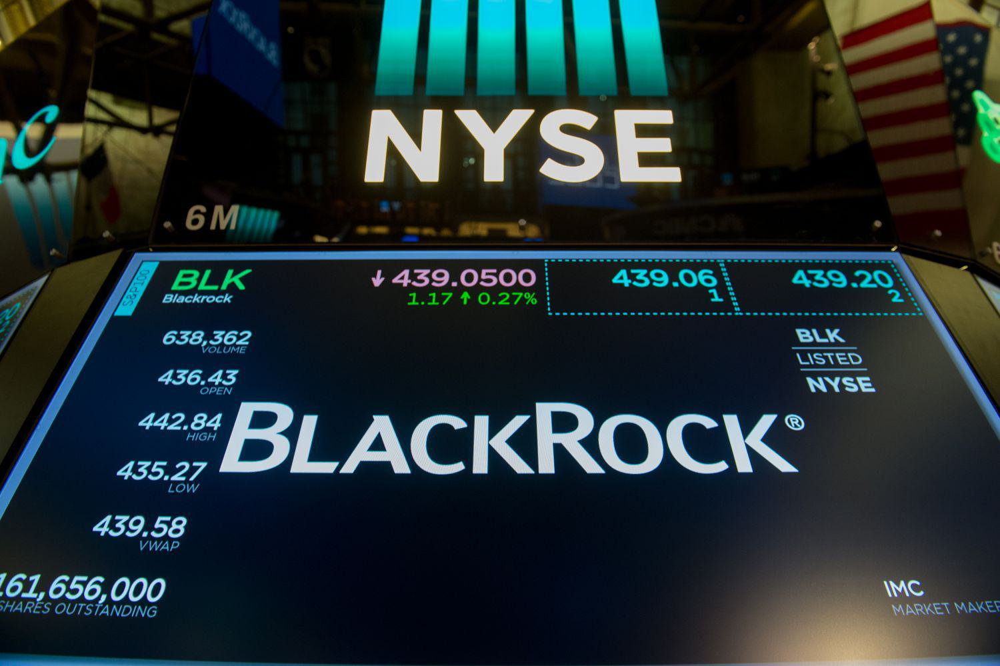

The United States investment landscape is characterized by a dynamic mix of traditional and modern financial strategies, prominently featuring mutual funds and algorithmic trading. Mutual funds, which pool resources from multiple investors to purchase a diversified portfolio of stocks, bonds, or other securities, have long been a staple in the American investment sector. They provide individual investors access to professionally managed portfolios and the ability to diversify their investments with ease. On the other hand, algorithmic trading represents a technological leap in finance, utilizing complex algorithms to execute trades at high speeds and volumes, capitalizing on market efficiencies and patterns that are beyond human capabilities.

Investment companies have evolved substantially since their inception in the early 20th century. The formation of these entities marked a shift towards structured investment vehicles, allowing broader public participation in financial markets. The enactment of the Investment Company Act of 1940 further regulated these entities, ensuring stability and transparency in investment practices.

In contemporary finance, mutual funds and algorithmic trading have become crucial components. Mutual funds have democratized access to diversified portfolios, enabling investors with limited capital to participate in markets that were once the preserve of wealthier individuals. With an array of mutual funds available—ranging from index funds, which track specific market indices, to actively managed funds that aim to outperform the market—investors have myriad options to tailor their investments to personal risk preferences and financial goals.

Algorithmic trading, meanwhile, has transformed trading floors worldwide by introducing precision and speed in executing orders. It reduces human error, enhances liquidity, and facilitates the swift execution of large volume trades with minimal market impact. This technological advancement has created opportunities for more sophisticated trading strategies, such as statistical arbitrage and market-making, thus reshaping the investment landscape.

This article will explore key areas within this modern investment milieu, including the fundamentals and impact of mutual funds, an analysis of leading investment companies like BlackRock, Vanguard, and Charles Schwab, and the transformative role of algorithmic trading strategies. Through examining these aspects, we will gain insights into how traditional and contemporary investment methodologies coexist and complement each other in the burgeoning financial markets.

## Table of Contents

## The Power of Mutual Funds in the US Market

Mutual funds are investment vehicles that pool money from various investors to purchase a diversified portfolio of stocks, bonds, or other securities. Managed by professional portfolio managers, mutual funds offer investors the opportunity to access a diverse range of investments without requiring extensive knowledge of the individual securities. The fundamental principle behind mutual funds is diversification, which reduces risk by spreading investments across various assets. This is based on the concept that while individual asset prices might fluctuate, diversified investments are more likely to yield stable returns over time.

In the United States, mutual funds have grown exponentially since their inception. The Investment Company Institute reported that as of 2022, the total net assets of US mutual funds stood at approximately $28.2 trillion, reflecting their significant impact on the economy [1]. This growth emphasizes the critical role mutual funds play in offering individual and institutional investors simplified access to diversified investment strategies.

Among the prominent players in the mutual fund industry are BlackRock, Vanguard, and Charles Schwab. BlackRock, the world's largest asset manager, is renowned for its broad array of mutual funds and its commitment to risk management and technological innovation [2]. Vanguard, well-known for its pioneering role in low-cost index funds, has consistently attracted investors prioritizing cost-efficiency and long-term growth [3]. Charles Schwab offers a competitive range of mutual funds with a focus on investor education and accessible trading platforms [4].

Investing in mutual funds offers numerous benefits. One of the primary advantages is professional management, where skilled portfolio managers make informed investment decisions on behalf of investors. Additionally, mutual funds provide [liquidity](/wiki/liquidity-risk-premium), as investors can buy or sell fund shares on any business day at the net asset value. Furthermore, mutual funds offer economies of scale, which can lead to lower trading costs than individual investing. The diversification inherent in mutual funds also minimizes the impact of an adverse event in a single security on the overall portfolio performance.

By providing a straightforward means of achieving diversified investment, mutual funds are powerful tools for investors seeking a balance between risk and return across various financial conditions.

[1] Investment Company Institute. "2022 Investment Company Fact Book." https://www.ici.org/research/stats/2022_factbook.

[2] BlackRock. "About BlackRock." https://www.blackrock.com/us/individual/about-us.

[3] Vanguard. "Why Choose Vanguard." https://investor.vanguard.com/corporate-portal.

[4] Charles Schwab. "Schwab Money Funds." https://www.schwab.com/mutual-funds.

## Top Mutual Fund Companies

BlackRock, Vanguard, and Charles Schwab are among the leading mutual fund companies in the United States, known for their significant assets under management (AUM) and diverse range of services offered to investors. These companies have cemented their roles as key players in the mutual fund industry through their strategic management of funds, innovative financial products, and commitment to investor satisfaction.

### BlackRock

BlackRock, founded in 1988, is the world's largest asset manager, boasting an AUM of approximately $9.4 trillion as of 2022. The company offers a broad spectrum of financial products, including mutual funds, exchange-traded funds (ETFs), and alternative investments. BlackRock is renowned for its iShares [ETF](/wiki/etf-trading-strategies) line, which provides investors with cost-effective exposure to a diverse range of markets and asset classes.

BlackRock's popularity stems from its emphasis on technology and data-driven insights. The company's Aladdin platform offers sophisticated risk management and portfolio analysis tools, attracting institutional and retail investors alike. Its commitment to [ESG](/wiki/esg-investing) (Environmental, Social, and Governance) criteria further sets BlackRock apart, as it continues to develop sustainable investment strategies.

### Vanguard

Vanguard, founded by John C. Bogle in 1975, manages approximately $7.6 trillion in assets. Known for pioneering the index fund, Vanguard offers a variety of investment products, including mutual funds and ETFs, with a focus on low-cost, long-term investment strategies. Vanguard's investment philosophy centers on minimizing fees and maximizing investor returns through passive management.

The company's popularity can largely be attributed to its client-ownership structure, which aligns the interests of the company with those of its investors, as well as its competitive expense ratios. Vanguard's commitment to investor education and its comprehensive suite of online tools and resources further enhance its reputation as a trusted investment partner.

### Charles Schwab

Charles Schwab, with an AUM of approximately $7.07 trillion as of 2022, is a major player in the financial services industry, offering a diverse range of investment products, including mutual funds, ETFs, and brokerage services. The company's approach integrates advanced technology with personalized client service, making it a popular choice for both novice and experienced investors.

Charles Schwab's appeal lies in its commitment to low-cost investing and transparency. The firm's extensive range of proprietary and third-party funds, combined with a robust online platform and investor assistance, ensures its standing as a leader in the mutual fund space. Schwab's recent initiatives to eliminate commissions on online equity and ETF trades have further solidified its competitive stance in the market.

### Comparative Analysis

In terms of performance, these companies have consistently delivered strong returns relative to their benchmarks, although their strategies might vary. BlackRock's focus on active management and technology-driven insights, Vanguard's dedication to low-cost passive investing, and Charles Schwab's comprehensive service offering and low fee structure highlight different approaches to achieving investment success.

#### Insights

The leadership of BlackRock, Vanguard, and Charles Schwab in the mutual fund industry can be attributed to their innovative service offerings, strategic investment philosophies, and strong commitment to investor satisfaction. Their substantial assets under management, diverse investment product offerings, and technological integration are key factors reinforcing their market dominance. They have each developed unique strategies to differentiate themselves, fostering competitive advantages that make them appealing to a broad range of investors. As they continue to adapt to changing market dynamics and investor demands, they are well-positioned to maintain their leadership in the mutual fund space.

## Algorithmic Trading: Revolutionizing the Investment World

Algorithmic trading, often referred to as algo trading, involves the use of computer algorithms to automate the buying and selling of financial instruments in the market. These algorithms are pre-programmed with specific criteria and rules, allowing them to execute trades at speeds and frequencies that surpass human capabilities. The concept is grounded in the application of quantitative measures and mathematical models to make trading decisions without direct human intervention.

The primary advantage of using algorithms is the enhancement of trading efficiency. They can process large volumes of data to detect patterns and trends much faster than a human trader. This speed allows for quick execution of orders, which can be crucial in capturing significant market movements. Additionally, algorithms reduce human error by eliminating emotional biases from trading decisions. They strictly follow predefined rules and criteria, ensuring a consistent approach to trading.

Successful [algorithmic trading](/wiki/algorithmic-trading) strategies vary widely depending on the market conditions they are designed to exploit. For instance, statistical [arbitrage](/wiki/arbitrage) involves finding discrepancies in the price movements of related financial instruments. By simultaneously buying and selling these instruments, the strategy aims to profit from price differences while minimizing risk. One popular [statistical arbitrage](/wiki/statistical-arbitrage) method uses pairs trading, where algorithms identify overvalued and undervalued pairs of stocks and execute trades when they deviate from their historical price relationship.

Another common strategy is high-frequency trading ([HFT](/wiki/high-frequency-trading-strategies)), which uses algorithms to capitalize on small price discrepancies over a short time frame. HFT firms deploy sophisticated technology to execute a large number of orders at incredibly high speeds. Their primary aim is to profit from the bid-ask spread or to capture arbitrage opportunities that may only exist for milliseconds.

While algorithmic trading offers numerous advantages, it does come with limitations. Market conditions can change rapidly, rendering some algorithms less effective. Over-reliance on historical data can also lead to inaccurate predictions, particularly in unforeseen market conditions. Furthermore, the complexity of some algorithms makes them susceptible to technical failures, potentially leading to substantial financial losses.

In conclusion, algorithmic trading has transformed the investment landscape by increasing efficiency and reducing human error. It provides a framework for developing highly sophisticated trading strategies capable of operating at speeds unattainable by human traders. Yet, the limitations and potential risks highlight the need for ongoing adjustments and monitoring to ensure these systems adapt to evolving market dynamics effectively.

## Top Algo Trading Firms in the US

Renaissance Technologies, Two Sigma, and Citadel are among the most prominent algorithmic trading firms in the United States, each known for their advanced use of technology, innovative strategies, and significant market influence. Here's a closer look at what distinguishes these firms.

### Renaissance Technologies

Founded by mathematician James Simons in 1982, Renaissance Technologies is renowned for its quantitative research and systematic trading. The firm is particularly famous for its Medallion Fund, which has achieved exceptional returns for its investors over the decades. At the core of Renaissance's success is its highly sophisticated algorithms, developed by a team of mathematicians, physicists, and statisticians who apply complex mathematical models to predict market movements.

**Case Study: Medallion Fund**  
The Medallion Fund's performance is attributed to its intricate pattern recognition systems and anomaly detection in financial data, leveraging both historical data and real-time information. This approach minimizes human intervention, allowing for optimized trading decisions.

### Two Sigma

Two Sigma, established in 2001 by David Siegel and John Overdeck, is another powerhouse in algorithmic trading. The firm is recognized for its significant investment in [machine learning](/wiki/machine-learning), [artificial intelligence](/wiki/ai-artificial-intelligence), and big data analytics. Two Sigma's trading strategies integrate diverse sets of data—including news and social media content—into its predictive models to inform trading decisions.

**Technology and Strategy**  
Two Sigma sets itself apart through its relentless focus on technology and data science, employing extensive [backtesting](/wiki/backtesting) and forward-testing of models to refine its strategies continually. The company's proprietary platforms accommodate various types of data, enhancing its capability to adapt to rapid market changes.

### Citadel

Founded by Kenneth Griffin in 1990, Citadel is a global financial institution that emphasizes innovation and technology to maintain its competitive edge. Its Citadel Securities division is a leading market maker and employs algorithmic trading strategies to provide liquidity across multiple asset classes, including equities, fixed income, and commodities.

**Innovation and Market Presence**  
Citadel's strength lies in its cutting-edge technology and infrastructure, which provide high-frequency trading capabilities. The firm's advanced risk management systems and data analytics platforms facilitate swift execution and efficient capital allocation.

### Future Outlook for Algorithmic Trading Firms

The trajectory of algorithmic trading firms is expected to accelerate further with advancements in artificial intelligence and quantum computing. These technologies promise to enhance the precision and speed of trading algorithms, potentially leading to more sophisticated market strategies.

As data continues to expand exponentially, firms like Renaissance Technologies, Two Sigma, and Citadel are likely to gain further insights into market trends, thereby improving their trading efficiency. However, regulatory challenges and the need for transparency are anticipated to grow, necessitating a balance between innovation and compliance.

In conclusion, the distinctive amalgamation of technology, innovation, and strategic foresight positions these firms at the forefront of the financial markets, driving the evolution of trading paradigms in the ever-expanding landscape of algorithmic trading.

## Choosing Between Mutual Funds and Algorithmic Trading

When evaluating the choice between mutual fund investments and algorithmic trading, several key factors should be taken into account, including risk assessment, investment objectives, and portfolio diversification strategies.

Risk assessment is a fundamental consideration for any investor. Mutual funds provide a diversified exposure to a variety of assets, thereby mitigating specific risks associated with individual securities. This diversification is achieved by pooling resources from multiple investors to purchase a wide array of stocks, bonds, or other securities. The inherent structure of mutual funds tends to reduce unsystematic risk – risks that are specific to a single asset or company. However, they are still subject to systematic risks that impact the entire market. Investors in mutual funds benefit from professional management, which can help cushion against market [volatility](/wiki/volatility-trading-strategies), but they also face management and administrative fees that can affect overall returns.

On the other hand, algorithmic trading introduces a different set of risks. Algorithms are designed to execute trades based on pre-defined criteria and can take advantage of market inefficiencies through speed and precision that is unattainable by human traders. This method can significantly reduce human biases and errors in trading decisions. However, algorithmic trading systems are susceptible to technological failures, such as software glitches or network outages, which could result in significant financial losses. Additionally, the market impact of large-scale automated trading operations can be unpredictable in rapidly changing market conditions.

Investment goals are another critical [factor](/wiki/factor-investing) that influences the choice between these two options. Mutual funds are generally suited for investors seeking long-term capital appreciation and those who prefer a hands-off approach to investing, relying on fund managers for decision-making. These investments are typically aligned with retirement goals, educational savings, and other long-term financial plans.

Conversely, algorithmic trading may appeal to those seeking short-term profit opportunities and are comfortable with a more active, hands-on approach to managing investments. It can be particularly advantageous for sophisticated investors who have a deep understanding of financial markets and access to the required technological resources and expertise.

Expert opinions often suggest that a diversified investment portfolio should incorporate both traditional and modern investment strategies. By investing in mutual funds, individuals can achieve broad market exposure with relative ease and stability. Simultaneously, allocating a portion of the portfolio to algorithmic trading can provide additional growth opportunities and capture short-term market inefficiencies.

To effectively balance these options, investors are encouraged to evaluate their risk tolerance, financial goals, and investment horizon. Regular reassessment of these factors can help ensure that their individual objectives are being met and that potential market opportunities are not overlooked. According to experts, the integration of mutual funds and algorithmic trading within a portfolio is not a question of one versus the other, but rather about realizing the benefits offered by both to align with personal financial aspirations.

## Conclusion

In this article, we explored the pivotal roles that mutual funds and algorithmic trading have within the US investment landscape. Mutual funds offer diversified investment opportunities, making them accessible and appealing to many investors due to their relatively lower risk and ease of management. The impressive growth and dominance of firms like BlackRock, Vanguard, and Charles Schwab illustrate the significance and trust these institutions have garnered in financial markets.

Algorithmic trading, a product of technological advancement, has significantly transformed the trading sector by enhancing efficiency and minimizing human error. The capabilities of leading firms like Renaissance Technologies, Two Sigma, and Citadel demonstrate how algorithms can execute complex strategies swiftly and accurately. Despite some limitations, such as the susceptibility to overfitting and market anomalies, algorithmic trading continues to shape modern financial markets.

Technology is playing an increasingly vital role in shaping investment strategies, with machine learning and big data driving the evolution of these methodologies. This synergy between traditional investment approaches and cutting-edge technology provides investors with a wide array of tools and strategies, widening possibilities for portfolio diversification and risk management.

In conclusion, as advancements in technology continue to surface, investors are encouraged to evaluate and adapt their strategies. Embracing both traditional methods and new technological solutions can lead to more resilient and rewarding investment portfolios. Continuously assessing and integrating these opportunities can pave the way for achieving individual financial goals in a dynamic market environment.

## References & Further Reading

[1]: Bergstra, J., Bardenet, R., Bengio, Y., & Kégl, B. (2011). ["Algorithms for Hyper-Parameter Optimization."](https://dl.acm.org/doi/10.5555/2986459.2986743) Advances in Neural Information Processing Systems 24.

[2]: ["Advances in Financial Machine Learning"](https://www.amazon.com/Advances-Financial-Machine-Learning-Marcos/dp/1119482089) by Marcos Lopez de Prado

[3]: ["Evidence-Based Technical Analysis: Applying the Scientific Method and Statistical Inference to Trading Signals"](https://www.amazon.com/Evidence-Based-Technical-Analysis-Scientific-Statistical/dp/0470008741) by David Aronson

[4]: ["Machine Learning for Algorithmic Trading"](https://github.com/stefan-jansen/machine-learning-for-trading) by Stefan Jansen

[5]: ["Quantitative Trading: How to Build Your Own Algorithmic Trading Business"](https://www.amazon.com/Quantitative-Trading-Build-Algorithmic-Business/dp/1119800064) by Ernest P. Chan

[6]: Investment Company Institute. ["2022 Investment Company Fact Book."](https://icifactbook.org/2022/)

[7]: BlackRock. ["About BlackRock."](https://en.wikipedia.org/wiki/BlackRock)

[8]: Vanguard. ["Why Choose Vanguard."](https://investor.vanguard.com/about-us)

[9]: Charles Schwab. ["Schwab Money Funds."](https://www.schwab.com/money-market-funds)