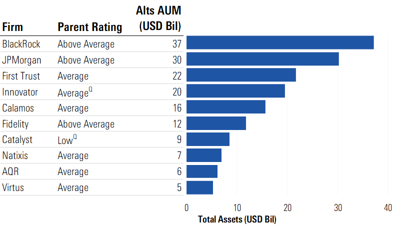

## Table of Contents

## What is a mutual fund?

A mutual fund is a type of investment where many people put their money together to buy a mix of stocks, bonds, or other assets. It's like a big basket where everyone's money goes in, and a professional manager decides what to buy and sell. This makes it easier for people who don't have a lot of money or time to invest on their own.

When you invest in a mutual fund, you own a small part of the entire basket, not just one stock or bond. This can help spread out the risk because if one investment does poorly, the others might do well and balance it out. Mutual funds are popular because they offer a simple way to diversify your investments and can be a good choice for people saving for goals like retirement or buying a house.

## How do mutual funds work?

Mutual funds work by pooling money from lots of people to invest in a mix of stocks, bonds, or other investments. When you buy into a mutual fund, you're buying a piece of this big pool. A professional manager looks after the pool, deciding what to buy and sell to try and make the fund grow. This manager aims to meet the fund's goals, which could be anything from growing your money fast to keeping it safe.

The value of your piece of the mutual fund goes up or down based on how well the investments inside it do. If the stocks or bonds the fund owns go up in value, your part of the fund goes up too. If they go down, so does your part. You can usually buy or sell your piece of the fund at the end of each trading day, based on its net asset value, which is the total value of all the investments inside the fund divided by the number of pieces, or shares, out there.

## What are the benefits of investing in mutual funds?

One big benefit of investing in mutual funds is that they help spread out your risk. When you put your money into a mutual fund, it gets split among many different investments like stocks and bonds. This means if one investment does badly, it's not the end of the world because the others might do well and make up for it. It's like not putting all your eggs in one basket. This can make investing less scary, especially if you're new to it or don't have a lot of money to start with.

Another advantage is that mutual funds are run by professionals. This means you don't have to spend a lot of time figuring out which stocks or bonds to buy. The fund manager does all the hard work for you, using their knowledge and experience to try and make the fund grow. This can be a big help if you're busy or just don't feel confident [picking](/wiki/asset-class-picking) investments on your own. Plus, mutual funds often let you start investing with a small amount of money, making it easier to get started on your savings goals.

## What are the different types of mutual funds available in the U.S.?

In the U.S., there are several types of mutual funds, each designed for different kinds of investors and goals. One common type is equity funds, which mostly invest in stocks. These can focus on big companies, small companies, or even companies in certain parts of the world. Another type is bond funds, which mainly buy bonds. These can be safer than stock funds but usually grow more slowly. Then there are money market funds, which invest in very safe, short-term things like government bonds and are meant to be very stable.

Another kind of mutual fund is the balanced fund, which mixes stocks and bonds to try and balance growth with safety. There are also index funds, which try to match the performance of a big group of stocks, like the S&P 500, instead of trying to beat it. Sector funds focus on one part of the economy, like technology or healthcare. Finally, target-date funds change their mix of investments as you get closer to a certain date, like when you plan to retire, to help keep your money safer as that time gets nearer.

All these types of mutual funds help people invest in different ways based on what they want to achieve and how much risk they're willing to take. Whether you're saving for a big goal like buying a house or just want to grow your money over time, there's likely a mutual fund that can fit your needs.

## How can one start investing in mutual funds?

To start investing in mutual funds, you first need to decide on your goals and how much risk you're okay with. Are you saving for a big goal like buying a house or for your retirement? Once you know this, you can pick the right type of mutual fund, like one that focuses on stocks for growth or bonds for safety. Next, you'll need to open an account with a company that sells mutual funds, like a bank, a brokerage firm, or directly with a mutual fund company. Many of these places let you start with just a little bit of money, so you don't need a lot to get going.

After you've picked your mutual fund and opened your account, you'll need to decide how much money to put in. You can usually start with a small amount and add more later. Some people like to set up automatic payments to invest a little bit every month. Once your money is in the fund, the professional manager will take care of buying and selling the investments. You can check on how your fund is doing anytime you want, and if you need to, you can sell your part of the fund and get your money back, usually at the end of the trading day.

## What are the largest mutual fund companies in the United States?

The biggest mutual fund company in the U.S. is Vanguard. They have lots of different funds that people can choose from, and they're known for keeping their fees low, which means you get to keep more of your money. Another big one is Fidelity Investments. They have been around for a long time and offer all sorts of funds, plus they have tools to help you pick the right one for you. BlackRock is also huge, and they're famous for their iShares, which are a type of fund that follows big groups of stocks or bonds.

Then there's T. Rowe Price, which is known for its focus on helping people save for retirement. They have funds that can help your money grow over time. American Funds, part of Capital Group, is another big name. They're known for their wide range of funds that cover different parts of the market. These companies all have a lot of different funds to choose from, so no matter what you're saving for, you can probably find something that fits your needs.

## What are the assets under management (AUM) for these top mutual fund companies?

Vanguard is the biggest mutual fund company in the U.S., with around $7.2 trillion in assets under management (AUM). They're known for their low fees, which means you get to keep more of your money. Vanguard has lots of different funds to choose from, so whether you're saving for retirement or something else, they likely have a fund that fits your needs.

Fidelity Investments is another giant, with about $3.8 trillion in AUM. They've been around for a long time and offer all sorts of funds. Fidelity also has tools to help you pick the right fund for you, making it easier to start investing. BlackRock comes in with around $9.1 trillion in AUM, and they're famous for their iShares, which are a type of fund that follows big groups of stocks or bonds.

T. Rowe Price manages about $1.4 trillion in AUM and is known for helping people save for retirement. They have funds that can help your money grow over time. American Funds, part of Capital Group, has around $2.2 trillion in AUM. They offer a wide range of funds that cover different parts of the market, so you can find something that fits your savings goals.

## How do the investment strategies of these top companies differ?

Vanguard focuses a lot on keeping fees low and making investing easy for everyone. They have a big range of funds, but they're especially known for their index funds, which try to match the performance of big groups of stocks like the S&P 500. This means they're not trying to beat the market, just keep up with it, which can be a safer way to grow your money over time. Vanguard also has target-date funds, which change their mix of investments as you get closer to a certain date, like retirement, to keep your money safer as that time gets nearer.

Fidelity Investments offers a lot of different funds and tools to help you pick the right one for you. They have funds that focus on growing your money fast, as well as ones that are more about keeping your money safe. Fidelity is known for its active management, where fund managers try to beat the market by picking the best stocks and bonds. This can be riskier but might also give you bigger rewards if they get it right. They also have a lot of resources to help you learn about investing, which can be a big help if you're new to it.

BlackRock is famous for its iShares, which are a type of fund called ETFs (exchange-traded funds) that you can buy and sell like stocks. They're big on using technology to manage their funds, and they have a lot of different ETFs that follow big groups of stocks or bonds. BlackRock also offers actively managed funds, where managers try to pick the best investments to beat the market. T. Rowe Price focuses a lot on helping people save for retirement, with funds that try to grow your money over time. American Funds, part of Capital Group, offers a wide range of funds that cover different parts of the market, so you can find something that fits your savings goals. They're known for their long-term approach and trying to beat the market through active management.

## What are the performance metrics used to evaluate these mutual fund companies?

When people want to see how well mutual fund companies are doing, they look at a few important numbers. One big one is the return, which shows how much money the fund has made or lost over time. People usually look at the return over different periods, like one year, three years, or even ten years, to get a good idea of how the fund has done. Another important number is the expense ratio, which tells you how much of your money goes to paying the fund's costs. A lower expense ratio means you get to keep more of your money. Risk is also a big thing to check. This is usually measured by something called standard deviation, which shows how much the fund's returns can go up and down. A higher standard deviation means the fund is riskier.

Another metric is the fund's alpha, which shows if the fund manager is doing a better job than just following the market. A positive alpha means the manager is beating the market, while a negative alpha means they're not doing as well. The beta tells you how the fund moves compared to the market. A beta of more than one means the fund goes up and down more than the market, which can be riskier but might also mean bigger rewards. Lastly, the Sharpe ratio looks at how much return you're getting for the risk you're taking. A higher Sharpe ratio means the fund is doing a good job of balancing risk and reward. All these numbers help people decide which mutual fund might be the best fit for them.

## How have these top mutual fund companies performed over the last decade?

Over the last ten years, Vanguard has done really well, especially with its low-cost index funds. These funds have kept up with the market, which has been growing. Because Vanguard keeps its fees low, people who invest in their funds get to keep more of their money. Their target-date funds have also been popular, helping people save for retirement by slowly changing the mix of investments as the target date gets closer. Overall, Vanguard has been a solid choice for people looking for steady growth without taking too much risk.

Fidelity Investments has also had a good run over the last decade. Their actively managed funds, where managers try to pick the best stocks and bonds, have had some big wins. This means they've beaten the market sometimes, but it's also riskier. Fidelity's tools and resources have helped a lot of people learn about investing and pick the right funds for them. BlackRock's iShares have been popular too, especially because you can buy and sell them like stocks. Their use of technology has helped them manage their funds well, and they've offered good returns for people who want to invest in big groups of stocks or bonds.

T. Rowe Price has focused on helping people save for retirement, and their funds have grown well over the last ten years. They've done a good job of balancing growth with safety, which is important for people saving for the long term. American Funds, part of Capital Group, has also done well. They've taken a long-term approach and tried to beat the market through active management. Their wide range of funds has helped a lot of people find something that fits their savings goals. Overall, these top mutual fund companies have offered good choices for people looking to grow their money over the last decade.

## What are the fee structures associated with the mutual funds offered by these companies?

Vanguard is known for keeping fees low, which is great for people who want to keep more of their money. Their index funds, which try to match the market, usually have very low expense ratios, often less than 0.10%. This means for every $1,000 you invest, you might only pay $1 a year in fees. Vanguard's actively managed funds, where a manager tries to beat the market, have higher fees, but they're still pretty low compared to other companies, usually around 0.30% to 0.50%.

Fidelity Investments has a range of fees depending on the type of fund. Their index funds have low expense ratios, similar to Vanguard, often around 0.015% to 0.15%. But their actively managed funds can have higher fees, sometimes up to 1% or more. Fidelity also offers some funds with no fees at all, like their Zero funds, which can be a good choice if you're just starting out. BlackRock's iShares, which are ETFs, also have low fees, usually between 0.03% and 0.40%, making them a good option for people who want to invest in big groups of stocks or bonds without paying a lot in fees.

T. Rowe Price's fees are a bit higher, with expense ratios for their funds often ranging from 0.50% to 0.90%. This is because they focus on actively managed funds, which cost more to run. American Funds, part of Capital Group, also has higher fees, usually between 0.50% and 1.00%, because they try to beat the market through active management. Both companies offer a lot of different funds, so the fees can vary, but they're generally higher than what you'd find with Vanguard or Fidelity's index funds.

## What future trends are expected to impact the largest mutual fund companies in the U.S.?

One big trend that's expected to impact the largest mutual fund companies in the U.S. is the growing popularity of [ESG](/wiki/esg-investing) investing. ESG stands for Environmental, Social, and Governance, and it means people want to invest in companies that are good for the planet, treat their workers well, and are run fairly. More and more people are looking for funds that match these values, so companies like Vanguard, Fidelity, BlackRock, T. Rowe Price, and American Funds are starting to offer more ESG funds. This could change how they pick their investments and might attract new investors who care about these issues.

Another trend is the rise of technology and robo-advisors. These are computer programs that help people invest without talking to a human advisor. They use algorithms to pick funds that fit your goals and how much risk you're okay with. Big companies like Vanguard and Fidelity are already using robo-advisors to help their customers. This could mean lower costs for investors and make it easier for people to start investing. It might also push these companies to keep their fees low and offer more digital tools to stay competitive.

## References & Further Reading

[1]: Bergstra, J., Bardenet, R., Bengio, Y., & Kégl, B. (2011). ["Algorithms for Hyper-Parameter Optimization."](https://dl.acm.org/doi/10.5555/2986459.2986743) Advances in Neural Information Processing Systems 24.

[2]: ["Advances in Financial Machine Learning"](https://www.amazon.com/Advances-Financial-Machine-Learning-Marcos/dp/1119482089) by Marcos Lopez de Prado

[3]: ["Evidence-Based Technical Analysis: Applying the Scientific Method and Statistical Inference to Trading Signals"](https://www.amazon.com/Evidence-Based-Technical-Analysis-Scientific-Statistical/dp/0470008741) by David Aronson

[4]: ["Machine Learning for Algorithmic Trading"](https://github.com/stefan-jansen/machine-learning-for-trading) by Stefan Jansen

[5]: ["Quantitative Trading: How to Build Your Own Algorithmic Trading Business"](https://www.amazon.com/Quantitative-Trading-Build-Algorithmic-Business/dp/1119800064) by Ernest P. Chan

[6]: Investment Company Institute. ["2022 Investment Company Fact Book."](https://icifactbook.org/2022/)

[7]: BlackRock. ["About BlackRock."](https://en.wikipedia.org/wiki/BlackRock)

[8]: Vanguard. ["Why Choose Vanguard."](https://investor.vanguard.com/about-us)

[9]: Charles Schwab. ["Schwab Money Funds."](https://www.schwab.com/money-market-funds)