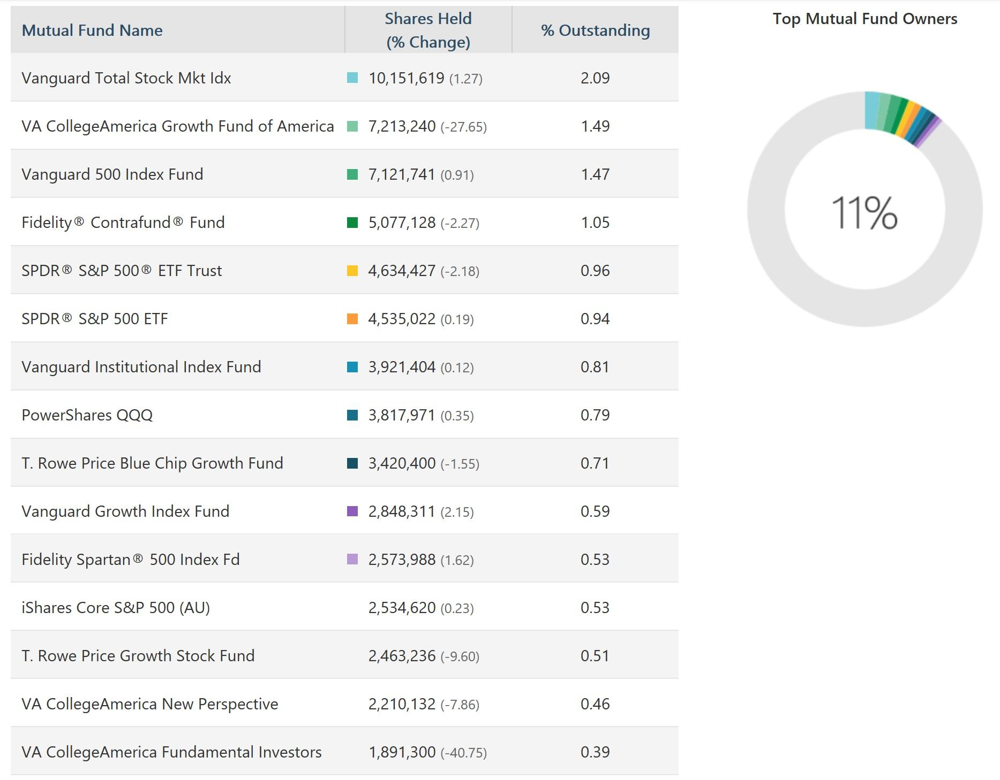

## Table of Contents

## What is a mutual fund?

A mutual fund is a type of investment where many people pool their money together to buy a variety of stocks, bonds, or other assets. This is managed by a professional who makes decisions on what to buy and sell. It's like a big basket where everyone's money goes in, and the professional decides how to fill the basket to hopefully make it grow.

When you invest in a mutual fund, you own a small part of that big basket. This is good because it helps spread out the risk. Instead of putting all your money into one company, you're investing in many different things. This can make it safer, but it's still important to understand that all investments can go up or down in value.

## How do mutual funds invest in companies like Amazon?

When a mutual fund wants to invest in a company like Amazon, it uses the money that people have put into the fund to buy Amazon's stock. The fund manager, who is like a captain of the fund, decides how much of the fund's money should go into Amazon's stock. If the manager thinks Amazon is a good investment, they might buy a lot of its stock. If they think it's not the best choice right now, they might buy less or none at all.

Once the mutual fund buys Amazon's stock, it becomes part of the big basket of investments that the fund owns. If Amazon does well and its stock price goes up, the value of the mutual fund goes up too. This means the people who invested in the mutual fund could make more money. But if Amazon's stock price goes down, the value of the mutual fund could go down as well. So, the fund manager always keeps an eye on Amazon and other companies to make the best choices for the fund.

## What are the benefits of investing in mutual funds that own Amazon stock?

Investing in mutual funds that own Amazon stock can be a good idea because it lets you own a piece of Amazon without having to buy its stock directly. This is helpful because Amazon's stock can be expensive, and buying a mutual fund that includes Amazon can be cheaper. Also, when you invest in a mutual fund, you're not just investing in Amazon; you're investing in a lot of different companies. This can make your investment safer because if Amazon doesn't do well, other companies in the fund might do better and help balance things out.

Another benefit is that you get a professional to manage your investment. The fund manager knows a lot about the stock market and can make smart choices about when to buy or sell Amazon's stock. This can save you time and effort because you don't have to keep track of Amazon's stock yourself. Plus, the fund manager is always watching the market and can make changes to the fund to try to make it grow. So, even if you don't know a lot about investing, you can still benefit from owning a piece of Amazon through a mutual fund.

## Who are the largest mutual fund owners of Amazon?

The Vanguard Group is one of the largest mutual fund owners of Amazon stock. They have a lot of different mutual funds, and many of these funds own Amazon stock. Vanguard is known for managing a big part of people's retirement savings, so a lot of people who invest in Vanguard funds end up owning a piece of Amazon without even knowing it.

Another big mutual fund owner of Amazon is BlackRock. They also have many different funds that include Amazon in their mix of investments. BlackRock is famous for being one of the biggest investment companies in the world, and they help a lot of people and big organizations invest their money. So, if you invest in a BlackRock fund, you might be owning a bit of Amazon too.

Fidelity Investments is also a major player when it comes to owning Amazon stock through their mutual funds. They offer a variety of funds, and many of them have Amazon as part of their portfolio. Fidelity is popular because they have a lot of different options for people who want to invest, from those just starting out to experienced investors. So, if you're investing with Fidelity, you could be part of the group that owns Amazon stock.

## What percentage of Amazon's stock do these mutual funds own?

The Vanguard Group, BlackRock, and Fidelity Investments are big owners of Amazon's stock through their mutual funds. Vanguard owns about 7% of Amazon's total stock. This is a big chunk and means that a lot of people who invest in Vanguard's funds own a piece of Amazon. BlackRock owns around 6% of Amazon's stock. That's also a big part and shows how much BlackRock trusts Amazon as a good investment for their funds. Fidelity Investments owns about 1% of Amazon's stock. While this is smaller than Vanguard and BlackRock, it's still a significant amount and means that Fidelity's funds have a good bit of Amazon in them.

These percentages can change because the mutual funds are always buying and selling stocks. But right now, these three companies together own a big part of Amazon, around 14% in total. This shows how important Amazon is to a lot of people's investments. When you invest in these mutual funds, you're not just betting on Amazon but also on a lot of other companies. This can help make your investment safer because if Amazon doesn't do well, the other companies might help balance things out.

## How has the ownership of Amazon stock by mutual funds changed over the past five years?

Over the past five years, the ownership of Amazon stock by mutual funds has grown a lot. This is because more and more people want to invest in Amazon, and mutual funds are a good way to do that. The Vanguard Group, for example, has increased its ownership of Amazon stock from about 5% five years ago to around 7% now. This shows that Vanguard thinks Amazon is a good investment and wants to have more of it in their funds. BlackRock has also grown its stake in Amazon, going from about 5% to around 6% over the same period. This means that more people who invest in BlackRock's funds are now owning a piece of Amazon.

Fidelity Investments has seen a smaller increase in its ownership of Amazon stock, going from about 0.8% to around 1% over the last five years. Even though this increase is smaller, it still shows that Fidelity thinks Amazon is a good company to invest in. Overall, these mutual funds have been buying more Amazon stock because they believe it will help their funds grow. This trend shows how important Amazon has become to investors and how mutual funds are a popular way for people to own a part of this big company.

## What is the impact of mutual fund ownership on Amazon's stock price?

When mutual funds own a lot of Amazon's stock, it can affect the stock price in a big way. If mutual funds like Vanguard, BlackRock, and Fidelity decide to buy more Amazon stock, it can push the stock price up. This is because when a lot of people want to buy something, the price goes up. So, if these big mutual funds are buying more Amazon stock, it shows that they think Amazon is a good investment, and this can make other people want to buy it too, which can make the stock price go even higher.

On the other hand, if mutual funds start selling their Amazon stock, it can make the stock price go down. When a lot of people want to sell something, the price goes down. So, if these big mutual funds decide that Amazon is not a good investment anymore and start selling their stock, it can make other people worried and want to sell too. This can lead to a lot of selling and make the stock price drop. But, mutual funds usually think carefully before they buy or sell a lot of stock, so their actions can show what they think about Amazon's future.

## How do the investment strategies of these mutual funds differ in relation to Amazon?

The Vanguard Group tends to focus on long-term growth and stability when it comes to investing in Amazon. They believe in holding onto stocks for a long time, which means they might not buy or sell Amazon's stock very often. Vanguard's strategy is to keep a big part of Amazon in their funds because they think Amazon will keep growing and be a good investment for many years. This means that people who invest in Vanguard's funds can expect to own a piece of Amazon for a long time.

BlackRock, on the other hand, might be a bit more active with their investment in Amazon. They might buy or sell Amazon's stock more often, depending on what they think is best for their funds at the time. BlackRock's strategy can be more about trying to make money in the short term as well as the long term. This means that if they think Amazon's stock price might go up soon, they might buy more of it, but if they think it might go down, they might sell some of it. So, people who invest in BlackRock's funds might see more changes in how much Amazon stock they own.

Fidelity Investments has a different approach. They might focus more on balancing risk and reward when it comes to Amazon. Fidelity might not own as much Amazon stock as Vanguard or BlackRock, but they still think it's a good investment. They might buy or sell Amazon's stock based on how they think it will affect the overall balance of their funds. This means that Fidelity's strategy is about trying to make sure their funds are not too risky but still have a chance to grow. People who invest in Fidelity's funds might see a more balanced approach to owning Amazon stock.

## What are the performance metrics of these mutual funds in comparison to the broader market?

When we look at how well the mutual funds from Vanguard, BlackRock, and Fidelity have done with Amazon stock compared to the broader market, we see that they've generally done well. The S&P 500 is a good way to measure the broader market, and over the past few years, it has grown a lot. But the mutual funds that own Amazon have often done even better. This is because Amazon has been a really strong company, and its stock price has gone up a lot. So, funds like Vanguard's and BlackRock's, which have a big part of Amazon in them, have seen their value grow more than the S&P 500.

However, it's not always a sure thing. Sometimes, the broader market can do better than these mutual funds. For example, if there's a lot of worry about big tech companies like Amazon, their stock price might go down. This can make the mutual funds that own a lot of Amazon stock go down too. But over the long run, the funds from Vanguard, BlackRock, and Fidelity have usually done well compared to the S&P 500. This is because they have a mix of different investments, and Amazon has been a big part of their success. So, while the broader market is important to watch, these mutual funds have often been a good choice for people who want to invest in Amazon.

## How do these mutual funds vote on shareholder proposals at Amazon?

When it comes to voting on shareholder proposals at Amazon, mutual funds like Vanguard, BlackRock, and Fidelity have a big say because they own a lot of Amazon's stock. These funds vote on things like how much the CEO should be paid, how the company should treat the environment, and other important decisions. They usually think carefully about what's best for the people who invest in their funds. Sometimes they might vote in favor of a proposal if they think it will make Amazon a better company. Other times, they might vote against it if they think it's not a good idea.

Vanguard often votes in a way that supports long-term growth and stability for Amazon. They might vote for proposals that help the company grow and be successful in the future. BlackRock might be more focused on making sure Amazon is doing well in the short term as well as the long term. They might vote for proposals that they think will help Amazon's stock price go up soon. Fidelity might vote in a way that balances risk and reward. They might support proposals that they think will make Amazon a safer investment but still have a chance to grow. So, each fund has its own way of deciding how to vote, but they all want to make the best choices for their investors.

## What are the risk management strategies employed by these mutual funds regarding their Amazon holdings?

When it comes to managing the risks of their Amazon holdings, mutual funds like Vanguard, BlackRock, and Fidelity use different strategies. They know that Amazon's stock can go up and down a lot, so they try to be careful. Vanguard might hold onto Amazon's stock for a long time because they believe in its long-term growth. They think that even if the stock goes down sometimes, it will go back up over many years. This helps them manage the risk because they're not worried about short-term changes. They also spread out their investments so that if Amazon doesn't do well, other companies in their funds might help balance things out.

BlackRock might be more active in buying and selling Amazon's stock. They watch the market closely and might sell some of their Amazon stock if they think it's going to go down soon. This helps them manage the risk because they're trying to avoid big drops in the stock price. They also use other tools like options and futures to protect their investments. These are like insurance policies that can help them if Amazon's stock price falls. BlackRock's strategy is about trying to make money in the short term as well as the long term, so they're always looking for ways to manage risk.

Fidelity takes a more balanced approach to managing risk with their Amazon holdings. They might not own as much Amazon stock as Vanguard or BlackRock, which helps them spread out the risk. They also look at how Amazon fits into their overall funds and might sell some stock if they think it's getting too risky. Fidelity might use different ways to protect their investments, like diversifying into other companies or using financial tools to hedge against losses. Their goal is to make sure their funds are not too risky but still have a chance to grow, so they're always trying to find the right balance when it comes to Amazon.

## How do global economic factors influence the mutual fund ownership of Amazon?

Global economic factors can have a big impact on how much mutual funds like Vanguard, BlackRock, and Fidelity own in Amazon. If the world economy is doing well, people might feel more confident about investing in companies like Amazon. This can make mutual funds want to buy more Amazon stock because they think it will keep growing. On the other hand, if the economy is not doing well, like during a recession, people might be more worried about losing money. This can make mutual funds sell some of their Amazon stock to be safer. Things like interest rates, inflation, and big events like trade wars or pandemics can also change how much mutual funds want to own in Amazon.

For example, if interest rates go up, it can make borrowing money more expensive for companies like Amazon. This might make mutual funds think twice about buying more Amazon stock because the company might not grow as fast. Also, if there's a lot of inflation, it can make things more expensive for everyone, including Amazon. This can affect how much profit Amazon makes, which can make mutual funds want to own less of its stock. Big events like trade wars can also make it harder for Amazon to do business in different countries, which can make mutual funds more cautious about their investments. So, global economic factors play a big role in how much mutual funds decide to own in Amazon.

## References & Further Reading

[1]: Bergstra, J., Bardenet, R., Bengio, Y., & Kégl, B. (2011). ["Algorithms for Hyper-Parameter Optimization."](https://dl.acm.org/doi/10.5555/2986459.2986743) Advances in Neural Information Processing Systems 24.

[2]: ["Advances in Financial Machine Learning"](https://www.amazon.com/Advances-Financial-Machine-Learning-Marcos/dp/1119482089) by Marcos Lopez de Prado

[3]: ["Evidence-Based Technical Analysis: Applying the Scientific Method and Statistical Inference to Trading Signals"](https://www.amazon.com/Evidence-Based-Technical-Analysis-Scientific-Statistical/dp/0470008741) by David Aronson

[4]: ["Machine Learning for Algorithmic Trading"](https://github.com/stefan-jansen/machine-learning-for-trading) by Stefan Jansen

[5]: ["Quantitative Trading: How to Build Your Own Algorithmic Trading Business"](https://github.com/LucindaYa/quant-resources/blob/master/Quantitative%20Trading%20How%20to%20Build%20Your%20Own%20Algorithmic%20Trading%20Business.pdf) by Ernest P. Chan