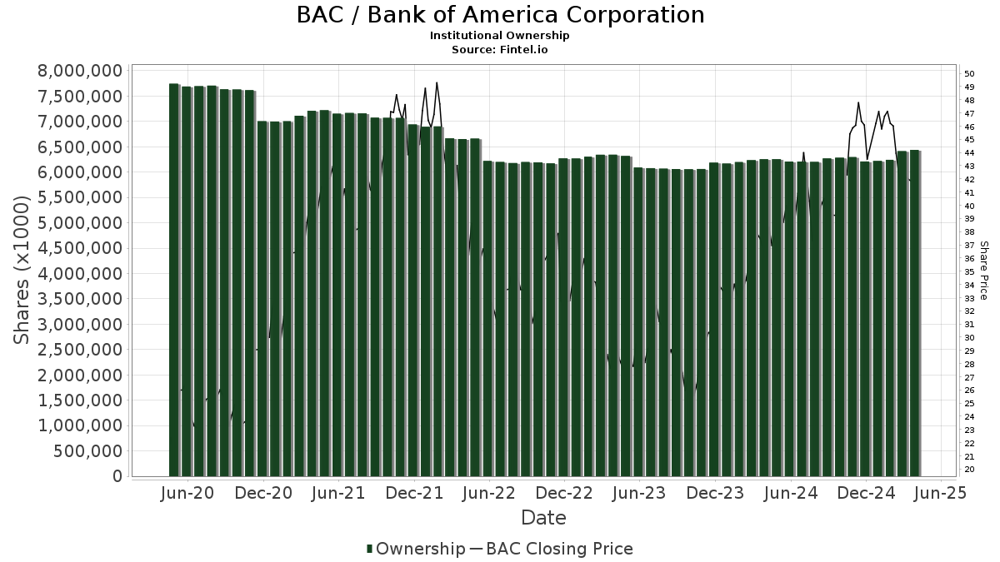

## Table of Contents

## What is a mutual fund?

A mutual fund is a type of investment where many people pool their money together to buy a variety of stocks, bonds, or other assets. This is managed by a professional who makes decisions about what to buy and sell. When you invest in a mutual fund, you are buying shares of the fund, and the value of your investment goes up or down based on how well the investments in the fund perform.

Mutual funds are popular because they allow people to invest in a diversified portfolio without needing a lot of money or knowledge about investing. Instead of picking individual stocks or bonds, you can invest in a fund that holds many different investments. This can help spread out the risk because if one investment does poorly, the others might do well and balance it out.

## What does it mean to be a shareholder of Bank of America through a mutual fund?

When you are a shareholder of Bank of America through a mutual fund, it means you own a small part of that mutual fund, and the fund itself owns shares of Bank of America. You don't directly own the Bank of America shares, but you benefit from them because the mutual fund's value goes up or down based on how well Bank of America and the other companies in the fund are doing.

Being a shareholder this way is different from buying Bank of America stock directly. When you invest through a mutual fund, you're spreading your money across many different investments, not just Bank of America. This can be safer because if Bank of America does poorly, other investments in the fund might do well and help balance things out. But, you also don't get to vote on Bank of America's decisions because you're not a direct shareholder.

## How can I find out which mutual funds hold the largest shares in Bank of America?

To find out which mutual funds hold the largest shares in Bank of America, you can use financial websites like Morningstar or Bloomberg. These sites have tools where you can look up a company like Bank of America and see a list of the biggest shareholders, including mutual funds. Just type in "Bank of America" in the search bar, and you'll find a section that shows the top mutual fund holders.

Another way to find this information is by using the Securities and Exchange Commission's (SEC) website. The SEC requires companies to report who owns their shares, and you can search through their database called EDGAR. Look for Bank of America's filings, especially the ones labeled as "13F," which show which investors, including mutual funds, own the most shares. This might take a bit more time, but it's a good way to get detailed information.

## What are the top three mutual funds with the largest shares in Bank of America?

The top three mutual funds with the largest shares in Bank of America are Vanguard Total Stock Market Index Fund, Vanguard 500 Index Fund, and SPDR S&P 500 [ETF](/wiki/etf-trading-strategies) Trust. These funds are popular because they aim to match the performance of the overall stock market, and Bank of America is a big part of that.

The Vanguard Total Stock Market Index Fund owns the most shares of Bank of America among these funds. It tries to include all the stocks in the U.S. market, so it has a lot of Bank of America shares. The Vanguard 500 Index Fund and the SPDR S&P 500 ETF Trust also own a lot of Bank of America shares because they focus on the 500 biggest companies in the U.S., and Bank of America is one of them.

## How do mutual fund investments in Bank of America impact its stock price?

When mutual funds invest in Bank of America, they buy a lot of its stock. This buying can push the stock price up because there's more demand for the stock. If a big mutual fund like Vanguard decides to buy more shares of Bank of America, other investors might see this as a good sign and want to buy the stock too, which can make the price go up even more.

But, the impact isn't always the same. If mutual funds start selling their shares of Bank of America, it can push the stock price down because there's more supply of the stock in the market. Also, if a lot of investors are watching what mutual funds do, and they see a big fund selling, they might think something is wrong with Bank of America and decide to sell their shares too, which can make the price drop even more. So, mutual funds can have a big effect on Bank of America's stock price, but it depends on whether they're buying or selling.

## What percentage of Bank of America's total shares are owned by mutual funds?

Mutual funds own about 55% of Bank of America's total shares. This means that more than half of the company is owned by these funds, which are managed by professionals who invest money from many people.

This high ownership by mutual funds shows how important they are to Bank of America. Because they own so much, what mutual funds do with their shares can affect the stock price a lot. If they buy more, the price might go up, and if they sell, the price might go down.

## How has the ownership of Bank of America by mutual funds changed over the past five years?

Over the past five years, the ownership of Bank of America by mutual funds has gone up a bit. At the start of this period, mutual funds owned about 52% of the bank's shares. Now, they own around 55%. This small increase shows that mutual funds have been buying more Bank of America stock over time.

This trend of mutual funds owning more of Bank of America is important because it can affect the stock's price. When mutual funds buy more shares, it can push the price up because there's more demand for the stock. On the other hand, if they start selling their shares, it can push the price down. So, the fact that mutual funds have been slowly increasing their ownership over the past five years is a good sign for Bank of America's stock price.

## What are the voting rights of mutual fund shareholders in Bank of America?

When mutual funds own shares of Bank of America, the voting rights for those shares usually go to the people who manage the mutual fund. These managers make decisions about how to vote on things like who should be on the bank's board of directors or other big choices. The people who invest in the mutual fund don't usually get to vote themselves because they own shares of the fund, not the bank directly.

But, some mutual funds might let their investors have a say in how the votes are used. This can happen if the fund's rules say so, or if the investors ask for it. Still, it's not common, and most of the time, the fund managers are the ones who decide how to vote the shares of Bank of America they own.

## How do mutual funds manage their investments in Bank of America?

Mutual funds manage their investments in Bank of America by buying and selling its stock based on what they think will happen to the bank's value. The people who run the mutual fund, called fund managers, look at a lot of information about Bank of America, like how well it's doing, what's happening in the economy, and what other investors are doing. If they think Bank of America will do well, they might buy more of its stock. If they think it won't do well, they might sell some of their shares.

The decisions made by mutual fund managers can affect how much of Bank of America's stock they own. They have to think about what's best for everyone who has put money into the mutual fund. Sometimes, they might decide to keep the same amount of Bank of America stock if they think it's a good long-term investment. Other times, they might change how much they own based on new information or changes in the market. This way, they try to make the best choices to help the mutual fund grow.

## What are the risks associated with investing in Bank of America through mutual funds?

When you invest in Bank of America through a mutual fund, there are some risks you should know about. One big risk is that the stock market can go up and down a lot. If Bank of America's stock price goes down, the value of your mutual fund will go down too. This means you could lose money if you need to sell your shares when the price is low. Also, even though mutual funds spread out their investments, if a lot of the money in the fund is in Bank of America and it does badly, it can still hurt the fund's overall performance.

Another risk is that the mutual fund managers might make bad choices. They decide when to buy or sell Bank of America's stock, and if they make the wrong call, it can affect your investment. For example, if they sell too early and miss out on a big price increase, or if they hold onto the stock too long and it drops in value, it can hurt your returns. Also, mutual funds charge fees, which can eat into your profits over time. So, it's important to understand these risks before you decide to invest in Bank of America through a mutual fund.

## How do the investment strategies of different mutual funds affect their holdings in Bank of America?

Different mutual funds have different ways of choosing what to invest in, and this affects how much they own in Bank of America. Some funds are called "index funds," and they try to match the performance of a big group of stocks, like the S&P 500. Since Bank of America is a big part of the S&P 500, these funds will own a lot of Bank of America stock. Other funds are called "actively managed funds," where the people running the fund pick stocks they think will do well. If they think Bank of America will do well, they might buy more of its stock, but if they think it won't do well, they might not own as much.

Another type of fund is called a "sector fund," which focuses on one part of the economy, like banks. A sector fund that invests in banks might own a lot of Bank of America because it's a big bank. But, if the fund managers think other banks will do better, they might own less Bank of America. So, the way a mutual fund is set up and what its managers think about Bank of America's future can change how much of the bank's stock the fund owns.

## What are the long-term performance trends of mutual funds heavily invested in Bank of America?

Mutual funds that have a lot of Bank of America stock have seen their performance go up and down over the long term. Bank of America is a big bank, and its stock price can change a lot because of things like the economy, interest rates, and how well the bank is doing. When the economy is doing well and people are borrowing more money, Bank of America usually does well, and the mutual funds that own a lot of its stock can see good returns. But, when there's a financial crisis or the economy is struggling, Bank of America's stock can drop a lot, which can hurt the performance of these mutual funds.

Over the past ten years, mutual funds with big investments in Bank of America have had some good years and some bad years. From 2012 to 2019, Bank of America's stock did pretty well, so mutual funds that owned a lot of it also did well during that time. But in 2020, when the COVID-19 pandemic hit, Bank of America's stock, like many others, went down a lot at first. However, it recovered quickly, and mutual funds that stuck with it saw their value go back up. So, the long-term performance of these mutual funds depends a lot on how Bank of America does, which can be hard to predict but can offer good returns if you're willing to take the risk.

## What is the understanding of mutual funds and their shareholders?

Mutual funds significantly contribute to the investment sector by aggregating capital from a diverse array of investors to acquire a variety of securities. This collective investment approach enables mutual funds to achieve diversification, thereby mitigating risk for individual investors. Diversification is a critical strategy in financial management, typically expressed by the formula:

$$
\text{Risk}_{\text{Portfolio}} = \sum_{i=1}^{n} \left( w_i^2 \cdot \sigma_i^2 \right) + \sum_{i=1}^{n} \sum_{j \neq i} w_i \cdot w_j \cdot \text{Cov}(r_i, r_j)
$$

where $w_i$ is the weight of security $i$ in the portfolio, $\sigma_i^2$ is the variance of the security's return, and $\text{Cov}(r_i, r_j)$ is the covariance between the returns of securities $i$ and $j$. By holding a mix of asset classes, mutual funds can reduce unsystematic risk, which is the portion of total risk unique to a particular company or industry.

Mutual fund shareholders represent a broad spectrum, including individual retail investors, institutional investors, and various financial entities, each contributing to the fund's pool of capital. Among these, institutional investors often hold significant equity stakes in various corporations due to their substantial capital resources. Key stakeholders such as Vanguard and SPDR exemplify this, frequently maintaining substantial positions in notable financial institutions, including Bank of America.

Vanguard, for instance, operates several mutual funds that are major shareholders in large corporations. The Vanguard Total Stock Market Index Fund is a prime example, having a significant shareholding in Bank of America. This fund tracks the CRSP US Total Market Index and represents a broad spectrum of the U.S. stock market, encompassing approximately 100% of the U.S. investable equity market.

The strategic positioning of mutual funds like Vanguard within large financial entities such as Bank of America underscores the profound impact that mutual funds have on corporate governance and financial market dynamics. By acting as large shareholders, these funds can influence corporate decisions, policy measures, and strategic directions of their portfolio companies. Consequently, their investment patterns can significantly sway stock prices and market movements, reflecting the intricate interplay between capital market participants.

## References & Further Reading

[1]: Bergstra, J., Bardenet, R., Bengio, Y., & Kégl, B. (2011). ["Algorithms for Hyper-Parameter Optimization."](https://papers.nips.cc/paper/4443-algorithms-for-hyper-parameter-optimization) Advances in Neural Information Processing Systems 24.

[2]: ["Advances in Financial Machine Learning"](https://www.amazon.com/Advances-Financial-Machine-Learning-Marcos/dp/1119482089) by Marcos Lopez de Prado

[3]: ["Evidence-Based Technical Analysis: Applying the Scientific Method and Statistical Inference to Trading Signals"](https://www.amazon.com/Evidence-Based-Technical-Analysis-Scientific-Statistical/dp/0470008741) by David Aronson

[4]: ["Machine Learning for Algorithmic Trading"](https://github.com/stefan-jansen/machine-learning-for-trading) by Stefan Jansen

[5]: ["Quantitative Trading: How to Build Your Own Algorithmic Trading Business"](https://www.amazon.com/Quantitative-Trading-Build-Algorithmic-Business/dp/1119800064) by Ernest P. Chan